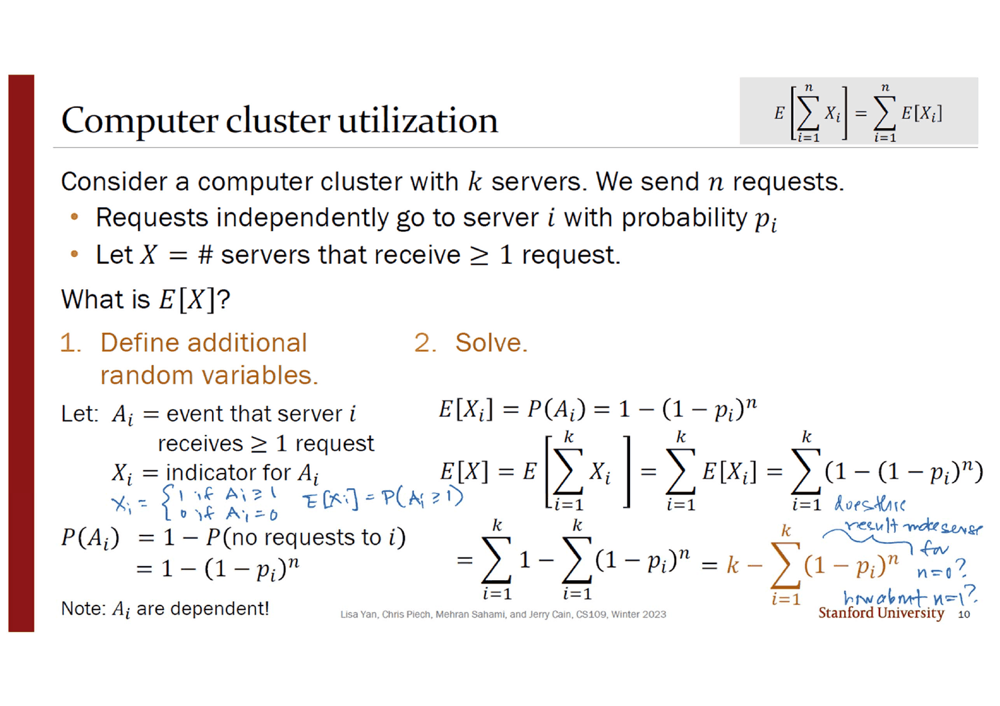
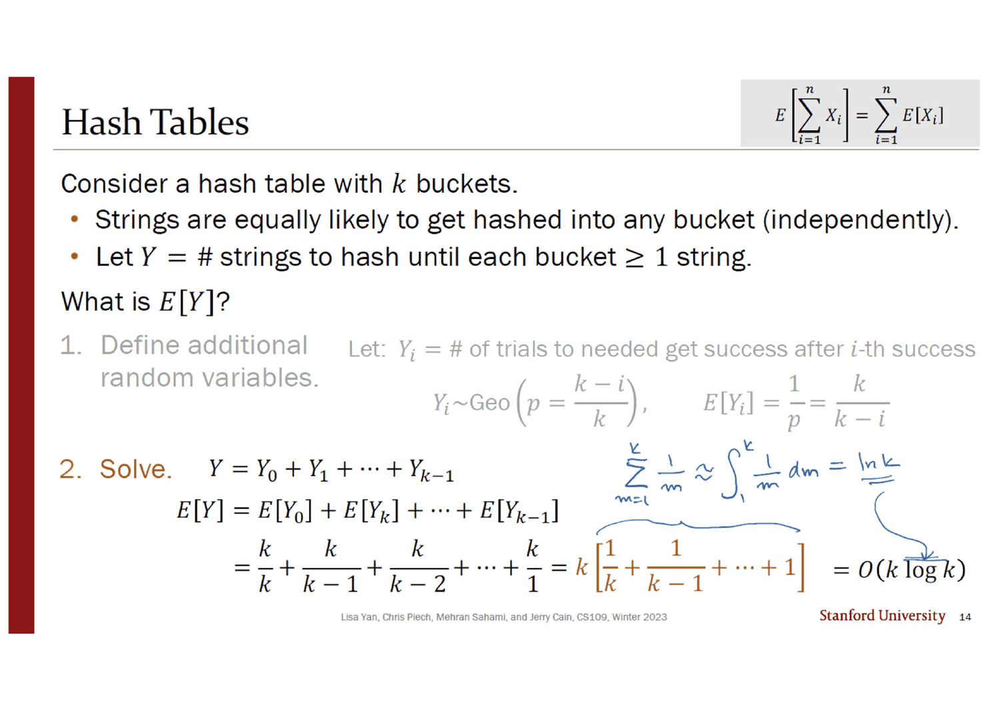
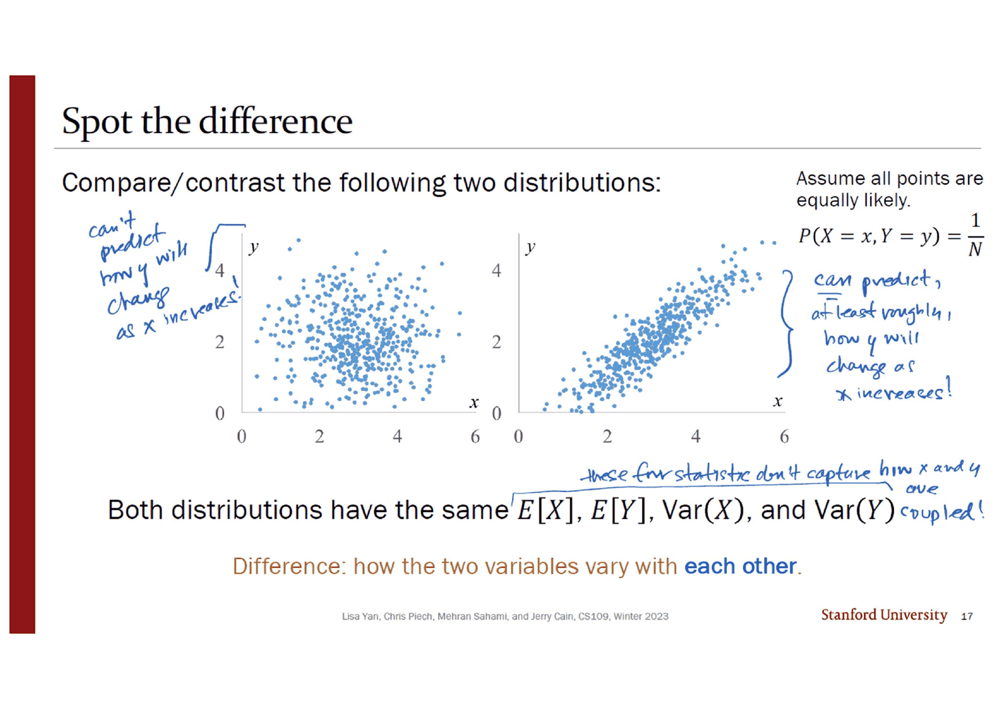
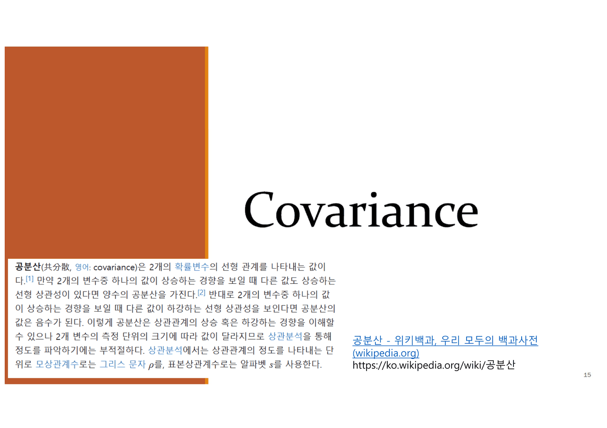
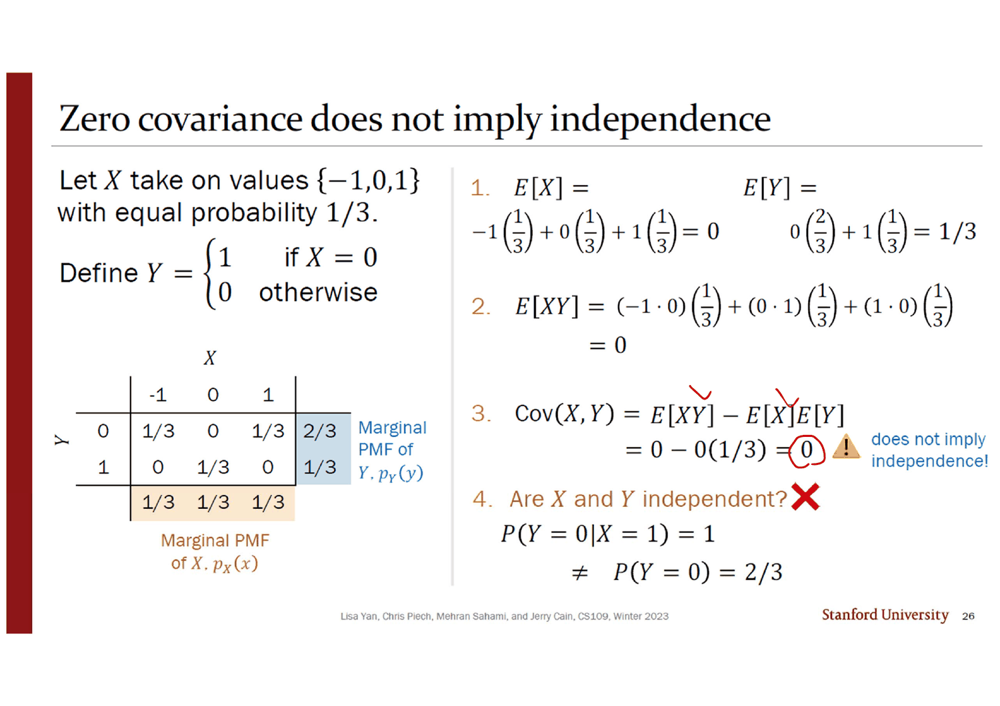
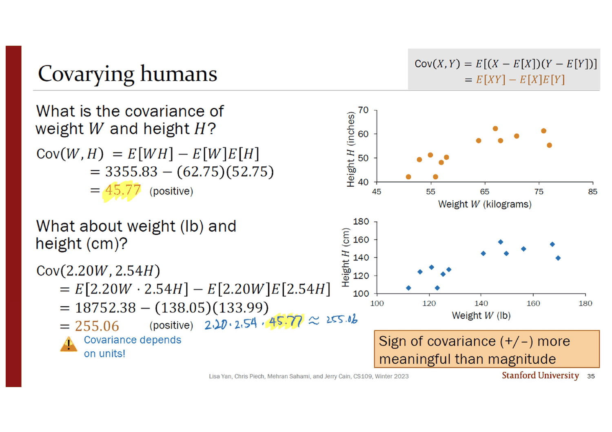
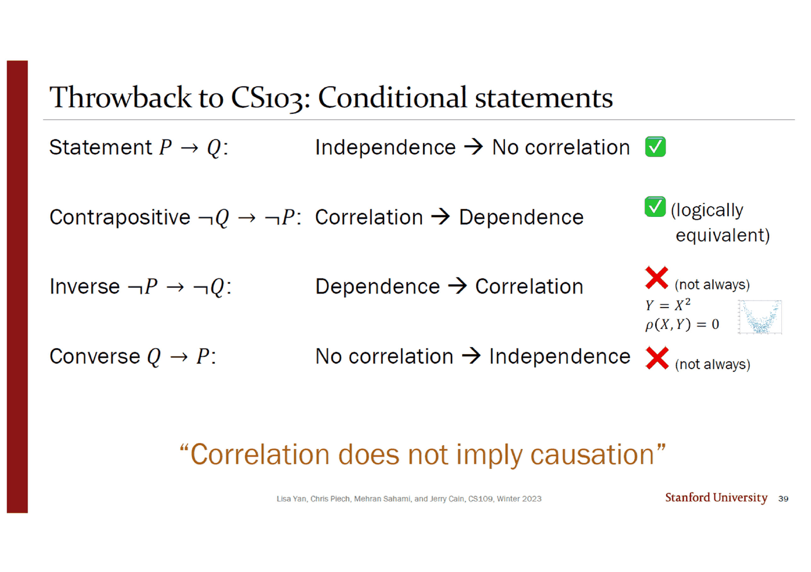

> [!abstract] 16번 슬라이드의 물음표가 이 덱 전체다
> 16번 슬라이드에는 두 줄밖에 없다. 위는 회색 상자 안에 이미 아는 것 — $E[X+Y] = E[X] + E[Y]$. 아래는 주황 상자 안에 모르는 것 — $\text{Var}(X+Y) = \;\;\textbf{?}$ 그리고 오른쪽 아래에 한 줄이 더 붙어 있다. ***"But first, a new statistic!"***
>
> **기댓값의 덧셈은 아무 대가 없이 성립하고 분산의 덧셈은 성립하지 않는다.** 그 어긋남이 이 덱의 엔진이다. 어긋남을 메우려고 **공분산**을 만들고(18번), 열두 장 뒤에 물음표를 채우며(28번), 그런데 공분산은 단위를 바꾸면 값이 변한다는 것을 발견하고(35번), 그래서 **상관계수**를 만든다(36번). 상관계수는 단위 문제를 고쳤지만 **직선만 본다**(38번). 그리고 그 뒤에 다섯 장이 더 붙어 「직선을 봐도 인과는 아니다」를 말한다(40~44번).
>
> 고치려고 만든 것이 매번 또 고칠 것을 남긴다. 그런데 **이 덱은 그 사슬의 마지막 두 마디를 원래 갖고 있지 않았다.** 표지의 목차가 그 사실을 흘린다.

---

## 표지 목차가 가리키는 자리가 전부 틀렸다

표지 왼쪽 위에 고정폭 글꼴로 목차 다섯 줄이 인쇄되어 있다. 그런데 **다섯 줄 모두 실제 절이 시작하는 슬라이드보다 앞을 가리킨다.**

| 목차가 말하는 번호 | 절 이름 | 실제 절 표지 | 어긋남 |
| --- | --- | --- | --- |
| 2 | Coupon Collecting | **7** | +5 |
| 10 | Covariance | **15** | +5 |
| 22 | Variances of RV Sums | **27** | +5 |
| 29 | Correlation | **34** | +5 |
| 35 | Extras | **45** | **+10** |

앞의 넷은 정확히 5씩, 마지막 하나만 10 어긋난다. **이 두 숫자가 어디에 무엇이 끼어들었는지를 지목한다.**

- 슬라이드 **2~6**: `Expectation of Common RVs` 절. 12번 덱의 마지막 절과 같은 내용이고, 3번 슬라이드는 12번 덱 22번 슬라이드와 **글자 하나까지 같다.** 목차에 이 절의 이름이 없다 — 다섯 장 전부 복습이다
- 슬라이드 **40~44**: `Spurious Correlation` 절. 목차에 이름이 없고, 절 표지의 링크 글꼴이 본문 디자인과 다르며, 안쪽 슬라이드 셋에 한국어 주석(`1인당`, `게임 수입`)이 붙어 있다

$5 + 5 = 10$ 이 마지막 줄의 어긋남과 정확히 맞는다. 목차는 **이 두 묶음이 붙기 전의 덱**을 설명하고 있고, 파일에 인쇄된 슬라이드 번호는 붙은 뒤의 것이다.

```mermaid
flowchart TB
    A["E[X+Y] = E[X] + E[Y]<br/>아무 가정도 필요 없다 · 3번"]
    A --> B{"Var(X+Y) = ?<br/>16번"}
    B -->|"고치려면"| C["공분산 Cov(X,Y)<br/>18번"]
    C --> D["Var(X+Y) = Var(X) + 2Cov + Var(Y)<br/>28번 — 물음표가 채워진다"]
    D --> E{"그런데 kg·in 을 lb·cm 로 바꾸면<br/>값이 5.588배가 된다 · 35번"}
    E -->|"고치려면"| F["상관계수 ρ = Cov / (σ_X σ_Y)<br/>36번"]
    F --> G{"그런데 Y = X² 도 ρ = 0 이다<br/>38번"}
    G -->|"원본이 남긴 자리"| H["직선만 본다<br/>39번이 논리로 정리"]
    H -.->|"덧붙은 다섯 장"| I["직선을 봐도 인과는 아니다<br/>40~44번 · 목차에 없음"]

    Z["공분산 0 ≠ 독립<br/>26번 · 반례"]
    C -.-> Z

    style B fill:transparent,stroke:var(--chart-1),stroke-width:2px
    style E fill:transparent,stroke:var(--chart-1),stroke-width:2px
    style G fill:transparent,stroke:var(--chart-1),stroke-width:2px
    style I fill:transparent,stroke:var(--chart-2),stroke-width:2px,stroke-dasharray:5 4
```

---

## 먼저, 덧붙은 앞쪽 다섯 장이 하는 일

3번 슬라이드는 12번 덱이 끝난 자리를 그대로 다시 연다 — $E[\sum X_i] = \sum E[X_i]$, *"Even if you don't know the **distribution** of $X$ … you can still compute **expectation** of $X$"*, 그리고 문제 풀이의 열쇠는 *"Define $X_i$ such that $X = \sum X_i$"*.

그리고 7번부터 **쿠폰 수집 문제**가 그 도구를 두 번 쓴다. 8번 슬라이드가 문제를 세우는 방식이 인상적이다 — 시리얼 상자와 쿠폰을 말한 뒤 오른쪽에 파란 글씨로 번역표를 세운다.

| 쿠폰 수집 | 서버 | 해시 테이블 (11번) |
| --- | --- | --- |
| 상자를 산다 | 요청 | 문자열 |
| $k$ 종류의 쿠폰 | $k$ 대의 서버 | $k$ 개의 버킷 |
| 타입 $i$ 쿠폰을 모은다 | 서버 $i$ 로 요청 | 버킷 $i$ 로 해싱 |

**같은 문제에 대해 물을 수 있는 질문이 둘 있고, 덱은 그 둘을 따로 푼다.**

1. $n$ 상자를 샀을 때 **쿠폰 종류는 몇 가지**나 모였을까? → 서버 $k$ 대에 요청 $n$ 개를 보내면 **몇 대나 쓰일까?**
2. 모든 종류를 다 모으려면 **상자를 몇 개** 사야 할까? → 모든 버킷에 문자열이 하나씩 들어가려면 **몇 개를 해싱**해야 할까?

### 첫째 질문 — 종속인 지시확률변수의 합



10번 슬라이드가 답한다. $A_i$ 를 「서버 $i$ 가 요청을 하나 이상 받는다」는 사건, $X_i$ 를 그 지시확률변수로 두면

$$E[X_i] = P(A_i) = 1 - P(\text{서버 } i \text{ 로 요청이 하나도 안 감}) = 1 - (1-p_i)^n$$

$$E[X] = \sum_{i=1}^{k} E[X_i] = \sum_{i=1}^{k}\big(1 - (1-p_i)^n\big) = k - \sum_{i=1}^{k}(1-p_i)^n$$

슬라이드 왼쪽 아래에 이 풀이의 급소가 작은 글씨로 박혀 있다 — ***"Note: $A_i$ are dependent!"*** 한 서버가 요청을 받았다는 사실은 다른 서버가 받았을 확률을 바꾼다. **그런데 기댓값의 선형성은 그 종속을 전혀 신경 쓰지 않는다.** 3번 슬라이드의 주황 상자가 미리 적어 둔 두 번째 용례(*"Sum of dependent RVs"*)가 여기서 실현된다.

잉크가 왼쪽에 지시확률변수의 정의를 풀어 적고($X_i = 1$ if $A_i \ge 1$, $0$ if $A_i = 0$), 오른쪽 끝에 검산 질문 둘을 남겼다.

> *does this result make sense for $n=0$? how about $n=1$?*

답은 두 줄이다. $n = 0$ 이면 $\sum(1-p_i)^0 = k$ 이므로 $E[X] = k - k = 0$. $n = 1$ 이면 $\sum(1-p_i) = k - \sum p_i = k - 1$ 이므로 $E[X] = k - (k-1) = 1$. **둘 다 맞고, 두 번째가 $\sum p_i = 1$ 을 쓴다는 점이 미묘하다** — 확률의 합이 1이라는 사실이 「요청 하나는 반드시 어딘가 한 대에 간다」로 번역되는 자리다.

### 둘째 질문 — 기하분포의 사슬



13·14번이 두 번째 질문에 답한다. 여기서 쪼개는 축이 중요하다 — **「몇 번째 문자열인가」가 아니라 「몇 번째 버킷이 채워지는가」**다.

$Y_i$ = $i$ 개의 버킷이 이미 찼을 때, $(i{+}1)$ 번째 버킷이 처음 차기까지 필요한 시행 수. 빈 버킷이 $k - i$ 개이므로 한 번의 해싱이 성공할 확률은 $\frac{k-i}{k}$ 이고,

$$Y_i \sim \text{Geo}\!\left(p = \frac{k-i}{k}\right), \qquad E[Y_i] = \frac1p = \frac{k}{k-i}$$

$$E[Y] = \sum_{i=0}^{k-1} \frac{k}{k-i} = \frac kk + \frac{k}{k-1} + \cdots + \frac k1 = k\left(\frac1k + \frac{1}{k-1} + \cdots + 1\right) = k \cdot H_k$$

**$k$ 가 고정된 상수라는 점이 이 풀이를 성립시킨다.** 12번 덱 24번 슬라이드의 음이항 문제와 똑같은 함정 — 시행으로 쪼개면 개수가 확률변수가 되고, 성공으로 쪼개면 상수가 된다.

잉크가 오른쪽에 점근을 채워 넣었다 — $\sum_{m=1}^{k}\frac1m \approx \int_1^k \frac1m\,dm = \ln k$, 그래서 $O(k\log k)$. 아래에서 그 근사가 얼마나 맞는지 확인할 수 있다.

> [!warning] 원본 오류 — 14번 슬라이드의 $E[Y_k]$
> 슬라이드는 바로 윗줄에 $Y = Y_0 + Y_1 + \cdots + Y_{k-1}$ 이라 정확히 적고, 그 아래에서는
> $$E[Y] = E[Y_0] + E[\mathbf{Y_k}] + \cdots + E[Y_{k-1}]$$
> 로 **둘째 항의 아래첨자가 $1$ 이 아니라 $k$** 다. 300 dpi로 다시 렌더해 확인했다. $Y_k$ 는 이 문제에서 정의되지 않은 항이고($i$ 는 $0$ 부터 $k-1$ 까지), 정의되더라도 $E[Y_k] = \frac{k}{k-k}$ 로 분모가 0이 된다. 바로 다음 줄의 전개 $\frac kk + \frac{k}{k-1} + \frac{k}{k-2} + \cdots$ 는 $E[Y_1] = \frac{k}{k-1}$ 을 쓰고 있으므로 계산 자체는 옳다

```html preview
<div id="cc13" style="font-family:system-ui,-apple-system,sans-serif;color:var(--foreground);background:var(--card);border:1px solid var(--border);border-radius:12px;padding:18px 16px;">
  <div style="display:flex;flex-wrap:wrap;gap:8px;margin-bottom:14px;">
    <button class="q-b" data-q="1">① n개 보냈을 때 몇 대가 쓰이나</button>
    <button class="q-b" data-q="2">② 전부 채우려면 몇 개 필요한가</button>
  </div>
  <div style="display:flex;flex-wrap:wrap;gap:14px;align-items:center;margin-bottom:6px;">
    <label style="font-size:13px;font-weight:600;">버킷 수 k</label>
    <input id="k13" type="range" min="2" max="200" value="10" style="flex:1;min-width:150px;accent-color:var(--chart-1);">
    <output id="kv13" style="font-variant-numeric:tabular-nums;font-weight:700;min-width:2.6em;">10</output>
  </div>
  <div id="nrow" style="display:flex;flex-wrap:wrap;gap:14px;align-items:center;margin-bottom:12px;">
    <label style="font-size:13px;font-weight:600;">요청 수 n</label>
    <input id="n13" type="range" min="0" max="200" value="10" style="flex:1;min-width:150px;accent-color:var(--chart-2);">
    <output id="nv13" style="font-variant-numeric:tabular-nums;font-weight:700;min-width:2.6em;">10</output>
  </div>
  <svg id="sv13" viewBox="0 0 620 220" style="width:100%;height:auto;display:block;"></svg>
  <div id="out13" style="margin-top:12px;font-size:13.5px;line-height:1.9;font-variant-numeric:tabular-nums;"></div>
</div>
<style>
#cc13 .q-b{font:inherit;font-size:12.5px;padding:6px 11px;border-radius:7px;cursor:pointer;
  border:1px solid var(--border);background:transparent;color:var(--muted-foreground);}
#cc13 .q-b[aria-pressed="true"]{border-color:var(--chart-1);color:var(--chart-1);font-weight:600;}
</style>
<script>
(function(){
  const NS='http://www.w3.org/2000/svg', svg=document.getElementById('sv13');
  function el(n,a){const e=document.createElementNS(NS,n);for(const k in a)e.setAttribute(k,a[k]);return e;}
  let q=1;
  const util=(k,n)=>k*(1-Math.pow(1-1/k,n));          // 10번 슬라이드, p_i = 1/k
  const Hk=k=>{let s=0;for(let m=1;m<=k;m++)s+=1/m;return s;};
  const cover=k=>k*Hk(k);                              // 14번 슬라이드
  const L=48,R=600,B=182,T=12;
  function draw(){
    svg.textContent='';
    const k=+document.getElementById('k13').value, n=+document.getElementById('n13').value;
    svg.appendChild(el('line',{x1:L,y1:B,x2:R,y2:B,stroke:'var(--border)'}));
    if(q===1){
      const NMAX=Math.max(20,4*k), sx=i=>L+(i/NMAX)*(R-L), sy=v=>B-(v/k)*(B-T);
      let d='';
      for(let i=0;i<=NMAX;i++) d+=(i?'L':'M')+sx(i).toFixed(1)+','+sy(util(k,i)).toFixed(1);
      svg.appendChild(el('path',{d:d,fill:'none',stroke:'var(--chart-1)','stroke-width':2}));
      svg.appendChild(el('line',{x1:L,y1:sy(k),x2:R,y2:sy(k),stroke:'var(--muted-foreground)','stroke-dasharray':'4 4',opacity:0.5}));
      if(n<=NMAX){
        svg.appendChild(el('circle',{cx:sx(n),cy:sy(util(k,n)),r:4.5,fill:'var(--chart-2)'}));
        svg.appendChild(el('line',{x1:sx(n),y1:sy(util(k,n)),x2:sx(n),y2:B,stroke:'var(--chart-2)','stroke-dasharray':'3 3'}));
      }
      const t=el('text',{x:L,y:T+10,'font-size':11,fill:'var(--muted-foreground)'});
      t.textContent='E[X] — 쓰인 버킷 수 (점근선 k='+k+')'; svg.appendChild(t);
    } else {
      const KMAX=200, sx=i=>L+((i-2)/(KMAX-2))*(R-L), mx=cover(KMAX), sy=v=>B-(v/mx)*(B-T);
      let d1='',d2='';
      for(let i=2;i<=KMAX;i++){d1+=(i>2?'L':'M')+sx(i).toFixed(1)+','+sy(cover(i)).toFixed(1);
                               d2+=(i>2?'L':'M')+sx(i).toFixed(1)+','+sy(i*Math.log(i)).toFixed(1);}
      svg.appendChild(el('path',{d:d2,fill:'none',stroke:'var(--muted-foreground)','stroke-width':1.6,'stroke-dasharray':'5 4'}));
      svg.appendChild(el('path',{d:d1,fill:'none',stroke:'var(--chart-1)','stroke-width':2}));
      if(k>=2) svg.appendChild(el('circle',{cx:sx(k),cy:sy(cover(k)),r:4.5,fill:'var(--chart-2)'}));
      const t1=el('text',{x:L,y:T+10,'font-size':11,fill:'var(--chart-1)'}); t1.textContent='E[Y] = k·H_k';
      const t2=el('text',{x:L,y:T+26,'font-size':11,fill:'var(--muted-foreground)'}); t2.textContent='잉크의 근사: k ln k';
      svg.appendChild(t1); svg.appendChild(t2);
    }
  }
  function out(){
    const k=+document.getElementById('k13').value, n=+document.getElementById('n13').value;
    const box=document.getElementById('out13');
    if(q===1){
      const v=util(k,n);
      box.innerHTML='<b>E[X] = k(1 − (1−1/k)<sup>n</sup>)</b> = '+k+'(1 − (1−1/'+k+')<sup>'+n+'</sup>) = <b style="color:var(--chart-2)">'+v.toFixed(4)+'</b>'+
       '<br><span style="color:var(--muted-foreground)">'+k+'대 중 '+(100*v/k).toFixed(1)+'% 가 쓰인다.</span>'+
       '<p style="margin:8px 0 0;font-size:12.5px;color:var(--muted-foreground);line-height:1.65">'+
       (n===0?'잉크가 물은 첫 번째 검산 — <b>n=0 이면 0</b>. Σ(1−p<sub>i</sub>)<sup>0</sup> = k 이므로 k − k = 0.':
        n===1?'잉크가 물은 두 번째 검산 — <b>n=1 이면 정확히 1</b>. Σ(1−p<sub>i</sub>) = k − Σp<sub>i</sub> = k − 1 이라 k − (k−1) = 1. 확률의 합이 1이라는 사실이 여기서 쓰인다.':
        'A<sub>i</sub> 들은 서로 <b>종속</b>이다. 그래도 기댓값의 선형성은 아무 영향을 받지 않는다.')+'</p>';
    } else {
      const v=cover(k), a=k*Math.log(k);
      box.innerHTML='<b>E[Y] = k·H<sub>k</sub></b> = <b style="color:var(--chart-2)">'+v.toFixed(3)+'</b>'+
        ' &nbsp;·&nbsp; <span style="color:var(--muted-foreground)">잉크의 근사 k ln k = '+a.toFixed(3)+'</span>'+
        ' &nbsp;·&nbsp; 비 <b>'+(v/a).toFixed(4)+'</b>'+
        '<p style="margin:8px 0 0;font-size:12.5px;color:var(--muted-foreground);line-height:1.65">'+
        '차이는 k·H<sub>k</sub> − k ln k → k·γ (γ ≈ 0.5772, 오일러–마스케로니 상수)로 <b>k에 비례해 벌어진다.</b> '+
        '비가 1에 다가가기는 하지만 k=1000 에서도 아직 1.08이다. 원본은 O(k log k) 라는 <b>차수</b>만 주장하므로 이 차이는 문제가 되지 않는다. (이 문단은 원본에 없는 보충)</p>';
    }
  }
  function upd(){
    document.getElementById('kv13').textContent=document.getElementById('k13').value;
    document.getElementById('nv13').textContent=document.getElementById('n13').value;
    document.getElementById('nrow').style.display=(q===1?'flex':'none');
    document.querySelectorAll('#cc13 .q-b').forEach(b=>b.setAttribute('aria-pressed',(+b.dataset.q)===q));
    draw(); out();
  }
  document.querySelectorAll('#cc13 .q-b').forEach(b=>b.addEventListener('click',()=>{q=+b.dataset.q;upd();}));
  ['k13','n13'].forEach(id=>document.getElementById(id).addEventListener('input',upd));
  upd();
})();
</script>
```

---

## 네 통계량이 못 보는 것



17번 슬라이드가 산점도 둘을 나란히 놓는다. 왼쪽은 공처럼 퍼져 있고 오른쪽은 대각선으로 길쭉하다. 그리고 아래에 한 줄 — ***"Both distributions have the same $E[X]$, $E[Y]$, $\text{Var}(X)$, and $\text{Var}(Y)$."***

잉크가 그 줄 위에 괄호를 치고 결론을 적었다.

> *these four statistics don't capture how $x$ and $y$ are **coupled**!*

왼쪽 그림 옆에는 *"can't predict how $y$ will change as $x$ increases!"*, 오른쪽에는 *"can predict, at least roughly, how $y$ will change as $x$ increases!"* **네 개의 숫자로는 두 그림을 구별할 수 없다**는 사실이 새 통계량이 필요한 이유의 전부다.

15번 절 표지에도 특이한 것이 있다.



`Covariance` 라는 큰 제목 아래 왼쪽에 **한국어 위키백과 「공분산」 항목의 본문이 통째로 붙어 있고** 오른쪽에 링크가 있다. 34번(`Correlation`)의 표지도 같은 방식이다. 이 두 장은 10번 덱에서 관찰된 삽입 슬라이드와 같은 손이고, **붙인 문단이 먼저 말해 버리는 것이 하나 있다** — 위키 본문의 마지막 문장이 *"2개 변수의 측정 단위의 크기에 따라 값이 달라지므로 상관분석을 통해 정도를 파악하기에는 부적절하다"* 이다. 원본이 35번에 가서야 발견하게 만드는 결론을 **절 표지에서 미리 흘린다.**

---

## 공분산 — 정의는 하나, 형태는 둘

18번이 정의를 주고 그 자리에서 두 번째 형태를 유도한다.

$$\text{Cov}(X, Y) = E\big[(X - E[X])(Y - E[Y])\big] = E[XY] - E[X]E[Y]$$

증명은 여섯 줄이고 쓰는 것은 기댓값의 선형성 하나뿐이다. 슬라이드가 표기에 주석을 단다 — *"rewriting $E[X]$, $E[Y]$ as $\mu_X$, $\mu_Y$ to emphasize the fact they're each **constants**"*. $\mu_X$ 가 상수이기 때문에 $E[\mu_Y X] = \mu_Y E[X] = \mu_X\mu_Y$ 로 빠져나올 수 있고, **세 항 중 둘이 서로를 지운다.**

$$E[XY] - \mu_X\mu_Y - \mu_X\mu_Y + \mu_X\mu_Y = E[XY] - \mu_X\mu_Y$$

19번이 부호의 의미를 예 셋으로 준다. 첫 예에는 한국어 주석이 붙어 있다(`utility bills` 위에 「공공요금」).

- 바깥 기온과 **공공요금**: 음의 공분산
- 손잡이(왼손/오른손)와 음악적 재능: 거의 0
- 제품 수요와 가격: 양의 공분산

> [!note] 셋째 예는 방향이 논쟁적이다 (원본에 대한 의견)
> 「수요와 가격이 양의 공분산」은 **수요곡선의 방향과 반대**다. 가격이 오르면 수요량은 줄어든다는 것이 수요의 법칙이고, 그 관계는 음이다. 슬라이드의 문장이 참이 되려면 「많이 팔리는 제품일수록 비싸게 매겨진다」는 공급 쪽 이야기로 읽어야 한다. 첫째 예도 비슷하게 흔들린다 — 난방비만 생각하면 음이지만 냉방비를 넣으면 U자가 되어 공분산이 거의 0에 가까워질 수 있다. **부호의 직관을 기르려는 예시이지 검증된 관측이 아니다.**

21번이 산점도 셋으로 부호를 눈에 붙이고(잉크가 세 그림 각각에 「$x$가 늘면 $y$도 는다」·「$x$가 늘면 $y$는 준다」·「패턴이 없다」를 적었다), 23번이 성질 넷을 준다.

| | 성질 | 눈여겨볼 것 |
| --- | --- | --- |
| 1 | $\text{Cov}(X,Y) = \text{Cov}(Y,X)$ | 대칭 |
| 2 | $\text{Var}(X) = E[XX] - E[X]E[X] = \text{Cov}(X,X)$ | **분산은 자기 자신과의 공분산이다** |
| 3 | $\text{Cov}(X_1{+}X_2,\, Y_1{+}Y_2) = \sum\sum \text{Cov}(X_i, Y_j)$ | 「모든 쌍의 합」 · *(proof left to you)* |
| 4 | $\text{Cov}(aX + b,\, Y) = a\,\text{Cov}(X,Y)$ | 잉크: *"recall that $\text{Var}(aX+b) = a^2\text{Var}(X)$"* |

**2번과 3번이 곧 29번의 증명 전부**가 된다. 그리고 4번에 붙은 잉크의 대조가 35번의 함정을 미리 조명한다 — 분산은 $a^2$, 공분산은 한 변수만 스케일하면 $a$. 두 변수를 각각 $a$, $b$ 배 하면 $ab$ 배다.

### 공분산이 0이어도 독립이 아니다



24번이 문제를, 26번이 답을 준다. 예가 최소한으로 깎여 있다.

$$X \in \{-1, 0, 1\} \ \text{각각 } \tfrac13, \qquad Y = \begin{cases}1 & X = 0\\ 0 & \text{그 외}\end{cases}$$

$E[X] = 0$, $E[Y] = \tfrac13$, 그리고 $E[XY]$ 의 세 항이 **전부 0이다** — $(-1)(0)$, $(0)(1)$, $(1)(0)$. $Y$ 가 1일 때는 $X$ 가 0이고, $X$ 가 0이 아닐 때는 $Y$ 가 0이라 곱이 살아남을 자리가 없다. 그래서

$$\text{Cov}(X,Y) = 0 - 0\cdot\tfrac13 = \mathbf{0}$$

그런데 $P(Y{=}0 \mid X{=}1) = 1 \ne \tfrac23 = P(Y{=}0)$ 이므로 **독립이 아니다.** $Y$ 는 $X$ 의 함수이니 종속의 극단인데도 공분산이 0이다.

이유는 **$Y$ 가 $X$ 의 짝함수**라는 데 있다. $X$ 의 분포가 0을 중심으로 대칭이므로 $X$ 가 $+1$ 일 때의 기여와 $-1$ 일 때의 기여가 정확히 상쇄된다. **공분산은 「같은 방향으로 함께 움직이는 정도」를 재는데, 위로도 아래로도 똑같이 반응하는 관계는 그 저울에서 0으로 읽힌다.**

---

## 물음표가 채워진다

27번에서 절이 바뀌고 28번이 16번의 물음표를 채운다.

$$\boxed{\ \text{Var}(X+Y) = \text{Var}(X) + 2\,\text{Cov}(X,Y) + \text{Var}(Y)\ }$$

29번의 증명이 짧은 이유는 23번의 성질 2·3을 이미 세워 두었기 때문이다.

$$\text{Var}(X+Y) = \text{Cov}(X{+}Y, X{+}Y) = \text{Cov}(X,X) + \text{Cov}(X,Y) + \text{Cov}(Y,X) + \text{Cov}(Y,Y)$$

**「분산을 공분산으로 바꿔 쓰고, 모든 쌍으로 펼치고, 다시 분산으로 되돌린다」** 세 걸음이다. 그리고 일반형이 따라온다(증명은 부록 47번).

$$\text{Var}\!\left(\sum_{i=1}^{n}X_i\right) = \sum_{i=1}^{n}\text{Var}(X_i) + 2\sum_{i=1}^{n}\sum_{j=i+1}^{n}\text{Cov}(X_i, X_j)$$

잉크가 둘째 합의 첨자 $j = i+1$ 에 빨간 밑줄을 그었다. **$i < j$ 인 쌍만 세고 2를 곱한다** — 47번 슬라이드가 그 조정을 `Adjust summation bounds` 한 줄로 처리하는데, $j \ne i$ 인 모든 순서쌍을 세면 각 쌍이 두 번 나오기 때문이다.

30·31번이 독립인 경우를 따로 떼어낸다. $X \perp Y$ 이면 $E[XY] = E[X]E[Y]$ 이므로 $\text{Cov} = 0$ 이고

$$\text{Var}(X+Y) = \text{Var}(X) + \text{Var}(Y)$$

31번 오른쪽의 주황 상자가 방향을 단속한다 — ***"NOT bidirectional: $\text{Cov}(X,Y) = 0$ does NOT imply independence of $X$ and $Y$!"*** 26번에서 이미 반례를 봤기 때문에 이 경고가 공허하지 않다.

### 그리고 07번 덱이 미룬 빚을 갚는다

32번 슬라이드가 특이한 방식으로 시작한다. **proofwiki.org의 이항분포 분산 증명 전체를 스크린샷으로 붙여 놓고**, 오른쪽에 징징대는 표정의 만화 캐릭터와 함께 이렇게 적는다.

> *Let's instead prove this using independence and variance!*

07번 덱이 $\text{Var}(X) = np(1-p)$ 의 증명을 세 번 미루고 결국 proofwiki 캡처 두 장으로 대체했던 그 자리다. 33번이 갚는데, **네 줄이면 끝난다.**

$$\text{Var}(X) = \text{Var}\!\left(\sum_{i=1}^n X_i\right) \overset{\text{독립}}{=} \sum_{i=1}^n \text{Var}(X_i) = \sum_{i=1}^n p(1-p) = np(1-p)$$

32번의 캡처는 열두 줄짜리 대수 계산이고 33번은 네 줄이다. **차이를 만든 것은 계산 기술이 아니라 $\text{Var}(X+Y) = \text{Var}(X)+\text{Var}(Y)$ 라는 한 줄의 도구**이고, 그 도구를 얻으려고 공분산을 거쳐 왔다. 여백의 잉크가 짧게 반응한다 — *"yay!"* 그리고 왼쪽 *"$X_i$ are independent (by definition)"* 옆에 빨간 체크.

---

## 단위를 바꾸면 값이 바뀐다



22번이 사람 열두 명의 몸무게(kg)와 키(inch)로 공분산을 계산했다. 표의 $W\cdot H$ 열 열두 값을 전부 검산했고 전부 맞는다.

$$E[W] = 62.75, \quad E[H] = 52.75, \quad E[WH] = 3355.8\overline{3}$$
$$\text{Cov}(W, H) = 3355.8\overline{3} - (62.75)(52.75) = \frac{2197}{48} = 45.7708\overline{3} \approx 45.77 \ \checkmark$$

35번이 같은 사람들을 파운드와 센티미터로 다시 잰다. 23번의 성질 4에 따르면 답은 나와 있다 — $\text{Cov}(2.20W,\ 2.54H) = 2.20 \times 2.54 \times \text{Cov}(W,H)$. 그런데 슬라이드는 그 지름길을 쓰지 않고 정의로 다시 계산한다.

$$\text{Cov}(2.20W, 2.54H) = 18752.38 - (138.05)(133.99) = \mathbf{255.06}$$

> [!warning] 원본 오류 — 35번 슬라이드의 255.06
> **정확한 값은 255.77이다.** $2.20 \times 2.54 \times \frac{2197}{48} = 255.7674\ldots$ 이다.
>
> 슬라이드의 산술 자체는 맞다($18752.38 - 18497.32 = 255.06$). 틀린 것은 **반올림한 중간값을 뺄셈에 넣은 것**이고, 어느 자리에서 어긋났는지까지 정확히 추적된다.
>
> | 인쇄값 | 참값 | 차이가 결과에 미치는 영향 |
> | --- | --- | --- |
> | $E[2.54H] = 133.99$ | $52.75 \times 2.54 = \mathbf{133.985}$ | $138.05 \times 0.005 = \mathbf{-0.690}$ |
> | $E[2.20W \cdot 2.54H] = 18752.38$ | $\mathbf{18752.3967}$ | $\mathbf{-0.017}$ |
> | | | 합계 $-0.707$ → $255.767 - 0.707 = 255.06$ |
>
> **18,750 근처의 두 수를 소수 둘째 자리에서 반올림해 빼면, 그 차이인 255의 셋째 자리가 통째로 날아간다.** 공분산의 두 번째 형태 $E[XY] - E[X]E[Y]$ 가 수치적으로 위험하다는 교과서적 사례이고, 슬라이드가 그 위험에 직접 걸렸다.
>
> 그리고 **잉크가 그것을 잡을 뻔했다.** 여백에 $2.20 \cdot 2.54 \cdot 45.77 \approx 255.06$ 이라 적혀 있는데, 이 곱은 실제로 $\mathbf{255.763}$ 이다. 지름길로 옳은 답에 도달해 놓고 **인쇄된 값에 맞춰 적었다.**

슬라이드 아래 주황 상자의 결론은 그대로 옳다 — ***"Sign of covariance (+/−) more meaningful than magnitude."*** 그런데 그 문장을 인쇄한 바로 그 슬라이드에서 **magnitude가 0.7 틀렸다는 점**이 이 경고를 예상보다 강하게 만든다.

---

## 상관계수 — 단위를 나눠 없앤다

36번의 정의는 한 줄이고, 하는 일도 한 가지다.

$$\rho(X, Y) = \frac{\text{Cov}(X,Y)}{\sigma_X\,\sigma_Y}, \qquad -1 \le \rho(X,Y) \le 1$$

분자가 $ab$ 배 되면 분모의 $\sigma_X\sigma_Y$ 도 $ab$ 배 되어 **비가 그대로 남는다.** 35번의 문제가 나눗셈 한 번에 사라진다.

그리고 슬라이드는 세 값의 뜻을 못 박는다.

$$\rho = 1 \Rightarrow Y = aX + b,\ a = \sigma_Y/\sigma_X \qquad \rho = -1 \Rightarrow a = -\sigma_Y/\sigma_X \qquad \rho = 0 \Rightarrow \text{무상관}$$

잉크가 `Correlation measures the **linear** relationship` 의 글머리 기호에 빨간 동그라미를 치고 세 줄을 묶었다. **「선형」이라는 단어가 이 절의 한계를 미리 말한다.**

> [!tip] 이 덱이 끝내 계산하지 않은 수 (원본에 없는 보충)
> 22·35번의 사람 열두 명은 이 덱의 유일한 실데이터이고, 상관계수가 태어난 이유가 그 예의 단위 문제였다. 그런데 **덱은 그들의 $\rho$ 를 한 번도 계산하지 않는다.** 직접 계산하면
> $$\text{Var}(W) = 74.0208\overline{3},\quad \text{Var}(H) = 42.6875,\quad \rho(W,H) = \frac{45.7708\overline{3}}{\sqrt{74.0208\overline{3}}\sqrt{42.6875}} = \mathbf{0.8143}$$
> 이고, 파운드·센티미터로 재도 **똑같이 0.8143**이다(분자·분모가 나란히 5.588배 된다). 45.77과 255.77이라는 두 값이 하나로 합쳐지는 자리다.

38번이 네 산점도로 $\rho$ 를 읽히는데, 네 번째가 이 절의 핵심이다. 포물선 모양의 구름에 ***"$C.\ \rho(X,Y) = 0$, $Y = X^2$"*** 이 붙어 있고 아래 주황 상자가 결론을 낸다 — ***"$X$ and $Y$ can be nonlinearly related even if $\rho(X,Y) = 0$."***

> [!note] 네 번째 그림의 표기는 느슨하다
> 인쇄된 식은 $Y = X^2$ 인데 **그려진 가로축은 0부터 6이고 포물선의 꼭짓점은 $x \approx 3$ 에 있다.** 축이 그대로라면 $Y = X^2$ 는 $[0,6]$ 에서 단조증가라 $\rho$ 가 1에 가깝게 나온다. $\rho(X, X^2) = 0$ 이 성립하려면 $E[X^3] = E[X]E[X^2]$ 여야 하고, 그림처럼 **$X$ 가 꼭짓점을 중심으로 대칭**일 때 그렇게 된다. 26번의 반례가 $X \in \{-1,0,1\}$ 로 0에 대칭이었던 것과 정확히 같은 구조다 — 두 반례가 사실은 하나인데 덱은 둘을 잇지 않는다.

### 그리고 논리로 정리한다



39번이 이 덱에서 가장 단정한 슬라이드다. $P$ = 독립, $Q$ = 무상관으로 두고 네 형태를 나란히 놓는다.

| 형태 | 문장 | 판정 |
| --- | --- | --- |
| 명제 $P \to Q$ | 독립 → 무상관 | ✅ (31번에서 증명) |
| **대우** $\lnot Q \to \lnot P$ | 상관 있음 → 종속 | ✅ *(logically equivalent)* |
| 역 $\lnot P \to \lnot Q$ | 종속 → 상관 있음 | ❌ *(not always)* — $Y = X^2$, $\rho = 0$ |
| 이 $Q \to P$ | 무상관 → 독립 | ❌ *(not always)* |

**세 번째와 네 번째는 서로 대우 관계라 함께 참이거나 함께 거짓**이고, 38번의 $Y = X^2$ 한 예가 둘 다를 동시에 무너뜨린다(26번의 예도 마찬가지다). 슬라이드는 반례를 세 번째 줄에만 붙였다.

그리고 맨 아래에 이 덱의 마지막 인쇄 문장이 있다 — ***"Correlation does not imply causation."***

---

## 목차에 없는 다섯 장

원본의 논리적 결말은 39번이다. 그런데 파일에는 다섯 장이 더 있고, 그 다섯 장이 39번의 마지막 문장을 그림으로 갚는다.

- **40번** 절 표지 `Spurious Correlation` + tylervigen.com 링크
- **41번** 라벨 없는 꺾은선 둘, 왼쪽에 주황 글씨 `Correlation: 0.947091`
- **42번** 같은 그림에 라벨을 붙인다 — **1인당 치즈 소비량**과 **침대보에 엉켜 사망한 사람 수**(한국어 주석 「1인당」)
- **(번호 없는 장)** 메인주 이혼율과 1인당 마가린 소비량, `Correlation: 99%`, BBC 기사 링크
- **44번** 아케이드 총수입과 미국 컴퓨터과학 박사학위 수여 수(한국어 주석 「게임 수입」)

> [!caution] 이 다섯 장에 물리적 이상이 셋 있다
>
> - **PDF 순서가 번호와 어긋난다.** PDF 33~36쪽의 인쇄 번호가 **41 → 44 → 42 → (없음)** 순이다. 44번이 42번 앞에 끼어 있다
> - **한 장에 번호가 없다.** 이혼율/마가린 장에는 `Stanford University` 는 있는데 **슬라이드 번호가 없다.** 이 장을 43번으로 세면 이 묶음이 정확히 40~44의 다섯 장이 되고, 표지 목차의 마지막 줄이 +10 어긋난 이유와 맞아떨어진다
> - **같은 상관계수가 세 번 나온다.** 41 · 42 · 44번이 모두 `Correlation: 0.947091` 을 인쇄한다. 41번은 42번의 라벨 없는 예고편이니 같아도 되지만, **44번의 두 계열은 42번과 완전히 다른 데이터**다(42번의 검은 곡선은 2002~2003에 평평했다가 2004에 튀고 2005에 꺼지는 반면, 44번의 검은 곡선은 2003까지 평평하다 2008까지 단조증가한다). **서로 다른 두 쌍이 소수점 여섯 자리까지 같은 상관계수를 가질 수는 없다** — 42번의 주황 글상자가 44번으로 복사되면서 값이 따라온 것으로 읽힌다

---

## 원본 오류·불일치

이번 덱에서 확인한 것은 일곱이다. 수치는 전부 유리수 연산으로 재계산했고, 인쇄가 애매한 자리는 300 dpi로 다시 렌더해 판정했다.

`계산·표기`

- **35번 슬라이드 `255.06`** — 참값은 **255.77**이다($2.20 \times 2.54 \times \frac{2197}{48}$). 반올림한 $E[2.54H] = 133.99$(참값 133.985)를 138.05에 곱하면서 0.690이, $E[XY]$ 의 반올림에서 0.017이 각각 깎였다. 여백의 잉크가 지름길 $2.20\cdot2.54\cdot45.77$ 로 옳은 값(255.76)에 도달해 놓고 **인쇄값에 맞춰 `≈ 255.06` 이라 적었다**
- **14번 슬라이드** — $E[Y] = E[Y_0] + E[\mathbf{Y_k}] + \cdots + E[Y_{k-1}]$ 에서 둘째 항의 아래첨자가 **1이어야 하는데 $k$** 다. 바로 윗줄의 $Y = Y_0 + Y_1 + \cdots$ 는 정확하고, 다음 줄의 전개도 $\frac{k}{k-1}$ 로 옳다
- **41 · 42 · 44번** — 서로 다른 데이터쌍 둘에 **같은 값 `Correlation: 0.947091`** 이 붙어 있다. 42번의 검은 곡선과 44번의 검은 곡선은 모양이 다르므로 같은 상관계수일 수 없다
- **38번 네 번째 그림** — 식은 $Y = X^2$ 인데 **가로축이 0~6이고 꼭짓점이 $x \approx 3$** 이다. 표시된 축 그대로라면 $\rho$ 는 0이 아니라 1에 가깝다. $\rho = 0$ 은 $X$ 가 꼭짓점 기준으로 대칭일 때 성립한다

`내용`

- **19번 셋째 예** — *"Product demand and price have a positive covariance"* 는 수요의 법칙(가격 ↑ → 수요량 ↓)과 반대 방향이다. 공급 쪽 이야기로 읽어야 참이 된다

`덱 구성`

- **표지 목차의 다섯 줄이 전부 앞을 가리킨다** — 넷은 정확히 +5, 마지막 `Extras` 만 +10이다. 슬라이드 **2~6**(12번 덱과 겹치는 복습 다섯 장)과 **40~44**(`Spurious Correlation` 다섯 장)가 각각 그만큼을 만든다. 목차는 이 열 장이 붙기 전의 덱을 설명한다. **3번 슬라이드는 12번 덱 22번 슬라이드와 완전히 같다**
- **PDF 쪽 순서가 번호와 어긋난다** — 33~36쪽이 `41 → 44 → 42 → (번호 없음)` 이다. 그리고 **이혼율/마가린 장에는 슬라이드 번호가 인쇄되어 있지 않다**
- **아홉 장이 빠졌다** — 인쇄된 마지막 번호는 47인데 PDF는 39쪽이고, **4 · 5 · 6 · 9 · 12 · 20 · 25 · 37 · 43번**이 없다(43번 자리는 위의 번호 없는 장일 가능성이 높다). $47 - 9 = 38$ 에 번호 없는 한 장을 더하면 39로 맞는다
- **15번과 34번 절 표지에 한국어 위키백과 본문이 붙어 있다** — 10번 덱의 삽입 슬라이드와 같은 손이다. 15번에 붙은 문단은 *"2개 변수의 측정 단위의 크기에 따라 값이 달라지므로… 부적절하다"* 로, **원본이 스무 장 뒤(35번)에 가서야 보여 줄 결론을 절 표지에서 먼저 말한다**
- **연도가 섞여 있지 않다** — 번호가 붙은 모든 슬라이드가 `Winter 2023` 이다. 11·12번 덱에서 보이던 2023/2024 이음매가 이 덱에는 없다
- **46번 슬라이드의 마지막 줄이 저작권 줄과 겹친다** — $= E[g(X)]E[h(Y)]$ 가 `Lisa Yan, Chris Piech, …` 위에 그대로 포개져 인쇄되어 있다

---

## 근거 자료

- **원본**: `sources/13_joint_statistics.pdf` — 39쪽, 인쇄 번호 1~47(4·5·6·9·12·20·25·37·43 결번, 한 장은 번호 없음, 33~36쪽 순서 뒤바뀜). 표지에 `Jerry Cain, February 7, 2024` 와 `Lecture Discussion on Ed` 링크
- **본문에 인용한 슬라이드**: 10 · 14 · 15 · 17 · 26 · 35 · 39번 (PDF 6 · 9 · 10 · 12 · 19 · 28 · 31쪽)
- **재계산한 값**: 22번 표의 $W\cdot H$ 열 12개 전부(모두 일치), $E[W]=\frac{251}{4}$·$E[H]=\frac{211}{4}$·$E[WH]=\frac{20135}{6}$·$\text{Cov} = \frac{2197}{48}$(유리수 연산), 35번의 참값 255.7674와 반올림 손실 −0.707의 내역, $\rho(W,H) = 0.8143$ 과 단위 불변성, 10번의 $n=0$·$n=1$ 검산, 14번의 $k\cdot H_k$ 와 $k\ln k$ 의 비($k=10$ 에서 1.272, $k=1000$ 에서 1.084, 차이는 $k\gamma$ 로 벌어짐)

`직전` → [[12. 합이 같은 가족으로 떨어지는 일은 특권이다]] · `관련` → 07번 덱이 미룬 이항분산 증명이 33번에서 갚아진다

11번 덱 39번이 예고한 세 가지가 이것으로 전부 끝났다 — 합의 기댓값(12번 덱), 합의 분포(12번 덱, 닫히는 가족만), **공분산(이 덱)**. 대신 이 덱이 새로 남긴 것이 둘이다. **(ⅰ)** 23번 성질 3의 증명이 *"proof left to you"* 로 비어 있고, **(ⅱ)** 39번이 「상관은 인과가 아니다」라고 선언만 한 뒤 **인과를 어떻게 따지는지는 말하지 않는다.** 15번 절 표지에 붙은 한국어 위키 문단이 그 자리를 가리킨다 — *"인과관계가 있는지에 대한 것은 회귀분석을 통해 인과관계의 방향, 정도와 수학적 모델을 확인해 볼 수 있다"*. 붙인 사람은 다음 걸음이 무엇인지 알고 있었고, 원본은 그 걸음을 떼지 않는다.
