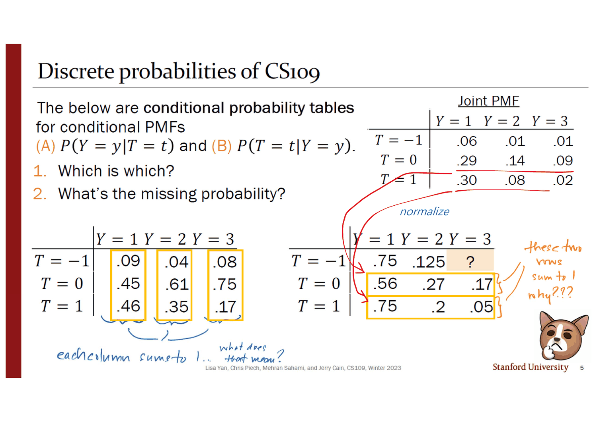
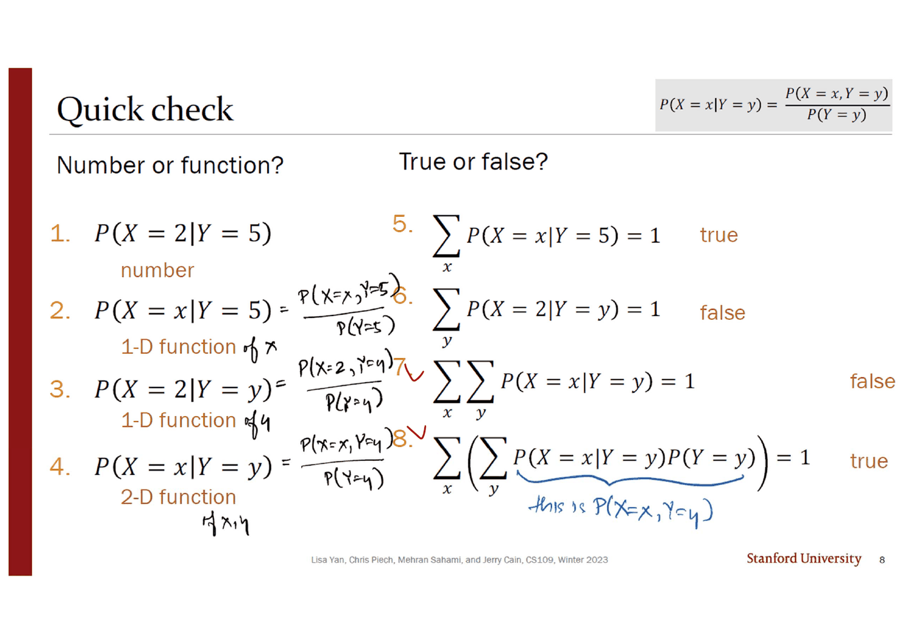
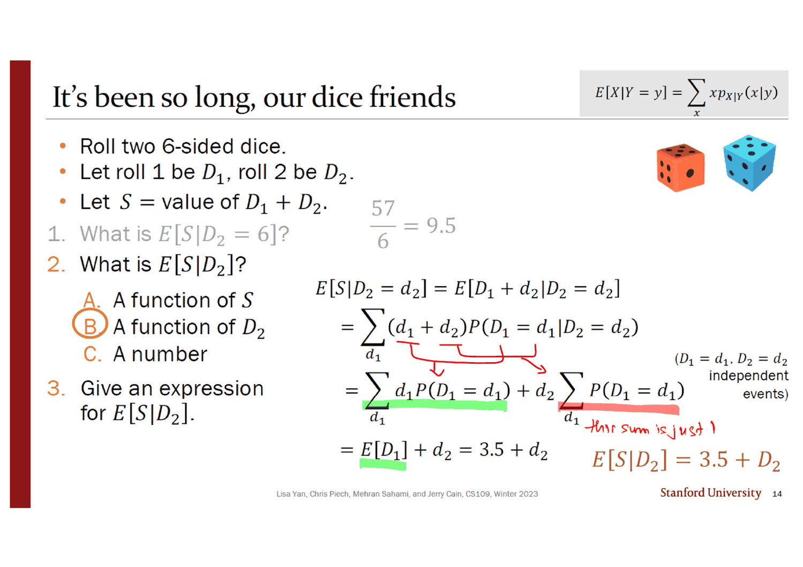
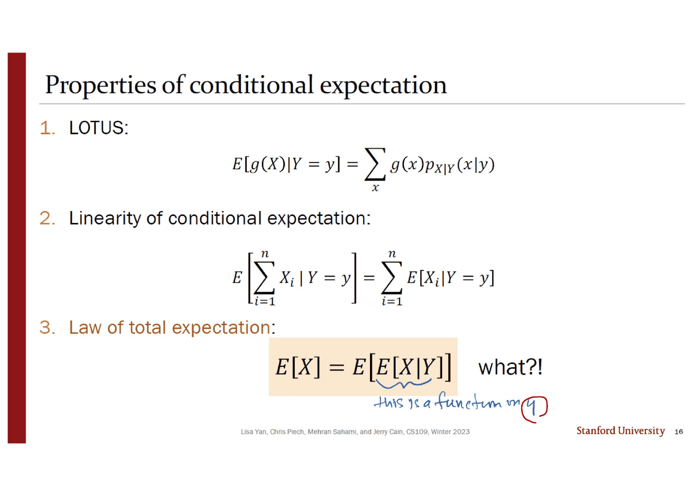
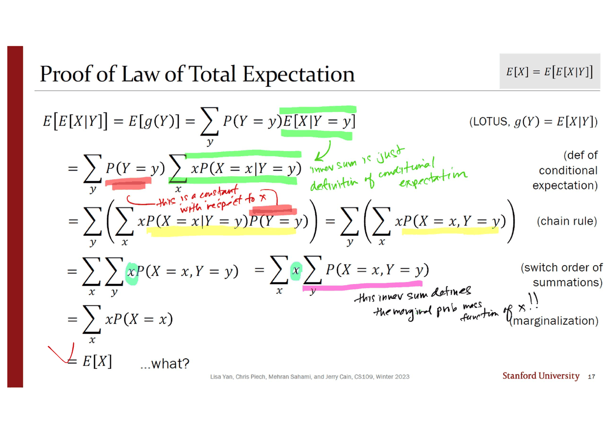
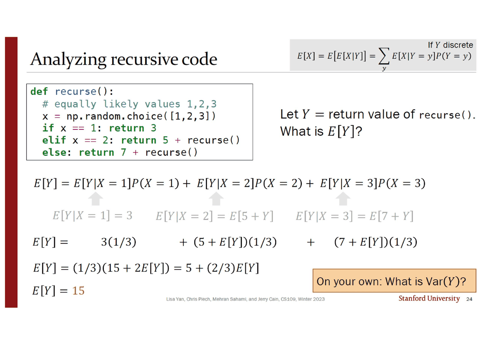
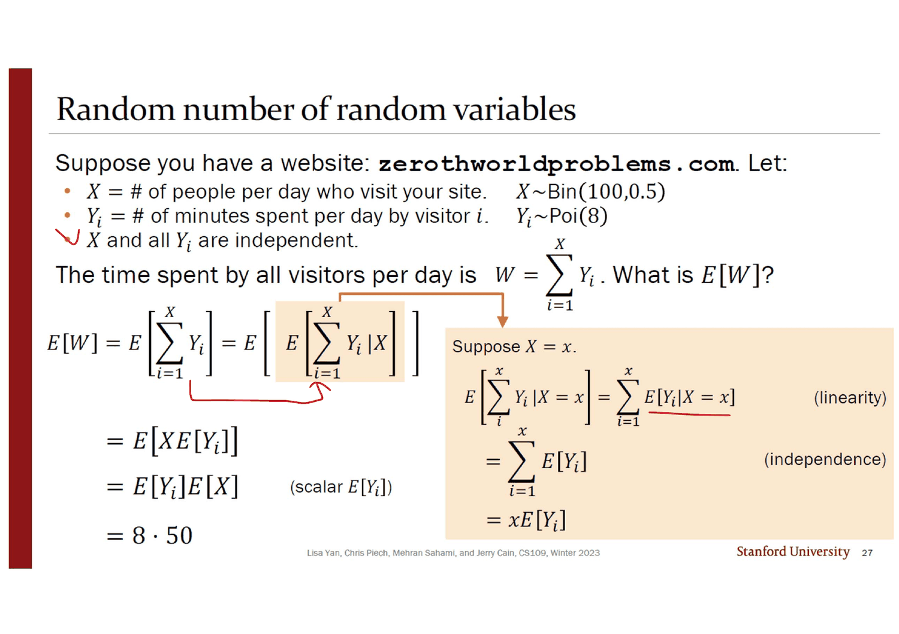

> [!abstract] 덱이 두 번 「what?」 이라고 쓴다
> 16번 슬라이드에는 식이 하나 있다.
>
> $$E[X] = E\big[E[X \mid Y]\big] \qquad \textsf{what?!}$$
>
> 그리고 17번이 여섯 줄짜리 증명을 끝낸다. 각 줄에 근거가 붙어 있고(LOTUS · 조건부기댓값의 정의 · 연쇄법칙 · 합의 순서 교환 · 주변화) 빠진 단계가 없다. 마지막 줄은 $= E[X]$ 이고, 그 옆에 이렇게 적혀 있다.
>
> $$= E[X] \qquad \textsf{…what?}$$
>
> **같은 덱이 증명 앞뒤로 같은 말을 한다.** 증명이 정리를 참으로 만들었지만 이해시키지는 못했다는 자백이고, 이 덱에서 가장 정직한 대목이다. 이해는 18번에서 온다 — 거기서 덱은 식을 다시 증명하는 대신 **세 단계짜리 절차**로 고쳐 쓴다.
>
> 그리고 그 절차가 있어야만 할 수 있는 일이 20~24번에 있다. **분포를 적을 수 없는 확률변수의 평균을 정확히 구하는 것.**

---

## 이 덱이 쌓는 것

목차 세 줄(`2 Discrete Conditional Distributions`, `9 Conditional Expectation`, `15 Law of Total Expectation`)이 모두 실제 절 시작과 맞는다. 세 절이 하는 일은 한 방향으로 쌓인다 — **조건부 PMF → 조건부 기댓값 → 조건부 기댓값의 기댓값.** 매 단계에서 「무엇에 대해 1이 되는가」와 「수인가 함수인가」가 다시 물어진다.

```mermaid
flowchart TB
    A["조건부 PMF<br/>p(x|y) = p(x,y) / p(y)<br/>3번"]
    A --> A1["새 표본공간에 맞춰<br/><b>정규화</b>한다 · 5~6번"]
    A1 --> A2["어느 방향이 1이 되는가가<br/>어느 쪽을 조건으로 잡았는지를 말한다"]

    A --> B["조건부 기댓값<br/>E[X|Y=y] = Σ x p(x|y)<br/>10번"]
    B --> B1["E[X|Y=y] — <b>수</b><br/>11번: E[S|D₂=6] = 9.5"]
    B --> B2["E[X|Y] — <b>Y의 함수</b><br/>= 확률변수<br/>14번: E[S|D₂] = 3.5 + D₂"]

    B2 --> C["함수이니 기댓값을 다시 씌울 수 있다<br/>E[X] = E[E[X|Y]] · 16번"]
    C --> C1["증명 · 17번<br/>…what?"]
    C --> C2["절차 · 18번<br/>① 고정 ② 전부 반복 ③ 가중합"]
    C2 --> D["분포를 못 적는 대상에 쓴다<br/>재귀 함수 19~24번 · E[Y] = 15"]
    C2 --> E["개수가 확률변수인 합 · 27번<br/>E[W] = E[X]E[Yᵢ] = 400"]

    style C fill:transparent,stroke:var(--chart-1),stroke-width:2px
    style C1 fill:transparent,stroke:var(--border),stroke-dasharray:5 4
    style C2 fill:transparent,stroke:var(--chart-2),stroke-width:2px
    style D fill:transparent,stroke:var(--chart-2),stroke-width:2px
```

---

## 정규화 — 어느 방향이 1이 되는가

3번 슬라이드는 새 개념을 하나도 만들지 않는다. 사건의 조건부확률 $P(E \mid F) = \frac{P(EF)}{P(F)}$ 를 그대로 가져와 사건 자리에 확률변수의 값을 넣을 뿐이다.

$$P(X = x \mid Y = y) = \frac{P(X=x,\, Y=y)}{P(Y=y)} \qquad\longleftrightarrow\qquad p_{X\mid Y}(x \mid y) = \frac{p_{X,Y}(x,y)}{p_Y(y)}$$

슬라이드가 왼쪽에 *"Different notation, same idea"* 라고 못 박는다. **12번 덱 3번 슬라이드에도 같은 문구가 있었다** — 그 덱은 독립을, 이 덱은 조건부를 같은 방식으로 도입한다.

4번이 예를 세운다. CS109 수강생이 학년 $Y$(1: 1·2학년, 2: 3·4학년, 3: 대학원생·SCPD)와 기분 $T$($-1$ · $0$ · $1$)로 답한 결합 PMF다.

| | $Y=1$ | $Y=2$ | $Y=3$ |
| --- | --- | --- | --- |
| $T = -1$ | .06 | .01 | .01 |
| $T = 0$ | .29 | .14 | .09 |
| $T = 1$ | .30 | .08 | .02 |

잉크가 위쪽에 조건을 적었다 — $\sum_y\sum_t P(Y{=}y, T{=}t) = 1$(직접 더해 확인했다. 정확히 1.00). 그리고 표의 한 행과 한 열을 감싸며 두 문장을 적었다.

- 초록(행 $T=0$): *"this row is concerned with just those feeling meh! (not good, not bad)"*
- 파랑(열 $Y=3$): *"this column is unconcerned with the world where everyone is a frosh or sophomore"*

**행과 열이 각각 「어떤 세계로 좁히는가」에 대응한다**는 것이 다음 슬라이드 전체의 열쇠다.



5번이 조건부 확률표 둘을 라벨 없이 던지고 두 가지를 묻는다 — *"Which is which?"*, *"What's the missing probability?"* 잉크가 각 표에 무엇을 봐야 하는지를 적었다. 왼쪽 표에는 *"each column sums to 1… what does that mean?"*, 오른쪽 표의 두 행을 묶고 *"these two rows sum to 1, why???"*

**답은 한 줄이다 — 1이 되는 방향이 조건을 건 변수를 가리킨다.** 열이 1로 합쳐지면 열 라벨($Y$)이 조건이고, 행이 1로 합쳐지면 행 라벨($T$)이 조건이다. 6번이 그것을 확인하며 두 계산을 보여 준다.

$$P(T{=}1 \mid Y{=}1) = \frac{.30}{.06+.29+.30} = \frac{.30}{.65} = .46, \qquad P(Y{=}3 \mid T{=}{-1}) = 1 - .75 - .125 = \mathbf{.125}$$

잉크가 첫 계산 아래 *"normalizes world to consist of juniors and seniors"*, 둘째 표 아래 *"normalizes world so that everyone is happy"* 라고 적었다. 그리고 주황 상자가 결론을 낸다 — ***"Conditional PMFs also sum to 1 conditioned on different events!"***

아래에서 두 방향을 직접 바꿔 볼 수 있다. 값은 4번 슬라이드의 결합 PMF에서 계산해 5·6번의 인쇄값과 전부 대조했다.

```html preview
<div id="ct14" style="font-family:system-ui,-apple-system,sans-serif;color:var(--foreground);background:var(--card);border:1px solid var(--border);border-radius:12px;padding:18px 16px;">
  <div style="display:flex;flex-wrap:wrap;gap:8px;margin-bottom:14px;">
    <button class="m-b" data-m="j">결합 PMF  P(Y, T)</button>
    <button class="m-b" data-m="a">(A)  P(Y = y | T = t)</button>
    <button class="m-b" data-m="b">(B)  P(T = t | Y = y)</button>
  </div>
  <div style="overflow-x:auto;"><table id="tb14" style="border-collapse:collapse;font-size:14px;font-variant-numeric:tabular-nums;min-width:380px;"></table></div>
  <p id="ms14" style="margin:14px 0 0;font-size:13px;line-height:1.75;min-height:5em;"></p>
</div>
<style>
#ct14 .m-b{font:inherit;font-size:12.5px;padding:6px 11px;border-radius:7px;cursor:pointer;
  border:1px solid var(--border);background:transparent;color:var(--muted-foreground);}
#ct14 .m-b[aria-pressed="true"]{border-color:var(--chart-1);color:var(--chart-1);font-weight:600;}
#ct14 td,#ct14 th{border:1px solid var(--border);padding:8px 14px;text-align:center;}
#ct14 th{border:none;color:var(--muted-foreground);font-weight:600;font-size:12.5px;}
</style>
<script>
(function(){
  // 4번 슬라이드의 결합 PMF. 행 = T, 열 = Y
  const J=[[.06,.01,.01],[.29,.14,.09],[.30,.08,.02]];
  const T=[-1,0,1], Yv=[1,2,3];
  const rowSum=r=>J[r].reduce((a,b)=>a+b,0);
  const colSum=c=>J.reduce((a,r)=>a+r[c],0);
  let m='j';
  const f=v=>v===0?'0':(Math.abs(v)<1? v.toFixed(v<0.1?3:(Math.round(v*1000)%10?3:2)).replace(/^0/,'').replace(/0+$/,'').replace(/\.$/,'.0') : v.toFixed(2));
  const g=v=>{const s=v.toFixed(3); return s.replace(/^0/,'').replace(/0$/,'');};
  function render(){
    let h='<tr><th></th>'+Yv.map(y=>'<th>Y = '+y+'</th>').join('')+'<th style="padding-left:14px">행 합</th></tr>';
    for(let r=0;r<3;r++){
      h+='<tr><th>T = '+T[r]+'</th>';
      for(let c=0;c<3;c++){
        let v, hi=false;
        if(m==='j') v=J[r][c];
        else if(m==='a'){ v=J[r][c]/rowSum(r); hi=(r===0&&c===2); }
        else { v=J[r][c]/colSum(c); hi=(r===2&&c===0); }
        h+='<td style="'+(hi?'background:color-mix(in srgb, var(--chart-1) 22%, transparent);font-weight:700;':'')+'">'+g(v)+'</td>';
      }
      const rs=(m==='j')?rowSum(r):(m==='a'?1:J[r].map((v,c)=>v/colSum(c)).reduce((a,b)=>a+b,0));
      h+='<td style="border:none;padding-left:14px;color:'+(m==='a'?'var(--chart-2)':'var(--muted-foreground)')+';font-weight:'+(m==='a'?700:400)+'">'+rs.toFixed(2)+'</td></tr>';
    }
    h+='<tr><th style="padding-top:12px">열 합</th>';
    for(let c=0;c<3;c++){
      const cs=(m==='j')?colSum(c):(m==='b'?1:J.map((r,ri)=>r[c]/rowSum(ri)).reduce((a,b)=>a+b,0));
      h+='<td style="border:none;padding-top:12px;color:'+(m==='b'?'var(--chart-2)':'var(--muted-foreground)')+';font-weight:'+(m==='b'?700:400)+'">'+cs.toFixed(2)+'</td>';
    }
    h+='<td style="border:none"></td></tr>';
    document.getElementById('tb14').innerHTML=h;
    const M={
      j:'열여섯이 아니라 아홉 칸이고, <b>전체가 1</b>이 된다(0.06+0.01+…+0.02 = 1.00). 4번 슬라이드 여백의 잉크가 이 조건을 먼저 적어 두었다.',
      a:'<b>행이 1이 된다</b> → 조건을 건 것은 행 라벨, 즉 <b>T</b>다. 각 행을 그 행의 합으로 나눈 것이고, 강조된 칸이 5번 슬라이드가 비워 둔 값 — P(Y=3 | T=−1) = 1 − .75 − .125 = <b>.125</b>. 잉크의 말로는 「모두가 행복한 세계로 정규화한다」.',
      b:'<b>열이 1이 된다</b> → 조건을 건 것은 열 라벨, 즉 <b>Y</b>다. 강조된 칸이 6번 슬라이드가 손으로 계산해 보인 값 — .30 / (.06+.29+.30) = .30/.65 = <b>.46</b>. 잉크의 말로는 「3·4학년만 있는 세계로 정규화한다」.'};
    document.getElementById('ms14').innerHTML=M[m];
    document.querySelectorAll('#ct14 .m-b').forEach(b=>b.setAttribute('aria-pressed', b.dataset.m===m));
  }
  document.querySelectorAll('#ct14 .m-b').forEach(b=>b.addEventListener('click',()=>{m=b.dataset.m;render();}));
  render();
})();
</script>
```

### 수인가 함수인가



8번 슬라이드는 이 덱에서 가장 많은 일을 한다. 왼쪽 네 줄이 **자유변수가 몇 개인가**를 묻고, 오른쪽 네 줄이 **무엇에 대해 더해야 1이 되는가**를 묻는다.

| | 식 | 정체 | 잉크가 덧붙인 것 |
| --- | --- | --- | --- |
| 1 | $P(X{=}2 \mid Y{=}5)$ | **수** | $\dfrac{P(X{=}2, Y{=}5)}{P(Y{=}5)}$ |
| 2 | $P(X{=}x \mid Y{=}5)$ | $x$ 의 1차원 함수 | $\dfrac{P(X{=}x, Y{=}5)}{P(Y{=}5)}$ |
| 3 | $P(X{=}2 \mid Y{=}y)$ | $y$ 의 1차원 함수 | $\dfrac{P(X{=}2, Y{=}y)}{P(Y{=}y)}$ |
| 4 | $P(X{=}x \mid Y{=}y)$ | $x, y$ 의 2차원 함수 | $\dfrac{P(X{=}x, Y{=}y)}{P(Y{=}y)}$ |

**잉크가 네 줄 모두에 분수를 다시 적은 것이 요점이다.** 네 경우의 정의는 완전히 같고 달라지는 것은 어느 문자가 묶여 있느냐뿐인데, 그것만으로 수와 2차원 함수가 갈린다.

오른쪽의 참·거짓 넷은 그 결과다.

$$\sum_x P(X{=}x \mid Y{=}5) = 1 \ \ \textbf{참} \qquad \sum_y P(X{=}2 \mid Y{=}y) = 1 \ \ \textbf{거짓}$$

첫째는 「$Y=5$ 인 세계」 안의 확률분포라 1이 된다. 둘째는 서로 다른 세계에서 잰 값들을 더한 것이라 1이 될 이유가 없다 — **5번 슬라이드의 표에서 잘못된 방향으로 더하는 것과 같다.** 셋째($\sum_x\sum_y$)도 같은 이유로 거짓이고, 넷째는 잉크가 밑줄을 그어 이유를 적었다.

$$\sum_x\Big(\sum_y \underbrace{P(X{=}x \mid Y{=}y)P(Y{=}y)}_{\text{잉크: } \textit{this is } P(X=x, Y=y)}\Big) = 1 \ \ \textbf{참}$$

$P(Y{=}y)$ 를 곱하는 순간 서로 다른 세계의 값들이 하나의 세계로 되돌아온다. **이 한 줄이 열 장 뒤 전확률 기댓값 법칙의 구조 그대로다.**

---

## 조건부 기댓값 — 그리고 답이 함수가 되는 순간

10번의 정의는 평범하다. 기댓값의 정의에서 PMF만 조건부 PMF로 바꾼다.

$$E[X \mid Y = y] = \sum_x x\,P(X = x \mid Y=y) = \sum_x x\,p_{X\mid Y}(x \mid y)$$

잉크가 제목 옆에 범위를 적고(*"discrete, though continuous is defined similarly"*), 오른쪽에 이 정의를 읽는 법을 적었다 — ***"$Y = y$ is the new sample space"***. 12번 슬라이드에서 같은 문장이 다시 나온다.

11번이 주사위로 확인한다. $D_1, D_2$ 가 6면체 둘, $S = D_1 + D_2$ 일 때

$$E[S \mid D_2 = 6] = \sum_{x=7}^{12} x\,P(S = x \mid D_2 = 6) = \frac16(7+8+9+10+11+12) = \frac{57}{6} = 9.5$$

슬라이드가 그 아래 직관도 적는다 — $6 + E[D_1] = 6 + 3.5 = 9.5$. 잉크가 합 기호에 범위 $x = 7$ 과 $12$ 를 직접 채워 넣었고(인쇄물에는 범위가 비어 있다), 문제 위에 한 줄을 적었다 — ***"$S \mid D_2 = 6$ is a random variable!"*** 그리고 오른쪽 *"Let's prove this!"* 옆에 빨간 글씨로 **`P.14`** 라고 적고 화살표를 그었다. **잉크가 슬라이드에 없는 상호참조를 만들어 붙였다.**



14번이 그 약속을 갚는데, 갚는 방식이 이 덱의 전환점이다. 질문이 *"What is $E[S \mid D_2]$?"* 로 바뀌었다 — **조건 자리의 $6$ 이 사라지고 $D_2$ 만 남았다.** 객관식 셋 중 잉크가 동그라미 친 답은 (C) 수가 아니라 **(B) $D_2$ 의 함수**다.

$$
\begin{aligned}
E[S \mid D_2 = d_2] &= E[D_1 + d_2 \mid D_2 = d_2] = \sum_{d_1}(d_1 + d_2)P(D_1 = d_1 \mid D_2 = d_2)\\
&= \sum_{d_1} d_1 P(D_1 = d_1) + d_2\underbrace{\sum_{d_1}P(D_1 = d_1)}_{\text{잉크: } \textit{this sum is just 1}} = E[D_1] + d_2 = 3.5 + d_2
\end{aligned}
$$

독립이 쓰이는 자리에 슬라이드가 작게 주석을 달았다 — *"($D_1 = d_1$, $D_2 = d_2$ independent events)"*. 그리고 주황 글씨로 결론을 낸다.

$$E[S \mid D_2] = 3.5 + D_2$$

**오른쪽 변에 대문자 $D_2$ 가 있다.** 조건부 기댓값은 조건을 고정하면 수이고, 고정하지 않으면 확률변수다. 12·16번의 잉크가 이 사실을 세 번 반복해 적었다 — *"$Y = y$ is the new sample space"*, *"this is a function on $y$"*(빨간 동그라미).

12번 슬라이드는 조건부 기댓값의 성질 셋을 적는데 셋째 줄이 비어 있다 — *"Law of total expectation (in, like, three slides)"*. 잉크가 옆에 대문자로 적었다 — **`CLIFFHANGER!!!`** 그리고 16번이 12번과 **완전히 같은 슬라이드**인데 셋째 줄만 채워져 있다.

---

## 두 번의 「what?」



$$E[X] = E\big[E[X \mid Y]\big] \qquad \textsf{what?!}$$

**「what?!」은 인쇄되어 있다.** 슬라이드를 만든 사람이 스스로 붙인 반응이다. 그리고 잉크가 안쪽 $E[X|Y]$ 에 밑줄을 긋고 *"this is a function on $\textbf{y}$"* 라고 적으면서 $y$ 에만 빨간 동그라미를 쳤다. **바깥 $E[\cdot]$ 가 무엇에 대한 기댓값인지가 유일한 어려움**이고, 잉크가 그것을 정확히 짚는다 — 바깥은 $Y$ 에 대한 기댓값이다.



17번의 증명은 여섯 줄이고 각 줄에 근거가 붙어 있다.

$$
\begin{aligned}
E\big[E[X\mid Y]\big] = E[g(Y)] &= \sum_y P(Y{=}y)\,E[X \mid Y{=}y] && \text{LOTUS, } g(Y) = E[X\mid Y]\\
&= \sum_y P(Y{=}y)\sum_x x\,P(X{=}x \mid Y{=}y) && \text{조건부 기댓값의 정의}\\
&= \sum_y\Big(\sum_x x\,P(X{=}x\mid Y{=}y)P(Y{=}y)\Big) = \sum_y\Big(\sum_x x\,P(X{=}x, Y{=}y)\Big) && \text{연쇄법칙}\\
&= \sum_x x\sum_y P(X{=}x, Y{=}y) && \text{합의 순서 교환}\\
&= \sum_x x\,P(X{=}x) \;=\; E[X] && \text{주변화}
\end{aligned}
$$

잉크가 네 색으로 각 단계를 표시했다 — 초록은 *"inner sum is just definition of conditional expectation"*, 빨강은 $P(Y{=}y)$ 를 안쪽으로 들일 때 *"this is a constant with respect to $x$"*, 분홍은 마지막에 *"this inner sum defines the marginal prob mass function of $x$!!"*, 하늘색은 합의 순서를 바꿀 때 $x$ 가 바깥으로 빠지는 것.

**빠진 단계가 없다. 그런데 마지막 줄 옆에 인쇄된 것이 `…what?` 이다.**

그리고 잉크가 그 마지막 줄에 빨간 체크를 하나 그렸다. 증명은 맞았고, 그래도 여전히 납득되지 않는다는 것이 이 두 글자의 뜻이다.

> [!tip] 왜 증명이 이해를 주지 않는가
> 증명의 다섯 단계는 전부 **표기 조작**이다. LOTUS를 쓰고, 정의를 펼치고, 곱을 결합하고, 순서를 바꾸고, 한 축으로 더한다. 각 단계는 앞 단계와 같은 것을 다르게 적을 뿐이라 **「왜 이 정리가 참인가」에 대한 이야기가 한 줄도 없다.** 실제로 이 증명이 쓰는 것은 8번 슬라이드의 넷째 참·거짓 문항 — $\sum_x\sum_y P(X{=}x\mid Y{=}y)P(Y{=}y) = 1$ — 과 정확히 같은 구조다. 그 문항에서 잉크가 적었던 한 줄(*"this is $P(X{=}x, Y{=}y)$"*)이 이 증명의 셋째 줄이다.

---

## 절차로 바꿔 쓰면 이해된다

18번이 방법을 바꾼다. 같은 식을 다시 쓰고, 그 아래에 **세 단계**를 적는다.

$$E\big[E[X\mid Y]\big] = \sum_y P(Y{=}y)\,E[X \mid Y{=}y] = E[X]$$

1. $Y = y$ 인 어떤 값 하나에 대해 $X$ 의 기댓값을 구한다
2. $Y$ 의 모든 값에 대해 1을 반복한다
3. **가중합**을 구한다 (가중치는 $P(Y{=}y)$)

잉크가 2·3번에 보충을 붙였다 — 3번의 「가중합」 앞에 *"of all conditional expectations of $X$, i.e. $E[X\mid Y{=}y]\ \forall y$"*. 그리고 슬라이드 위쪽 여백에는 이 정리를 쓸 **조건**을 적었다.

> *An assumption here is that it's difficult to compute marginal PDF of $X$.*

**이것이 16번의 「what?!」 에 대한 진짜 답이다.** $X$ 의 분포를 알면 $E[X]$ 를 직접 구하면 되니 이 정리는 쓸 일이 없다. 이 정리는 **$X$ 의 분포를 모를 때, 그러나 조건을 걸면 알게 될 때** 쓰는 도구다. 슬라이드 오른쪽 아래의 주황 상자가 그 자리를 하나 지목한다 — ***"Useful for analyzing recursive code."*** 그리고 코드 조각을 하나 붙여 둔다.

```python
def recurse():
    if random.random() < 0.5:
        return 3
    else: return 2 + recurse()
```

---

## 분포를 적을 수 없는 확률변수의 평균

19번이 문제를 조금 키운다.

```python
def recurse():
    # equally likely values 1,2,3
    x = np.random.choice([1,2,3])
    if   x == 1: return 3
    elif x == 2: return 5 + recurse()
    else:        return 7 + recurse()
```

$Y$ 를 `recurse()` 의 반환값이라 할 때 $E[Y]$ 를 구한다. **20~23번이 한 항씩 켠다.** 조건은 첫 번째 주사위 $X$ 이고, 세 갈래 각각에서 $Y$ 가 무엇이 되는지를 코드에서 읽는다.

| | 코드가 하는 일 | $E[Y \mid X = x]$ |
| --- | --- | --- |
| $X=1$ | `return 3` | $3$ |
| $X=2$ | `return 5 + recurse()` | $E[5 + Y] = 5 + E[Y]$ |
| $X=3$ | `return 7 + recurse()` | $E[7 + Y] = 7 + E[Y]$ |

21번은 둘째 줄을 객관식으로 묻고, 잉크가 **B** 에 동그라미를 쳤다. 오답 (C) $5 + E[Y \mid X{=}2]$ 가 함정이다 — **재귀 호출은 새로 시작하므로 그 안의 $X$ 는 방금 뽑은 2와 무관하다.** 22번이 그것을 말로 적는다 — *"When $X=2$, return 5 + **a future** return value of `recurse()`."*

> [!note] 이 표기에는 미끄러짐이 하나 있다
> $E[Y \mid X{=}2] = E[5+Y]$ 의 오른쪽 $Y$ 는 왼쪽 $Y$ 와 **같은 확률변수가 아니다.** 앞으로 일어날 호출의 반환값이고, 분포만 같을 뿐이다. 슬라이드도 그것을 *"a future return value"* 라 부르면서 식에서는 같은 문자를 쓴다. 독립인 복제본을 $Y'$ 로 적으면 $E[Y\mid X{=}2] = E[5 + Y'] = 5 + E[Y]$ 가 되어 오해가 없다. 21번의 오답 (C)가 정확히 이 미끄러짐을 겨냥한 선택지다.



24번이 세 항을 모은다.

$$E[Y] = 3\cdot\tfrac13 + (5 + E[Y])\tfrac13 + (7 + E[Y])\tfrac13 = \tfrac13\big(15 + 2E[Y]\big) = 5 + \tfrac23 E[Y]$$

$$\tfrac13 E[Y] = 5 \;\Longrightarrow\; \boxed{E[Y] = 15}$$

**미지수가 양변에 나타나고 방정식을 풀어 값을 얻는다.** 18번의 절차가 아니었다면 이 형태를 쓸 수 없다 — $Y$ 의 PMF를 먼저 알아야 했을 테니까. 그리고 그 PMF는 실제로 지저분하다.

```html preview
<div id="rc14" style="font-family:system-ui,-apple-system,sans-serif;color:var(--foreground);background:var(--card);border:1px solid var(--border);border-radius:12px;padding:18px 16px;">
  <svg id="rs14" viewBox="0 0 620 240" style="width:100%;height:auto;display:block;"></svg>
  <div style="display:flex;flex-wrap:wrap;gap:8px;margin:14px 0 0;">
    <button class="r-b" data-m="p">PMF만 보기</button>
    <button class="r-b" data-m="e">평균 15 표시</button>
    <button class="r-b" data-m="v">분산 218 표시</button>
  </div>
  <p id="rm14" style="margin:12px 0 0;font-size:13px;line-height:1.75;min-height:5.2em;"></p>
</div>
<style>
#rc14 .r-b{font:inherit;font-size:12.5px;padding:6px 11px;border-radius:7px;cursor:pointer;
  border:1px solid var(--border);background:transparent;color:var(--muted-foreground);}
#rc14 .r-b[aria-pressed="true"]{border-color:var(--chart-1);color:var(--chart-1);font-weight:600;}
</style>
<script>
(function(){
  // Y 의 정확한 PMF (유리수로 전개한 뒤 소수로 옮김). 지지집합이 {3,8,10,13,15,17,18,20,…} 로 듬성듬성하다.
  const P=[[3,0.33333333],[8,0.11111111],[10,0.11111111],[13,0.03703704],[15,0.07407407],[17,0.03703704],
           [18,0.01234568],[20,0.03703704],[22,0.03703704],[23,0.00411523],[24,0.01234568],[25,0.01646091],
           [27,0.02469136],[28,0.00137174],[29,0.01646091],[30,0.00685871]];
  const NS='http://www.w3.org/2000/svg', svg=document.getElementById('rs14');
  function el(n,a){const e=document.createElementNS(NS,n);for(const k in a)e.setAttribute(k,a[k]);return e;}
  const L=44,R=600,B=196,T=14,VMAX=32,PMAX=0.35;
  const sx=v=>L+(v/VMAX)*(R-L), sy=p=>B-(p/PMAX)*(B-T);
  let m='p';
  function draw(){
    svg.textContent='';
    svg.appendChild(el('line',{x1:L,y1:B,x2:R,y2:B,stroke:'var(--border)'}));
    for(const [v,p] of P){
      svg.appendChild(el('rect',{x:sx(v)-4,y:sy(p),width:8,height:B-sy(p),fill:'var(--chart-1)',opacity:0.8}));
    }
    for(const t of [0,5,10,15,20,25,30]){
      const tx=el('text',{x:sx(t),y:B+18,'text-anchor':'middle','font-size':11,fill:'var(--muted-foreground)'});
      tx.textContent=t; svg.appendChild(tx);
    }
    if(m!=='p'){
      svg.appendChild(el('line',{x1:sx(15),y1:T,x2:sx(15),y2:B,stroke:'var(--chart-2)','stroke-width':2}));
      const t=el('text',{x:sx(15)+6,y:T+12,'font-size':11.5,fill:'var(--chart-2)','font-weight':700});
      t.textContent='E[Y] = 15'; svg.appendChild(t);
    }
    if(m==='v'){
      const sd=Math.sqrt(218);
      svg.appendChild(el('rect',{x:sx(Math.max(0,15-sd)),y:T,width:sx(15+sd)-sx(Math.max(0,15-sd)),height:B-T,
        fill:'var(--chart-2)',opacity:0.10}));
      const t=el('text',{x:sx(15)+6,y:T+28,'font-size':11,fill:'var(--chart-2)'});
      t.textContent='± σ = ±'+sd.toFixed(2); svg.appendChild(t);
    }
    const M={
      p:'지지집합이 <b>{3, 8, 10, 13, 15, 17, 18, 20, 22, 23, …}</b> 로 듬성듬성하고 규칙이 보이지 않는다. 5와 7을 몇 번씩 더하느냐의 모든 조합이라 4·5·6·7·9·11·12 같은 값은 아예 나올 수 없다. <b>닫힌 꼴로 적을 수 있는 분포가 아니다.</b>',
      e:'그런데 평균은 <b>정확히 15</b>다. 24번 슬라이드가 방정식 한 줄로 얻은 값이고, PMF를 전개해 직접 더해도 같다. <b>최빈값은 3</b>(확률 1/3)이라 평균이 최빈값의 다섯 배인데, 이것이 18번이 말한 「주변 PDF를 구하기 어려울 때」의 전형이다.',
      v:'24번 슬라이드가 남긴 숙제 — <i>“On your own: What is Var(Y)?”</i> 같은 방법으로 <b>Var(Y) = 218</b>(σ ≈ 14.76)이 나온다. E[Y²] 에 대해 같은 조건화를 한 번 더 하면 E[Y²] = 3 + ⅓(25+10·15+E[Y²]) + ⅓(49+14·15+E[Y²]) 에서 <b>E[Y² ] = 443</b>, 따라서 443 − 15² = 218. (이 값은 원본에 없다 — 직접 계산해 수치로도 확인했다)'};
    document.getElementById('rm14').innerHTML=M[m];
    document.querySelectorAll('#rc14 .r-b').forEach(b=>b.setAttribute('aria-pressed', b.dataset.m===m));
  }
  document.querySelectorAll('#rc14 .r-b').forEach(b=>b.addEventListener('click',()=>{m=b.dataset.m;draw();}));
  draw();
})();
</script>
```

---

## 개수마저 확률변수일 때

25번이 독립을 조건부 언어로 다시 적는다. $X \perp Y$ 이면 $p_{X\mid Y}(x\mid y) = p_X(x)$ 이므로

$$E[X \mid Y = y] = \sum_x x\,p_{X\mid Y}(x\mid y) = \sum_x x\,p_X(x) = E[X]$$

**독립이면 조건부 기댓값이 상수 함수가 된다.** 14번이 만든 「$D_2$ 의 함수」가 여기서는 $D_2$ 에 반응하지 않는 평평한 함수로 무너진다.



27번이 이 덱의 마지막이고, 지금까지 나온 모든 도구를 한 번에 쓴다. 웹사이트 `zerothworldproblems.com` 에서

- $X$ = 하루 방문자 수, $X \sim \text{Bin}(100, 0.5)$
- $Y_i$ = 방문자 $i$ 의 체류 시간(분), $Y_i \sim \text{Poi}(8)$
- $X$ 와 모든 $Y_i$ 는 독립

$$W = \sum_{i=1}^{X} Y_i, \qquad E[W] = ?$$

**합의 위쪽 끝이 확률변수다.** 12번 덱 22번 슬라이드의 기댓값 선형성은 항의 개수 $n$ 이 상수일 때의 규칙이라 그대로 쓸 수 없다. 그래서 $X$ 로 조건을 건다.

$$E[W] = E\Big[E\big[\textstyle\sum_{i=1}^{X} Y_i \,\big|\, X\big]\Big]$$

안쪽은 주황 상자에서 따로 계산한다. $X = x$ 로 **고정되면 개수가 상수가 되고**, 그 순간 선형성이 다시 쓸 수 있게 된다.

$$E\Big[\sum_{i=1}^{x} Y_i \,\Big|\, X = x\Big] \overset{\text{선형성}}{=} \sum_{i=1}^{x}E[Y_i \mid X = x] \overset{\text{독립}}{=} \sum_{i=1}^{x}E[Y_i] = x\,E[Y_i]$$

두 번째 등호가 25번의 결과다. 그러면 바깥은

$$E[W] = E\big[X\,E[Y_i]\big] = E[Y_i]\,E[X] = 8 \cdot 50 = \mathbf{400}$$

**조건화가 한 일은 단 하나 — 확률변수였던 합의 개수를 잠시 상수로 만든 것이다.** 그리고 그 대가로 바깥에 기댓값이 하나 더 생겼는데, 안쪽 결과가 $X$ 에 대해 선형이라 그 기댓값이 그냥 $E[X]$ 로 풀린다.

> [!note] 이름이 붙지 않은 결과
> $E\big[\sum_{i=1}^{N} Y_i\big] = E[N]\,E[Y]$ 는 **왈드 등식(Wald's equation)** 으로 알려진 결과다. 덱은 이름을 붙이지 않고 예제 하나로 지나간다. 슬라이드가 마지막 줄을 $8 \cdot 50$ 에서 멈추고 **400을 적지 않은 것**도 같은 결에 있다 — 이 슬라이드는 값이 아니라 조건화의 동작을 보여 주려는 자리다.

---

## 원본 오류·불일치

이번 덱은 계산 오류가 없다. 인쇄된 수치를 전부 재계산해 대조했고 전부 맞는다 — 결합 PMF의 합 1.00, 두 조건부 표의 모든 칸, $57/6 = 9.5$, $3.5 + d_2$, $E[Y] = 15$, $8 \times 50$. 대신 구조와 표기에서 넷이 걸린다.

`표기`

- **21~24번의 $Y$ 가 두 가지를 가리킨다** — $E[Y \mid X{=}2] = E[5+Y]$ 에서 오른쪽 $Y$ 는 **다음 호출의 반환값**이지 왼쪽 $Y$ 가 아니다. 22번이 말로는 *"a future return value"* 라고 구별하면서 식에서는 같은 문자를 쓴다. 21번의 오답 (C) $5 + E[Y\mid X{=}2]$ 가 이 미끄러짐을 정확히 겨냥한 선택지다
- **27번이 마지막 값을 적지 않는다** — $E[W] = 8 \cdot 50$ 에서 멈추고 400이 없다
- **27번의 안쪽 계산에서 첨자가 흐려진다** — 주황 상자의 첫 줄 왼쪽 합이 $\sum_i$ 로 범위 없이 적혀 있고 오른쪽만 $\sum_{i=1}^{x}$ 다. 잉크가 오른쪽 $E[Y_i \mid X = x]$ 에 빨간 밑줄을 그어 그 자리를 표시했다

`구조`

- **12번과 16번이 같은 슬라이드다** — 셋째 항목만 `(in, like, three slides)` 에서 실제 식으로 바뀐다. 그 사이의 13·14·15번 중 13번은 결번이고 15번은 절 표지이므로, **「세 장 뒤」라는 약속의 실제 거리는 네 장**이다. 잉크가 12번에 `CLIFFHANGER!!!` 라고 적었다
- **세 장이 빠졌다** — 인쇄된 마지막 번호는 27인데 PDF는 24쪽이고 **7 · 13 · 26번**이 없다($27 - 3 = 24$). 7번은 5·6번 다음의 연습, 26번은 25번(독립)과 27번(웹사이트) 사이라 예제 한 장으로 보인다
- **연도가 섞여 있지 않다** — 전 슬라이드가 `Winter 2023` 이다
- **표지 등사체 목차는 정확하다** — 세 줄(`2 Discrete Conditional Distributions` / `9 Conditional Expectation` / `15 Law of Total Expectation`)이 모두 실제 절 표지와 일치한다. 13번 덱에서 다섯 줄이 전부 어긋났던 것과 대조된다

---

## 근거 자료

- **원본**: `sources/14_conditional_expectation.pdf` — 24쪽, 인쇄 번호 1~27(7·13·26 결번). 표지에 `Jerry Cain, February 9, 2024` 와 `Lecture Discussion on Ed` 링크
- **본문에 인용한 슬라이드**: 5 · 8 · 14 · 16 · 17 · 24 · 27번 (PDF 5 · 7 · 12 · 14 · 15 · 22 · 24쪽)
- **재계산한 값**: 4번 결합 PMF의 총합(1.00)과 두 조건부 표의 아홉 칸 전부(5·6번의 인쇄값과 일치), $P(Y{=}3\mid T{=}{-}1) = .125$, $P(T{=}1\mid Y{=}1) = .30/.65 = .4615$, $E[S\mid D_2{=}6] = 57/6$, 재귀 함수의 $E[Y] = 15$(방정식과 PMF 전개 두 방법), **$\text{Var}(Y) = 218$**(24번이 숙제로 남긴 값, $E[Y^2] = 443$), $E[W] = 8 \times 50 = 400$

`직전` → [[13. 고치려고 만든 것이 또 고칠 것을 남긴다]]

이 덱은 앞 세 덱과 성격이 다르다. 11~13번 덱은 **모형을 포기하는 법**을 가르쳤다 — 분포를 근사하고, 결합분포 대신 통계량을 보고하고, 그 통계량마저 고쳐 썼다. 이 덱은 반대로 **모르는 채로 정확한 답을 얻는 법**이다. 24번의 $E[Y] = 15$ 는 근사가 아니고 요약도 아니다. 분포를 끝까지 모르면서 평균만 정확히 집어낸다. 12번 덱 22번 슬라이드가 *"Even if you don't know the distribution of $X$ … you can still compute expectation of $X$"* 라고 적었던 그 약속이, 조건화라는 도구를 얻고 나서야 재귀 함수와 왈드 등식까지 닿는다.
