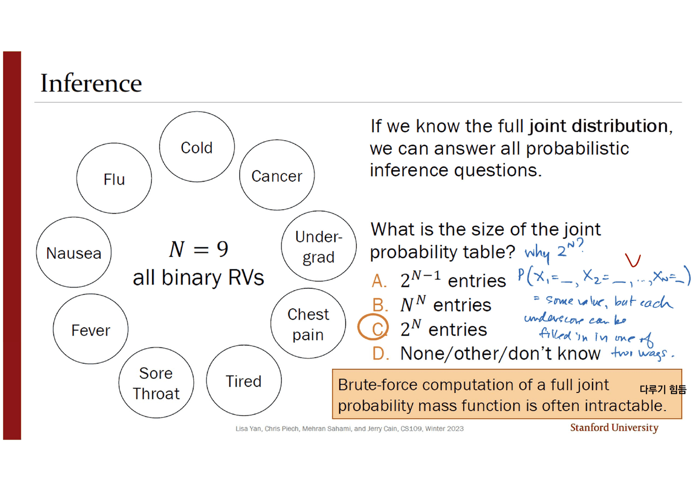
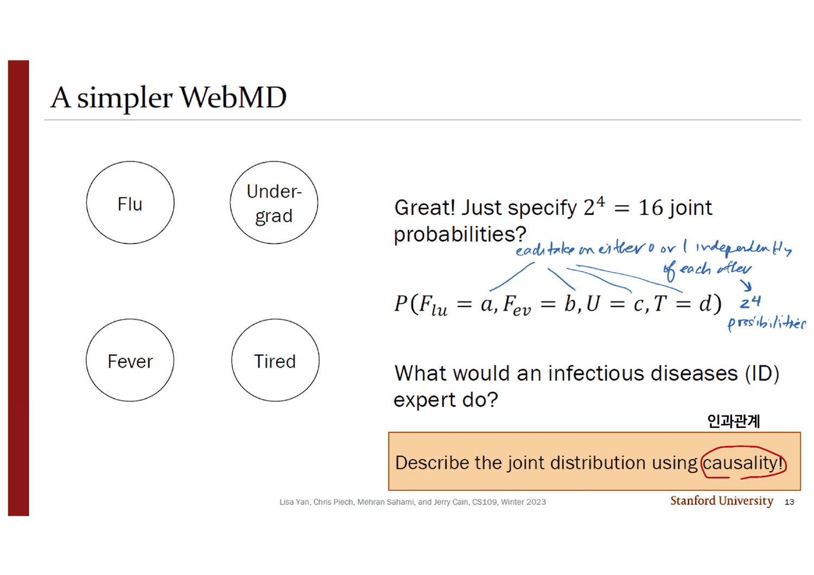
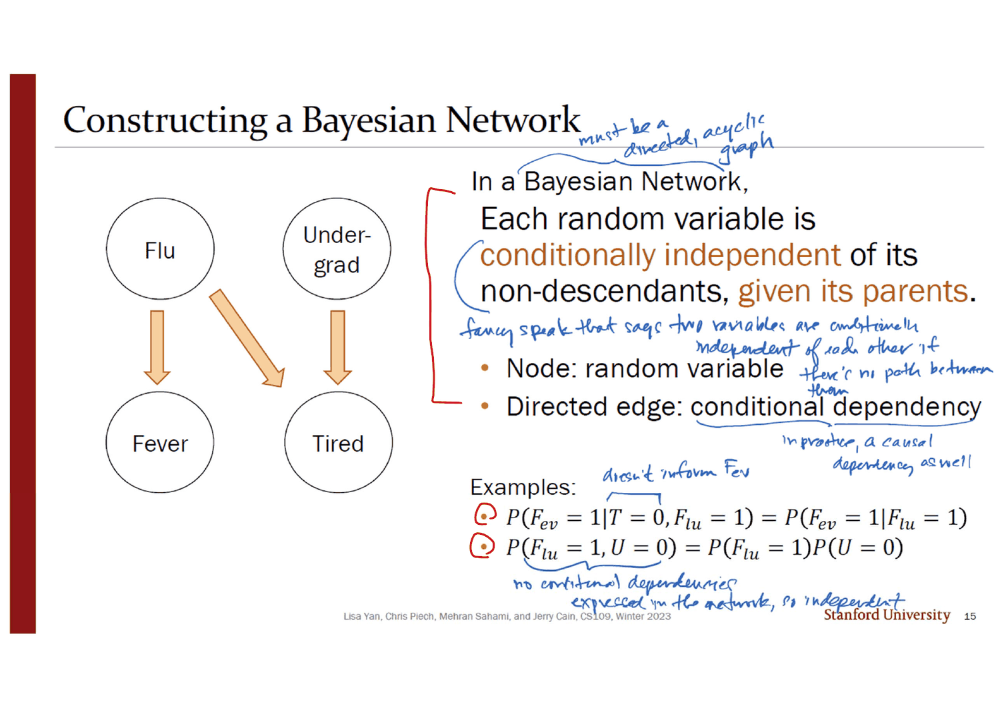
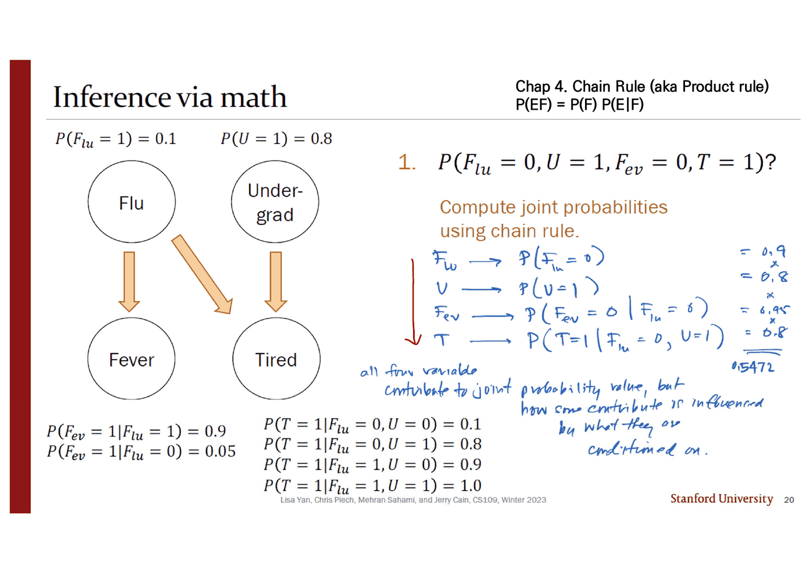
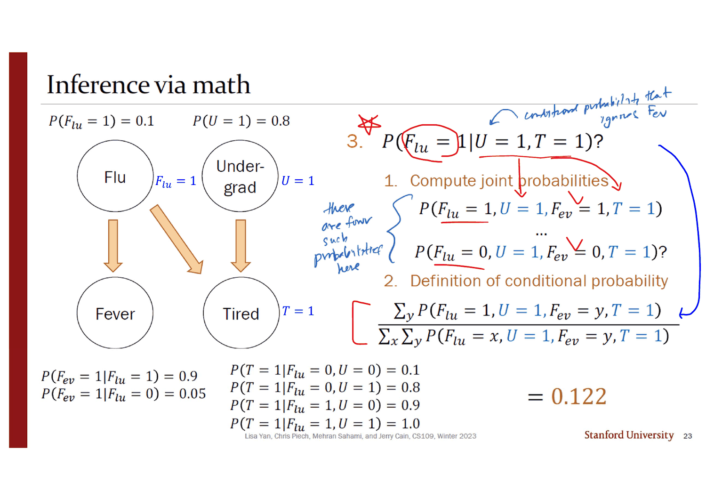
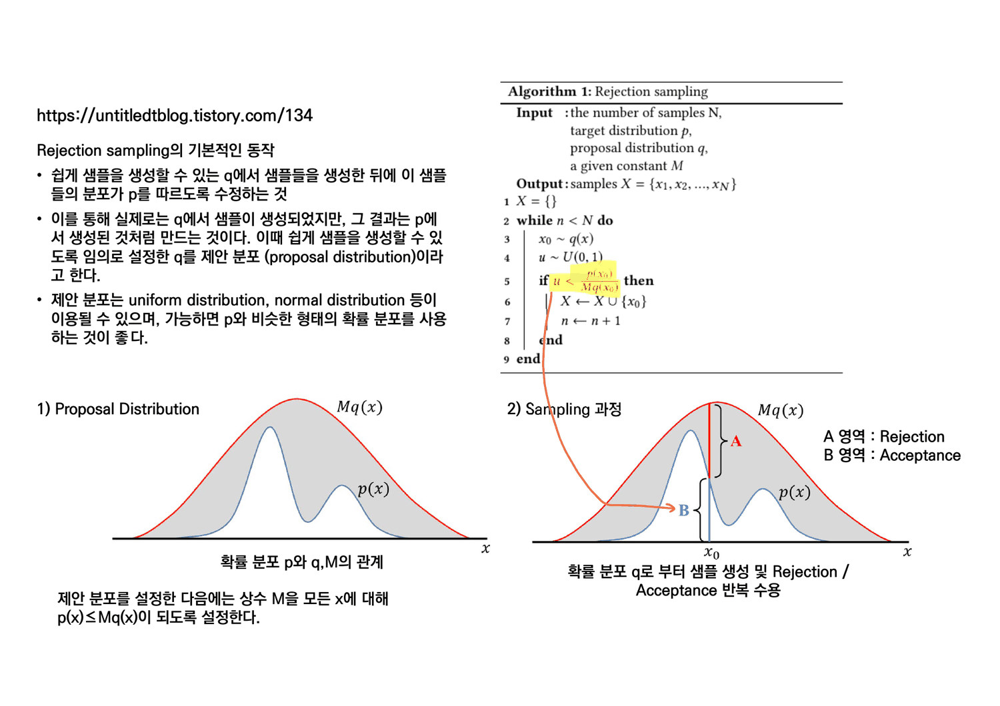
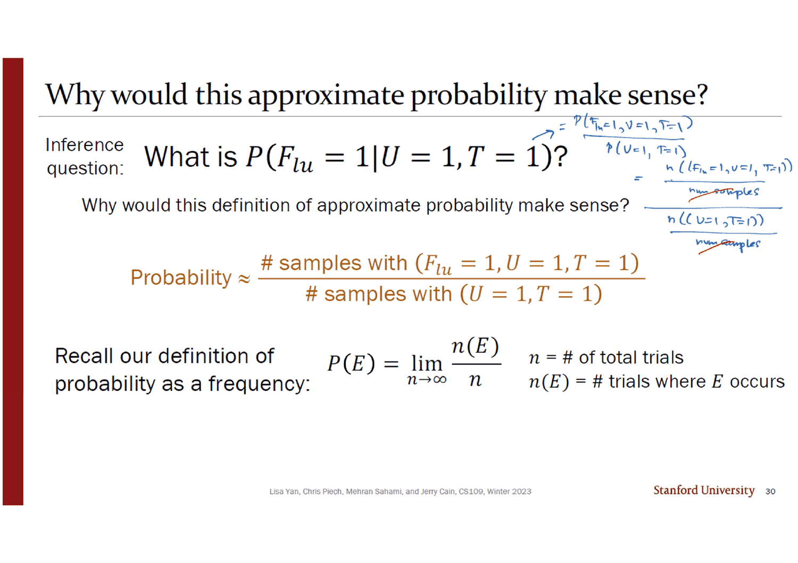
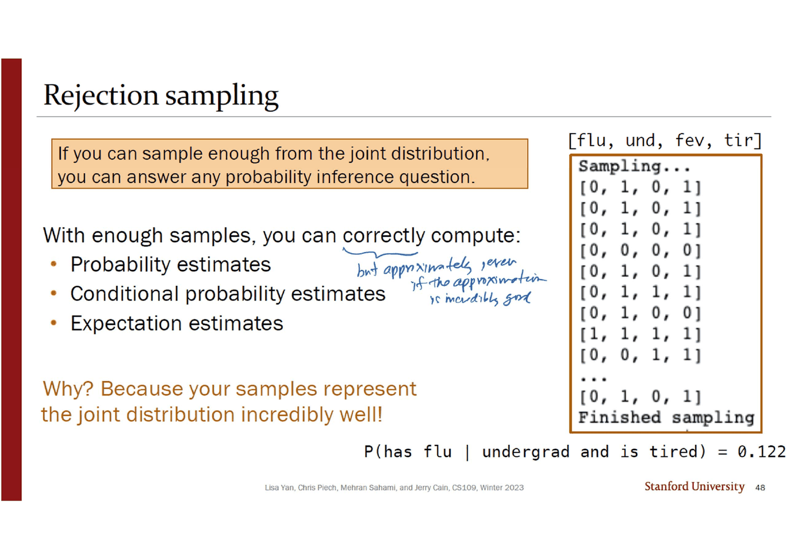

> [!abstract] 같은 질문에 두 번 답하는 덱
> 23번 슬라이드가 $P(F_{lu}{=}1 \mid U{=}1, T{=}1)$ 을 손으로 계산해 **0.122** 를 얻는다. 그리고 스물다섯 장 뒤, 48번 슬라이드의 터미널 출력이 이렇게 끝난다.
>
> ```text
> P(has flu | undergrad and is tired) = 0.122
> ```
>
> **같은 수다.** 중간의 스물다섯 장은 이미 답을 아는 문제를 10만 개의 표본으로 다시 푸는 과정이고, 그 과정의 결과물은 **다섯 줄짜리 파이썬 함수 하나**다. 스무 장에 걸쳐 그 다섯 줄을 한 줄씩 켠다.
>
> 그런데 그 다섯 줄이 새로운 알고리즘이 아니다. **조건부확률의 정의를 그대로 옮겨 적은 것**이다 — 표본을 잔뜩 만들고(빈도주의적 확률의 정의), 관측과 어긋나는 것을 버리고(표본공간을 조건으로 좁히기), 남은 것 중 사건이 성립하는 것을 다시 세고(교집합), 두 수를 나눈다(정의). 덱이 29번에서 그것을 대놓고 묻는다 — *"Why would this definition of approximate probability make sense?"* 잉크의 답이 한 줄이다. ***"this is the frequentist's definition of probability!!"***
>
> 그러니까 이 덱은 새 도구를 만들지 않는다. **1장에서 배운 정의를 실행 가능한 형태로 되돌려 놓는다.**

---

## 네 번의 압축

덱의 네 절이 같은 대상 — 네 변수의 결합분포 — 을 네 번 다르게 담는다. 표지 목차 네 줄(`2 General Inference: Intro`, `12 Bayesian Networks`, `19 Inference: Math`, `25 Rejection Sampling`)이 모두 실제 절 표지와 정확히 맞고, 순서대로 읽으면 크기가 계속 줄어든다.

```mermaid
flowchart TB
    A["① 완전 결합 확률표<br/>2^N 칸 · N=9 면 512칸<br/>슬라이드 8~9"]
    A -->|"다루기 힘들다"| B["② 베이즈망<br/>인과 구조 + 조건부독립<br/>슬라이드 12~18"]
    B --> B1["네 변수: 15개 → <b>8개</b> 수<br/>(덱은 이 개수를 세지 않는다)"]
    B --> C["③ 수학으로 정확히 계산<br/>연쇄법칙 + 전확률의 법칙<br/>슬라이드 20~23 · 답 0.122"]
    C -->|"가능하지만 지겹다"| D["④ 기각 표집<br/>표본 10만 개 · 슬라이드 26~48<br/>답 0.122"]

    E["실제 망은 노드가 수백 개다<br/>슬라이드 10"]
    A -.-> E
    E -.->|"④만 남는다"| D

    style A fill:transparent,stroke:var(--chart-1),stroke-width:2px
    style D fill:transparent,stroke:var(--chart-2),stroke-width:2px
    style E fill:transparent,stroke:var(--border),stroke-dasharray:5 4
```

---

## ① 표가 터진다

3번(결번) 다음의 4번 슬라이드가 WebMD 증상 검사기 화면을 통째로 붙여 놓는다. 메스꺼움 · 발열 100.5~102℉ · 심한 두통 · 오한을 입력하면 `Results Strength: MODERATE` 가 나온다. 5번이 그 화면을 원 아홉 개로 추상화한다 — 감기 · 암 · 학부생 · 흉통 · 피로 · 인후통 · 발열 · 메스꺼움 · 독감. 그리고 오른쪽에 질문 하나.

> **일반 추론 질문**: 어떤 확률변수들의 값이 주어졌을 때, **다른 확률변수들의 조건부 분포**는 무엇인가?

잉크가 이 문장의 네 조각에 각각 빨간 밑줄을 긋고 오른쪽에 별표를 쳤다 — `Given the values of some random variables` · `what is the conditional distribution` · `of some other random variables`. **「주어진 것」과 「묻는 것」이 모두 여러 개**라는 점이 이 정의를 지난 덱들과 가르는 유일한 차이다.

6·7번이 그 일반형의 구체적인 예 둘을 든다. 원의 색이 파랑(묻는 것)과 주황(주어진 것)으로 칠해지고, 질문이 형식적으로 같은 모양이 된다.

$$P(F{=}1 \mid N{=}1, T{=}1) = \frac{P(F{=}1, N{=}1, T{=}1)}{P(N{=}1, T{=}1)}, \qquad P(C_o{=}1, U{=}1 \mid S{=}0, F_e{=}0) = \frac{P(C_o{=}1, U{=}1, S{=}0, F_e{=}0)}{P(S{=}0, F_e{=}0)}$$

**둘 다 분자와 분모가 결합확률이다.** 그래서 8번의 결론이 나온다 — *"If we know the full joint distribution, we can answer all probabilistic inference questions."*



그리고 바로 값을 묻는다. $N = 9$ 개의 이항 확률변수에 대한 결합 확률표의 크기는? 답은 **C. $2^N$** 이고, 잉크가 왜 그런지를 채워 넣었다.

> *why $2^N$?* &nbsp; $P(X_1 = \_\_,\ X_2 = \_\_,\ \ldots,\ X_N = \_\_)$
> *= some value, but each underscore can be filled in in one of two ways.*

$2^9 = 512$ 칸이다. 그리고 주황 상자가 결론을 낸다 — *"Brute-force computation of a full joint probability mass function is often intractable."* 그 옆에 한국어 주석 「다루기 힘듦」이 붙어 있다.

10번이 규모를 보여 준다. 왼쪽은 노드 수백 개가 뒤엉킨 망, 오른쪽은 간 질환 진단용 베이즈망 — `Gallstones` · `Liver disorder` · `Total bilirubin` 같은 노드가 100개 가까이 있고 화살표가 그보다 훨씬 많다. 제목은 **`N can be large…`** 한 줄뿐이다. $2^{100}$ 은 계산되지 않는다.

11번이 해법의 재료를 꺼낸다 — **조건부 독립**.

$$P(X_1{=}x_1, \ldots, X_n{=}x_n \mid Y{=}y) = \prod_{i=1}^{n}P(X_i{=}x_i \mid Y{=}y)$$

잉크가 이 줄에 빨간 별표를 치고, 왼쪽 여백에 $n=2$ 인 경우를 직접 풀어 썼다. 그리고 슬라이드가 *"This implies the following (cool to remember for later)"* 라며 로그를 취한 형태를 덧붙이는데, **왜 그것이 쓸모 있는지는 인쇄되어 있지 않다.** 잉크가 채운다.

> *useful when $N$ is large and probabilities are so small that numerical stability is at risk!*

곱이 합이 되면 언더플로가 사라진다. **이 한 줄이 지금 덱에서는 쓰이지 않고 `23_naive_bayes` 에 가서야 값을 한다.**

---

## ② 인과로 다시 적는다



13번이 문제를 네 변수로 줄인다 — 독감 $F_{lu}$ · 학부생 $U$ · 발열 $F_{ev}$ · 피로 $T$. 그러고는 비꼬듯 묻는다.

> *Great! Just specify $2^4 = 16$ joint probabilities?*

잉크가 식 $P(F_{lu}{=}a, F_{ev}{=}b, U{=}c, T{=}d)$ 의 네 문자에 화살표를 그어 *"each take on either 0 or 1 independently of each other"*, 그래서 *"$2^4$ possibilities"* 라고 적었다. 그리고 주황 상자가 전문가의 답을 준다 — ***"Describe the joint distribution using causality!"*** 「causality」에 빨간 동그라미와 한국어 주석 「인과관계」가 붙어 있다.

14번은 슬라이드 한 장 전체가 한 문장이다. 글자 크기가 다른 슬라이드의 세 배다.

> ## Assume conditional independence

잉크가 번호 `2.` 에 빨간 동그라미를 쳤다. **이 덱의 방법론은 이 한 문장이고, 나머지는 그것의 결과다.**



15번이 베이즈망을 정의한다.

> 베이즈망에서 **각 확률변수는 자신의 부모가 주어지면 자신의 비자손과 조건부 독립**이다.
>
> - 노드: 확률변수
> - 유향 간선: 조건부 종속성

인쇄된 것은 이게 전부고, **나머지는 전부 잉크다.** 제목 옆에 *"must be a directed, acyclic graph"*(원본은 비순환을 말하지 않는다), 정의 아래에 *"fancy speak that says two variables are conditionally independent of each other if there's no path between them"*, 간선 설명 아래에 *"in practice, a causal dependence as well"*.

예 두 줄에도 잉크가 이유를 붙였다.

| 예 | 잉크의 설명 |
| --- | --- |
| $P(F_{ev}{=}1 \mid T{=}0, F_{lu}{=}1) = P(F_{ev}{=}1 \mid F_{lu}{=}1)$ | *"$T$ doesn't inform $F_{ev}$"* — 피로는 발열의 비자손이고 발열의 부모($F_{lu}$)가 이미 주어져 있다 |
| $P(F_{lu}{=}1, U{=}0) = P(F_{lu}{=}1)P(U{=}0)$ | *"no conditional dependencies expressed in the network, so independent"* — 둘 사이에 간선이 없다 |

16·17·18번이 전문가가 실제로 대야 할 수를 채운다. 어느 조건부확률을 물어야 하는가가 요점이다 — **각 노드마다 「부모의 모든 조합에 대한 그 노드의 분포」**다.

| 노드 | 부모 | 대야 할 수 |
| --- | --- | --- |
| $F_{lu}$ | 없음 | $P(F_{lu}{=}1) = 0.1$ |
| $U$ | 없음 | $P(U{=}1) = 0.8$ |
| $F_{ev}$ | $F_{lu}$ | $P(F_{ev}{=}1 \mid F_{lu}{=}1) = 0.9$, $P(F_{ev}{=}1 \mid F_{lu}{=}0) = 0.05$ |
| $T$ | $F_{lu}, U$ | $P(T{=}1 \mid F_{lu}, U)$ 네 줄 — $0.1 / 0.8 / 0.9 / 1.0$ |

17번이 $T$ 의 네 줄을 「무엇을 물어야 하는가」로만 인쇄하고 값을 비우고, 18번이 값을 채운다. 그리고 잉크가 17번의 위쪽 두 수 옆에 여집합을 적었다 — Flu 옆에 `0.9`, Undergrad 옆에 `0.2`. **이항이라 한 수만 대면 나머지가 따라온다**는 사실의 표시다.

> [!tip] 덱이 세지 않는 수 (원본에 없는 보충)
> 13번이 「$2^4 = 16$ 개를 다 댈 거냐」고 비꼰 뒤, 덱은 **전문가가 실제로 댄 수를 한 번도 세지 않는다.** 세어 보면 $1 + 1 + 2 + 4 = \mathbf{8}$ 개다. 완전 결합표의 자유도는 $2^4 - 1 = 15$ 이므로 **거의 절반**이다.
>
> 네 변수에서는 인상적이지 않다. 이득은 구조에서 온다 — 각 노드의 비용이 $2^{(\text{부모 수})}$ 이므로, **부모 수가 작게 유지되면 $N$ 에 대해 선형으로 늘어난다.** 10번 슬라이드의 간 질환 망처럼 노드가 100개여도 부모가 평균 두셋이면 수백 개의 수로 끝나고, 완전 결합표는 $2^{100}$ 이다. 이 대비가 **베이즈망이 존재하는 이유 전부**인데 원본은 숫자로 말하지 않는다.

---

## ③ 수학으로 — 그리고 점점 지겨워진다



20번이 첫 질문을 던진다. $P(F_{lu}{=}0, U{=}1, F_{ev}{=}0, T{=}1)$. 인쇄된 안내는 *"Compute joint probabilities using chain rule"* 한 줄뿐이고, **계산 전체가 잉크다.** 오른쪽 위에 출처까지 적혀 있다 — `Chap 4. Chain Rule (aka Product rule) P(EF) = P(F)P(E|F)`.

$$
\underbrace{P(F_{lu}{=}0)}_{0.9}\cdot\underbrace{P(U{=}1)}_{0.8}\cdot\underbrace{P(F_{ev}{=}0 \mid F_{lu}{=}0)}_{0.95}\cdot\underbrace{P(T{=}1 \mid F_{lu}{=}0, U{=}1)}_{0.8} = \mathbf{0.5472}
$$

네 인자를 위에서 아래로 적고 오른쪽에 값을 세로로 늘어놓아 곱한 것인데, **각 인자가 정확히 한 노드에 대응하고 조건 자리에 그 노드의 부모만 들어간다.** 잉크가 그 구조를 문장으로 적었다.

> *all four variables contribute to joint probability value, but how some contribute is influenced by what they are conditioned on.*

그리고 이것이 베이즈망의 실제 정의다 — 원본이 15번에서 조건부독립으로 말한 것을 20번이 곱의 형태로 실행한다.

$$P(x_1, \ldots, x_n) = \prod_{i=1}^{n} P\big(x_i \mid \text{parents}(x_i)\big)$$

**이 식은 덱 어디에도 인쇄되어 있지 않다.** 20번의 잉크가 네 줄로 그것을 쓴 것이 전부다.

21·23번이 난도를 한 단계씩 올린다.

| | 질문 | 필요한 결합확률 | 답 |
| --- | --- | --- | --- |
| 20번 | $P(F_{lu}{=}0, U{=}1, F_{ev}{=}0, T{=}1)$ | 1개 | 0.5472 |
| 21번 | $P(F_{lu}{=}1 \mid F_{ev}{=}0, U{=}0, T{=}1)$ | 2개 (분모에서 $F_{lu}$ 를 합) | **0.095** |
| 23번 | $P(F_{lu}{=}1 \mid U{=}1, T{=}1)$ | **4개** (분자에서 $F_{ev}$ 를, 분모에서 $F_{ev}$ 와 $F_{lu}$ 를 합) | **0.122** |

21번의 잉크가 분모에 화살표를 긋고 그 정체를 밝힌다 — *"denominator results from application of law of total probability with one unknown."* 23번에서는 **모르는 변수가 둘**이 되고, 잉크가 왼쪽에 중괄호를 그어 적는다 — *"there are four such probabilities here."*



$$P(F_{lu}{=}1 \mid U{=}1, T{=}1) = \frac{\sum_y P(F_{lu}{=}1, U{=}1, F_{ev}{=}y, T{=}1)}{\sum_x\sum_y P(F_{lu}{=}x, U{=}1, F_{ev}{=}y, T{=}1)} = \frac{0.08}{0.656} = \mathbf{0.12195\ldots}$$

세 답을 전부 유리수로 재계산해 대조했다 — $0.5472 = \frac{342}{625}$, $\frac{9/5000}{189/10000} = \frac{2}{21} = 0.09524$, $\frac{2/25}{82/125} = \frac{5}{41} = 0.12195$. 모두 인쇄값과 일치한다.

여기서 문제가 되는 것은 어려움이 아니라 **항의 개수**다. 관측되지 않은 변수 하나마다 합이 하나씩 붙는다. 24번이 그것을 말한다 — *"Solving inference questions precisely is possible, but **sometimes tedious**."* 그리고 10번의 거대한 망 그림을 작게 다시 붙이며 묻는다. *"Can we use sampling to do approximate inference?"* 답은 오른쪽 아래에 `yass` 라는 로고 이미지로 인쇄되어 있다.

---

## ④ 다섯 줄

25번 절 표지에는 원본에 없던 한국어 설명과 링크 둘이 붙어 있다 — *"정확한 확률밀도 함수를 알기 힘들거나 확률밀도 함수가 주어졌을 때, 해당 함수로부터 sample을 추출하기 어려운 경우 sampling 하는 기본적인 방법"*. 그리고 그 다음에 **번호도 저작권 줄도 없는 삽입 슬라이드**가 한 장 들어간다.



이 장은 다른 출처(블로그)에서 온 것이고, **원본 덱이 가르치는 것과 다른 알고리즘을 설명한다.** 제안분포 $q$, 상수 $M$, $p(x) \le Mq(x)$, 그리고 $u < \frac{p(x_0)}{Mq(x_0)}$ 이면 받아들이는 일반형 기각 표집이다. 원본 덱의 기각 표집은 제안분포도 $M$ 도 쓰지 않는다 — **베이즈망 자체에서 표본을 뽑으므로 제안분포가 곧 목표분포**이고, 버리는 기준은 밀도비가 아니라 「관측과 어긋나는가」다.

> [!caution] 삽입 슬라이드와 원본이 같은 이름의 다른 알고리즘을 말한다
> 둘 다 「기각 표집」이 맞지만 **버리는 이유가 다르다.** 삽입 슬라이드는 *잘못된 분포에서 뽑았기 때문에* 확률적으로 버리고(그래서 $M$ 과 난수 $u$ 가 필요하다), 원본 덱은 *올바른 분포에서 뽑았지만 관측과 맞지 않기 때문에* 결정적으로 버린다. 원본의 방식은 문헌에서 흔히 **조건화를 위한 기각 표집** 또는 베이즈망 문맥의 **기각 표집에 의한 추론**이라 부르고, 삽입된 쪽은 임의 분포에서 표본을 만드는 일반 기법이다. 두 장을 나란히 읽으면 $M$ 과 $q$ 를 원본 알고리즘 어디에 넣어야 하는지 찾게 되는데, **넣을 자리가 없다.**

### 스무 장에 걸쳐 한 줄씩

26번이 `Step 0: Require a fully specified Bayesian Network` 로 시작하고, 27번이 함수의 껍데기를 띄운다.

```python
def rejection_sampling(event, observation):
    samples = sample_a_ton()
    samples_observation = …   # number of samples with (U=1, T=1)
    samples_event =           # number of samples with (F_lu=1, U=1, T=1)
    return len(samples_event)/len(samples_observation)
```

**이후 스무 장이 이 다섯 줄을 한 줄씩 채운다.** 27~29번이 전체 구조와 `return` 을 강조하고, 31~38번이 `sample_a_ton` 과 그 안의 `make_sample` 을 채우고, 40~45번이 두 `reject_inconsistent` 를 채우고, 46번이 다시 `return` 으로 돌아온다.

이 비율이 이상해 보이지만, **각 줄이 서로 다른 확률 개념 하나에 대응한다는 것을 보면 납득된다.**



| 코드 줄 | 확률에서의 정체 | 덱이 그것을 말하는 자리 |
| --- | --- | --- |
| `samples = sample_a_ton()` | 결합분포에서 뽑기 = **연쇄법칙을 위상 순서로 실행** | 33~38번: 부모를 먼저 뽑고 그 값으로 자식의 베르누이 모수를 고른다 |
| `reject_inconsistent(samples, observation)` | **표본공간을 조건으로 좁히기** | 42번: *"Keep only samples that are consistent with the observation"* |
| `reject_inconsistent(samples_observation, event)` | 좁힌 세계 안에서의 **교집합** | 44번 잉크: *"further require this event to hold as well"* |
| `len(...)/len(...)` | **조건부확률의 정의** | 30번: $P(E) = \lim_{n\to\infty} n(E)/n$ |

29번이 이 대응을 직접 묻는다 — *"Why would this definition of approximate probability make sense?"* 그리고 30번이 답으로 **1장의 빈도주의 정의를 그대로 다시 인쇄한다.** 잉크가 오른쪽 위에 전체 논증을 네 줄로 압축해 적었다.

$$P(F_{lu}{=}1\mid U{=}1,T{=}1) = \frac{P(F_{lu}{=}1, U{=}1, T{=}1)}{P(U{=}1, T{=}1)} = \frac{n(F_{lu}{=}1, U{=}1, T{=}1)\,/\,\text{num samples}}{n(U{=}1, T{=}1)\,/\,\text{num samples}}$$

**분모의 `num samples` 두 개가 약분되고, 남는 것이 코드의 마지막 줄이다.** 알고리즘의 정당화가 이것으로 끝난다.

33~37번의 `make_sample` 도 같은 구조다. 부모를 먼저 뽑고 그 값에 따라 자식의 모수를 고른다.

```python
def make_sample():
    flu = bernoulli(0.1)          # 부모 없음
    und = bernoulli(0.8)          # 부모 없음
    if flu == 1: fev = bernoulli(0.9)       # 부모: flu
    else:        fev = bernoulli(0.05)
    if   flu == 0 and und == 0: tir = bernoulli(0.1)    # 부모: flu, und
    elif flu == 0 and und == 1: tir = bernoulli(0.8)
    elif flu == 1 and und == 0: tir = bernoulli(0.9)
    else:                       tir = bernoulli(1.0)
    return [flu, und, fev, tir]
```

**`if`/`elif` 사슬의 네 갈래가 18번 슬라이드 조건부확률표의 네 줄과 한 줄씩 대응한다.** 36번이 그 부분을 `# TODO: fill in` 으로 비워 두고 강아지 이모지를 붙이고, 37번이 채운다. 33번의 잉크가 코드 옆에 표본의 기대 구성까지 적었다 — *"this suggests that about 10% of samples should have $F_{lu} = 1$"*, *"about 80% of samples should have $U = 1$"*.



48번이 닫는다. 주황 상자의 문장이 이 덱의 결론이다 — ***"If you can sample enough from the joint distribution, you can answer any probability inference question."*** 그리고 아래의 세 가지(확률 추정 · 조건부확률 추정 · 기댓값 추정) 옆에 잉크가 단서를 붙였다.

> *but approximately, even if the approximation is incredibly good.*

인쇄된 문장은 *"With enough samples, you can **correctly** compute"* 인데, **`correctly` 는 과장이다.** 표본은 아무리 많아도 근사를 준다. 잉크가 그 단어를 고쳐 읽는다.

### 무엇을 얼마나 버리는가

원본이 한 번도 말하지 않는 것이 있다 — **몇 개를 버리는가.** 10만 개를 뽑아 $(U{=}1, T{=}1)$ 과 어긋나는 것을 버리면 얼마가 남는지는 계산할 수 있고, 그 수가 이 알고리즘의 한계 전부다. 아래 값은 18번까지의 조건부확률표에서 유리수로 계산해 21·23·48번의 인쇄값과 대조한 것이다.

```html preview
<div id="rj15" style="font-family:system-ui,-apple-system,sans-serif;color:var(--foreground);background:var(--card);border:1px solid var(--border);border-radius:12px;padding:18px 16px;">
  <p style="margin:0 0 12px;font-size:13px;color:var(--muted-foreground);">관측으로 고정할 값을 고르면, 10만 개의 표본 중 살아남는 수와 그것이 주는 추정의 정밀도가 바뀐다.</p>
  <div style="display:flex;flex-wrap:wrap;gap:16px;margin-bottom:16px;font-size:13px;">
    <label style="display:flex;gap:7px;align-items:center;"><b>U</b>
      <select id="u15" style="font:inherit;padding:4px 8px;border-radius:6px;border:1px solid var(--border);background:transparent;color:var(--foreground);"><option value="1">1 (학부생)</option><option value="0">0</option></select></label>
    <label style="display:flex;gap:7px;align-items:center;"><b>T</b>
      <select id="t15" style="font:inherit;padding:4px 8px;border-radius:6px;border:1px solid var(--border);background:transparent;color:var(--foreground);"><option value="1">1 (피로)</option><option value="0">0</option></select></label>
    <label style="display:flex;gap:7px;align-items:center;"><b>F<sub>ev</sub></b>
      <select id="f15" style="font:inherit;padding:4px 8px;border-radius:6px;border:1px solid var(--border);background:transparent;color:var(--foreground);"><option value="-1">관측 안 함</option><option value="1">1 (발열)</option><option value="0">0</option></select></label>
  </div>
  <svg id="sv15" viewBox="0 0 620 90" style="width:100%;height:auto;display:block;"></svg>
  <div id="out15" style="margin-top:14px;font-size:13.5px;line-height:1.95;font-variant-numeric:tabular-nums;"></div>
</div>
<script>
(function(){
  const NS='http://www.w3.org/2000/svg', svg=document.getElementById('sv15');
  function el(n,a){const e=document.createElementNS(NS,n);for(const k in a)e.setAttribute(k,a[k]);return e;}
  // 18번까지의 조건부확률표 그대로
  const pF=f=>f?0.1:0.9, pU=u=>u?0.8:0.2;
  const pFev=(v,f)=>{const p=f?0.9:0.05; return v?p:1-p;};
  const TT={'00':0.1,'01':0.8,'10':0.9,'11':1.0};
  const pT=(v,f,u)=>{const p=TT[''+f+u]; return v?p:1-p;};
  const J=(f,u,fe,t)=>pF(f)*pU(u)*pFev(fe,f)*pT(t,f,u);
  const N=100000;
  function calc(){
    const u=+document.getElementById('u15').value,
          t=+document.getElementById('t15').value,
          fe=+document.getElementById('f15').value;
    const fevs = fe<0 ? [0,1] : [fe];
    let num=0, den=0;
    for(const y of fevs){ num+=J(1,u,y,t); den+=J(1,u,y,t)+J(0,u,y,t); }
    return {u,t,fe,den,p: den>0? num/den : 0, kept: Math.round(den*N)};
  }
  function draw(r){
    svg.textContent='';
    const L=10,R=610,H=30,Y=22;
    svg.appendChild(el('rect',{x:L,y:Y,width:R-L,height:H,rx:5,fill:'var(--muted-foreground)',opacity:0.18}));
    const w=(R-L)*r.den;
    svg.appendChild(el('rect',{x:L,y:Y,width:Math.max(w,1.5),height:H,rx:5,fill:'var(--chart-1)',opacity:0.85}));
    const t1=el('text',{x:L,y:16,'font-size':11,fill:'var(--muted-foreground)'});
    t1.textContent='표본 10만 개'; svg.appendChild(t1);
    const t2=el('text',{x:L+Math.max(w,1.5)+8,y:Y+H/2+4,'font-size':11.5,fill:'var(--chart-1)','font-weight':700});
    t2.textContent='남는 표본 '+r.kept.toLocaleString()+'개 ('+(100*r.den).toFixed(1)+'%)';
    if(w > (R-L)*0.6){ t2.setAttribute('x', L+8); t2.setAttribute('fill','var(--card)'); }
    svg.appendChild(t2);
    const t3=el('text',{x:R,y:Y+H+18,'font-size':11,fill:'var(--muted-foreground)','text-anchor':'end'});
    t3.textContent='버려지는 표본 '+(N-r.kept).toLocaleString()+'개'; svg.appendChild(t3);
  }
  function out(r){
    const se = r.kept>0 ? Math.sqrt(r.p*(1-r.p)/r.kept) : NaN;
    const obs = 'U='+r.u+', T='+r.t+(r.fe<0?'':', F_ev='+r.fe);
    let h='<b>P(F<sub>lu</sub> = 1 | '+obs+') = <span style="color:var(--chart-1)">'+r.p.toFixed(5)+'</span></b>'+
      ' &nbsp;<span style="color:var(--muted-foreground)">(정확값, 유리수 연산)</span>';
    h+='<br>표본 '+r.kept.toLocaleString()+'개로 추정하면 표준오차 <b>±'+(isNaN(se)?'—':se.toFixed(5))+'</b>';
    let note='';
    if(r.u===1&&r.t===1&&r.fe<0) note='<b>23번과 48번 슬라이드의 자리다.</b> 정확값 5/41 = 0.12195, 인쇄값 0.122. 관측이 흔해서 65.6%가 살아남는다 — 이 문제에서 기각 표집이 잘 도는 이유다.';
    else if(r.den<0.02) note='⚠ 관측이 드물어 <b>표본의 98% 이상이 버려진다.</b> 남은 수가 적으니 표준오차가 위 경우의 다섯 배 넘게 커진다. <b>기각 표집의 한계가 정확히 여기 있다</b> — 관측이 희귀할수록 쓸 수 있는 표본이 줄어든다. 원본은 이 점을 말하지 않는다.';
    else if(r.p===0) note='정확히 0이다. P(T=1 | F<sub>lu</sub>=1, U=1) = <b>1.0</b> 이라 독감에 걸린 학부생은 반드시 피곤하고, 따라서 T=0 인 학부생은 독감일 수 없다. <b>조건부확률표에 1.0이 하나 있으면 사후확률에 0이 생긴다.</b>';
    else if(r.den>0.5) note='관측이 흔해 표본이 넉넉히 남는다.';
    else note='관측이 드물수록 남는 표본이 줄고 추정이 거칠어진다.';
    document.getElementById('out15').innerHTML=h+'<p style="margin:10px 0 0;font-size:12.5px;color:var(--muted-foreground);line-height:1.65">'+note+'</p>';
  }
  function upd(){const r=calc(); draw(r); out(r);}
  ['u15','t15','f15'].forEach(id=>document.getElementById(id).addEventListener('change',upd));
  upd();
})();
</script>
```

> [!note] 원본에 없는 관찰 세 가지
> 위 값을 훑으면 원본이 말하지 않은 것이 드러난다.
>
> 1. **덱이 고른 질문은 기각 표집에 가장 유리한 경우다.** $P(U{=}1, T{=}1) = 0.656$ 이라 10만 개 중 65,600개가 살아남는다. 그런데 21번이 푼 질문($F_{ev}{=}0, U{=}0, T{=}1$)의 관측 확률은 **0.0189** 로, 같은 10만 개에서 1,890개만 남는다. 표준오차가 ±0.0013에서 **±0.0068** 로 다섯 배 커진다
> 2. **관측이 드물수록 표본은 줄고 계산은 그대로다.** 수학적 방법은 관측이 희귀해도 비용이 같고, 표집은 정확히 그 자리에서 무너진다. **두 방법의 장단이 정반대**인데 24번은 「지겹다 vs 표집」이라는 한 축으로만 비교한다
> 3. **$P(T{=}1\mid F_{lu}{=}1, U{=}1) = 1.0$ 이 사후확률에 정확한 0을 만든다.** 독감 걸린 학부생은 확정적으로 피곤하므로, 피곤하지 않은 학부생은 독감일 수 없다. 기각 표집은 이 자리에서 13,680개의 표본을 남기고도 답을 0으로 내놓는데, **그 0은 표본이 모자라서가 아니라 참으로 0이다.** 표본만 보고는 그 둘을 구별할 수 없다

---

## 원본 오류·불일치

이번 덱은 **계산이 전부 맞는다.** 0.5472 · 0.095 · 0.122 세 값을 유리수로 재계산해 대조했고, 결합분포 16칸의 합도 정확히 1이다. 걸리는 것은 인쇄되지 않은 부분과 덱 구성이다.

`표기·문장`

- **48번의 `correctly`** — *"With enough samples, you can **correctly** compute: probability estimates …"* 라고 인쇄되어 있는데 표집은 근사만 준다. 잉크가 바로 옆에 고쳐 적었다 — *"but approximately, even if the approximation is incredibly good."* 같은 슬라이드 안에서 인쇄물과 잉크가 충돌한다
- **33번 여백의 잉크** — *"about 10% of samples should have $F_{lu} = 0.1$"* 로 적혀 있다. $F_{lu} = 1$ 이어야 한다(0.1은 확률값). 손글씨의 미끄러짐이다
- **27번과 31번이 같은 슬라이드다** — 번호만 다르고 내용이 완전히 같으며, 31번에만 오른쪽 위 녹색 표지 `(1) samples=sample_a_ton()` 이 붙어 있다. 그 사이의 28·29·30번이 `return` 줄과 그 정당화를 다루므로, **31번은 27번으로 되돌아가는 자리**다

`인쇄되지 않은 것 — 이 덱은 핵심이 여백에 있다`

- **베이즈망의 인수분해 공식이 덱에 없다.** $P(x_1,\ldots,x_n) = \prod_i P(x_i \mid \text{parents}(x_i))$ 가 어느 슬라이드에도 인쇄되어 있지 않고, 20번 여백의 잉크가 네 줄로 쓴 것이 전부다
- **20번의 계산 전체가 잉크다.** 인쇄된 것은 질문 한 줄과 *"Compute joint probabilities using chain rule"* 뿐이다. 연쇄법칙의 출처(`Chap 4`)와 그 진술도 잉크가 적었다
- **15번의 정의를 읽는 법이 전부 잉크다.** 「비순환이어야 한다」·「경로가 없으면 조건부 독립」·「실제로는 인과적 종속」 셋 모두 인쇄물에 없다
- **11번의 로그 변환이 왜 쓸모 있는지가 인쇄되어 있지 않다.** *"cool to remember for later"* 라고만 적고, 수치 안정성이라는 이유는 잉크에만 있다
- **베이즈망이 실제로 몇 개의 수로 줄였는지를 세지 않는다.** 13번이 16을 말하고 18번이 8개를 대는데, 그 대비가 문장으로도 숫자로도 나오지 않는다
- **기각률을 말하지 않는다.** `N_SAMPLES = 100000` 을 32번에 인쇄하면서, 그중 몇 개가 살아남는지는 어느 슬라이드에도 없다

`덱 구성`

- **삽입 슬라이드가 원본과 다른 알고리즘을 설명한다** — PDF 24쪽(번호 없음, 저작권 줄 없음)은 제안분포 $q$ 와 상수 $M$ 을 쓰는 일반형 기각 표집이고, 원본 덱의 기각 표집에는 그 둘이 없다. 25번 절 표지에도 한국어 해설과 링크 둘이 덧붙어 있다
- **네 장이 빠졌다** — 인쇄된 마지막 번호는 48인데 PDF는 45쪽이고, **3 · 22 · 39 · 47번**이 없다. 여기에 번호 없는 삽입 슬라이드 한 장을 더하면 $48 - 4 + 1 = 45$ 로 정확히 맞는다. 22번은 21번(답 0.095)과 23번(답 0.122) 사이, 39번은 38번(`make_sample` 완성)과 40번(`samples_observation`) 사이라 각각 문제 한 장으로 보인다
- **8·9번 슬라이드에 번호가 없다** — 오른쪽 아래에 `Stanford University` 는 있는데 숫자가 없다. 둘 다 강아지 이모지가 그 자리 근처에 놓여 있다
- **연도가 섞여 있지 않다** — 전 슬라이드가 `Winter 2023` 이고 표지만 `February 12, 2024` 다

---

## 근거 자료

- **원본**: `sources/15_general_inference.pdf` — 45쪽, 인쇄 번호 1~48(3·22·39·47 결번, 8·9번은 번호 미인쇄, 번호 없는 삽입 슬라이드 한 장). 표지에 `Jerry Cain, February 12, 2024` 와 `Lecture Discussion on Ed` 링크
- **본문에 인용한 슬라이드**: 9 · 13 · 15 · 20 · 23 · 30 · 48번과 번호 없는 삽입 슬라이드 (PDF 8 · 12 · 14 · 19 · 21 · 24 · 29 · 45쪽)
- **재계산한 값**: 18번까지의 조건부확률표로 만든 결합분포 16칸 전부(합 = 1), $P(F_{lu}{=}0, U{=}1, F_{ev}{=}0, T{=}1) = \frac{342}{625} = 0.5472$, $P(F_{lu}{=}1\mid F_{ev}{=}0,U{=}0,T{=}1) = \frac{2}{21} = 0.09524$, $P(F_{lu}{=}1\mid U{=}1,T{=}1) = \frac{5}{41} = 0.12195$, 베이즈망의 모수 개수 $1{+}1{+}2{+}4 = 8$ 대 $2^4{-}1 = 15$, 여덟 가지 관측 각각의 생존 표본 수와 표준오차

`직전` → [[14. 두 번의 「what?」 — 증명된 뒤에도 이해되지 않는 한 줄]]

이 덱은 11번 덱 39번이 던진 문장 — *"In general, manipulating joint PMFs is difficult"* — 에 대한 **네 번째 대답**이다. 12번 덱은 닫히는 가족을 찾았고, 13번 덱은 통계량 몇 개로 요약했고, 14번 덱은 조건을 걸어 평균만 건졌다. 이 덱은 **결합분포를 포기하지 않고 구조를 넣어 줄인 다음, 그것을 컴퓨터에 넘긴다.** 그리고 11번 덱 36번 슬라이드의 스팸 다항분포 — 48개 단어의 빈도를 조건부로 놓고 스팸 여부를 가리던 그 예 — 가 이 덱의 방법론으로 다시 나타날 자리가 `23_naive_bayes` 다. 11번 슬라이드의 로그 변환을 잉크가 *"cool to remember for later"* 라 적은 이유도 거기 있다.
