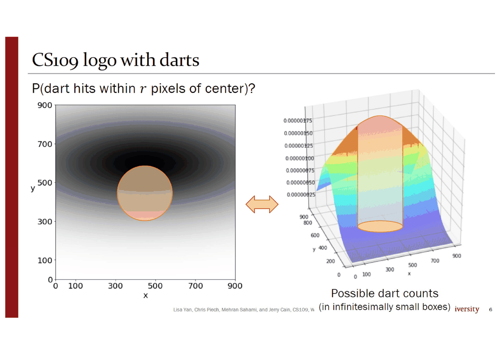
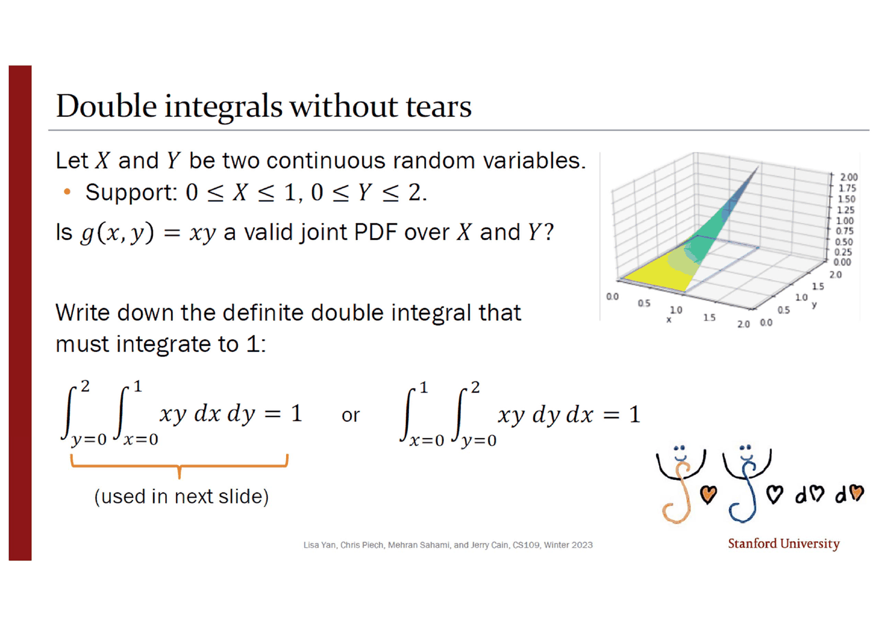
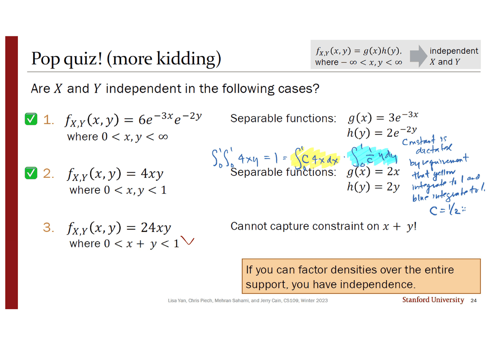
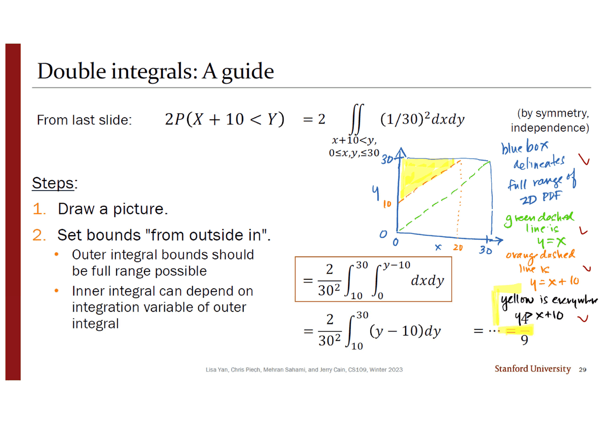
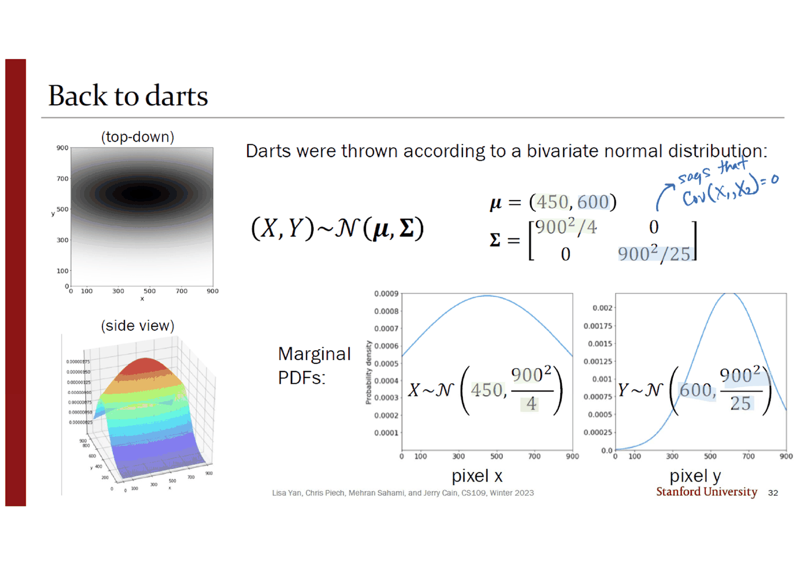
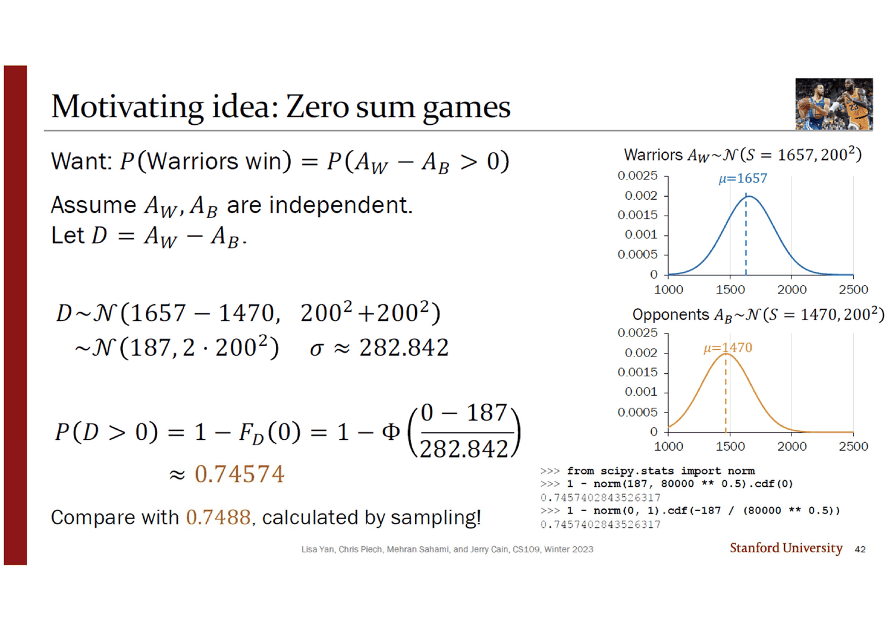
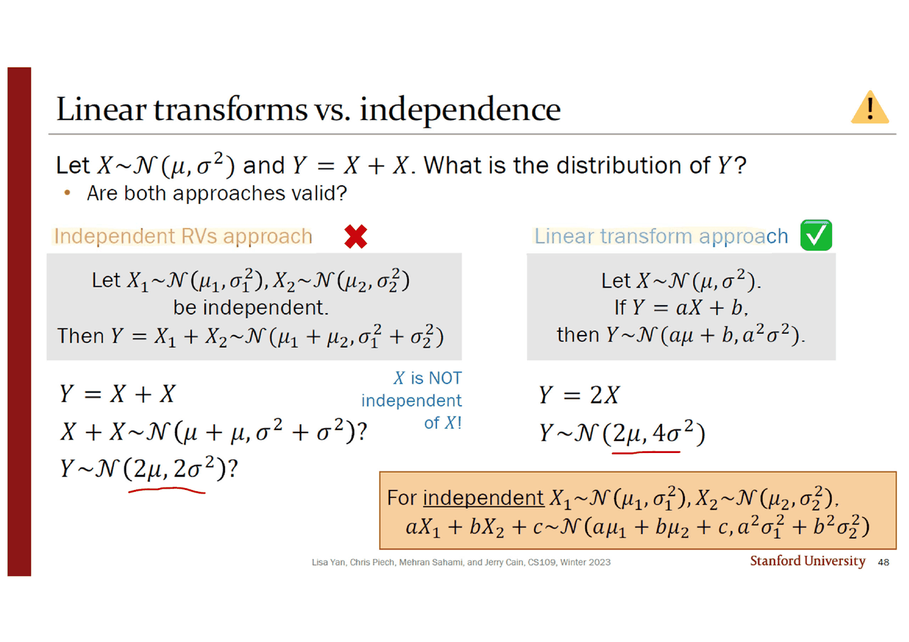

> [!abstract] 되돌아오는 그림과 답하지 않는 질문
> 3번 슬라이드는 스탠퍼드 인장 그림을 붙여 놓고 이렇게 말한다. *"이 로고는 결합분포에 따라 다트 50만 개를 던져 만들었다"*(옆에 파란 글씨로 *"not really, but let's pretend"*). 그리고 묻는다.
>
> $$P(\text{다트가 중심에서 } r \text{ 픽셀 안에 맞는다}) = ?$$
>
> 이 그림은 덱에서 **네 번** 되돌아온다. 4번에서 100×100 상자의 히스토그램이 되고, 5번에서 50×50이 되고, 6번에서 무한히 작은 상자 — 곡면 — 이 되고, 32번에서 마침내 $\boldsymbol\mu = (450, 600)$ 과 $\boldsymbol\Sigma = \mathrm{diag}(900^2/4,\ 900^2/25)$ 를 얻는다. 모든 준비가 끝난다.
>
> **그런데 3번의 질문은 답을 받지 못한다.** 그 확률을 구하려면 이변량 정규분포를 원판 위에서 적분해야 하는데, 두 분산이 다르면 닫힌 꼴이 없다. 덱은 그 자리에서 조용히 방향을 튼다 — 원판 대신 주변분포로(13·14번), 그리고 원판 대신 **합**으로(37~45번).
>
> 대신 이 덱은 **다섯 덱 전의 질문**에 답한다. 11번 덱 15번 슬라이드가 농구 사진과 함께 $P(A_W > A_B)$ 를 던져 놓고 *"이건 확률변수 **두 개**가 얽힌 사건의 확률이다!"* 라고만 적고 넘어갔던 그 질문이 39번에서 같은 사진과 함께 돌아오고, 42번이 **0.74574** 로 닫는다.
>
> 그리고 그 답에는 이중적분이 하나도 쓰이지 않는다.

---

## 두 개의 도구, 한 가지 모양의 질문

이 덱은 「확률변수 둘이 얽힌 사건의 확률」이라는 한 모양의 질문에 **완전히 다른 두 도구**를 준다. 표지 목차 다섯 줄(`2 Continuous Joint Distributions`, `15 Joint CDFs`, `20 Independent Continuous Random Variables`, `30 Bivariate Normal Distribution`, `37 Sum of Independent Normal Random Variables`)이 모두 실제 절 표지와 정확히 맞는데, 그 다섯 절은 **29번을 경계로 두 덩이**다.

```mermaid
flowchart TB
    Q["확률변수 둘이 얽힌 사건의 확률"]

    Q --> A["① 영역을 그리고 적분한다<br/>슬라이드 2~29"]
    A --> A1["상자를 줄여 곡면을 얻는다<br/>3~6번 · 다트"]
    A1 --> A2["확률 = 곡면 아래 <b>부피</b><br/>7·8번"]
    A2 --> A3["이중적분 · 주변 PDF · 결합 CDF<br/>9~19번"]
    A3 --> A4["독립 = 지지집합 전체에서<br/>곱으로 쪼개진다 · 21~27번"]
    A4 --> A5["만남 문제 <b>4/9</b><br/>28·29번 — 이 덱에서 실제로<br/>적분을 도는 유일한 문제"]

    Q --> B["② 닫힘 성질로 1차원으로 접는다<br/>슬라이드 30~48"]
    B --> B1["이변량 정규 · 공분산행렬<br/>30~35번 · 다트가 Σ를 얻는다"]
    B1 --> B2["독립 정규의 합은 정규<br/>38번 — <i>proof left to Wikipedia</i>"]
    B2 --> B3["농구 <b>0.74574</b> · 바이러스 <b>0.06235</b><br/>39~45번"]
    B3 --> B4["⚠ 마지막 장은 경고다<br/>Y = X + X · 48번"]

    U["3번의 질문: 원판 위의 확률"]
    A1 -.-> U
    B1 -.-> U
    U -.->|"두 도구 모두 닿지 못한다"| V["닫힌 꼴이 없다<br/>덱은 묻기만 하고 지나간다"]

    style U fill:transparent,stroke:var(--chart-1),stroke-width:2px
    style V fill:transparent,stroke:var(--chart-1),stroke-width:2px,stroke-dasharray:5 4
    style B4 fill:transparent,stroke:var(--chart-2),stroke-width:2px
```

---

## 상자를 줄이면 곡면이 된다

3~6번은 같은 그림을 네 장 이어 붙인 애니메이션이다. 슬라이드마다 바뀌는 것은 **상자의 크기 하나**뿐이고, 그 변화가 이산에서 연속으로 넘어가는 과정 전체를 보인다.

| 슬라이드 | 왼쪽 그림 | 오른쪽 그림 | 고른 영역 |
| --- | --- | --- | --- |
| 3 | 다트 50만 개의 산점도 (`1 pixel = 1 dart`) | — | — |
| 4 | 같은 산점도 | **100×100 상자**의 3차원 막대그래프 | 정사각형 하나 |
| 5 | 흐려진 회색 구름 | **50×50 상자** | 십자 모양 아홉 칸 |
| 6 | 같은 구름 | **무한히 작은 상자** — 매끈한 곡면 | **원판** |



**고른 영역의 모양이 상자 크기를 따라간다.** 100×100일 때는 정사각형밖에 고를 수 없고, 50×50일 때는 계단 모양 십자가 되고, 무한소가 되어서야 진짜 원판을 고를 수 있다. 3번의 질문이 원판에 대한 것이었으므로 **연속으로 가는 이유가 그 질문 안에 이미 들어 있다.**

3번에는 검산도 하나 붙어 있다. *"다트가 정확히 $(456.2344132343,\ 532.1865739012)$ 에 맞을 확률은?"* 그리고 파란 글씨로 답 — *"so small it's essentially zero"*. 09번 덱이 「확률 0인 사건이 매일 일어난다」로 세운 것을 2차원에서 다시 확인한다.

7·8번이 그 결과를 정의로 굳힌다.

$$P(a_1 \le X \le a_2,\ b_1 \le Y \le b_2) = \int_{a_1}^{a_2}\!\!\int_{b_1}^{b_2} f_{X,Y}(x,y)\,dy\,dx, \qquad \int_{-\infty}^{\infty}\!\!\int_{-\infty}^{\infty} f_{X,Y}(x,y)\,dy\,dx = 1$$

8번의 주황 상자가 1차원과의 차이를 한 단어로 정리한다 — 1차원에서 확률이 **넓이**였다면, *"Probability for jointly continuous RVs is **volume** under a surface."*

---

## 이중적분, 눈물 없이



9~11번이 이중적분을 절차로 만든다. 문제는 최소한이다 — $0 \le X \le 1$, $0 \le Y \le 2$ 위에서 $g(x,y) = xy$ 가 유효한 결합 PDF인가?

10번이 답 대신 **적을 수 있는 두 가지 순서**를 먼저 보인다.

$$\int_{y=0}^{2}\!\!\int_{x=0}^{1} xy\,dx\,dy = 1 \qquad \text{또는} \qquad \int_{x=0}^{1}\!\!\int_{y=0}^{2} xy\,dy\,dx = 1$$

그리고 왼쪽에 중괄호로 *"(used in next slide)"*. 오른쪽 아래에는 이 덱이 **2024년 2월 14일** 강의임을 알려 주는 낙서가 있다 — 적분 기호 둘과 하트로 만든 $\int\!\!\int \heartsuit\, d\heartsuit\, d\heartsuit$. 표지의 날짜에도 하트가 양쪽에 붙어 있다.

11번의 절차가 세 단계다.

> **0. 적분을 세운다** — $1 = \int\!\!\int g\,dx\,dy$ 에 실제 지지집합을 대입
> **1. 안쪽 적분을 $y$ 를 상수 취급해 계산한다** — $\int_{y=0}^{2}\left(\int_{x=0}^{1} xy\,dx\right)dy = \int_{y=0}^{2} y\left[\frac{x^2}{2}\right]_0^1 dy = \int_{y=0}^{2}\frac y2\,dy$
> **2. 남은 단일 적분을 계산한다** — $\left[\frac{y^2}{4}\right]_0^2 = 1 - 0 = 1$

파란 결론 — *"Yes, $g(x,y)$ is a valid joint PDF because it integrates to 1."* **1단계의 「$y$ 를 상수로 본다」가 이중적분의 전부**이고, 나머지는 1차원 적분 두 번이다.

12번이 주변 PDF를 정의하고, 그 그림에 붙은 잉크가 이 덱에서 가장 좋은 설명 하나를 남긴다. 곡면 옆면에 붙은 빨간 곡선을 가리키며 —

> *the 1D integral of density along red line produces height of density in marginal*

$$f_X(a) = \int_{-\infty}^{\infty} f_{X,Y}(a,y)\,dy, \qquad f_Y(b) = \int_{-\infty}^{\infty} f_{X,Y}(x,b)\,dx$$

**11번 덱 18번의 「나머지를 전부 더한다」가 「나머지 방향으로 적분한다」로 바뀐 것뿐**이다. 파란 글씨로 *"similar story for blue"* 가 덧붙어 있다.

13·14번이 다트로 돌아온다. 두 주변 PDF 그래프를 놓고 어느 쪽이 $X$ 이고 어느 쪽이 $Y$ 인지 맞히라고 한다. 왼쪽은 완만하고 대칭이며 최고 밀도가 약 0.0009, 오른쪽은 좁고 위로 치우쳤으며 최고 밀도가 약 0.0022다. 14번이 답을 붙인다 — 왼쪽이 `pixel x`, 오른쪽이 `pixel y`. **위에서 본 그림이 가로로 퍼지고 세로로 눌려 있으니 $X$ 의 분포가 더 넓다.**

17~19번은 결합 CDF를 한 장에 정리한다.

$$F_{X,Y}(a,b) = P(X \le a, Y \le b) = \int_{-\infty}^{a}\!\!\int_{-\infty}^{b} f_{X,Y}(x,y)\,dy\,dx, \qquad f_{X,Y}(a,b) = \frac{\partial^2}{\partial a\,\partial b}F_{X,Y}(a,b)$$

**미분이 두 번이라는 것**이 1차원과의 유일한 차이이고, 19번의 그림이 그것을 보인다 — 왼쪽의 뾰족한 종 모양 곡면이 오른쪽에서 0에서 1로 오르는 S자 언덕이 된다.

---

## 독립 — 지지집합까지 쪼개져야 한다

21번이 정의를 주고 그 자리에서 PDF 형태를 유도한다.

$$F_{X,Y}(x,y) = F_X(x)F_Y(y) \ \forall x,y \quad\Longrightarrow\quad f_{X,Y}(x,y) = \frac{\partial^2}{\partial x\,\partial y}F_X(x)F_Y(y) = f_X(x)f_Y(y)$$

증명의 급소에 잉크가 초록으로 밑줄을 그었다 — $\frac{\partial}{\partial y}$ 가 $F_X(x)$ 를 지나칠 수 있는 이유는 *"this is a constant with respect to $y$!"* 뿐이다.

22번이 그 조건을 더 느슨하게 다시 적는다. **주변 PDF까지 갈 필요 없이 아무 두 함수의 곱이면 된다.**

$$f_{X,Y}(x,y) = g(x)h(y), \qquad -\infty < x, y < \infty$$

그리고 잉크가 그 마지막 조건 — 대부분 눈으로 넘기는 $-\infty < x,y < \infty$ — 에 중괄호를 치고 적었다.

> *states that $x$ and $y$ can freely roam over their full support!*



24번이 그 조건이 왜 조건인지를 세 줄로 보인다.

| | 결합 PDF | 지지집합 | 판정 |
| --- | --- | --- | --- |
| 1 | $6e^{-3x}e^{-2y}$ | $0 < x, y < \infty$ | ✅ $g = 3e^{-3x}$, $h = 2e^{-2y}$ |
| 2 | $4xy$ | $0 < x, y < 1$ | ✅ $g = 2x$, $h = 2y$ |
| 3 | $24xy$ | $\mathbf{0 < x + y < 1}$ | ❌ *"Cannot capture constraint on $x + y$!"* |

**세 번째의 밀도는 두 번째와 똑같은 모양($xy$의 상수배)인데 지지집합만 다르다.** 그런데 그것만으로 독립이 깨진다 — $x$ 가 0.9면 $y$ 는 0.1 미만이어야 하므로, $x$ 를 아는 것이 $y$ 에 대한 정보를 준다. 주황 상자가 결론을 낸다 — ***"If you can factor densities over the entire support, you have independence."***

잉크가 두 번째 줄에 상수를 어떻게 맞추는지를 적어 두었다. $\int_0^1\!\!\int_0^1 4xy = 1 = \left(\int_0^1 C\cdot 4x\,dx\right)\!\left(\int_0^1 \tfrac1C y\,dy\right)$ 에서 *"constant is dictated by requirement that yellow integrate to 1 and blue integrate to 1"*, 그래서 $C = \tfrac12$. **쪼개는 방법은 여럿이고 상수 하나가 자유롭다** — 각자가 1로 적분되도록 고정하면 그것이 주변 PDF다.

26·27번이 같은 도구를 한 번 더 쓴다. $f_{X,Y}(x,y) = 3e^{-3x}$, $0 < x < \infty$, $1 < y < 2$. **밀도에 $y$ 가 아예 없다.** 잉크가 $\int_1^2 \frac1C\,dy = 1 \Rightarrow C = 1$ 을 계산해 넣고, 결론을 빨간 밑줄로 적는다.

$$f_X(x) = 3e^{-3x} \Leftrightarrow X \sim \text{Exp}(3), \qquad f_Y(y) = 1 \Leftrightarrow Y \sim \text{Uni}(1,2)$$

27번의 셋째 질문 $E[X+Y]$ 에 잉크가 **두 전략**을 나란히 적는다.

> **전략 1 (LOTUS)**: $E[g(X,Y)] = \int\!\!\int (x+y)f_{X,Y}(x,y)\,dy\,dx$
> **전략 2 (기댓값의 선형성)**: $E[X+Y] = E[X] + E[Y] = \tfrac13 + \tfrac32 = \tfrac{11}{6}$

그리고 두 번째 옆에 하트를 하나 그렸다. **이중적분을 배운 바로 다음 장에서, 이중적분을 피하는 쪽에 하트가 붙는다.** 이 덱의 나머지 절반이 그 방향이다.

---

## 실제로 적분을 도는 유일한 문제



28·29번의 만남 문제가 이 덱에서 **이중적분을 끝까지 계산하는 유일한 자리**다. 두 사람이 12시와 12시 반 사이에 독립적으로 균등하게 도착한다. 먼저 온 사람이 10분 넘게 기다릴 확률은?

$$P(X + 10 < Y) + P(Y + 10 < X) = 2P(X+10 < Y) \quad \text{(대칭성)}$$

28번이 문제문의 세 단어에 밑줄을 긋는다 — `independently`(이것이 $f_{X,Y} = (1/30)^2$ 를 준다), `uniformly`, `12pm`과 `12:30pm`(이것이 지지집합을 준다). **문장에서 결합 밀도를 읽어내는 절차**가 밑줄 세 개로 표시되어 있다.

29번의 절차는 두 줄이다.

> **1. 그림을 그린다.**
> **2. 경계를 「바깥에서 안으로」 정한다.** 바깥 적분의 경계는 가능한 전 범위여야 하고, 안쪽 적분은 바깥 적분의 변수에 의존할 수 있다.

잉크가 그림의 각 선에 이름을 붙였다 — 파란 상자는 *"delineates full range of 2D PDF"*, 초록 점선은 $y = x$, 주황 점선은 $y = x + 10$, 노랑으로 칠한 삼각형은 *"everywhere $y > x + 10$"*.

$$2P(X{+}10 < Y) = \frac{2}{30^2}\int_{10}^{30}\!\!\int_{0}^{y-10} dx\,dy = \frac{2}{30^2}\int_{10}^{30}(y-10)\,dy = \frac{2}{900}\cdot\frac{20^2}{2} = \frac{400}{900} = \mathbf{\frac49}$$

**바깥이 $y$, 안쪽이 $x$ 인 이유가 그림에 있다** — 노란 삼각형에서 $y$ 는 10부터 30까지 자유롭지만 $x$ 의 상한은 $y$ 에 매달려 있다. 순서를 바꾸면 안쪽 경계가 $x+10$ 부터 30까지가 되고 계산은 같은 값을 준다.

기하로 검산하면 한 줄이다. 조건은 $|X - Y| > 10$ 이고, 정사각형에서 그 여집합인 띠를 빼면 남는 두 삼각형의 넓이 비가 $\left(\frac{20}{30}\right)^2 = \frac49$. 아래에서 기다리는 시간을 바꿔 가며 확인할 수 있다.

```html preview
<div id="mt16" style="font-family:system-ui,-apple-system,sans-serif;color:var(--foreground);background:var(--card);border:1px solid var(--border);border-radius:12px;padding:18px 16px;">
  <div style="display:flex;flex-wrap:wrap;gap:12px;align-items:center;margin-bottom:14px;">
    <label style="font-size:13px;font-weight:600;">기다리는 시간 t (분)</label>
    <input id="t16" type="range" min="0" max="30" value="10" step="1" style="flex:1;min-width:160px;accent-color:var(--chart-1);">
    <output id="tv16" style="font-variant-numeric:tabular-nums;font-weight:700;font-size:15px;min-width:2.2em;">10</output>
  </div>
  <div style="display:flex;gap:18px;flex-wrap:wrap;align-items:flex-start;">
    <svg id="sv16" viewBox="0 0 300 300" style="width:min(300px,100%);height:auto;flex:0 0 auto;"></svg>
    <div id="ot16" style="font-size:13.5px;line-height:1.95;font-variant-numeric:tabular-nums;flex:1;min-width:220px;"></div>
  </div>
</div>
<script>
(function(){
  const NS='http://www.w3.org/2000/svg', svg=document.getElementById('sv16');
  function el(n,a){const e=document.createElementNS(NS,n);for(const k in a)e.setAttribute(k,a[k]);return e;}
  const L=34,B=266,S=232;                        // 30분 → S픽셀
  const px=v=>L+(v/30)*S, py=v=>B-(v/30)*S;
  function draw(t){
    svg.textContent='';
    svg.appendChild(el('rect',{x:L,y:py(30),width:S,height:S,fill:'var(--muted-foreground)',opacity:0.10,
      stroke:'var(--border)'}));
    // y > x+t 삼각형, x > y+t 삼각형
    if(t<30){
      svg.appendChild(el('polygon',{points:`${px(0)},${py(t)} ${px(30-t)},${py(30)} ${px(0)},${py(30)}`,
        fill:'var(--chart-1)',opacity:0.55}));
      svg.appendChild(el('polygon',{points:`${px(t)},${py(0)} ${px(30)},${py(30-t)} ${px(30)},${py(0)}`,
        fill:'var(--chart-1)',opacity:0.55}));
    }
    svg.appendChild(el('line',{x1:px(0),y1:py(0),x2:px(30),y2:py(30),
      stroke:'var(--chart-2)','stroke-width':1.4,'stroke-dasharray':'5 4'}));
    for(const [x1,y1,x2,y2] of [[0,t,30-t,30],[t,0,30,30-t]]){
      if(t<30) svg.appendChild(el('line',{x1:px(x1),y1:py(y1),x2:px(x2),y2:py(y2),
        stroke:'var(--chart-1)','stroke-width':1.6}));
    }
    for(const v of [0,10,20,30]){
      const a=el('text',{x:px(v),y:B+16,'text-anchor':'middle','font-size':10.5,fill:'var(--muted-foreground)'});
      a.textContent=v; svg.appendChild(a);
      const b=el('text',{x:L-8,y:py(v)+4,'text-anchor':'end','font-size':10.5,fill:'var(--muted-foreground)'});
      b.textContent=v; svg.appendChild(b);
    }
    const lx=el('text',{x:px(15),y:B+32,'text-anchor':'middle','font-size':11.5,fill:'var(--foreground)'});
    lx.textContent='X (사람 1, 12시 이후 분)'; svg.appendChild(lx);
    const ly=el('text',{x:12,y:py(15),'font-size':11.5,fill:'var(--foreground)',transform:`rotate(-90 12 ${py(15)})`,'text-anchor':'middle'});
    ly.textContent='Y (사람 2)'; svg.appendChild(ly);
  }
  function out(t){
    const p=Math.pow((30-t)/30,2);
    let h='<b>P(먼저 온 사람이 '+t+'분 넘게 기다린다)</b><br>'+
      '= 2 · (1/30²) ∬ dx dy = <b>2 · ½ · ('+(30-t)+'/30)² · … </b>';
    h='<b>P( |X − Y| > '+t+' )</b> &nbsp;=&nbsp; ((30 − '+t+') / 30)<sup>2</sup> &nbsp;=&nbsp; '+
      '<b style="color:var(--chart-1)">'+p.toFixed(5)+'</b>';
    h+='<p style="margin:10px 0 0;font-size:12.5px;color:var(--muted-foreground);line-height:1.7">'+
      (t===10? '<b>29번 슬라이드의 자리다.</b> 색칠된 두 삼각형이 각각 밑변·높이 20인 직각삼각형이라 넓이 합이 2·(20²/2) = 400, 전체가 900이므로 <b>4/9 = 0.44444</b>. 슬라이드의 이중적분도 같은 값을 준다.'
       : t===0 ? '기다리는 시간이 0이면 두 삼각형이 정사각형 전체를 덮고 대각선만 남는다 — 확률 1. 두 사람이 정확히 같은 순간에 올 확률은 0이다.'
       : t>=30 ? '30분 넘게 기다릴 수는 없다. 두 사람 모두 30분 안에 오기 때문이다.'
       : '주황 실선 두 개가 y = x ± '+t+' 다. 색칠된 넓이의 비가 곧 확률이고, 각 변이 (30−'+t+')/30 로 줄어든 닮은꼴 삼각형 둘이다.')+'</p>';
    document.getElementById('ot16').innerHTML=h;
  }
  function upd(){const t=+document.getElementById('t16').value;
    document.getElementById('tv16').textContent=t; draw(t); out(t);}
  document.getElementById('t16').addEventListener('input',upd); upd();
})();
</script>
```

---

## 다트가 공분산행렬을 얻는다

30번 절 표지에 한국어 주석 「(랜덤변수 2개)」가 붙어 있다. 31번이 이변량 정규분포의 밀도를 통째로 인쇄하는데, 잉크가 제목 옆에 1차원 정규 밀도를 먼저 적어 대조한다 — *"recall that for $X \sim \mathcal N(\mu, \sigma^2) \Rightarrow f(x) = \frac{1}{\sigma\sqrt{2\pi}}e^{-(x-\mu)^2/2\sigma^2}$"*.

$$f(x_1, x_2) = \frac{1}{2\pi\sigma_1\sigma_2\sqrt{1-\rho^2}}\exp\left[-\frac{1}{2(1-\rho^2)}\left(\frac{(x_1-\mu_1)^2}{\sigma_1^2} - \frac{2\rho(x_1-\mu_1)(x_2-\mu_2)}{\sigma_1\sigma_2} + \frac{(x_2-\mu_2)^2}{\sigma_2^2}\right)\right]$$

잉크가 **가운데 항에만** 빨간 물결 밑줄을 그었다. 그 항이 $\rho$ 를 품은 유일한 항이고, 33번에서 통째로 사라질 항이기 때문이다.

그리고 슬라이드가 표기를 압축한다 — $\boldsymbol X \sim \mathcal N(\boldsymbol\mu, \boldsymbol\Sigma)$. 잉크가 공분산행렬을 풀어 적었다.

$$\boldsymbol\Sigma = \begin{pmatrix}\sigma_1^2 & \rho\sigma_1\sigma_2 \\ \rho\sigma_1\sigma_2 & \sigma_2^2\end{pmatrix} = \begin{pmatrix}\mathrm{Cov}(X_1,X_1) & \mathrm{Cov}(X_1,X_2) \\ \mathrm{Cov}(X_2,X_1) & \mathrm{Cov}(X_2,X_2)\end{pmatrix}$$

**13번 덱 23번의 성질 2 — 「분산은 자기 자신과의 공분산」 — 이 여기서 행렬의 대각선이 된다.** 주황 상자가 범위를 정한다 — *"We will focus on understanding the **shape** of a bivariate Normal RV."*



32번이 다트로 돌아와 모형을 밝힌다.

$$\boldsymbol\mu = (450, 600), \qquad \boldsymbol\Sigma = \begin{pmatrix}900^2/4 & 0 \\ 0 & 900^2/25\end{pmatrix} \quad\Longrightarrow\quad X \sim \mathcal N(450, 450^2),\ \ Y \sim \mathcal N(600, 180^2)$$

잉크가 오른쪽 위 0에 화살표를 그어 *"says that $\text{Cov}(X_1, X_2) = 0$"*. 13·14번에서 눈으로 맞혔던 두 주변 PDF가 여기서 모수를 얻는다 — 최고 밀도를 검산하면 $\frac{1}{450\sqrt{2\pi}} = 0.000886$ 과 $\frac{1}{180\sqrt{2\pi}} = 0.002216$ 으로, 13번 그래프의 눈금(약 0.0009와 0.0022)과 맞는다.

33번이 $\rho = 0$ 일 때 밀도가 어떻게 쪼개지는지를 세 줄로 보인다. $\rho$ 가 0이면 31번에서 밑줄 친 가운데 항이 사라지고, 지수 안이 두 제곱의 합이 되고, 지수함수가 곱으로 갈라진다.

$$\frac{1}{2\pi\sigma_1\sigma_2}e^{-\frac12\left(\frac{(x_1-\mu_1)^2}{\sigma_1^2}+\frac{(x_2-\mu_2)^2}{\sigma_2^2}\right)} = \underbrace{\frac{1}{\sigma_1\sqrt{2\pi}}e^{-(x_1-\mu_1)^2/2\sigma_1^2}}_{\mathcal N(\mu_1,\sigma_1^2)}\cdot\underbrace{\frac{1}{\sigma_2\sqrt{2\pi}}e^{-(x_2-\mu_2)^2/2\sigma_2^2}}_{\mathcal N(\mu_2,\sigma_2^2)}$$

> [!important] 정규분포에서만 성립하는 역
> 13번 덱 39번이 못 박았다 — **무상관이라고 독립인 것은 아니다.** 그런데 33번은 $\text{Cov} = 0$ 에서 독립을 끌어낸다. 모순이 아니다. **이변량 정규라는 가정이 추가로 들어갔기 때문**이고, 이것이 정규분포 가족의 특권이다. 13번 덱의 반례($Y = X^2$)는 애초에 이변량 정규가 아니다.
>
> 덱은 두 사실을 잇지 않는다. 33번은 *"Are $X_1$ and $X_2$ independent?"* 라고만 묻고 초록 체크로 답한다.

34·35번이 네 산점도와 네 공분산행렬을 짝짓게 한다. 35번의 잉크가 각 그림에 판단 근거를 적었다.

| 그림 | 답 | 잉크의 근거 |
| --- | --- | --- |
| 1 (동심원) | **A** $\left(\begin{smallmatrix}1&0\\0&1\end{smallmatrix}\right)$ | *"covariance is clearly zero, spread in x and y looks to be the same"* |
| 2 (오른쪽 위로 기움) | **C** $\left(\begin{smallmatrix}1&0.5\\0.5&1\end{smallmatrix}\right)$ | *"top-down view suggests positive correlation in $(X_1, X_2)$"* |
| 3 (오른쪽 아래로 기움) | **D** $\left(\begin{smallmatrix}1&-0.5\\-0.5&1\end{smallmatrix}\right)$ | *"makes it clear that $\rho < 0$, because $y$ decreases as $x$ increases"* |
| 4 (세로로 긺) | **B** $\left(\begin{smallmatrix}1&0\\0&2\end{smallmatrix}\right)$ | *"no correlation, but spread in y dimension looks larger"* |

**네 그림 모두 위에서 본 그림(오른쪽)으로 판정하고 3차원 곡면(왼쪽)은 쓰지 않는다.** 잉크가 그것을 두 번이나 `top-down view` 라고 명시한다.

### 그리고 3번의 질문은 어떻게 되었나

36번이 절을 닫으며 결합 PDF의 쓸모 셋을 든다 — 두 연속 확률변수가 어떻게 함께 변하는가($P(X<Y)$, $\text{Cov}$, $\rho$) · 증거가 주어졌을 때의 분포(*"more on Friday"*) · **하나의 확률변수를 둘로 분해하거나 그 반대**($Z = X+Y$ 의 분포, 밑줄 그어 *"which is a **1-D** RV!"*).

**셋 중 어느 것도 「평면 위의 영역에 들어갈 확률」이 아니다.** 3번이 물은 원판 확률은 여기서 목록에 오르지도 못하고 덱이 방향을 튼다.

> [!note] 덱이 답하지 않은 값을 직접 구해 본다 (원본에 없는 계산)
> 32번의 모형이면 3번의 질문은 원리적으로 답할 수 있다. 중심을 분포의 평균 $(450, 600)$ 으로 잡으면
> $$P\big((X-450)^2 + (Y-600)^2 \le r^2\big) = \iint_{\text{원판}} \frac{1}{2\pi(450)(180)}\exp\left[-\frac12\left(\frac{u^2}{450^2}+\frac{v^2}{180^2}\right)\right]du\,dv$$
> 인데 **$\sigma_1 \ne \sigma_2$ 이면 이 적분에 닫힌 꼴이 없다.** 원판을 타원으로 바꾸면($\frac{u^2}{450^2}+\frac{v^2}{180^2} \le c^2$) 답이 $1 - e^{-c^2/2}$ 로 깔끔하게 나오지만, 3번이 물은 것은 원판이다. 아래는 수치적분한 값이다.

```html preview
<div id="dt16" style="font-family:system-ui,-apple-system,sans-serif;color:var(--foreground);background:var(--card);border:1px solid var(--border);border-radius:12px;padding:18px 16px;">
  <p style="margin:0 0 12px;font-size:13px;color:var(--muted-foreground);">
    32번 슬라이드의 모형 — X ~ 𝒩(450, 450²), Y ~ 𝒩(600, 180²), 독립. 3번 슬라이드가 물은 값이다.</p>
  <div style="display:flex;flex-wrap:wrap;gap:12px;align-items:center;margin-bottom:14px;">
    <label style="font-size:13px;font-weight:600;">반지름 r (픽셀)</label>
    <input id="r16" type="range" min="0" max="900" value="180" step="50" style="flex:1;min-width:160px;accent-color:var(--chart-1);">
    <output id="rv16" style="font-variant-numeric:tabular-nums;font-weight:700;font-size:15px;min-width:3em;">180</output>
  </div>
  <div style="display:flex;gap:18px;flex-wrap:wrap;align-items:flex-start;">
    <svg id="ds16" viewBox="0 0 280 280" style="width:min(280px,100%);height:auto;flex:0 0 auto;"></svg>
    <div id="do16" style="font-size:13.5px;line-height:1.95;font-variant-numeric:tabular-nums;flex:1;min-width:230px;"></div>
  </div>
</div>
<script>
(function(){
  // 수치적분으로 구한 P(중심에서 r 이내). 파이썬으로 계산해 검증
  const T=[[0,0.00000],[50,0.01526],[100,0.05907],[150,0.12601],[200,0.20861],[250,0.29900],[300,0.39031],
           [350,0.47754],[400,0.55761],[450,0.62912],[500,0.69182],[550,0.74606],[600,0.79252],[650,0.83197],
           [700,0.86517],[750,0.89285],[800,0.91568],[850,0.93433],[900,0.94938]];
  const NS='http://www.w3.org/2000/svg', svg=document.getElementById('ds16');
  function el(n,a){const e=document.createElementNS(NS,n);for(const k in a)e.setAttribute(k,a[k]);return e;}
  // 900×900 화면을 240px 안에 그린다. 원점(0,0)이 왼쪽 아래.
  const L=24,B=256,S=240, sc=S/900;
  const px=v=>L+v*sc, py=v=>B-v*sc;
  function draw(r){
    svg.textContent='';
    svg.appendChild(el('rect',{x:L,y:py(900),width:S,height:S,fill:'var(--muted-foreground)',opacity:0.08,stroke:'var(--border)'}));
    // 등고선 — 표준편차 1·2배 타원
    for(const k of [2,1]){
      svg.appendChild(el('ellipse',{cx:px(450),cy:py(600),rx:450*k*sc,ry:180*k*sc,
        fill:'var(--chart-2)',opacity:k===1?0.20:0.10,stroke:'var(--chart-2)','stroke-width':0.8}));
    }
    if(r>0) svg.appendChild(el('circle',{cx:px(450),cy:py(600),r:r*sc,fill:'var(--chart-1)',opacity:0.30,
      stroke:'var(--chart-1)','stroke-width':1.6}));
    svg.appendChild(el('circle',{cx:px(450),cy:py(600),r:2.5,fill:'var(--chart-1)'}));
    for(const v of [0,450,900]){
      const a=el('text',{x:px(v),y:B+15,'text-anchor':'middle','font-size':10,fill:'var(--muted-foreground)'});
      a.textContent=v; svg.appendChild(a);
      const b=el('text',{x:L-6,y:py(v)+4,'text-anchor':'end','font-size':10,fill:'var(--muted-foreground)'});
      b.textContent=v; svg.appendChild(b);
    }
    const c=el('text',{x:px(450)+7,y:py(600)-6,'font-size':10.5,fill:'var(--chart-1)','font-weight':700});
    c.textContent='μ=(450,600)'; svg.appendChild(c);
  }
  function out(r){
    const row=T.find(t=>t[0]===r)||T[0];
    let h='<b>P(중심에서 '+r+'픽셀 이내) = <span style="color:var(--chart-1)">'+row[1].toFixed(5)+'</span></b>'+
      '<br><span style="color:var(--muted-foreground)">수치적분값 — 닫힌 꼴이 없다</span>';
    h+='<p style="margin:10px 0 0;font-size:12.5px;color:var(--muted-foreground);line-height:1.7">'+
      (r===0? '점 하나에 맞을 확률은 0이다 — 3번 슬라이드의 검산 문항이 그것이었다.'
       : r===900? '반지름을 화면 전체만큼 키워도 0.949에서 멈춘다. <b>분포가 그림 밖으로 새기 때문</b>이다.'
       : '주황 타원은 표준편차 1배·2배 등고선이다. 가로로 납작한 원판 하나가 세로로 긴 타원들을 가로지르므로, 이 적분에는 초등함수 해가 없다.')+'</p>';
    h+='<p style="margin:8px 0 0;font-size:12.5px;color:var(--chart-1);line-height:1.7"><b>모형이 그림을 넘친다.</b> '+
      'P(0 ≤ X ≤ 900) = Φ(1) − Φ(−1) = 0.6827 이므로, 이 모형대로라면 다트 50만 개 중 <b>약 17만 5천 개(35%)가 900×900 화면 밖</b>에 떨어진다. 3번 슬라이드는 그 그림이 다트로 만들어졌다고 말한다.</p>';
    document.getElementById('do16').innerHTML=h;
  }
  function upd(){const r=+document.getElementById('r16').value;
    document.getElementById('rv16').textContent=r; draw(r); out(r);}
  document.getElementById('r16').addEventListener('input',upd); upd();
})();
</script>
```

---

## 다섯 덱 전의 질문

37번에서 마지막 절이 열리고, 38번이 이 덱의 두 번째 도구를 한 줄로 준다.

$$X \sim \mathcal N(\mu_1, \sigma_1^2),\ Y \sim \mathcal N(\mu_2, \sigma_2^2),\ \text{독립} \quad\Longrightarrow\quad X + Y \sim \mathcal N(\mu_1 + \mu_2,\ \sigma_1^2 + \sigma_2^2)$$

그리고 그 아래 괄호 — ***"(proof left to Wikipedia)"***. 12번 덱 12번이 포아송의 같은 성질을 네 줄로 증명했던 것과 대조된다. 잉크가 대신 **평균과 분산만은 따로 확인**해 둔다 — $E[X+Y] = \mu_1 + \mu_2$ 는 선형성으로, $\text{Var}(X+Y) = \sigma_1^2 + \sigma_2^2$ 는 *"because of independence"* 로. **정규라는 것만 증명되지 않았고, 두 모수는 이미 아는 도구로 설명된다.**



39번이 11번 덱 15번과 **같은 사진**을 다시 붙이고 같은 문장을 다시 인쇄한다 — *"This is a probability of an event involving **two** random variables!"* 그런데 이번에는 한 줄이 더 있다.

$$P(A_W > A_B) \quad\longrightarrow\quad P(A_W - A_B > 0) \qquad \underbrace{\phantom{A_W - A_B}}_{\textit{A sum of Normals!}}$$

**두 변수의 비교를 한 변수의 부호로 바꾸는 것**이 전부다. 36번이 밑줄 그어 예고한 *"which is a 1-D RV!"* 가 여기서 쓰인다.

40·41번이 $D = A_W - A_B$ 의 분포를 객관식으로 묻고, 잉크가 뺄셈을 덧셈으로 바꿔 적는다.

> *this is really $A_W + (-A_B)$*
> $-A_B \sim \mathcal N(-1470,\ (-1)^2\cdot 200^2) \ \Downarrow\ \mathcal N(-1470,\ 200^2)$

주황 상자가 그 규칙을 인쇄한다 — $X \sim \mathcal N(\mu_1, \sigma^2)$ 이면 $-X \sim \mathcal N(-\mu, (-1)^2\sigma^2 = \sigma^2)$. **분산은 뺄셈에서도 더해진다.** 정답 B.

42번이 닫는다. $A_W \sim \mathcal N(1657, 200^2)$, $A_B \sim \mathcal N(1470, 200^2)$ 이므로

$$D \sim \mathcal N(187,\ 2\cdot 200^2), \quad \sigma \approx 282.842, \quad P(D > 0) = 1 - \Phi\!\left(\frac{0 - 187}{282.842}\right) \approx \mathbf{0.74574}$$

직접 계산하면 $0.7457402843\ldots$ 로 인쇄값과 소수 다섯째 자리까지 일치한다. 그리고 그 아래 한 줄 — *"Compare with **0.7488**, calculated by sampling!"* **15번 덱의 기각 표집이 여기서 다시 나타나 0.003 차이로 검산 역할을 한다.**

43~45번의 바이러스 문제가 마지막 예제인데, 세 덱의 도구가 한 문제에 다 들어온다.

> WHO와 함께 대응을 준비한다. 노출된 두 집단이 있다 — G1은 20,000명이 각각 독립으로 $p_1 = 0.1$, G2는 10,000명이 각각 $p_2 = 0.4$. $P(\text{감염자} \ge 6100)$ 은? (근사해도 좋다)

43번의 전략 객관식 넷에 잉크가 **네 줄의 판정**을 모두 적었다.

| 전략 | 잉크의 판정 |
| --- | --- |
| A. 독립 이항의 합 | *"no, $p_1 \ne p_2$"* 😕 |
| B. 독립 포아송의 합 | *"no, because $p_1$ and $p_2$ too large"* |
| **C. 독립 가우시안의 합** | ***"yes!!!!"*** 😄 |
| D. 독립 지수의 합 | *"no, because mean and stdev of B are very different"* |

**A의 판정이 12번 덱 17번 여백의 잉크와 똑같은 문장**이다 — $p$ 가 다르면 이항은 닫히지 않는다. 그 덱에서는 우회로가 포아송이었는데(그때는 $p$ 가 0.01·0.02로 작았다), 여기서는 $p$ 가 커서 포아송이 막히고 정규가 남는다. **12번 덱 11번 슬라이드의 자격 조건표가 두 덱에 걸쳐 실제로 쓰이는 자리다.**

44·45번이 계산한다.

$$A \approx X \sim \mathcal N(2000, 1800), \quad B \approx Y \sim \mathcal N(4000, 2400) \quad (np = 2000,\ np(1{-}p) = 1800;\ 4000,\ 2400)$$
$$P(A+B \ge 6100) \approx P(X+Y \ge \mathbf{6099.5}), \qquad W = X+Y \sim \mathcal N(6000, 4200)$$
$$P(W \ge 6099.5) = 1 - \Phi\!\left(\frac{6099.5-6000}{\sqrt{4200}}\right) = 1 - \Phi(1.53532) \approx \mathbf{0.06235}$$

**6099.5의 `.5` 가 11번 덱 7번의 연속성 보정**이고, 슬라이드가 파란 글씨로 `continuity correction` 이라 이름을 붙여 둔다. 보정을 빼면 $1-\Phi(1.54303) = 0.06141$ 로 1.5% 달라진다.

---

## 마지막 장은 경고다



46번이 38번의 결과를 선형변환 규칙 옆에 나란히 놓고 묻는다 — *"Is this related to linear transformations of Gaussians?"* 그리고 48번이 그 질문에 노란 경고 표시와 함께 답한다.

$$X \sim \mathcal N(\mu, \sigma^2),\quad Y = X + X. \qquad Y \text{의 분포는?}$$

| 독립 확률변수 접근 ❌ | 선형변환 접근 ✅ |
| --- | --- |
| $Y = X + X \sim \mathcal N(\mu+\mu,\ \sigma^2+\sigma^2)$? | $Y = 2X \sim \mathcal N(2\mu,\ 2^2\sigma^2)$ |
| $Y \sim \mathcal N(2\mu,\ \underline{2\sigma^2})$? | $Y \sim \mathcal N(2\mu,\ \underline{4\sigma^2})$ |

파란 글씨가 이유를 한 줄로 적는다 — ***"$X$ is NOT independent of $X$!"*** 분산이 **두 배 틀린다.** 그리고 주황 상자가 두 규칙을 하나로 합쳐 덱을 닫는다.

$$X_1 \sim \mathcal N(\mu_1,\sigma_1^2),\ X_2 \sim \mathcal N(\mu_2,\sigma_2^2)\ \textbf{독립} \ \Longrightarrow\ aX_1 + bX_2 + c \sim \mathcal N\big(a\mu_1+b\mu_2+c,\ a^2\sigma_1^2 + b^2\sigma_2^2\big)$$

**덱의 마지막 인쇄물이 자기 대표 정리를 잘못 쓰는 법**이다. 38번의 결과가 한 줄이라 쉬워 보이지만, 그 한 줄이 붙어 있는 조건(`독립`)을 놓치면 즉시 틀린다. 12번 덱 4번의 파란 글씨 *"If only it were always so simple"* 이 여기서 정규분포에도 적용된다.

---

## 원본 오류·불일치

계산은 전부 맞는다. 인쇄된 값 $\frac49$ · $\frac{11}{6}$ · $0.74574$ · $0.06235$ · $\mathcal N(2000,1800)$ · $\mathcal N(4000,2400)$ 을 모두 재계산해 대조했고 일치한다. 걸리는 것은 구조와 물리적 배치다.

`답하지 않은 질문`

- **3번의 질문이 덱 어디에서도 계산되지 않는다** — `P(dart hits within r pixels of center)` 가 3·4·5·6번 네 장의 제목줄에 반복되고, 32번이 모수를 다 주고도 값을 내지 않는다. $\sigma_1 \ne \sigma_2$ 인 이변량 정규를 원판 위에서 적분하면 초등함수 해가 없기 때문이다(수치적분하면 $r=180$ 에서 0.174, $r=450$ 에서 0.629). **원본은 그 사실을 언급하지 않고 방향만 바꾼다**
- **32번의 모형이 그림을 넘친다** — $X \sim \mathcal N(450, 450^2)$ 이면 $P(0 \le X \le 900) = \Phi(1)-\Phi(-1) = 0.6827$ 이다. $Y$ 까지 합치면 **다트의 35%가 900×900 화면 밖**에 떨어진다(50만 개 중 약 175,000개). 3번은 그 그림이 다트 50만 개로 만들어졌다고 말하므로, 밖으로 나간 다트의 행방이 설명되지 않는다. 파란 글씨의 *"not really, but let's pretend"* 가 이 어긋남을 미리 감싸고 있기는 하다
- **「중심」이 어디인지 정해지지 않는다** — 3번은 `center` 라고만 하고, 32번의 평균은 $(450, 600)$ 인데 900×900 화면의 기하적 중심은 $(450, 450)$ 이다. 두 점이 180픽셀($\sigma_Y$ 만큼) 떨어져 있다

`덱 구성`

- **PDF 17·18쪽의 인쇄 번호가 서로 바뀌어 있다** — 17쪽이 슬라이드 **18**(`Single variable CDF, graphically`, 오른쪽 위에 `Review` 표시), 18쪽이 슬라이드 **17**(`Joint cumulative distribution function`)이다. 인쇄 순서는 복습을 먼저 보여 주므로 교육적으로는 자연스럽고, **어긋난 것은 슬라이드 번호 쪽**이다. 13번 덱 33~36쪽에서 본 것과 같은 종류의 사고다
- **세 장이 빠졌다** — 인쇄된 마지막 번호는 48인데 PDF는 45쪽이고 **23 · 25 · 47번**이 없다($48-3=45$). 23번은 22번(인수분해 정의)과 24번(팝 퀴즈) 사이, 25번은 24번과 26번(두 번째 팝 퀴즈) 사이, 47번은 46번(선형변환 복습)과 48번(경고) 사이라 각각 문제 한 장으로 보인다
- **9·10번 슬라이드에 번호가 없다** — 오른쪽 아래에 `Stanford University` 는 있는데 숫자가 없다. 9번에는 그 자리에 생각하는 코기 이모지가, 10번에는 발렌타인 낙서($\int\!\!\int\heartsuit\,d\heartsuit\,d\heartsuit$)가 있다
- **6번 슬라이드의 저작권 줄이 가려져 있다** — 오른쪽 아래가 `iversity` 로 잘려 있고, `Lisa Yan, … CS109, W` 까지만 읽힌다. 「Possible dart counts (in infinitesimally small boxes)」라는 긴 설명 상자가 그 위를 덮었다. 11번 덱 5번, 12번 덱 9번과 같은 종류다
- **연도가 섞여 있지 않다** — 전 슬라이드가 `Winter 2023` 이고 표지만 `February 14, 2024` 다
- **30번 절 표지에 한국어 주석 「(랜덤변수 2개)」가 붙어 있다** — 13·15번 덱에서 본 것과 같은 손인데, 이 덱에는 한국어가 이 한 곳뿐이다

`증명의 공백`

- **38번의 핵심 결과에 증명이 없다** — *"(proof left to Wikipedia)"* 한 줄이다. 12번 덱 12번이 포아송의 같은 닫힘 성질을 이항정리 한 줄로 증명했던 것과 대조되고, 13번 덱 32번이 proofwiki 캡처를 거부하며 *"Let's instead prove this using independence and variance!"* 라고 했던 태도와도 어긋난다
- **31번의 *"Can show that $X_1 \sim \mathcal N(\mu_1,\sigma_1^2)$"*** — 주변분포가 정규라는 사실도 증명 없이 외부로 넘긴다(`Ross chapter 6, example 5d`)

---

## 근거 자료

- **원본**: `sources/16_continous_joint_probability_i.pdf` — 45쪽, 인쇄 번호 1~48(23·25·47 결번, 9·10번은 번호 미인쇄, 17·18쪽의 번호가 뒤바뀜). 표지에 `Jerry Cain, ♥ February 14, 2024 ♥` 와 `Lecture Discussion on Ed` 링크
- **본문에 인용한 슬라이드**: 6 · 10 · 24 · 29 · 32 · 42 · 48번 (PDF 6 · 10 · 23 · 27 · 30 · 40 · 45쪽)
- **재계산한 값**: 만남 문제 $\frac49$(이중적분과 기하 두 방법), $E[X+Y] = \frac{11}{6}$, 농구 $P(D>0) = 0.7457402843$(인쇄값 0.74574와 일치), 바이러스 $z = 1.53532$·$P = 0.06235283$(연속성 보정 없이는 0.06141), 32번 모형의 주변 PDF 최고 밀도 0.000886·0.002216(13번 그래프 눈금과 대조), **3번이 물은 원판 확률의 수치적분값**(r = 50·100·…·900), **모형이 화면 밖으로 새는 비율 35.02%**

`직전` → [[15. 조건부확률의 정의를 그대로 실행하는 다섯 줄]]

이 덱은 **09번 덱이 이산에서 연속으로 넘어가며 했던 일을 결합분포에서 한 번 더 한다.** 그 덱의 TL;DR 상자가 「합을 적분으로 바꾸면 전부 그대로」였다면, 이 덱은 「이중합을 이중적분으로 바꾸면 전부 그대로」다 — 주변분포도, 독립의 인수분해도, CDF와 PDF의 관계도 모양이 같고 기호만 바뀐다. 달라지는 것은 **지지집합이 2차원 도형이 된다는 것 하나**이고, 24번의 세 번째 줄($0 < x+y < 1$)과 29번의 노란 삼각형이 그 값을 치른다. 36번이 「증거가 주어졌을 때의 분포」를 *"more on Friday"* 로 미뤘으므로, 조건부 PDF는 17번 덱의 몫이다.
