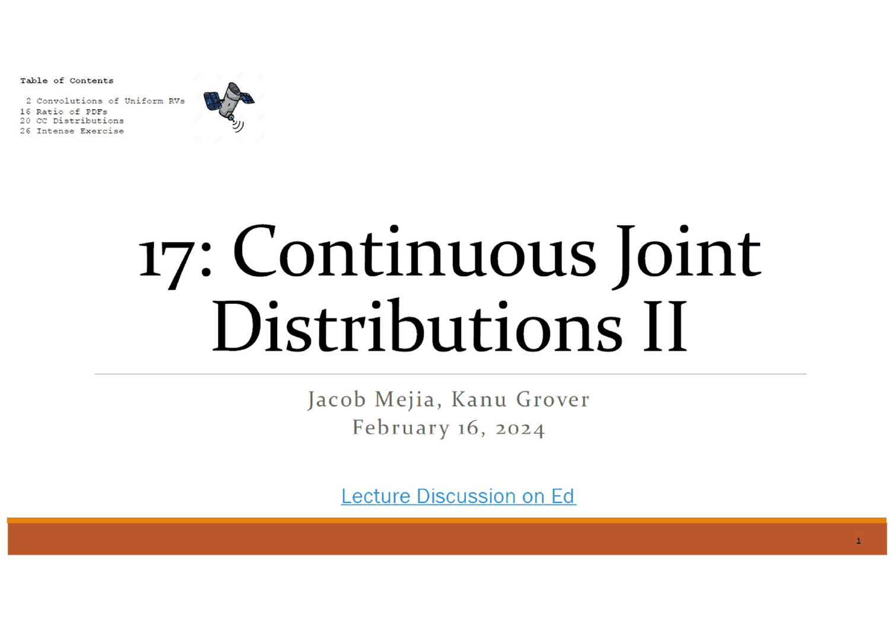
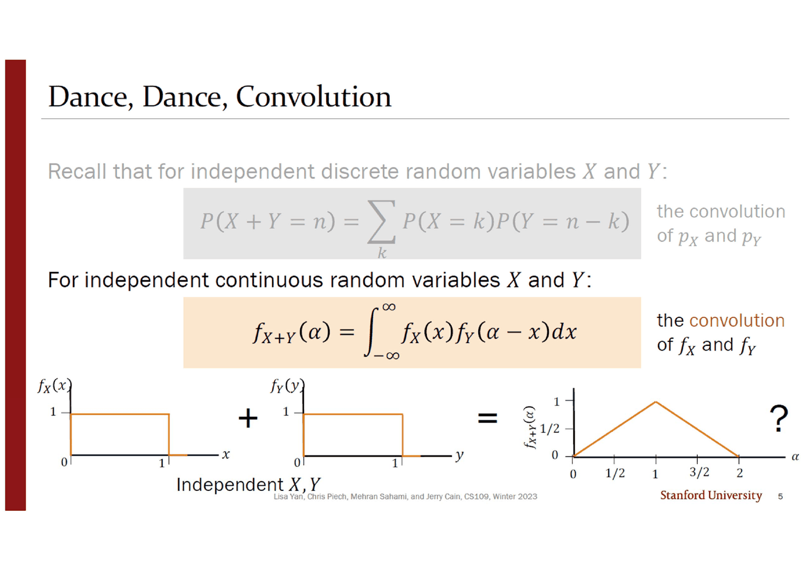
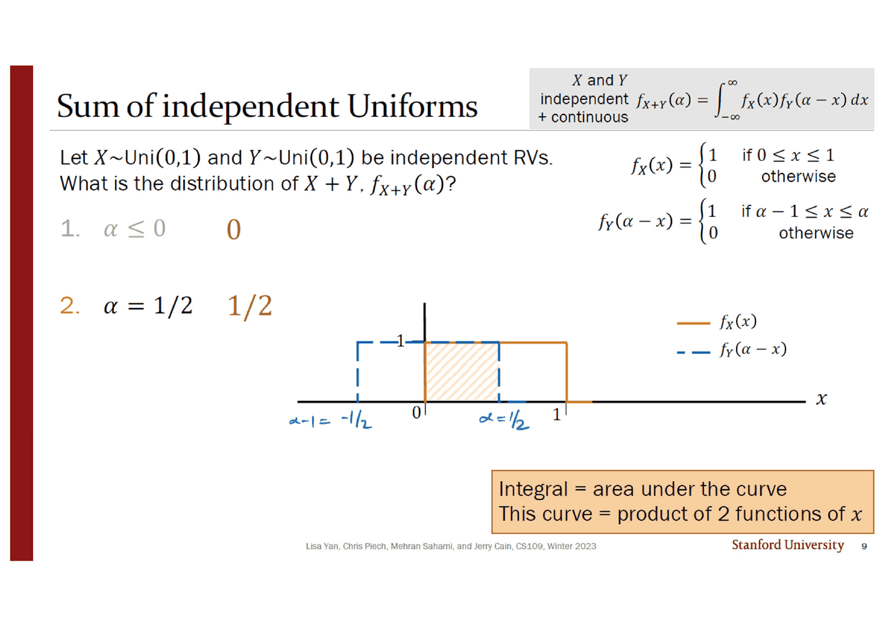
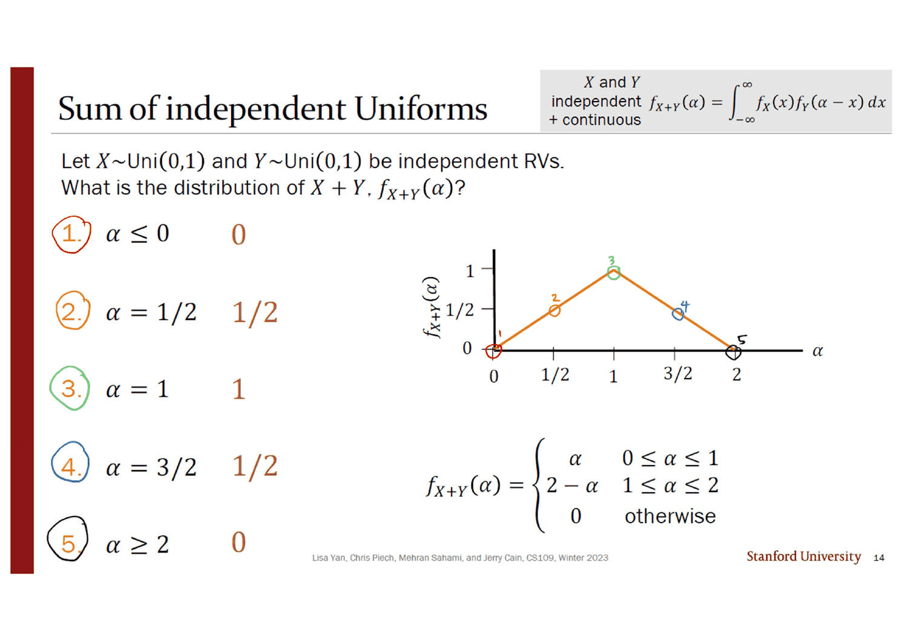
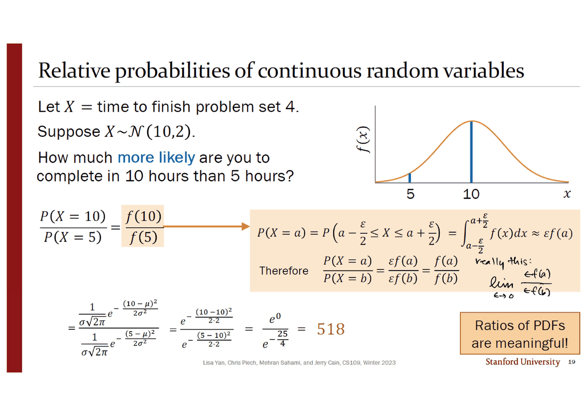
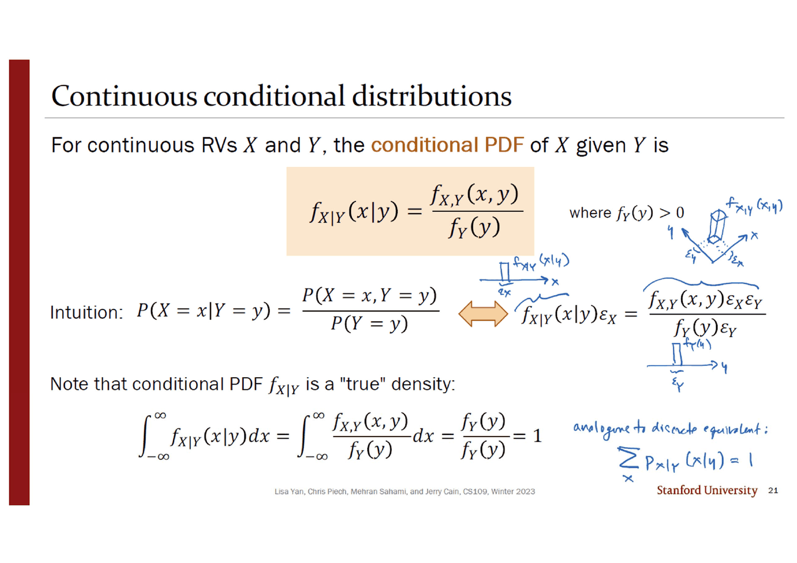
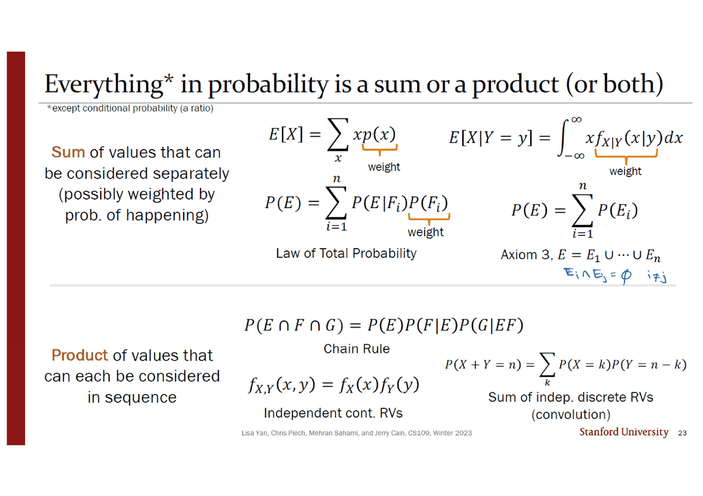
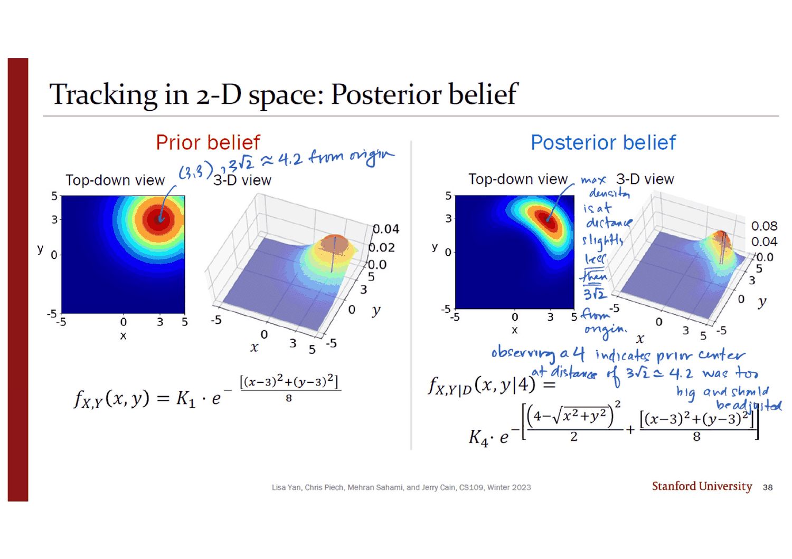

> [!abstract] 각주가 본문이 되는 덱
> 23번 슬라이드의 제목은 이렇다.
>
> ## Everything\* in probability is a sum or a product (or both)
>
> <small>\*except conditional probability (a ratio)</small>
>
> 제목은 크게, 각주는 작게 인쇄되어 있다. **그런데 이 덱의 39장 중 24장이 그 각주에 관한 것이다.** 16~19번은 PDF의 비, 20~21번은 조건부 PDF, 24~25번은 베이즈 정리, 26~39번은 사후분포 — 전부 분수다.
>
> 그리고 분수에는 언제나 같은 문제가 따라온다. **분모를 계산할 수 없다.** 19번에서는 $\varepsilon$ 이, 21번에서는 $\varepsilon_Y$ 가, 25번에서는 $f_X(x)$ 가, 36번에서는 $f_D(4)$ 가 분모에 앉아 있다. 덱이 그때마다 쓰는 기술은 하나다 — **계산하지 말고 상수 $K$ 로 미뤄 둔 다음, 전체가 1이 되도록 마지막에 맞춘다.** 30번에서 $K_1$, 33번에서 $K_2$, 36번에서 $K_3$ 와 $K_4$ 가 차례로 나오고, 39번이 마지막 $K_4$ 를 **이중적분 대신 이중합**으로 근사하며 덱을 닫는다. *"Use a computer!"*
>
> 3번 슬라이드가 이 단원의 목표를 정직하게 적어 두었다 — *"Goal of CS109 continuous joint distributions unit: **build mathematical maturity**."* 새 정리가 아니라 **태도**를 가르치겠다는 말이고, 그 태도의 이름이 「상수를 미루기」다.

---

## 이 덱은 조교가 맡았다



표지의 이름이 다르다. 11~16번 덱이 모두 `Jerry Cain` 이었는데 이 덱만 **`Jacob Mejia, Kanu Grover`** 다. 날짜는 `February 16, 2024`. 표지의 그림도 다른 덱의 장식이 아니라 **인공위성 클립아트**인데, 그 이유는 26번 절에 가서야 드러난다(MH370 수색).

성격도 다르다. 3번 슬라이드가 강의 전체의 구성을 대놓고 설명한다.

> 이산 결합분포에서 본 것을 연속 결합분포로 옮긴다.
> **대체로 쉽다.** 예를 들어 —
>
> | | 이산 | 연속 |
> | --- | --- | --- |
> | 주변분포 | $p_X(a) = \sum_y p_{X,Y}(a,y)$ | $f_X(a) = \int_{-\infty}^{\infty}f_{X,Y}(a,y)\,dy$ |
> | 독립 | $p_{X,Y}(x,y) = p_X(x)p_Y(y)$ | $f_{X,Y}(x,y) = f_X(x)f_Y(y)$ |
>
> 그런데 **수학적으로는 접근 가능해도 실제로 구현하기 어려운** 개념이 몇 있다. 오늘은 그중 몇 개를 다룬다.

**「수학적으로는 가능한데 실제로는 어렵다」** 가 이 덱의 대상이고, 그 어려움은 전부 분모에서 온다.

```mermaid
flowchart TB
    T["23번의 분류<br/>확률의 모든 것은 합이거나 곱이다"]
    T --> S["<b>합</b> — 따로 볼 수 있는 값들을 더한다<br/>E[X] · 전확률의 법칙 · 공리 3"]
    T --> P["<b>곱</b> — 순서대로 볼 수 있는 값들을 곱한다<br/>연쇄법칙 · 독립 · 합성곱"]
    T --> R["<b>비</b> — 각주가 말한 예외<br/>조건부확률"]

    S --> C1["합성곱: 합과 곱이 동시에<br/>슬라이드 2~15 · 창을 밀어 겹친 넓이"]
    P --> C1

    R --> R1["PDF의 비 · 16~19번<br/>ε 이 약분된다 → 518"]
    R --> R2["조건부 PDF · 20~21번<br/>ε_X ε_Y / ε_Y 가 약분된다"]
    R --> R3["베이즈 · 24~25번<br/>분모는 그냥 스칼라"]
    R3 --> R4["사후분포 · 26~39번<br/>분모를 K로 미루고 마지막에 맞춘다"]
    R4 --> R5["1/K₄ = ΣΣ ⋯ ΔxΔy<br/><b>적분을 합으로 바꿔 컴퓨터에 넘긴다</b>"]

    style R fill:transparent,stroke:var(--chart-1),stroke-width:2px
    style R5 fill:transparent,stroke:var(--chart-2),stroke-width:2px
```

---

## 먼저 합과 곱 — 창을 미는 일

4번 슬라이드가 12번 덱 8·10번을 그대로 되살린다(오른쪽 위에 `Review` 표시). 독립인 이산 확률변수의 합성곱과 주사위 두 개의 삼각형 분포다. 잉크가 표기 하나를 덧붙였다 — $p_{X+Y}(n) = \sum_k p_X(k)p_Y(n-k)$, *"also written as … as well"*.

5번이 연속판을 놓는다.

$$f_{X+Y}(\alpha) = \int_{-\infty}^{\infty}f_X(x)\,f_Y(\alpha - x)\,dx$$



**아래 그림에 답이 이미 그려져 있다.** 네모 둘을 더하면 0부터 2까지의 삼각형이 되고, 그 옆에 커다란 물음표가 붙어 있다. 6번이 그 물음표를 「왜 상자가 아닌가」로 바꾼다 — 코기가 *"Isn't this just one??"* 이라 묻고 파란 글씨가 답한다. ***"Not so fast…"***

**두 균등분포의 합이 균등분포가 아니라는 사실**이 이 절의 유일한 내용이고, 나머지 아홉 장은 그것을 손으로 확인하는 과정이다.

### 창을 뒤집고 옮긴다

7번이 합성곱의 유일한 기술적 단계를 다룬다. $f_Y(\alpha - x)$ 를 **$x$ 의 함수로** 다시 쓰는 일이다. 인쇄물은 두 줄의 결과만 준다.

$$f_Y(\alpha - x) = \begin{cases}1 & 0 \le \alpha - x \le 1\\ 0 & \text{그 외}\end{cases} = \begin{cases}1 & \alpha - 1 \le x \le \alpha\\ 0 & \text{그 외}\end{cases}$$

잉크가 그 변형을 두 단계로 쪼갰다 — ①  *"subtract $\alpha$ from everything"* ($-\alpha \le -x \le 1-\alpha$), ②  *"then divide by $-1$"*(부등호가 뒤집힌다). 그리고 주황 상자가 이 전체를 가능하게 하는 전제를 적는다 — ***"$\alpha$ is a constant in the integral w.r.t. $x$."***

**적분변수는 $x$ 이고 $\alpha$ 는 상수다.** 이 한 줄을 놓치면 $f_Y(\alpha-x)$ 가 무엇의 함수인지 알 수 없고, 그러면 그림을 그릴 수 없다.

### 다섯 점을 찍고 잇는다



8~13번이 $\alpha$ 를 다섯 자리에 놓고 **그때마다 두 상자가 겹친 넓이를 읽는다.** 9번의 주황 상자가 왜 그것이 답인지를 두 줄로 적는다 — *"Integral = area under the curve. This curve = product of 2 functions of $x$."* 두 함수가 모두 0 또는 1이므로 곱은 「둘 다 1인 구간에서만 1」이고, 그 구간의 길이가 곧 적분값이다.

| 슬라이드 | $\alpha$ | $f_Y(\alpha-x)$ 상자의 위치 | 겹친 길이 | $f_{X+Y}(\alpha)$ |
| --- | --- | --- | --- | --- |
| 8 | $\alpha \le 0$ | $[\alpha-1, \alpha]$ — 완전히 왼쪽 | 0 | $0$ |
| 9 | $1/2$ | $[-1/2, 1/2]$ | $1/2$ | $\mathbf{1/2}$ |
| 11 | $1$ | $[0, 1]$ — 정확히 포개진다 | $1$ | $\mathbf{1}$ |
| 12 | $3/2$ | $[1/2, 3/2]$ | $1/2$ | $\mathbf{1/2}$ |
| 13 | $\alpha \ge 2$ | $[\alpha-1, \alpha]$ — 완전히 오른쪽 | 0 | $0$ |

잉크가 슬라이드마다 축에 $\alpha-1$ 과 $\alpha$ 의 실제 값을 적어 넣었다($-1/2$ 와 $1/2$, $1/2$ 와 $3/2$, …). **인쇄물에는 그 수가 없다** — 그림에는 0과 1만 표시되어 있고, 상자가 어디 있는지는 잉크가 채운다.



14번이 다섯 값을 좌표평면에 찍고 잇는다. 잉크가 왼쪽 목록의 1~5번에 빨강·주황·초록·파랑·검정으로 동그라미를 치고, 그래프의 같은 색 점에도 같은 번호를 달았다. **그 다섯 점을 직선으로 이으면 삼각형이 되고, 그것이 5번이 미리 보여 준 그림이다.**

$$f_{X+Y}(\alpha) = \begin{cases}\alpha & 0 \le \alpha \le 1\\ 2-\alpha & 1 \le \alpha \le 2\\ 0 & \text{그 외}\end{cases}$$

> [!tip] 다섯 점으로 충분한 이유 (원본에 없는 보충)
> 원본은 다섯 점을 찍고 그냥 잇는다. 왜 그래도 되는지는 말하지 않는데, **겹친 길이가 $\alpha$ 에 대해 구간별 일차식이기 때문**이다. $0 \le \alpha \le 1$ 에서 겹치는 구간은 $[0, \alpha]$ 라 길이가 정확히 $\alpha$ 이고, $1 \le \alpha \le 2$ 에서는 $[\alpha-1, 1]$ 이라 $2-\alpha$ 다. 직선 두 토막이므로 끝점과 꺾인점만 알면 나머지가 따라온다. **꺾이는 자리($\alpha = 0, 1, 2$)가 정확히 다섯 점 중 셋**이다.

아래에서 창을 직접 밀어 볼 수 있다. 값은 전부 원본 $\text{Uni}(0,1)$ 둘에서 계산한 것이고 9·11·12번의 인쇄값과 대조했다.

```html preview
<div id="cv17" style="font-family:system-ui,-apple-system,sans-serif;color:var(--foreground);background:var(--card);border:1px solid var(--border);border-radius:12px;padding:18px 16px;">
  <div style="display:flex;flex-wrap:wrap;gap:12px;align-items:center;margin-bottom:14px;">
    <label style="font-size:13px;font-weight:600;">α</label>
    <input id="a17" type="range" min="-50" max="250" value="50" step="5" style="flex:1;min-width:180px;accent-color:var(--chart-1);">
    <output id="av17" style="font-variant-numeric:tabular-nums;font-weight:700;font-size:15px;min-width:3.2em;">0.50</output>
  </div>
  <svg id="s17" viewBox="0 0 620 300" style="width:100%;height:auto;display:block;"></svg>
  <p id="o17" style="margin:12px 0 0;font-size:13px;line-height:1.8;font-variant-numeric:tabular-nums;min-height:4.2em;"></p>
</div>
<script>
(function(){
  const NS='http://www.w3.org/2000/svg', svg=document.getElementById('s17');
  function el(n,a,txt){const e=document.createElementNS(NS,n);for(const k in a)e.setAttribute(k,a[k]);
    if(txt!==undefined)e.textContent=txt; return e;}
  // 위: x 축 위의 두 상자.  아래: 결과 삼각형.
  const L=40,R=590,XMIN=-1.6,XMAX=2.6, TOP=18, MID=150, B2=274;
  const sx=v=>L+((v-XMIN)/(XMAX-XMIN))*(R-L);
  const overlap=a=>Math.max(0, Math.min(1,a)-Math.max(0,a-1));
  function draw(a){
    svg.textContent='';
    // ── 위 패널
    const y0=MID-16, h=62;
    svg.appendChild(el('line',{x1:L,y1:y0,x2:R,y2:y0,stroke:'var(--border)'}));
    // f_X: [0,1]
    svg.appendChild(el('rect',{x:sx(0),y:y0-h,width:sx(1)-sx(0),height:h,fill:'none',
      stroke:'var(--chart-1)','stroke-width':2}));
    // f_Y(a-x): [a-1, a]
    svg.appendChild(el('rect',{x:sx(a-1),y:y0-h,width:sx(a)-sx(a-1),height:h,fill:'none',
      stroke:'var(--chart-2)','stroke-width':2,'stroke-dasharray':'6 4'}));
    // 겹침
    const lo=Math.max(0,a-1), hi=Math.min(1,a);
    if(hi>lo) svg.appendChild(el('rect',{x:sx(lo),y:y0-h,width:sx(hi)-sx(lo),height:h,
      fill:'var(--chart-1)',opacity:0.3}));
    for(const v of [-1,0,1,2]) {
      svg.appendChild(el('text',{x:sx(v),y:y0+16,'text-anchor':'middle','font-size':11,
        fill:'var(--muted-foreground)'}, v));
    }
    svg.appendChild(el('text',{x:sx(0.5),y:y0-h-8,'text-anchor':'middle','font-size':11.5,
      fill:'var(--chart-1)','font-weight':600},'f_X(x)'));
    svg.appendChild(el('text',{x:sx(a-0.5),y:y0-h-24,'text-anchor':'middle','font-size':11.5,
      fill:'var(--chart-2)','font-weight':600},'f_Y(α−x),  [α−1, α]'));
    svg.appendChild(el('text',{x:L,y:TOP+4,'font-size':11,fill:'var(--muted-foreground)'},
      '① 두 함수를 곱하면 겹친 구간에서만 1이다'));
    // ── 아래 패널: 삼각형
    const ty=B2, th=76;
    svg.appendChild(el('line',{x1:L,y1:ty,x2:R,y2:ty,stroke:'var(--border)'}));
    svg.appendChild(el('path',{d:`M${sx(0)},${ty} L${sx(1)},${ty-th} L${sx(2)},${ty}`,
      fill:'none',stroke:'var(--muted-foreground)','stroke-width':1.8,opacity:0.55}));
    const v=overlap(a);
    if(a>=-0.001 && a<=2.001){
      svg.appendChild(el('line',{x1:sx(a),y1:ty,x2:sx(a),y2:ty-th*v,stroke:'var(--chart-1)','stroke-width':1.5,'stroke-dasharray':'3 3'}));
      svg.appendChild(el('circle',{cx:sx(a),cy:ty-th*v,r:5,fill:'var(--chart-1)'}));
    }
    svg.appendChild(el('text',{x:L,y:ty-th-10,'font-size':11,fill:'var(--muted-foreground)'},
      '② 겹친 길이를 α 자리에 찍으면 삼각형이 된다'));
    for(const v2 of [0,1,2]) svg.appendChild(el('text',{x:sx(v2),y:ty+16,'text-anchor':'middle',
      'font-size':11,fill:'var(--muted-foreground)'}, v2));
  }
  function out(a){
    const v=overlap(a);
    const lo=Math.max(0,a-1), hi=Math.min(1,a);
    let h='<b>f<sub>X+Y</sub>('+a.toFixed(2)+') = '+v.toFixed(3)+'</b>';
    h += v>0 ? ' &nbsp;<span style="color:var(--muted-foreground)">겹치는 구간 ['+lo.toFixed(2)+', '+hi.toFixed(2)+'] 의 길이</span>'
             : ' &nbsp;<span style="color:var(--muted-foreground)">두 상자가 겹치지 않는다</span>';
    const marks={'0.50':'9번 슬라이드','1.00':'11번 슬라이드','1.50':'12번 슬라이드'};
    const k=a.toFixed(2);
    h+='<br><span style="font-size:12.5px;color:var(--muted-foreground)">'+
      (marks[k]? '<b style="color:var(--chart-1)">'+marks[k]+'의 자리</b> — 인쇄값 '+(v===1?'1':'1/2')+' 과 일치한다.'
       : (a<=0 ? '8번 슬라이드의 경우: α ≤ 0 이면 상자가 왼쪽으로 완전히 빠진다.'
         : a>=2 ? '13번 슬라이드의 경우: α ≥ 2 면 상자가 오른쪽으로 완전히 빠진다.'
         : (a<1 ? '0 ≤ α ≤ 1 구간에서는 겹치는 구간이 [0, α] 라 길이가 정확히 α 다.'
                : '1 ≤ α ≤ 2 구간에서는 겹치는 구간이 [α−1, 1] 이라 길이가 2 − α 다.')))+'</span>';
    document.getElementById('o17').innerHTML=h;
  }
  function upd(){const a=+document.getElementById('a17').value/100;
    document.getElementById('av17').textContent=a.toFixed(2); draw(a); out(a);}
  document.getElementById('a17').addEventListener('input',upd); upd();
})();
</script>
```

15번이 이산과 연속을 위아래로 나란히 놓고 절을 닫는다(`Dance, Dance, Convolution Extreme`). **위는 12번 덱 10번의 주사위, 아래는 방금 만든 삼각형.** 둘 다 삼각형이고, 둘 다 「가운데가 높은 이유는 조합의 수(또는 겹치는 길이)가 가운데에서 최대이기 때문」이다.

22번이 나중에 이 결과의 쓸모를 한 줄로 정리한다 — *"What can we model with a triangular PDF? **Sum of uniforms!**"* 그리고 주황 상자가 방향을 밝힌다. *"We're covering the reverse direction for now; the forward direction will come on Friday."* **지금은 「부품에서 전체로」이고, 「전체에서 부품으로」는 다음 강의다.**

---

## 여기서부터는 전부 분수다

### ① PDF의 비 — $\varepsilon$ 이 약분된다

17번의 질문이 도발적이다. $X \sim \mathcal N(10, 2)$ 가 문제집 4를 끝내는 시간일 때, **10시간에 끝낼 가능성은 5시간에 끝낼 가능성의 몇 배인가?**

$$\frac{P(X = 10)}{P(X = 5)} = \frac{0}{0}\,?$$

객관식 네 개 중 **A는 `0/0 = undefined`** 다. 09번 덱이 세운 「연속 확률변수가 한 점을 가질 확률은 0」을 그대로 따르면 A가 맞아 보인다. 그런데 18번이 동그라미 치는 답은 **B. 2** 다.



19번의 근거가 주황 상자 안에 있다. 점 대신 **폭 $\varepsilon$ 인 아주 작은 구간**을 잡는다.

$$P(X = a) \approx P\!\left(a - \tfrac{\varepsilon}{2} \le X \le a + \tfrac{\varepsilon}{2}\right) = \int_{a-\varepsilon/2}^{a+\varepsilon/2}f(x)\,dx \approx \varepsilon f(a)$$

$$\therefore\quad \frac{P(X=a)}{P(X=b)} = \frac{\varepsilon f(a)}{\varepsilon f(b)} = \frac{f(a)}{f(b)}$$

**두 확률이 모두 0으로 가지만 비는 0으로 가지 않는다.** 잉크가 그 엄밀한 형태를 오른쪽에 적어 두었다 — *"really this: $\lim_{\varepsilon \to 0}\frac{\varepsilon f(a)}{\varepsilon f(b)}$"*.

그리고 계산하면 정규분포의 상수 $\frac{1}{\sigma\sqrt{2\pi}}$ 까지 약분된다.

$$\frac{f(10)}{f(5)} = \frac{e^{-(10-10)^2/(2\cdot 2)}}{e^{-(5-10)^2/(2\cdot 2)}} = \frac{e^{0}}{e^{-25/4}} = e^{6.25} = \mathbf{518.01\ldots}$$

인쇄값은 `518` 이고 직접 계산해도 518.0128이다. 주황 상자의 결론 — ***"Ratios of PDFs are meaningful!"***

> [!note] 18번의 정답 B가 던지는 것
> 문제는 「몇 배인가」였고 답은 518이다. 그런데 18번이 동그라미 친 보기는 **B. 2** 다. 세 번째 보기 C가 $\frac{f(10)}{f(5)}$ 라 그쪽이 더 정답처럼 보이는데, 실제 강의의 질문이 무엇이었는지는 슬라이드만으로는 알 수 없다. **B와 C는 서로 모순되지 않는다** — C가 방법이고 그 값이 518이니, B의 「2」는 보기의 번호를 가리켰을 가능성이 높다. 19번이 C를 노랗게 칠하고 거기서 출발하므로 내용상으로는 C가 답이다.

### ② 조건부 PDF — $\varepsilon_Y$ 가 약분된다



21번이 같은 기술을 한 번 더 쓴다. 정의 자체는 14번 덱 3번의 이산판과 글자만 다르다.

$$f_{X\mid Y}(x \mid y) = \frac{f_{X,Y}(x,y)}{f_Y(y)}, \qquad f_Y(y) > 0$$

직관 줄에서 인쇄물은 이산판 $P(X=x\mid Y=y) = \frac{P(X=x,Y=y)}{P(Y=y)}$ 과 연속판을 **주황 쌍화살표로 잇는다.** 그리고 잉크가 그 연속판의 정체를 그림으로 그렸다 — $x$-$y$ 평면 위에 폭 $\varepsilon_X$, 깊이 $\varepsilon_Y$ 인 가느다란 기둥을 세워 놓고 그 부피가 $f_{X,Y}(x,y)\varepsilon_X\varepsilon_Y$ 임을, 그 옆에 $y$ 축 위의 납작한 막대가 $f_Y(y)\varepsilon_Y$ 임을 그렸다.

$$f_{X\mid Y}(x\mid y)\,\varepsilon_X = \frac{f_{X,Y}(x,y)\,\varepsilon_X\varepsilon_Y}{f_Y(y)\,\varepsilon_Y}$$

**$\varepsilon_Y$ 가 약분되고 $\varepsilon_X$ 만 양변에 남는다.** 19번에서 $\varepsilon$ 이 사라진 것과 같은 일이고, 여기서는 *어느* $\varepsilon$ 이 사라지는지가 중요하다 — 조건을 건 쪽만 사라진다.

아래쪽 절반은 이 정의가 **진짜 밀도**임을 확인한다.

$$\int_{-\infty}^{\infty}f_{X\mid Y}(x\mid y)\,dx = \int_{-\infty}^{\infty}\frac{f_{X,Y}(x,y)}{f_Y(y)}\,dx = \frac{f_Y(y)}{f_Y(y)} = 1$$

잉크가 오른쪽에 이산판을 나란히 적었다 — *"analogue to discrete equivalent: $\sum_x p_{X\mid Y}(x\mid y) = 1$"*. **14번 덱 5번에서 「어느 방향이 1이 되는가」로 물었던 것이 여기서 적분 한 줄로 확인된다.**

### ③ 23번 — 분류가 자기 자신을 가리킨다



23번은 이 과목이 지금까지 쓴 식을 **두 상자에 나눠 담는다.**

| **합** — 따로 볼 수 있는 값들을 (일어날 확률로 가중해) 더한다 | **곱** — 차례로 볼 수 있는 값들을 곱한다 |
| --- | --- |
| $E[X] = \sum_x x\,p(x)$ &nbsp;(가중치: $p(x)$) | $P(E \cap F \cap G) = P(E)P(F\mid E)P(G\mid EF)$ &nbsp;연쇄법칙 |
| $E[X\mid Y{=}y] = \int x f_{X\mid Y}(x\mid y)dx$ &nbsp;(가중치: $f_{X\mid Y}$) | $f_{X,Y}(x,y) = f_X(x)f_Y(y)$ &nbsp;독립인 연속 확률변수 |
| $P(E) = \sum_i P(E\mid F_i)P(F_i)$ &nbsp;전확률의 법칙 | $P(X{+}Y{=}n) = \sum_k P(X{=}k)P(Y{=}n{-}k)$ &nbsp;합성곱 |
| $P(E) = \sum_i P(E_i)$ &nbsp;공리 3 | |

잉크가 공리 3 옆에 빠진 조건을 채웠다 — $E_i \cap E_j = \varnothing,\ i \ne j$. **배반이어야 더할 수 있다**는 조건이 인쇄되어 있지 않다.

그리고 합성곱이 **오른쪽 상자에 들어가 있다**는 점이 이 표의 재미다. 합 기호로 적혀 있는데 곱으로 분류된 이유는, 합성곱의 본질이 「$X{=}k$ 와 $Y{=}n{-}k$ 가 **동시에** 일어난다」는 곱이고 합은 배반인 경우를 모으는 겉껍질이기 때문이다. 제목이 **`(or both)`** 이라 적은 자리가 여기다.

---

## 그리고 각주가 덱을 삼킨다

24번이 조건부확률과 베이즈 정리를 한 장에 다시 인쇄하는데, **두 곳에 똑같은 설명이 붙는다.**

$$P(F\mid E) = \frac{P(E\cap F)}{\underbrace{P(E)}_{\textit{Scaling to the correct sample space}}}, \qquad P(F\mid E) = \frac{\overbrace{P(F)}^{\textit{Prior}}\overbrace{P(E\mid F)}^{\textit{Likelihood}}}{\underbrace{P(E)}_{\textit{Scaling to the correct sample space}}}$$

**분모의 역할은 언제나 같다 — 표본공간을 올바른 크기로 맞추는 것.** 그리고 독립일 때의 설명이 그 대칭점이다 — *"Sample space doesn't need to be scaled."* 독립은 「나눌 필요가 없는 경우」로 정의된다.

25번이 베이즈 정리를 세 벌 쌓아 놓는다 — 사건으로, 이산 확률변수로, 연속 확률변수로. (그리고 세 줄 옆에 각각 토머스 베이즈의 초상, 그 초상에 드럼 세트를 합성한 그림, 찰리 신의 사진을 붙여 놓았다.) 주황 상자 — ***"Really all the same idea!"***

$$f_{Y\mid X}(y\mid x) = \frac{f_Y(y)\,f_{X\mid Y}(x\mid y)}{\underbrace{f_X(x)}_{\textit{…so this is just a scalar}}}$$

그리고 $f_{Y\mid X}(y\mid \underbrace{x}_{\textit{You are given this value…}})$ 의 $x$ 에 중괄호를 쳐 둔다. **조건 자리의 값은 주어진 것이므로 분모는 변수가 아니라 상수다.** 이 한 줄이 26번 이후 전체를 가능하게 한다.

---

## 위성 하나로 비행기를 찾는다

26번 절 표지가 `Intense Exercise` 이고, 옆에 절벽길 위 자동차 사진(`GPS SAYS… TURN LEFT NOW!`)과 *"I don't know how GPS tracking works and at this point I'm too afraid to ask"* 밈이 붙어 있다. 27번이 진짜 자료를 꺼낸다 — **MH370 수색 지도**. 인도양 위에 동심원이 겹쳐 있고 `Satellite 37,800 km above sea level`, `Last known possible position of MH370 based on satellite data (somewhere on red lines)`.

> 어떤 물체의 2차원 위치를 알고 싶다. 위성 핑은 물체와 위성 $(0,0)$ 사이 거리의 **잡음 섞인 1차원 측정값**을 준다. 그 측정으로 물체가 어디 있는지 알 수 있는가?

**1차원 관측으로 2차원 위치를 추정한다.** 정보가 한 차원 모자라고, 그 부족분을 메우는 것이 사전분포다. 28번이 세 단계를 세운다 — 사전 믿음 → 잡음 관측 $D = 4$ → 사후 믿음. 잉크가 위쪽 그림에 화살표를 그어 *"prior belief distribution, centered at $(3,3)$"* 이라 적었다.

29번이 쓸 식을 준다.

$$f_{X,Y\mid D}(x,y\mid d) = \frac{\overbrace{f_{D\mid X,Y}(d\mid x,y)}^{\textit{likelihood (of evidence)}}\ \overbrace{f_{X,Y}(x,y)}^{\textit{prior belief}}}{\underbrace{f_D(d)}_{\textit{normalization constant}}}$$

그리고 30~39번이 이 식을 왼쪽에서 오른쪽으로 하나씩 채운다. **매 슬라이드의 오른쪽 위에 같은 식이 작게 인쇄되고, 지금 채우는 조각만 빨간 사각형으로 표시된다.**

### 1. 사전 — $K_1$

30번. 사전분포는 $(3,3)$ 을 중심으로 한 대칭 이변량 정규분포다. 잉크가 16번 덱의 표기로 옮겨 적었다 — $\boldsymbol\mu = \binom{3}{3}$, $\boldsymbol\Sigma = \begin{pmatrix}2^2 & 0\\0&2^2\end{pmatrix}$.

$$f_{X,Y}(x,y) = \frac{1}{2\pi\cdot 2^2}e^{-\frac{(x-3)^2+(y-3)^2}{2(2^2)}} = \mathbf{K_1}\cdot e^{-\frac{(x-3)^2+(y-3)^2}{8}}$$

**상수를 $K_1$ 로 접는 첫 동작이다.** 슬라이드가 그 위에 빨간 글씨로 `normalizing constant` 라고 적어 둔다.

### 2. 가능도 — $K_2$

31~33번. 위성이 재는 것은 거리 $D$ 이고, 참 위치가 $(x,y)$ 라면 참 거리는 $\sqrt{x^2+y^2}$ 다. 그런데 측정에는 **표준정규 잡음**이 섞인다. 잉크가 모형을 한 줄로 적었다.

$$D = \sqrt{x^2+y^2} + Z, \qquad Z \sim \mathcal N(0,1)$$

32번은 이 결론의 네 자리를 `(A)`·`(B)`·`(C)`·`(D)` 로 비워 두고 묻고, 33번이 채운다.

$$D \mid X, Y \sim \mathcal N\!\left(\mu = \sqrt{x^2+y^2},\ \sigma^2 = 1\right) \quad\Longrightarrow\quad f_{D\mid X,Y}(d\mid x,y) = \frac{1}{\sqrt{2\pi}}e^{-\frac{(d-\sqrt{x^2+y^2})^2}{2}} = \mathbf{K_2}\cdot e^{-\frac{(d-\sqrt{x^2+y^2})^2}{2}}$$

**두 번째 상수.** 16번 덱 48번이 경고한 선형변환 규칙이 여기서 쓰인다 — 상수에 잡음을 더하면 평균만 옮겨지고 분산은 그대로다.

### 3. 사후 — $K_3$, 그리고 $K_4$

34번은 목표만 다시 적고 비워 둔다. 35번이 재료를 모으고 힌트 셋을 준다.

> - 베이즈 정리를 써라!
> - $f_D(4)$ 는 **그냥 스케일링 상수다. 왜 그런가?**
> - 그 마지막 스케일링 상수를 **컴퓨터로 어떻게 근사할 수 있는가?**

36번이 네 줄로 계산한다. 지수끼리 더해지면서 $K_1 K_2$ 가 $K_3$ 가 되고, $K_3 / f(D{=}4)$ 가 다시 $K_4$ 가 된다.

$$f_{X,Y\mid D}(x,y\mid 4) = \frac{K_2 e^{-\frac{(4-\sqrt{x^2+y^2})^2}{2}}\cdot K_1 e^{-\frac{(x-3)^2+(y-3)^2}{8}}}{f(D{=}4)} = \mathbf{K_4}\cdot \exp\left[-\left(\frac{\left(4-\sqrt{x^2+y^2}\right)^2}{2} + \frac{(x-3)^2+(y-3)^2}{8}\right)\right]$$

주황 상자가 이 덱의 핵심 문장을 적는다.

> ***Key: Once we know the part dependent on $x, y$, we can computationally approximate $K_4$ so that $f_{X,Y\mid D}$ is a valid PDF.***

**$x, y$ 에 의존하는 부분만 정확히 알면 된다.** 나머지는 상수이고, 상수는 나중에 「전체가 1이 되도록」 맞추면 된다. 39번이 그 맞추는 법을 보인다.

$$\frac{1}{K_4} = \int_{-\infty}^{\infty}\!\!\int_{-\infty}^{\infty} e^{-\left[\cdots\right]}dx\,dy \quad\approx\quad \sum_y\sum_x e^{-\left[\cdots\right]}\Delta x\,\Delta y \qquad \textbf{Use a computer!}$$

**덱이 이중적분을 이중합으로 되돌리며 끝난다.** 16번 덱이 열여섯 장에 걸쳐 합을 적분으로 바꿨는데, 이 덱의 마지막 슬라이드가 그것을 다시 합으로 바꾼다. 그리고 그 되돌림이 후퇴가 아니라 **실행 가능성**이다 — 15번 덱 30번의 기각 표집이 확률의 정의를 코드로 되돌렸던 것과 같은 동작이다.

### 관측이 믿음을 얼마나 당기는가



37·38번이 사전과 사후를 나란히 그린다. 사전은 $(3,3)$ 을 중심으로 한 동그란 언덕이고, 사후는 **원점을 중심으로 한 반지름 4의 호를 따라 휜 초승달**이다. 잉크가 그 변화를 세 줄로 해설한다.

> $(3,3)$ 은 원점에서 $3\sqrt2 \approx 4.2$ 떨어져 있다.
> 사후의 최대 밀도는 원점에서 $3\sqrt2$ **보다 약간 가까운** 거리에 있다.
> 4를 관측했다는 것은 사전의 중심이 4.2 거리에 있었던 것이 **너무 멀었고 조정되어야 함**을 뜻한다.

잉크의 「약간 가까운」이 정확히 얼마인지 직접 계산했다.

> [!tip] 사후 최빈점은 4.0485다 — 정확히 1:4 가중평균 (원본에 없는 계산)
> 사전과 가능도가 모두 $x{\leftrightarrow}y$ 대칭이므로 최빈점은 대각선 $y = x$ 위에 있다. 거기서 $r = \sqrt{x^2+y^2}$ 로 바꿔 쓰면 지수 안이 **$r$ 에 대한 두 이차식의 합**이 된다.
> $$\frac{(4-r)^2}{2} + \frac{\left(r - 3\sqrt2\right)^2}{8}$$
> 앞은 분산 1, 뒤는 분산 4인 정규분포의 지수다. 두 이차식의 합을 최소화하는 $r$ 은 **정밀도(분산의 역수)로 가중한 평균**이다.
> $$r^\star = \frac{\frac{1}{1}\cdot 4 + \frac{1}{4}\cdot 3\sqrt2}{\frac11 + \frac14} = \frac{4 + 1.06066}{1.25} = \mathbf{4.04853}$$
> 최빈점은 $(2.86274,\ 2.86274)$ 이고 수치 격자 탐색으로도 같은 값이 나온다. **관측 쪽으로 정확히 80% 당겨진다** — 관측의 정밀도가 사전의 4배이기 때문이다.
>
> 이 「정밀도 가중평균」은 이 덱에 인쇄되어 있지 않다. **`22_map` 이 형식으로 다룰 내용**이고, 여기서는 그림과 잉크 세 줄이 그 자리를 대신한다.

```html preview
<div id="bp17" style="font-family:system-ui,-apple-system,sans-serif;color:var(--foreground);background:var(--card);border:1px solid var(--border);border-radius:12px;padding:18px 16px;">
  <p style="margin:0 0 12px;font-size:13px;color:var(--muted-foreground);">
    30·33번의 모형을 대각선 y = x 위에서 반지름 r 로 본 것. 사전은 𝒩(3√2, 4), 가능도는 𝒩(r, 1).
    관측값 d 를 바꾸면 사후 최빈점이 어디로 가는지 볼 수 있다.</p>
  <div style="display:flex;flex-wrap:wrap;gap:12px;align-items:center;margin-bottom:14px;">
    <label style="font-size:13px;font-weight:600;">관측 D = d</label>
    <input id="d17" type="range" min="0" max="90" value="40" step="1" style="flex:1;min-width:170px;accent-color:var(--chart-1);">
    <output id="dv17" style="font-variant-numeric:tabular-nums;font-weight:700;font-size:15px;min-width:2.6em;">4.0</output>
  </div>
  <svg id="bs17" viewBox="0 0 620 210" style="width:100%;height:auto;display:block;"></svg>
  <div id="bo17" style="margin-top:12px;font-size:13.5px;line-height:1.95;font-variant-numeric:tabular-nums;"></div>
</div>
<script>
(function(){
  const NS='http://www.w3.org/2000/svg', svg=document.getElementById('bs17');
  function el(n,a,t){const e=document.createElementNS(NS,n);for(const k in a)e.setAttribute(k,a[k]);
    if(t!==undefined)e.textContent=t; return e;}
  const PRIOR_MU=3*Math.SQRT2, PRIOR_VAR=4, LIK_VAR=1;
  const L=40,R=596,B=168,TOP=16,RMIN=0,RMAX=10;
  const sx=r=>L+((r-RMIN)/(RMAX-RMIN))*(R-L);
  const g=(r,m,v)=>Math.exp(-(r-m)*(r-m)/(2*v))/Math.sqrt(2*Math.PI*v);
  function curve(m,v,col,dash,peak){
    let d='',mx=0;
    for(let i=0;i<=400;i++){const r=RMIN+(RMAX-RMIN)*i/400; mx=Math.max(mx,g(r,m,v));}
    for(let i=0;i<=400;i++){const r=RMIN+(RMAX-RMIN)*i/400;
      const y=B-(g(r,m,v)/peak)*(B-TOP); d+=(i?'L':'M')+sx(r).toFixed(1)+','+y.toFixed(1);}
    return el('path',{d:d,fill:'none',stroke:col,'stroke-width':2,'stroke-dasharray':dash||'none'});
  }
  function draw(d){
    svg.textContent='';
    const post_var=1/(1/PRIOR_VAR+1/LIK_VAR);
    const post_mu=post_var*(PRIOR_MU/PRIOR_VAR + d/LIK_VAR);
    const peak=1/Math.sqrt(2*Math.PI*post_var);
    svg.appendChild(el('line',{x1:L,y1:B,x2:R,y2:B,stroke:'var(--border)'}));
    svg.appendChild(curve(PRIOR_MU,PRIOR_VAR,'var(--muted-foreground)','6 4',peak));
    svg.appendChild(curve(d,LIK_VAR,'var(--chart-2)','3 3',peak));
    svg.appendChild(curve(post_mu,post_var,'var(--chart-1)',null,peak));
    for(const [m,col] of [[PRIOR_MU,'var(--muted-foreground)'],[d,'var(--chart-2)'],[post_mu,'var(--chart-1)']])
      svg.appendChild(el('line',{x1:sx(m),y1:TOP,x2:sx(m),y2:B,stroke:col,'stroke-width':1,'stroke-dasharray':'2 3',opacity:0.7}));
    for(const r of [0,2,4,6,8,10])
      svg.appendChild(el('text',{x:sx(r),y:B+17,'text-anchor':'middle','font-size':11,fill:'var(--muted-foreground)'}, r));
    svg.appendChild(el('text',{x:L+4,y:TOP+10,'font-size':11,fill:'var(--muted-foreground)'},'--- 사전 𝒩(4.243, 4)'));
    svg.appendChild(el('text',{x:L+4,y:TOP+25,'font-size':11,fill:'var(--chart-2)'},'··· 가능도 𝒩(d, 1)'));
    svg.appendChild(el('text',{x:L+4,y:TOP+40,'font-size':11,fill:'var(--chart-1)','font-weight':700},'—— 사후'));
    return {post_mu,post_var};
  }
  function upd(){
    const d=+document.getElementById('d17').value/10;
    document.getElementById('dv17').textContent=d.toFixed(1);
    const {post_mu,post_var}=draw(d);
    const w=(1/LIK_VAR)/(1/PRIOR_VAR+1/LIK_VAR);
    let h='<b>사후 최빈 반지름 r* = <span style="color:var(--chart-1)">'+post_mu.toFixed(5)+'</span></b>'+
      ' &nbsp;<span style="color:var(--muted-foreground)">(사전 4.24264 와 관측 '+d.toFixed(1)+' 을 1 : 4 로 가중)</span>'+
      '<br>사후 분산 = 1/(1/4 + 1/1) = <b>'+post_var.toFixed(3)+'</b> — <b>사전보다도 관측보다도 작다.</b>'+
      ' 관측 쪽 가중치 <b>'+(100*w).toFixed(0)+'%</b>';
    h+='<p style="margin:9px 0 0;font-size:12.5px;color:var(--muted-foreground);line-height:1.7">'+
      (Math.abs(d-4)<0.05 ? '<b style="color:var(--chart-1)">38번 슬라이드의 자리다.</b> 잉크가 「3√2 보다 약간 가깝다」고 적은 값이 정확히 4.04853 이다. 사후 최빈점은 (2.86274, 2.86274).'
       : '관측이 사전에서 멀어질수록 사후도 따라가지만, 언제나 관측 쪽으로 80%, 사전 쪽으로 20% 지점에 멈춘다. <b>비율을 정하는 것은 두 분산뿐</b>이고 관측값 자체와는 무관하다.')+'</p>';
    document.getElementById('bo17').innerHTML=h;
  }
  document.getElementById('d17').addEventListener('input',upd); upd();
})();
</script>
```

37번의 마지막 문장이 이 덱이 무엇을 열었는지 말한다 — ***"With this continuous version of Bayes' theorem, we can explore new domains."***

---

## 원본 오류·불일치

이 덱은 **결번이 하나도 없고**(39쪽, 인쇄 번호 1~39가 빠짐없이 순서대로), 계산도 전부 맞는다. $518 = e^{6.25}$, 삼각형 분포의 다섯 값, 사후분포의 지수 결합을 모두 재계산해 대조했다. 걸리는 것은 표기와 설명의 공백 몇 가지다.

`표기`

- **17·18번의 $\mathcal N(10, 2)$ 가 모호하다** — 두 번째 인자가 분산인지 표준편차인지 슬라이드에 없다. 19번의 계산이 $\frac{(5-10)^2}{2\cdot 2}$ 로 전개되므로 **$\sigma^2 = 2$**(분산)가 맞고, 이 과목의 표기 $\mathcal N(\mu, \sigma^2)$ 와도 일치한다. 다만 $\sigma = \sqrt2 \approx 1.41$ 인데 17번 그림의 종 모양은 5와 10 사이를 여유 있게 덮고 있어 **그림이 $\sigma$ 를 훨씬 크게 그렸다**
- **18번이 고른 답 B** — 「몇 배인가」에 대한 답이 `2` 로 동그라미 쳐져 있는데 실제 값은 518이다. 19번이 보기 C($\frac{f(10)}{f(5)}$)를 노랗게 칠하고 거기서 계산을 시작하므로, B의 동그라미는 보기 번호를 가리킨 것으로 보인다. **슬라이드만으로는 판별되지 않는다**
- **27번의 `37.800 km`** — 소수점인지 천 단위 구분인지 인쇄만으로는 갈리지 않는다. 지구정지궤도 고도가 약 35,786 km 이므로 **37,800 km**(천 단위 구분)로 읽어야 한다. 소수점으로 읽으면 37.8 km가 되어 성층권 높이다
- **29번의 분모가 $f_D(d)$ 와 $f(D=4)$ 두 표기로 나타난다** — 29번은 $f_D(d)$, 36번은 $f(D = 4)$ 로 아래첨자 없이 적는다

`설명의 공백`

- **7번의 변수 치환 절차가 인쇄되어 있지 않다** — $0 \le \alpha - x \le 1$ 에서 $\alpha - 1 \le x \le \alpha$ 로 가는 두 단계(양변에서 $\alpha$ 빼기 · $-1$ 로 나누며 부등호 뒤집기)는 잉크에만 있다
- **8~13번 그림의 축에 $\alpha$ 관련 눈금이 없다** — 0과 1만 인쇄되어 있고 $\alpha-1$, $\alpha$ 의 실제 위치는 잉크가 채운다. 인쇄물만 보면 파란 점선 상자가 왜 거기 있는지 읽을 수 없다
- **33번의 잡음 모형 $D = \sqrt{x^2+y^2} + Z$ 가 잉크에만 있다** — 인쇄물은 *"$D$ is still noisy! Suppose noise is standard normal"* 과 *"On average, $D$ is your true Euclidean distance"* 두 줄로 흩어져 있고, 그 둘을 하나의 식으로 합친 것은 잉크다
- **23번 공리 3의 배반 조건이 빠져 있다** — $P(E) = \sum_i P(E_i)$ 옆에 $E = E_1 \cup \cdots \cup E_n$ 만 적혀 있고 $E_i \cap E_j = \varnothing$ 은 잉크가 보충했다
- **사후 최빈점의 위치가 수로 나오지 않는다** — 38번의 잉크가 「$3\sqrt2$ 보다 약간 가깝다」로 끝난다. 실제 값 4.04853과 그것이 정밀도 가중평균이라는 사실은 어느 슬라이드에도 없다
- **$f_D(4)$ 가 왜 상수인지에 대한 답이 없다** — 35번이 *"$f_D(4)$ is just a scaling constant. **Why?**"* 라고 묻고 굵게 강조까지 하는데, **답이 인쇄된 슬라이드가 없다.** 25번이 *"You are given this value… so this is just a scalar"* 로 미리 말해 두기는 했다

`덱 구성`

- **저자가 다르다** — 11~16번 덱의 표지는 모두 `Jerry Cain` 인데 이 덱만 **`Jacob Mejia, Kanu Grover`** 다. 하단 저작권 줄은 여전히 `Lisa Yan, Chris Piech, Mehran Sahami, and Jerry Cain, CS109, Winter 2023`
- **빠진 슬라이드가 없다** — 이번 회차에 읽은 일곱 덱 중 **유일하게 결번이 하나도 없는 덱**이다(11번 덱 5장, 12번 1장, 13번 9장, 14번 3장, 15번 4장, 16번 3장 결번)
- **연도가 섞여 있지 않다** — 전 슬라이드가 `Winter 2023`, 표지만 `February 16, 2024`
- **4번 슬라이드의 저작권 줄이 가려져 있다** — 가운데 그래프의 $Y = y$ 축 라벨이 `Lisa Yan, Chris Piech, M…` 위에 겹쳐 인쇄되어 있다

---

## 근거 자료

- **원본**: `sources/17_continous_joint_probability_iI.pdf` — 39쪽, 인쇄 번호 1~39 전부. 표지에 `Jacob Mejia, Kanu Grover, February 16, 2024` 와 `Lecture Discussion on Ed` 링크, 인공위성 클립아트
- **본문에 인용한 슬라이드**: 1 · 5 · 9 · 14 · 19 · 21 · 23 · 38번 (PDF 같은 번호의 쪽)
- **재계산한 값**: $\frac{f(10)}{f(5)} = e^{25/4} = 518.0128$(인쇄값 518), 삼각형 분포의 다섯 점($0,\ \tfrac12,\ 1,\ \tfrac12,\ 0$)과 구간별 일차식 $\alpha$ · $2-\alpha$, **사후 최빈점 $(2.86274,\ 2.86274)$ 과 $r^\star = 4.04853$**(대각선 위 해석해와 $2001\times2001$ 격자 탐색 두 방법), 정밀도 가중치 $4:1$ 과 관측 쪽 이동률 80%, 사후 분산 $1/(1/4+1) = 0.8$

`직전` → [[16. 첫 장의 질문에는 끝내 답하지 않는다]]

16번 덱 36번이 *"How continuous RV is distributed given evidence (more on Friday)"* 로 미룬 것이 이 덱의 20~21번이고, 22번이 *"the forward direction will come on Friday"* 로 다시 미룬 것이 있다. **이 덱의 금요일은 이미 왔고, 다음 금요일은 없다** — 다음 덱은 19번(표본추출과 부트스트랩)으로 건너뛴다(`sources/` 에 18번 덱이 없다).

그리고 이 덱이 열어 둔 자리가 둘이다. **(ⅰ)** 35번이 굵게 물은 *"$f_D(4)$ is just a scaling constant. Why?"* 에 대한 답, **(ⅱ)** 사후 최빈점이 사전과 관측의 정밀도 가중평균이라는 사실. 둘 다 `22_map` 이 형식으로 다룰 내용이고, 이 덱은 그림과 잉크로 먼저 보여 준다.
