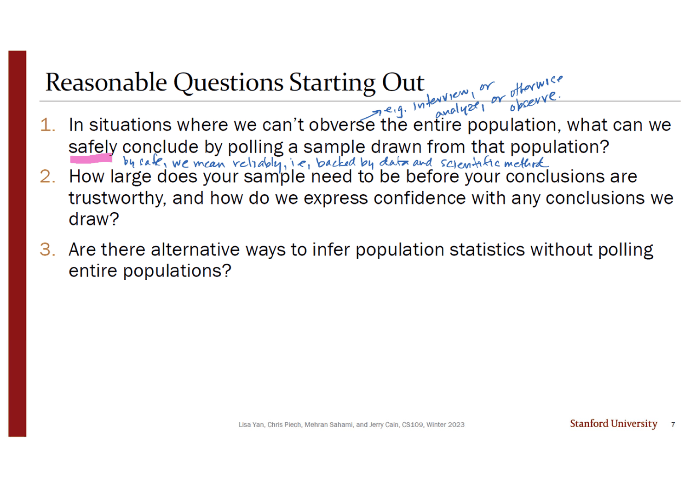
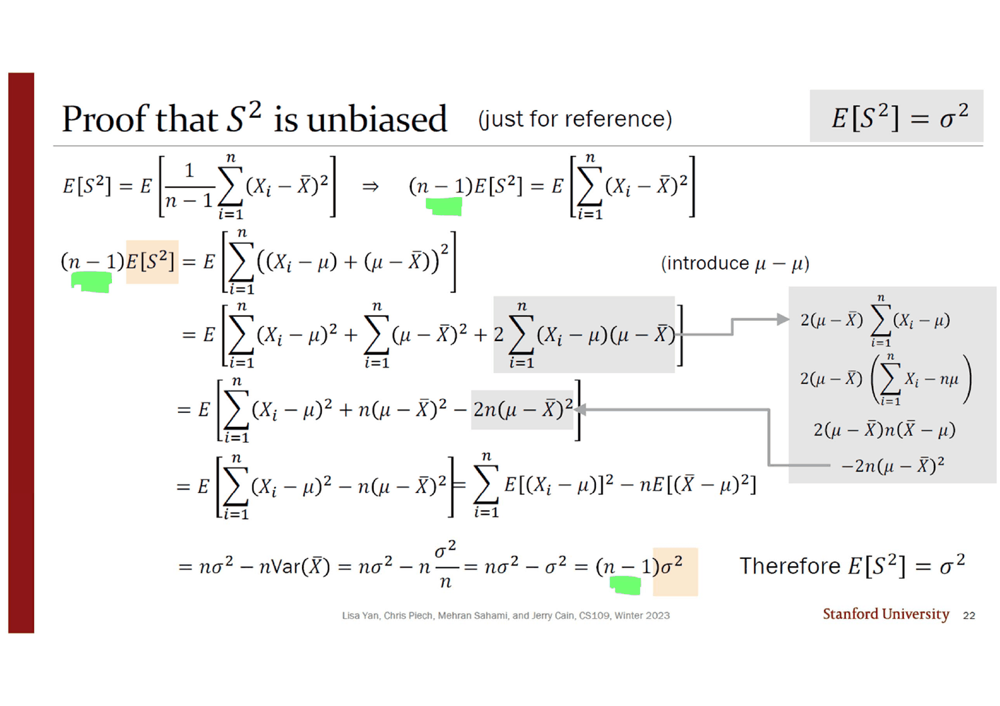
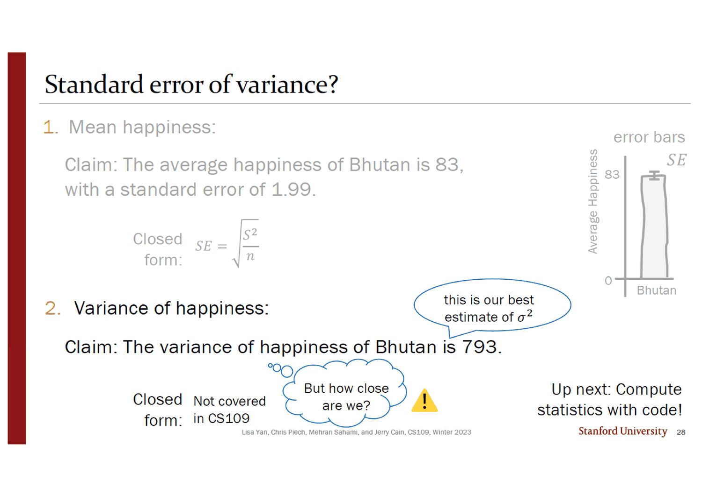
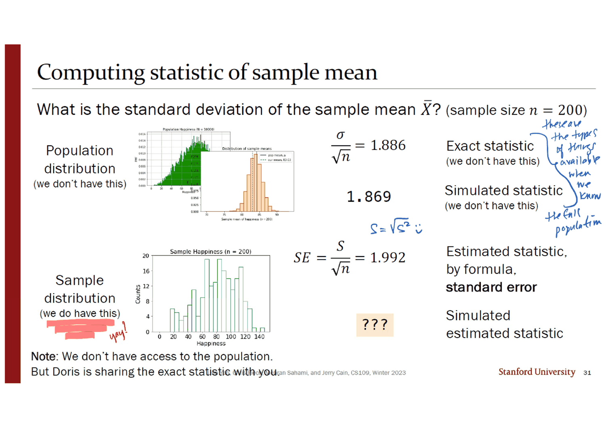
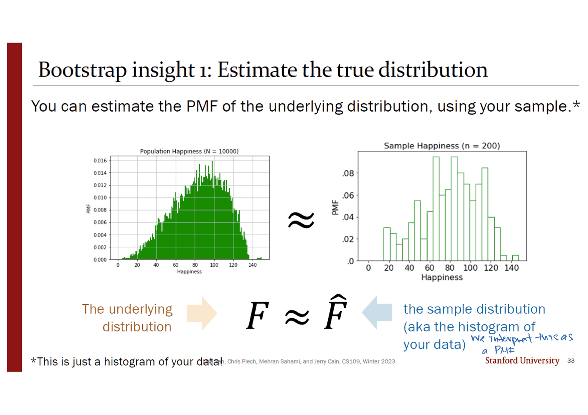
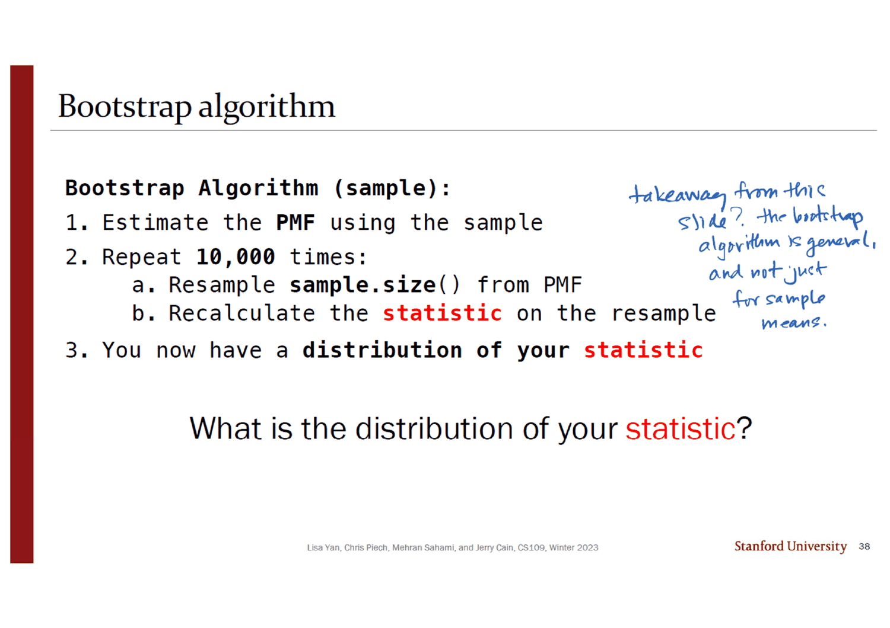
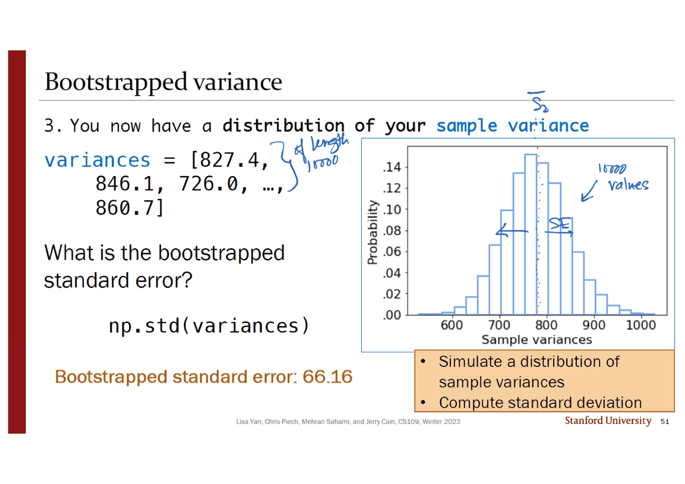
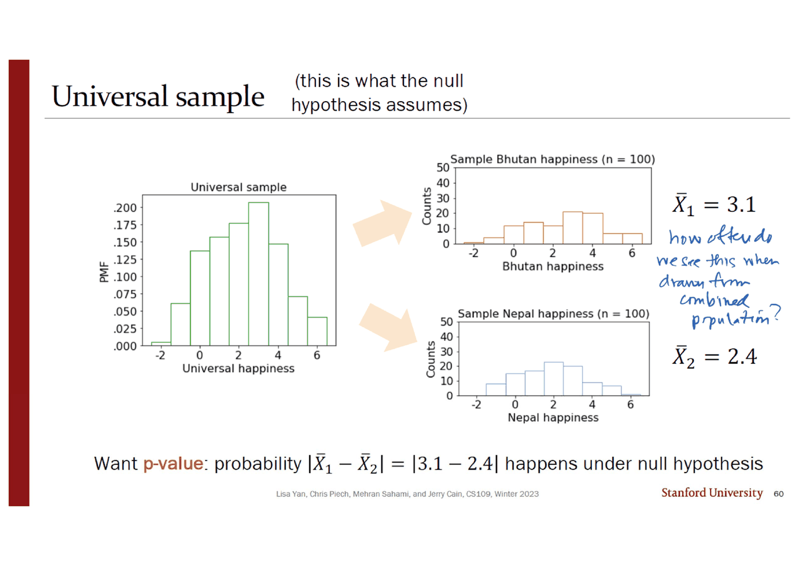

> [!abstract] 이 덱이 갈라지는 한 줄
> 27번 슬라이드가 부탄의 평균 행복도를 **83, 표준오차 1.99** 로 보고한다. 공식이 있다 — $SE = \sqrt{S^2/n}$. 28번이 같은 형식으로 분산을 보고한다. *"부탄 행복도의 분산은 793이다."* 그리고 `Closed form:` 칸에 이렇게 인쇄되어 있다.
>
> > **Not covered in CS109**
>
> 옆에 생각 구름과 노란 경고 표시 — *"But how close are we?"* **이 공백이 이 덱의 나머지 42장을 만든다.**
>
> 부트스트랩은 그 공백을 메우러 오는데, 곧장 들어가지 않는다. **먼저 답을 이미 아는 문제를 다시 푼다.** 31·36번이 평균의 표준편차를 네 가지로 계산해 나란히 놓는다 — 모집단을 알 때의 정확값 1.886, 모집단에서 모의실험한 1.869, 공식이 주는 1.992, 그리고 부트스트랩이 주는 **2.003**. 앞의 둘은 *"we don't have this"* 가 붙어 있고, 뒤의 둘만 실제로 손에 넣을 수 있다. **공식과 부트스트랩이 0.011 차이로 만나는 것**을 확인한 다음에야, 51번이 공식이 없는 자리로 들어가 **66.16** 을 내놓는다.
>
> 그러니 이 덱의 순서는 우연이 아니다. **검산 가능한 자리에서 신뢰를 벌고, 검산 불가능한 자리로 가져간다.**

---

## 세 번 도는 같은 고리

표지 목차 여섯 줄(`2 Sampling Definitions`, `11 Unbiased Estimators`, `23 Standard Error`, `29 Bootstrap: Sample Mean`, `40 Bootstrap: Sample Variance`, `57 Bootstrap: p-values`)이 모두 실제 절 표지와 맞는다. 뒤의 세 절은 **같은 알고리즘을 단어 하나씩 바꿔 가며 세 번 돈다.**

```mermaid
flowchart TB
    A["모집단은 볼 수 없다<br/>슬라이드 3~10"]
    A --> B["표본으로 추정한다<br/>X̄ · S² · 불편성 · 11~22번"]
    B --> C{"추정이 얼마나 가까운가?"}

    C -->|"평균 — 공식이 있다"| D["SE = √(S²/n) = 1.99<br/>23~27번"]
    C -->|"분산 — 공식이 없다"| E["Closed form:<br/><b>Not covered in CS109</b><br/>28번"]

    D --> F["부트스트랩으로 같은 것을<br/>다시 구한다 → 2.003<br/>29~39번 · <b>검산</b>"]
    F --> G["같은 고리, 단어 하나만 바꿔<br/>→ 66.16<br/>40~56번 · <b>공백을 메운다</b>"]
    E --> G
    G --> H["또 한 번, 단어 하나만 바꿔<br/>→ p-value<br/>57~70번"]

    I["단 하나의 통찰<br/>F ≈ F̂<br/>표본의 히스토그램을 PMF로 쓴다<br/>33번"]
    I -.-> F
    I -.-> G
    I -.-> H

    style E fill:transparent,stroke:var(--chart-1),stroke-width:2px
    style I fill:transparent,stroke:var(--chart-2),stroke-width:2px
    style G fill:transparent,stroke:var(--chart-2),stroke-width:2px
```

---

## 모집단과 표본 — 그리고 인쇄된 오타 하나

2번 절 표지에 한국어 주석 네 개가 붙어 있다 — `모집단` · `샘플링` · `모수` · `통계치`. 15번 덱부터 계속 나타난 그 손이다.

3번이 예를 세운다. 부탄 국민 10,000명 전체의 행복도 히스토그램이 있고, *"이 수들의 평균은 **83**"* 이다. 그리고 6번이 조건을 바꾼다 — *"하지만 여러분은 10,000명 전부를 조사할 시간이 없다."* 200명만 뽑는다.



7번이 용어 넷을 정의한다.

| 용어 | 정의 | 기호 |
| --- | --- | --- |
| 모집단(population) | 관심 있는 대상 전체 | $N$ |
| 모수(parameter) | 모집단을 요약하는 수 | $\mu$, $\sigma^2$ |
| 표본(sample) | 모집단에서 뽑은 부분집합 | $n$ |
| 통계량(statistic) | 표본을 요약하는 수 | $\bar X$, $S^2$ |

> [!warning] 원본 오타 — 7번 슬라이드의 `obverse`
> 슬라이드 본문에 *"In situations where we can't **obverse** the entire population…"* 이라 인쇄되어 있다. **`observe` 의 철자가 틀렸다**(o-b-v-e-r-s-e). 잉크가 그 줄 옆에 보충을 적으면서 정확한 철자를 쓴다 — *"e.g., interview, analyze, or otherwise **observe**."* 고쳐 적었다는 표시는 없다

8·9번이 통계량이 확률변수임을 못 박는다. **$\bar X$ 는 뽑기 전에는 값이 정해지지 않았다.** 그래서 슬라이드는 표본평균과 표본분산을 이렇게 쓴다.

$$\bar X = \frac1n\sum_{i=1}^{n}X_i, \qquad S^2 = \frac{1}{n-1}\sum_{i=1}^{n}(X_i - \bar X)^2$$

그리고 대문자·소문자 규약을 붙인다 — $X_i$ 는 확률변수, $x_i$ 는 관측된 값. 10번의 주황 상자가 결론이다 — *"Statistics are random variables that are functions of your sample."*

---

## 불편성 — 그리고 $n-1$

11번 절 표지 뒤에 **번호도 저작권 줄도 없는 삽입 슬라이드**가 한 장 들어간다. 한국어로 편향과 불편추정량을 설명하고 `bskyvision.com` 링크를 단 장이다. 15·16·17번 덱에서 본 것과 같은 방식이다.

12번이 정의한다 — 추정량 $\hat\theta$ 가 **불편(unbiased)** 이라는 것은 $E[\hat\theta] = \theta$ 라는 뜻이다. 잉크가 오른쪽에 편향의 정의를 적어 넣었다 — $\text{bias} = E[\hat\theta] - \theta$.

13번이 $\bar X$ 를 검사한다. 기댓값의 선형성 한 줄로 끝난다.

$$E[\bar X] = E\!\left[\frac1n\sum X_i\right] = \frac1n\sum E[X_i] = \frac1n \cdot n\mu = \mu$$

14번이 한 걸음 더 간다 — **$\bar X$ 는 정규분포를 따른다**(중심극한정리, 한국어 주석 「중심극한정리」가 붙어 있다).

$$\bar X \sim \mathcal N\!\left(\mu,\ \frac{\sigma^2}{n}\right)$$

16번이 $\text{Var}(\bar X) = \sigma^2/n$ 을 세 줄로 증명하는데, **12번 덱과 13번 덱의 결과가 둘 다 쓰인다.**

$$\text{Var}(\bar X) = \text{Var}\!\left(\frac1n\sum X_i\right) \overset{\text{선형변환}}{=} \frac{1}{n^2}\text{Var}\!\left(\sum X_i\right) \overset{\text{독립}}{=} \frac{1}{n^2}\sum\text{Var}(X_i) = \frac{n\sigma^2}{n^2} = \frac{\sigma^2}{n}$$

**$\frac1{n^2}$ 이 나오는 자리가 13번 덱 23번 성질 4의 대조 그대로**다 — 분산은 $a^2$ 배, 공분산은 $ab$ 배.



17~22번이 이 덱에서 가장 긴 증명이다. $S^2$ 의 분모가 왜 $n$ 이 아니라 $n-1$ 인가.

17번이 먼저 **$n$ 으로 나눈 것**을 계산한다.

$$E\!\left[\frac1n\sum_{i=1}^{n}(X_i - \bar X)^2\right] = \frac{n-1}{n}\sigma^2 \;\ne\; \sigma^2$$

잉크가 결론에 빨간 밑줄을 긋고 적었다 — *"biased!"* **$\frac{n-1}{n} < 1$ 이므로 항상 과소평가한다.** 그래서 $\frac{n}{n-1}$ 을 곱해 되돌리면 $S^2$ 가 된다.

22번의 증명이 쓰는 기교는 하나뿐이다 — $(X_i - \bar X)$ 를 $(X_i - \mu) - (\bar X - \mu)$ 로 쪼개 $\mu$ 를 끼워 넣는 것.

$$\sum(X_i-\bar X)^2 = \sum(X_i-\mu)^2 - n(\bar X - \mu)^2$$

기댓값을 씌우면 앞은 $n\sigma^2$, 뒤는 $n\cdot\text{Var}(\bar X) = \sigma^2$ 이므로 $(n-1)\sigma^2$ 가 남는다.

아래에서 아주 작은 모집단을 놓고 **모든 표본을 하나도 빠짐없이 열거해** 이 사실을 확인할 수 있다. 유리수로 정확히 계산한 값이다.

```html preview
<div id="nb19" style="font-family:system-ui,-apple-system,sans-serif;color:var(--foreground);background:var(--card);border:1px solid var(--border);border-radius:12px;padding:18px 16px;">
  <p style="margin:0 0 12px;font-size:13px;color:var(--muted-foreground);">
    모집단 {1, 2, 3, 6} — μ = 3, σ² = 7/2 = 3.5. 크기 n 의 표본을 <b>복원추출로 전부 열거</b>해 두 추정량의 기댓값을 정확히 구한다.</p>
  <div style="display:flex;flex-wrap:wrap;gap:12px;align-items:center;margin-bottom:16px;">
    <label style="font-size:13px;font-weight:600;">표본 크기 n</label>
    <input id="n19" type="range" min="2" max="6" value="2" step="1" style="flex:1;min-width:150px;accent-color:var(--chart-1);">
    <output id="nv19" style="font-variant-numeric:tabular-nums;font-weight:700;font-size:15px;min-width:1.4em;">2</output>
  </div>
  <svg id="s19" viewBox="0 0 620 140" style="width:100%;height:auto;display:block;"></svg>
  <div id="o19" style="margin-top:12px;font-size:13.5px;line-height:2;font-variant-numeric:tabular-nums;"></div>
</div>
<script>
(function(){
  const POP=[1,2,3,6], MU=3, SIG2=3.5;
  const NS='http://www.w3.org/2000/svg', svg=document.getElementById('s19');
  function el(t,a,x){const e=document.createElementNS(NS,t);for(const k in a)e.setAttribute(k,a[k]);
    if(x!==undefined)e.textContent=x; return e;}
  function enumerate(n){
    let sumN=0,sumN1=0,cnt=0;
    const rec=(d,acc)=>{
      if(d===n){ const xb=acc.reduce((a,b)=>a+b,0)/n;
        const ss=acc.reduce((a,x)=>a+(x-xb)*(x-xb),0);
        sumN+=ss/n; sumN1+=ss/(n-1); cnt++; return; }
      for(const v of POP){ acc.push(v); rec(d+1,acc); acc.pop(); }
    };
    rec(0,[]);
    return {En:sumN/cnt, En1:sumN1/cnt, cnt};
  }
  function draw(n,r){
    svg.textContent='';
    const L=150,R=560,B=104,H=30, MAX=4.2;
    const w=v=>(v/MAX)*(R-L);
    svg.appendChild(el('line',{x1:L,y1:B+14,x2:L+w(SIG2),y2:B+14,stroke:'var(--chart-2)','stroke-width':2,'stroke-dasharray':'4 4'}));
    svg.appendChild(el('line',{x1:L+w(SIG2),y1:18,x2:L+w(SIG2),y2:B+22,stroke:'var(--chart-2)','stroke-width':1.5,'stroke-dasharray':'3 3'}));
    svg.appendChild(el('text',{x:L+w(SIG2)+6,y:16,'font-size':11,fill:'var(--chart-2)','font-weight':700},'σ² = 3.5'));
    const rows=[['÷ n  (편향)',r.En,'var(--chart-1)'],['÷ (n−1)  = S²',r.En1,'var(--chart-2)']];
    rows.forEach(([lab,v,col],i)=>{
      const y=30+i*44;
      svg.appendChild(el('text',{x:L-10,y:y+H/2+4,'text-anchor':'end','font-size':12.5,fill:'var(--foreground)'},lab));
      svg.appendChild(el('rect',{x:L,y:y,width:Math.max(w(v),1),height:H,rx:4,fill:col,opacity:0.8}));
      svg.appendChild(el('text',{x:L+w(v)+8,y:y+H/2+4,'font-size':12,fill:col,'font-weight':700},v.toFixed(5)));
    });
  }
  function upd(){
    const n=+document.getElementById('n19').value;
    document.getElementById('nv19').textContent=n;
    const r=enumerate(n); draw(n,r);
    const ratio=r.En/SIG2;
    document.getElementById('o19').innerHTML=
      '열거한 표본 <b>'+r.cnt.toLocaleString()+'</b>개 (= 4<sup>'+n+'</sup>)<br>'+
      'E[ Σ(Xᵢ−X̄)²/n ] = <b style="color:var(--chart-1)">'+r.En.toFixed(6)+'</b> = <b>'+(n-1)+'/'+n+'</b> × σ² &nbsp;'+
      '<span style="color:var(--muted-foreground)">(비 = '+ratio.toFixed(6)+', 정확히 (n−1)/n = '+((n-1)/n).toFixed(6)+')</span><br>'+
      'E[ Σ(Xᵢ−X̄)²/(n−1) ] = <b style="color:var(--chart-2)">'+r.En1.toFixed(6)+'</b> = σ² &nbsp;<b>✓ 불편</b>'+
      '<p style="margin:9px 0 0;font-size:12.5px;color:var(--muted-foreground);line-height:1.7">'+
      (n===2? '<b>n = 2 에서 편향이 가장 크다</b> — 절반으로 과소평가한다. 표본이 둘뿐이면 X̄ 가 그 둘의 한가운데에 놓이므로 퍼짐이 구조적으로 작게 잡힌다.'
            : '표본이 커질수록 (n−1)/n 이 1에 다가가 편향이 줄지만, <b>어떤 n 에서도 0이 되지는 않는다.</b> 17번 슬라이드 여백의 잉크가 적은 「biased!」 가 이것이다.')+'</p>';
  }
  document.getElementById('n19').addEventListener('input',upd); upd();
})();
</script>

> [!note] 26번 슬라이드가 조용히 인정하는 것 (원본에 있으나 지나치기 쉽다)
> $S^2$ 는 $\sigma^2$ 의 불편추정량이고, $S^2/n$ 도 $\sigma^2/n = \text{Var}(\bar X)$ 의 불편추정량이다. 그런데 $SE = \sqrt{S^2/n}$ 은 $\text{SD}(\bar X)$ 의 **불편추정량이 아니다.** 제곱근이 오목함수라 젠센 부등식에 걸린다. 잉크가 그것을 두 번 적었다 — 왼쪽에 *"(somewhat biased, but best we can do)"*, 오른쪽에 $E[SE] < \text{SD}(\bar X)$ 와 *"less than because of the bias"*.
>
> **인쇄된 슬라이드는 이 사실을 말하지 않는다.** *"More info on bias of standard error: wikipedia"* 라는 링크 한 줄이 전부다.

---

## 공식이 끝나는 자리

23번 절 표지 뒤로 표준오차가 정의된다 — *"평균의 **표준오차**는 $\bar X$ 의 표준편차의 **추정치**다."* 잉크가 그 위에 왜 $\sigma$ 를 못 쓰는지를 적었다 — *"but remember! we don't know $\sigma^2$, that's a population-level statistic."*

$$SE = \sqrt{\frac{S^2}{n}} = \sqrt{\frac{793}{200}} = 1.9912\ldots \approx \mathbf{1.99}$$

27번이 그것을 보고 형식으로 만든다 — *"부탄의 평균 행복도는 **83**, 표준오차 **1.99**."* 오른쪽에 오차막대 그림이 붙고, 주황 상자가 정리한다 — *"These 2 statistics give a sense of how $\bar X$ … behaves."* 슬라이드 왼쪽 아래에 한국어 주석 「앞에 예시」와 함께 $\bar X = 83$, $S^2 = 793$, $n = 200$ 이 적혀 있다.



그리고 28번이 같은 형식을 분산에 적용하려다 멈춘다.

> **2. 분산:** 부탄 행복도의 분산은 **793**이다.
> `Closed form:` **Not covered in CS109**
> 💭 *But how close are we?* ⚠
> *Up next: Compute statistics with code!*

**공식이 있는 줄과 없는 줄이 같은 슬라이드에 나란히 있다.** 위 절반은 회색으로 바래 있고(이미 끝난 일), 아래 절반만 검다.

---

## 부트스트랩 — 표본을 모집단처럼 쓴다

29번 절 표지 뒤에 30번(한국어 설명 + towardsdatascience 링크)이 오고, 그 뒤로 **번호 없는 삽입 슬라이드가 세 장 연속** 들어간다 — 티스토리 블로그의 부트스트랩 알고리즘 도해, 캐글 토론의 표집분포 vs 부트스트랩 분포 그림, 그리고 같은 블로그의 파이썬 코드(`random.gauss(2,1)` 로 만든 100개에서 68% 구간 [1.756, 2.011]을 얻는 예). 이 덱은 이번 회차에서 읽은 덱 중 **삽입 슬라이드가 가장 많다**(모두 다섯 장).



31번이 이 덱의 설계도다. $\bar X$ 의 표준편차를 얻는 길이 네 개이고, **어느 것을 쓸 수 있는지가 표시되어 있다.**

| 값 | 이름 | 쓸 수 있나 |
| --- | --- | --- |
| $\sigma/\sqrt n = 1.886$ | 정확한 통계량 | ❌ *we don't have this* |
| $1.869$ | 모의실험한 통계량 (모집단에서 표본을 반복 추출) | ❌ *we don't have this* |
| $SE = S/\sqrt n = 1.992$ | **공식이 주는 추정치** | ✅ |
| **???** | 모의실험으로 얻은 추정치 | ← 이 덱이 채울 자리 |

잉크가 위의 둘을 중괄호로 묶고 적었다 — *"these are the types of things available when we know the full population."* 그리고 「표본 분포(we do have this)」에는 빨간 밑줄 세 겹과 함께 `yay!` 라고 적었다. 슬라이드 아래의 한 줄이 상황을 설명한다 — *"Note: We don't have access to the population. But Doris is sharing the exact statistic with you."*



33번이 부트스트랩의 **통찰 1**을 준다. 그리고 이것이 전부다.

$$F \approx \hat F$$

왼쪽은 모집단 10,000명의 히스토그램, 오른쪽은 표본 200명의 히스토그램. 슬라이드 아래 각주 — *"\*This is just a histogram of your data!"* 잉크가 덧붙인다 — *"we interpret this as a PMF."*

**「표본의 히스토그램을 확률분포로 취급한다」** 이 한 줄에서 나머지가 전부 따라 나온다. 34번의 **통찰 2**는 그 결과일 뿐이다 — 모집단에서 표본을 반복 추출해 $\bar X$ 의 분포를 만드는 절차를, **표본에서 재표집해** 흉내 낸다. 잉크가 두 화살표에 각각 *"this estimates this"*, *"this imitates this"* 를 적고, 위쪽 회색 화살표에는 *"we are about to lose this?!!"* 라고 적었다.

35·36번이 결과를 낸다 — `np.std(means)` = **2.003**. 31번의 `???` 자리에 들어가고, 잉크가 오렌지색 체크를 그렸다.

> [!tip] 이 대조가 이 덱의 논증 전부다 (원본에 없는 계산)
> 네 값을 1.886(정확값)과 비교하면 이렇다.
>
> | | 값 | 정확값 대비 |
> | --- | --- | --- |
> | $\sigma/\sqrt n$ | 1.886 | — |
> | 모집단 모의실험 | 1.869 | $-0.90\%$ |
> | 공식 $SE$ | 1.992 | $+5.62\%$ |
> | **부트스트랩** | **2.003** | $+6.20\%$ |
>
> **공식과 부트스트랩의 차이(0.58%p)가 둘과 정확값의 차이(약 6%)보다 훨씬 작다.** 즉 두 방법은 서로를 거의 정확히 재현하고, 둘 다 같은 방향으로 어긋난다 — 이 표본의 $S^2 = 793$ 이 $\sigma^2 \approx 711$ 보다 크기 때문이다. **부트스트랩의 오차는 재표집에서 오는 것이 아니라 표본 자체에서 온다.** 원본은 네 값을 나란히 놓기만 하고 이 해석을 하지 않는다.

```html preview
<div id="fv19" style="font-family:system-ui,-apple-system,sans-serif;color:var(--foreground);background:var(--card);border:1px solid var(--border);border-radius:12px;padding:18px 16px;">
  <p style="margin:0 0 14px;font-size:13px;color:var(--muted-foreground);">
    31·36번 슬라이드의 네 값. 막대를 눌러 보면 그 값을 얻으려면 무엇이 필요한지 나온다.</p>
  <svg id="fs19" viewBox="0 0 620 190" style="width:100%;height:auto;display:block;cursor:pointer;"></svg>
  <p id="fo19" style="margin:14px 0 0;font-size:13px;line-height:1.8;min-height:4.6em;"></p>
</div>
<script>
(function(){
  const D=[
    {v:1.886, lab:'σ/√n',       name:'정확한 통계량', have:false,
     msg:'<b>모집단 10,000명 전부</b>의 σ 를 알아야 한다. 31번 슬라이드가 <i>“we don’t have this”</i> 라고 적은 값이다. 이 덱에서는 도리스가 답만 알려 준 상태다.'},
    {v:1.869, lab:'모의실험',     name:'모의실험한 통계량', have:false,
     msg:'<b>모집단에서 200명을 반복해 다시 뽑을 수 있어야</b> 한다. 역시 불가능하다 — 애초에 200명만 조사할 시간밖에 없어서 표본을 뽑은 것이다.'},
    {v:1.992, lab:'SE = S/√n',   name:'공식이 주는 추정치', have:true,
     msg:'<b>표본 하나면 된다.</b> S² = 793, n = 200 에서 √(793/200) = 1.99123. 다만 이 공식은 <b>평균에만</b> 있다 — 28번 슬라이드가 분산에 대해 “Not covered in CS109” 라고 적은 이유다.'},
    {v:2.003, lab:'부트스트랩',    name:'모의실험으로 얻은 추정치', have:true,
     msg:'<b>표본 하나면 되고, 통계량이 무엇이든 된다.</b> 같은 표본에서 200개를 복원추출해 평균을 구하기를 10,000번 반복한 뒤 그 표준편차를 잰다. 공식값 1.992와 <b>0.011 차이</b>로 만난다.'}
  ];
  const NS='http://www.w3.org/2000/svg', svg=document.getElementById('fs19');
  function el(t,a,x){const e=document.createElementNS(NS,t);for(const k in a)e.setAttribute(k,a[k]);
    if(x!==undefined)e.textContent=x; return e;}
  let sel=3;
  function draw(){
    svg.textContent='';
    const L=96,B=140,TOP=22, W=(600-L)/4;
    const sy=v=>B-((v-1.80)/0.26)*(B-TOP);
    svg.appendChild(el('line',{x1:L-8,y1:B,x2:604,y2:B,stroke:'var(--border)'}));
    svg.appendChild(el('line',{x1:L-8,y1:sy(1.886),x2:604,y2:sy(1.886),
      stroke:'var(--chart-2)','stroke-width':1.4,'stroke-dasharray':'5 4',opacity:0.8}));
    svg.appendChild(el('text',{x:L-14,y:sy(1.886)+4,'text-anchor':'end','font-size':10.5,
      fill:'var(--chart-2)','font-weight':700},'정확값'));
    D.forEach((d,i)=>{
      const x=L+i*W+W*0.18, bw=W*0.64, on=(i===sel);
      const g=el('g',{});
      g.appendChild(el('rect',{x:x,y:sy(d.v),width:bw,height:B-sy(d.v),rx:4,
        fill:d.have?'var(--chart-1)':'var(--muted-foreground)',opacity:on?0.9:(d.have?0.5:0.25)}));
      g.appendChild(el('text',{x:x+bw/2,y:sy(d.v)-8,'text-anchor':'middle','font-size':12.5,
        fill:on?'var(--chart-1)':'var(--muted-foreground)','font-weight':on?700:600}, d.v.toFixed(3)));
      g.appendChild(el('text',{x:x+bw/2,y:B+17,'text-anchor':'middle','font-size':11.5,
        fill:'var(--foreground)'}, d.lab));
      g.appendChild(el('text',{x:x+bw/2,y:B+33,'text-anchor':'middle','font-size':10.5,
        fill:d.have?'var(--chart-1)':'var(--muted-foreground)'}, d.have?'✓ 손에 넣을 수 있다':'✗ 없다'));
      g.appendChild(el('rect',{x:x-4,y:TOP-8,width:bw+8,height:B-TOP+8,fill:'transparent'}));
      g.addEventListener('click',()=>{sel=i;draw();});
      svg.appendChild(g);
    });
    const d=D[sel];
    document.getElementById('fo19').innerHTML='<b>'+d.name+' — '+d.v.toFixed(3)+'</b> '+
      '<span style="color:var(--muted-foreground)">(정확값 1.886 대비 '+
      ((d.v-1.886)>=0?'+':'')+(100*(d.v-1.886)/1.886).toFixed(2)+'%)</span><br>'+d.msg;
  }
  draw();
})();
</script>
```



37번이 알고리즘을 적는다.

```text
Bootstrap Algorithm (sample):
1. Estimate the PMF using the sample
2. Repeat 10,000 times:
     a. Resample sample.size() from PMF
     b. Recalculate the sample mean on the resample
3. You now have a distribution of your sample mean
```

잉크가 2a 옆에 왜 복원추출인지를 적었다 — *"we sample with replacement, because the sample operates as a PMF. (also, you'd just regenerate the sample every time)"* **비복원이면 매번 원래 표본이 그대로 나온다.** 이 한 줄이 「with replacement」의 이유 전부다.

그리고 38번이 같은 슬라이드에서 **`sample mean` 을 `statistic` 으로 바꾼다.** 그게 전부다. 잉크가 요약한다.

> *takeaway from this slide? the bootstrap algorithm is general, and not just for sample means.*

---

## 공백을 메운다

40번 절 표지 뒤로 41~51번이 같은 고리를 한 번 더 돌린다. 이번에는 `statistic` 자리에 **`sample variance`** 가 들어간다. 42~50번이 1 → 2a → 2b → 3 단계를 하나씩 강조하며 걸어가는데, 그 사이에 잉크가 두 가지를 짚는다.

- 45번: *"formula for $S^2$ is still $\frac{1}{n-1}\sum_{k=1}^{n}(X_i - \bar X)^2$"* — **재표집한 자료에도 같은 $n-1$ 을 쓴다**
- 44번: *"Why are these samples different?"* 에 대한 답이 주황 상자에 있다 — *"This resampled sample is generated **with replacement**."*

`variances` 리스트가 `[827.4]` → `[827.4, 846.1]` → `[827.4, 846.1, 726.0, …, 860.7]` 로 한 항씩 자란다.



51번이 답을 낸다 — `np.std(variances)` = **66.16**. 잉크가 히스토그램에 $\bar S_2$ 와 `SE` 의 폭을 그려 넣고 *"10000 values"* 라 적었다. 그리고 52번이 28번으로 돌아가 빈칸을 채운다.

> **2. 분산:** 부탄 행복도의 분산은 793이고, **부트스트랩 표준오차는 66.16**이다.

잉크가 말풍선에 한 단어를 덧붙였다 — *"this is how close we are, calculated by bootstrapping **and confident**."*

53·54번이 두 단계를 실제 코드로 내린다. 1단계 「PMF를 추정한다」의 실체는 나눗셈 한 줄이고,

$$P(X = k) = \frac{\text{표본에서 } k \text{ 와 같은 값의 개수}}{n}$$

2a단계 「PMF에서 재표집한다」의 실체는 넘파이 한 줄이다.

```python
def resample(sample, n):
    # estimate the PMF using the sample
    # draw n new samples from the PMF
    return np.random.choice(sample, n, replace=True)
```

**두 줄이 같은 일이다.** 표본에서 균등하게 하나 뽑는 것이 곧 그 히스토그램을 PMF로 삼아 뽑는 것이고, `np.random.choice` 의 `replace=True` 가 그것을 공짜로 해 준다. 슬라이드 오른쪽 위에 넘파이 문서가 그대로 붙어 있고 잉크가 초록 체크를 쳤다.

55번이 적용 범위에 단서를 단다.

> **Bootstrapping works for any statistic\***
> \*as long as your sample is iid and the underlying distribution **does not have a long tail**

잉크가 밑줄 친 부분에 중괄호를 치고 번역했다 — ***"fancy way of saying that variance is finite."*** **분산이 무한한 분포에서는 부트스트랩이 무너진다**는 것이 이 각주의 내용이고, 인쇄물은 「긴 꼬리」라는 비유로만 말한다.

56번이 발명자를 소개한다 — 브래들리 에프런, 1979년, 스탠퍼드 재직 중, 국가과학훈장. 그리고 에프런의 주사위 넷 — $P(A>B) = P(B>C) = P(C>D) = P(D>A) = \tfrac23$ 으로 **순환하는 비이행적 주사위**. (이 덱에서 부트스트랩과 아무 관계가 없는 유일한 줄이다.)

---

## 세 번째 고리 — p-값



57번 절 표지 뒤에 또 하나의 삽입 슬라이드(한국어 p-값 설명과 t-검정 공식, `kongdols-room.tistory.com` 링크)가 들어간다. 그리고 58번이 문제를 세운다 — 네팔과 부탄에서 각각 100명씩 뽑았고 평균이 3.1과 2.4다. *"두 나라 평균 행복도의 차이는 0.7이고, **이것은 통계적으로 유의하다.**"*

59번이 귀무가설과 p-값을 정의한다.

> **귀무가설**: 아무 패턴이 없더라도(즉 두 표본이 **같은 분포**에서 왔더라도) 당신의 주장이 우연히 나왔을 수 있다.
> **p-값**: 관측된 차이가 귀무가설 아래에서 일어날 확률.

잉크가 정의를 다시 썼다 — *"that is, what are the chances you observed a significant difference by chance?"* 그리고 동전 예에 두 개의 중괄호를 달았다 — 「같은 동전을 쓴다」가 귀무가설, 「같은 동전인데도 그만한 차이를 볼 가능성」이 p-값.

60번이 **보편표본(universal sample)** 을 꺼낸다. 두 표본을 합친 하나의 히스토그램이고, *"(this is what the null hypothesis assumes)"* 라는 부제가 붙어 있다. 잉크의 질문이 절차 전체를 요약한다.

> *how often do we see this when drawn from combined population?*

61번이 그 조립을 그림으로 보인다(부탄 히스토그램 **+** 네팔 히스토그램 **=** 보편표본 → **≈** 그 PMF). 잉크가 위에 적었다 — *"if two statistics are different by chance, then combining population shouldn't matter, right?"* 주황 화살표의 인쇄 문구는 더 짧다 — *"i.e., recreate the null hypothesis."*

62번이 고리를 세 번째로 돌린다. 바뀐 단어는 둘이다.

```text
1. Create a universal sample using your two samples
2. Repeat 10,000 times:
     a. Resample both samples
     b. Recalculate the mean difference between the resamples
3. p-value = # (mean diffs >= observed diff) / n
```

63~68번이 이것을 의사코드로 펼치는데, 잉크가 한 곳에 길게 적는다. `bhutan_resample` 은 $N$ 개, `nepal_resample` 은 $M$ 개 — **원래 표본과 같은 크기로 뽑아야 한다**는 것이다.

> *imperative you go with the sizes that are the same as those when derived separately! otherwise you're using different random variables.*

**두 재표집을 같은 보편표본에서 뽑되 크기만 원래대로 유지한다** — 이것이 「같은 분포에서 왔다면」이라는 가정을 코드로 옮긴 형태다.

70번이 58번으로 돌아가 결론에 괄호 하나를 더한다 — *"…and this is statistically significant **(p < 0.05)**."*

---

## 원본 오류·불일치

`철자·기호`

- **7번 슬라이드 `obverse`** — *"we can't **obverse** the entire population"*. `observe` 의 철자 오류다. 같은 슬라이드 여백의 잉크는 정확히 `observe` 로 적었다
- **62번 ↔ 67번의 부등호가 다르다** — 62번은 p-값을 `# (mean diffs **>=** observed diff) / n` 로, 67번 오른쪽 위 상자는 `# (mean diffs **>** observed diff) / n` 로 인쇄한다. **의사코드 본문은 `if diff >= observed_diff` 이므로 62번이 맞다.** 67번만 등호가 빠졌다

`값의 불일치`

- **58 · 70번 ↔ 60번 — 어느 나라가 3.1인가** — 58번과 70번은 $\bar X_1 = 3.1$ 을 **네팔** 아래, $\bar X_2 = 2.4$ 를 **부탄** 아래에 놓는다. 그런데 60번은 $\bar X_1 = 3.1$ 을 **부탄** 히스토그램 옆에, $\bar X_2 = 2.4$ 를 **네팔** 옆에 놓는다. **두 배정이 정반대이고, 같은 덱 안에서 한 나라의 평균이 두 값을 갖는다.**
  어느 쪽이 맞는지는 **같은 슬라이드 안에서도 증거가 갈린다.**
  - **히스토그램은 60번을 지지한다.** 58번에 인쇄된 막대 높이를 그대로 읽어 구간 중앙값으로 가중평균하면 네팔 ≈ **2.42**, 부탄 ≈ **3.07** 이다. 네팔(파랑)은 2~4에 몰려 있고 5 이상이 거의 없는 반면, 부탄(주황)은 3~5에 최빈이 있고 5~7 구간에도 14명이 있다
  - **표는 58번을 지지한다.** 58번 왼쪽 표의 네팔 값 다섯(4.45 · 2.45 · 6.37 · 2.07 · 1.63)이 부탄 값 다섯(0.91 · 0.34 · 1.91 · 1.61 · 1.08)보다 일관되게 크다. 다만 **각각 100개 중 다섯 개**라 히스토그램만큼의 근거는 아니다
  
  어느 배정이 원래 의도였든, **표 · 히스토그램 · 평균 세 가지가 한 슬라이드 안에서 서로 맞지 않는다는 사실은 남는다.** 그리고 계산 자체는 영향을 받지 않는다 — 63번 이후의 코드가 쓰는 것은 $\lvert \mu_1 - \mu_2\rvert$ 라는 **절댓값**이므로 어느 쪽이 큰지는 p-값을 바꾸지 않는다
- **3번 ↔ 25번** — 3번은 모집단 평균을 *"The mean of all these numbers is **83**"* 이라 하고, 25·31번 그래프의 범례는 표본평균을 `our mean, **83.03**` 으로 쓴다. 27번의 보고는 다시 `83` 이다. 세 자리에서 같은 수가 83 / 83.03 / 83 으로 오간다

`덱 구성`

- **삽입 슬라이드가 다섯 장이다** — PDF 12 · 32 · 33 · 34 · 61쪽. 모두 번호도 저작권 줄도 없고 한국어 설명과 외부 링크(`bskyvision.com`, `hongl.tistory.com` 2회, `kaggle.com`, `kongdols-room.tistory.com`)가 붙어 있다. 32~34쪽은 **세 장 연속**이다. 이번 회차에 읽은 일곱 덱 중 삽입이 가장 많다
- **한 장이 빠졌다** — 인쇄된 마지막 번호는 70인데 번호 있는 쪽은 69장이고, **32번**이 없다. 31번(네 가지 값과 `???`)과 33번(통찰 1) 사이다. $70 - 1 + 5 = 74$ 로 전체 쪽수와 맞는다
- **연도가 섞여 있다** — **21번만** `Winter 2024` 이고 나머지 전부 `Winter 2023` 이다. 21번은 $S^2$ 의 불편성 증명이 시작되는 자리다
- **30번 슬라이드가 절 표지와 거의 같다** — 29번 절 표지가 `Bootstrap: Sample mean` 이고, 30번은 본문 대신 *"The Bootstrap: Probability for Computer Scientists"* 라는 큰 글자와 한국어 설명·링크만 있다. 원래 이 자리가 무엇이었는지는 알 수 없다

`증명·설명의 공백`

- **$SE$ 가 편향추정량이라는 사실이 인쇄되어 있지 않다** — 26번은 *"More info on bias of standard error: wikipedia"* 링크만 주고, $E[SE] < \text{SD}(\bar X)$ 와 그 이유는 잉크에만 있다
- **「긴 꼬리」의 정확한 뜻이 인쇄되어 있지 않다** — 55번의 각주가 말하는 조건은 잉크의 번역대로 **분산이 유한할 것**이다
- **28번의 「닫힌 꼴이 없다」는 정확히는 「이 과목에서 다루지 않는다」** — 표본분산의 표준오차에는 닫힌 꼴 근사가 존재한다(모집단의 4차 적률이 필요하다). 슬라이드도 *"Not covered in CS109"* 라고만 적어 그 구별을 지킨다. **부트스트랩이 이기는 것은 존재 여부가 아니라 필요한 가정의 수**인데, 그 대비는 덱 어디에도 없다

---

## 근거 자료

- **원본**: `sources/19_sampling_bootstrap.pdf` — 74쪽. 번호 있는 슬라이드 1~70(32번 결번), 번호 없는 삽입 슬라이드 5장(PDF 12·32·33·34·61쪽). 표지에 `Jerry Cain, February 26, 2024` 와 `Lecture Discussion on Ed` 링크
- **본문에 인용한 슬라이드**: 7 · 22 · 28 · 31 · 33 · 38 · 51 · 60번 (PDF 7 · 23 · 29 · 35 · 36 · 41 · 54 · 64쪽)
- **재계산한 값**: $SE = \sqrt{793/200} = 1.99123$(인쇄값 1.99 · 1.992와 일치), $\sigma/\sqrt n = 1.886$ 에서 역산한 $\sigma^2 \approx 711.4$, 네 추정치의 정확값 대비 오차(−0.90% · +5.62% · +6.20%), **모집단 $\{1,2,3,6\}$ 에서 크기 $n$ 의 표본을 전부 열거해 확인한 $E[\sum(X_i-\bar X)^2/n] = \frac{n-1}{n}\sigma^2$**(유리수 연산, $n = 2{\sim}6$), 58·70번 히스토그램의 막대 높이에서 어림한 두 나라 평균(네팔 ≈ 2.42, 부탄 ≈ 3.07)

`직전` → [[17. 상수를 미루는 기술 — 합도 곱도 아닌 것]]

10번 덱이 정규분포를 쓸 이유 넷을 대면서 **「표본평균은 정규분포를 따른다」** 를 3주 뒤로 미뤘다. 이 덱 14번이 그것을 한 줄로 갚는다 — $\bar X \sim \mathcal N(\mu, \sigma^2/n)$, 한국어 주석 「중심극한정리」와 함께. 12번 덱 11번이 *"Looks kinda Normal…??? (more on this in Week 7)"* 이라 적은 자리도 같은 줄이 덮는다. **다만 증명은 없다** — 두 덱이 미룬 것을 이 덱은 결과만 인쇄하고 지나간다.

그리고 이 덱이 새로 연 자리가 하나 있다. 31번이 *"we don't have this"* 라고 두 번 적은 그 「없는 것」을 **데이터로부터 최대한 그럴듯하게 정하는 법** — 그것이 `20_mle` 다.
