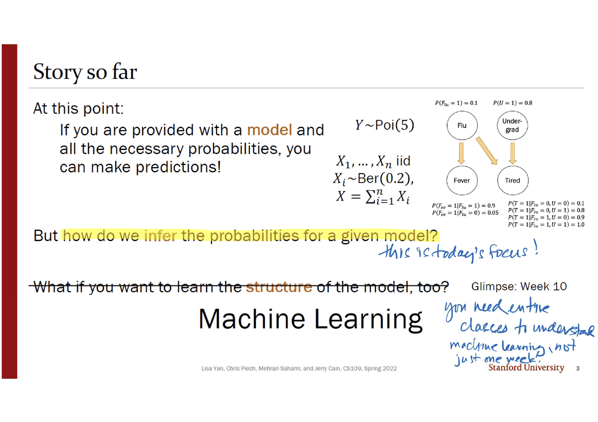
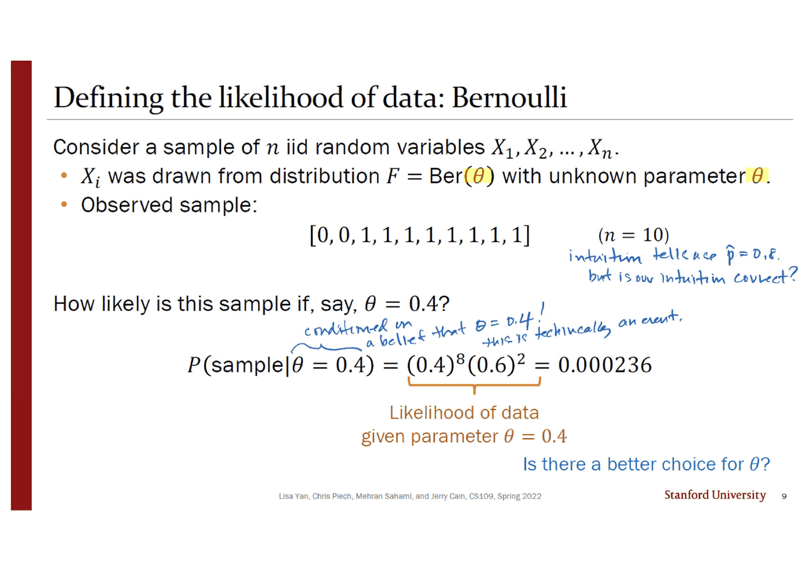
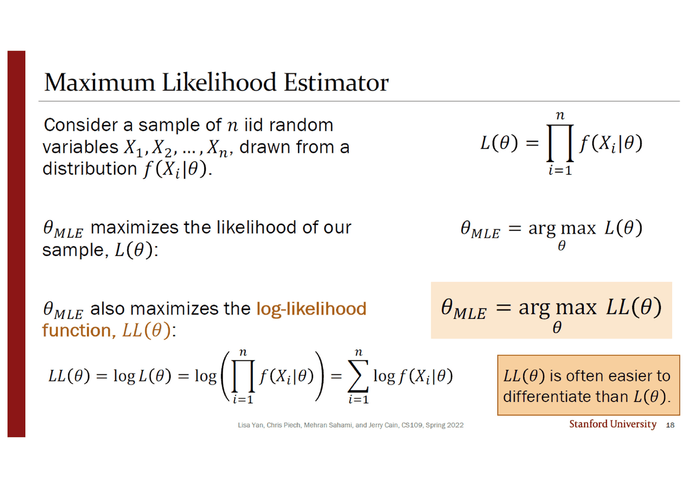
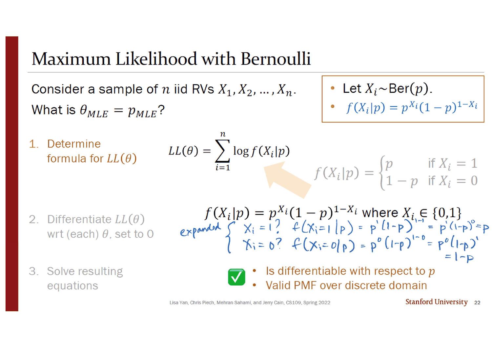
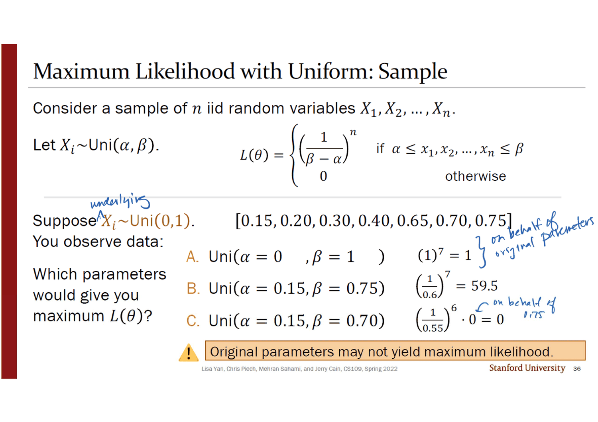
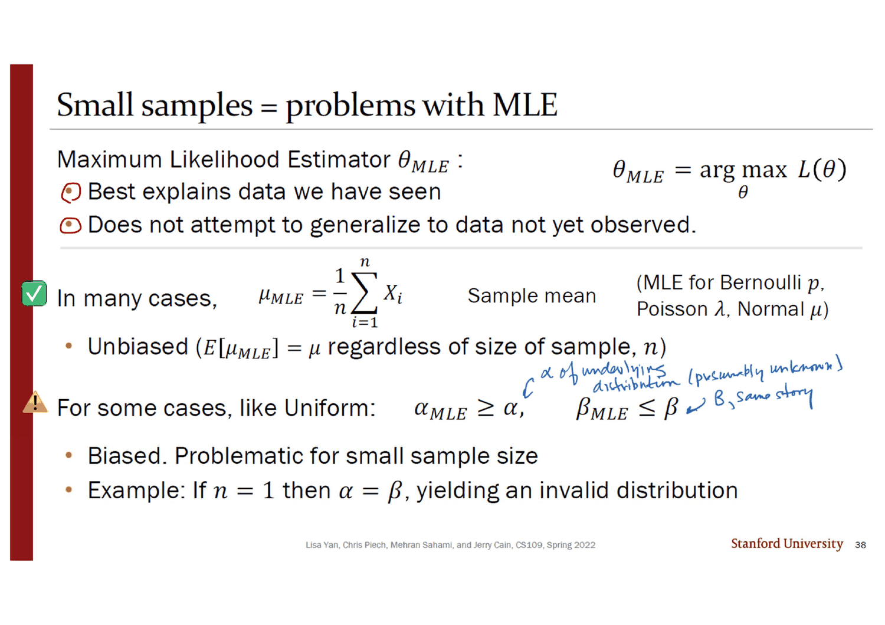
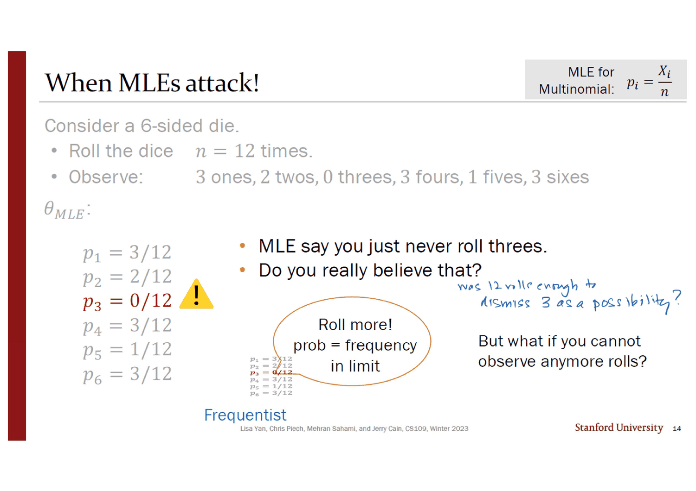
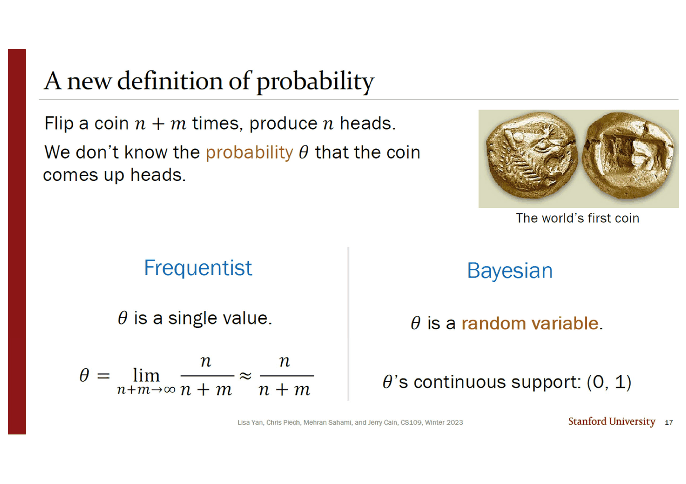

> [!abstract] 참값이 지는 슬라이드
> 36번 슬라이드의 설정은 단순하다. $X_i \sim \text{Uni}(0, 1)$ 에서 실제로 뽑은 일곱 개의 수가 있다.
>
> $$[0.15,\ 0.20,\ 0.30,\ 0.40,\ 0.65,\ 0.70,\ 0.75]$$
>
> 그리고 세 후보의 우도를 계산한다. **A는 데이터를 만든 진짜 분포 $\text{Uni}(0,1)$ 이고, 우도는 $1^7 = 1$ 이다.** B는 $\text{Uni}(0.15, 0.75)$ — 표본의 최솟값과 최댓값을 그대로 경계로 삼은 것 — 이고 우도는 **35.7**이다(슬라이드에는 59.5로 인쇄되어 있는데, 아래에서 다룬다).
>
> **참값이 36배 차이로 진다.** 슬라이드가 노란 경고 표시와 함께 결론을 인쇄한다.
>
> > ***Original parameters may not yield maximum likelihood.***
>
> 이것이 이 덱이 가르치는 방법의 성질이자 한계다. 38번이 그것을 두 줄로 적는다 — *"Best explains data we have seen"*, *"**Does not attempt to generalize** to data not yet observed."* 그리고 그 두 줄이 어디까지 갈 수 있는지를 이 파일의 **두 번째 덱**이 보인다. 주사위를 열두 번 굴려 3이 한 번도 안 나오면, 최대우도는 $p_3 = 0$ 이라고 답한다. *"Do you really believe that?"*

---

## 이 PDF는 두 파일이 붙어 있다

먼저 물리적인 사실부터. **이 덱은 한 파일이 아니다.**

| | 쪽 | 인쇄 번호 | 저작권 줄 | 내용 |
| --- | --- | --- | --- | --- |
| **앞 덩이** | PDF 1~43 | 슬라이드 **1~45**(24·25 결번) | `CS109, **Spring 2022**` (15번만 `Winter 2024`) | 모수 추정 → MLE → argmax·로그우도 → 베르누이 · 포아송 · 균등 · 정규 |
| **뒤 덩이** | PDF 44~58 | 슬라이드 **8~22**(결번 없음) | `CS109, **Winter 2023**` | 다항분포 MLE → `When MLEs attack!` → 베이즈 통계 |

PDF 43쪽이 슬라이드 45(정규분포 MLE의 마지막)이고, **44쪽이 갑자기 슬라이드 8**(`MLE: Multinomial` 절 표지, 오른쪽 위에 `brand new content` 로고 이미지)로 돌아간다. 표지의 등사체 목차도 앞 덩이만 설명한다 — `2 Parameter Estimation` / `8 Maximum Likelihood Estimator` / `14 argmax and LL(θ)` / `19 MLE: Bernoulli` / `29 MLE: Poisson, Uniform` / `39 MLE: Gaussian`. **다항분포도 베이즈 통계도 목차에 없다.**

두 덩이는 우연히 붙은 것이 아니다. **뒤 덩이가 앞 덩이의 결론을 반례로 뒤집는다.**

```mermaid
flowchart TB
    subgraph A["앞 덩이 — Spring 2022 · 슬라이드 1~45"]
      A1["모수 = 분포를 고르고 남은 자유도<br/>Distribution = model + parameter θ · 6번"]
      A1 --> A2["우도 L(θ) = ∏ f(Xᵢ|θ)<br/>10~13번"]
      A2 --> A3["argmax · 로그 · 미분<br/>15~20번 · 절차 세 단계"]
      A3 --> A4["베르누이 p = X̄ · 포아송 λ = X̄<br/>정규 μ = X̄ · 21~45번"]
      A4 --> A5["⚠ 균등분포에서 처음 어긋난다<br/>α_MLE ≥ α, β_MLE ≤ β · 36~38번"]
    end

    subgraph B["뒤 덩이 — Winter 2023 · 슬라이드 8~22"]
      B1["다항분포 pᵢ = Xᵢ/n<br/>8~12번"]
      B1 --> B2["⚠⚠ p₃ = 0/12<br/>본 적 없는 눈의 확률이 정확히 0<br/>13·14번"]
      B2 --> B3["θ 를 확률변수로 본다<br/>15~22번 · 베이즈 통계"]
    end

    A5 -.->|"같은 고장의 약한 형태"| B2
    B3 -.->|"다음 덱"| C["22_map"]

    style A5 fill:transparent,stroke:var(--chart-1),stroke-width:2px
    style B2 fill:transparent,stroke:var(--chart-1),stroke-width:2px
    style B3 fill:transparent,stroke:var(--chart-2),stroke-width:2px
```

---

## 오늘의 초점은 인쇄되지 않았다



3번 슬라이드가 이 과목의 지금까지를 한 줄로 요약한다 — *"모형과 필요한 확률을 전부 주면 예측할 수 있다."* 그 옆에 15번 덱의 독감 베이즈망과 $Y \sim \text{Poi}(5)$, $X_i \sim \text{Ber}(0.2)$ 가 나란히 붙어 있다. **지금까지 모든 덱은 확률을 「주어진 것」으로 받았다.**

그리고 노랗게 칠해진 한 줄이 방향을 바꾼다.

> *But **how do we infer the probabilities** for a given model?*

잉크가 그 아래에 적었다 — *"this is today's focus!"*

그 아래 줄은 **가로줄이 그어져 지워져 있다** — *"What if you want to learn the structure of the model, too?"* 와 그 답인 큰 글씨 **`Machine Learning`**. 오른쪽에 `Glimpse: Week 10` 이라 인쇄되어 있고, 잉크가 그 옆에 적었다.

> *you need entire classes to understand machine learning, not just one week.*

**이 덱이 다루지 않는 것을 잉크가 먼저 선을 그어 잘라 낸다.** 모형의 **구조**는 주어지고, 그 안의 **수**만 데이터에서 정한다.

6번이 그 구별을 정의로 굳힌다.

$$\text{Distribution} = \text{model} + \text{parameter } \theta$$

| 분포 | 모형 | 모수 $\theta$ |
| --- | --- | --- |
| $\text{Ber}(p)$ | 베르누이 | $p$ |
| $\text{Poi}(\lambda)$ | 포아송 | $\lambda$ |
| $\text{Uni}(\alpha, \beta)$ | 균등 | $(\alpha, \beta)$ |
| $\mathcal N(\mu, \sigma^2)$ | 정규 | $(\mu, \sigma^2)$ |
| $Y = mX + b$ | 선형 | $(m, b)$ |

주황 상자가 한 줄 더 — *"$\theta$ can be a **vector** of parameters!"* 그리고 7번이 표기 하나를 정한다. 잉크가 `estimator $\hat\theta$` 의 모자에 빨간 동그라미를 치고 적었다.

> *whenever you see a ^ over a parameter, it almost always means an estimate!*

---

## 우도 — 조건을 뒤집어 읽는다



9번 슬라이드가 표본 하나를 놓는다 — $[0,0,1,1,1,1,1,1,1,1]$, $n = 10$. 그리고 **모수를 먼저 정하고 표본의 확률을 계산한다.**

$$P(\text{sample} \mid \theta = 0.4) = (0.4)^8(0.6)^2 = 0.000236$$

잉크가 오른쪽에 이 덱 전체의 질문을 적었다.

> *intuition tells us $\hat p = 0.8$, but is our intuition correct?*

그리고 조건 자리에 중괄호를 치고 — *"conditioned on a belief that $\theta = 0.4$! this is technically an event."* **$\theta$ 를 사건으로 취급한다는 것**이 우도의 정의에 들어 있는 미묘한 전제이고, 뒤 덩이 17번이 그것을 정식으로 확률변수로 바꾼다.

10번이 정의를 준다. 잉크가 빨간 밑줄을 긋고 *"this is the definition of $L(\theta)$ in all scenarios"*, 곱 형태에는 하늘색으로 *"this follows from generic definition when $X_i$ are iid"* 라고 적었다 — **정의는 결합밀도이고, 곱은 독립일 때만 참이다.**

$$L(\theta) = f(X_1, X_2, \ldots, X_n \mid \theta) \overset{\text{iid}}{=} \prod_{i=1}^{n} f(X_i \mid \theta)$$

그리고 11·12·13번이 정의를 세 조각으로 나눠 강조한다 — $\theta_{MLE} = \arg\max_\theta L(\theta)$ 에서 ①  $L(\theta)$ 가 무엇인지, ②  `arg max` 가 무엇인지, ③  연속이면 PDF·이산이면 PMF라는 것.

15번이 `arg max` 를 그림 하나로 못 박는다. $f(x) = -x^2 + 4$, $-2 < x < 2$ 에서 —

$$\max_x f(x) = \mathbf 4 \qquad\text{그런데}\qquad \arg\max_x f(x) = \mathbf 0$$

형광펜이 4는 초록, 0은 분홍으로 칠해져 있고, 그래프의 꼭짓점과 $x$ 축의 0에 같은 색이 칠해져 있다. **높이를 묻는가 위치를 묻는가**의 차이다.

16번이 그 위치가 **로그를 씌워도 변하지 않는다**는 것을 두 줄로 보인다.

$$\arg\max_x f(x) = \arg\max_x \log f(x) = \arg\max_x \big(c\log f(x)\big) \quad (c > 0)$$

근거는 괄호 안에 있다 — *"log is an increasing function: $x < y \Leftrightarrow \log x < \log y$"*. **순서를 보존하는 변환은 최댓값의 위치를 옮기지 않는다.** 18번이 그 결과를 실무 규칙으로 바꾼다 — $\theta_{MLE} = \arg\max_\theta LL(\theta)$, 그리고 주황 상자 — *"$LL(\theta)$ is often easier to differentiate than $L(\theta)$."* 곱이 합이 되기 때문이다.



> [!warning] 원본 오류 — 17번 슬라이드의 도함수에서 마이너스가 사라진다
> 같은 $f(x) = -x^2 + 4$ 를 미분하는 줄이 이렇게 인쇄되어 있다.
> $$\frac{d}{dx}f(x) = \frac{d}{dx}\big(\mathbf{x^2 + 4}\big) = \mathbf{2x}$$
> **두 군데가 틀렸다** — 괄호 안에서 $-x^2$ 의 부호가 사라졌고, 결과도 $-2x$ 여야 한다. 슬라이드 오른쪽에는 같은 슬라이드에서 $f(x) = -x^2 + 4$ 가 정확히 인쇄되어 있고 그래프도 아래로 볼록한 포물선이다.
>
> **답은 영향을 받지 않는다** — $2x = 0$ 과 $-2x = 0$ 의 해가 둘 다 $\hat x = 0$ 이기 때문이다. 부호가 중요해지는 것은 바로 다음 줄인데, 슬라이드는 그 줄을 건너뛴다. *"Make sure $\hat x$ is a maximum · Often ignored in expository derivations · **We'll ignore it here too** (and won't require it in class)"* 라고 인쇄되어 있다. **2계 조건을 생략하기로 한 슬라이드에서 1계 도함수의 부호가 틀린 것**이라, 어느 쪽도 다른 쪽을 잡아 주지 못한다

20번이 절차를 네 단계로 정리하고(공식 세우기 → 미분 → 0으로 놓고 풀기 → 최댓값 확인), 4단계에 같은 면제 조항이 다시 붙는다.

---

## 네 분포에 같은 절차를 돌린다



21번이 베르누이로 시작하는데, **첫 시도가 막힌다.** PMF를 경우 나누기로 적으면

$$f(X_i \mid p) = \begin{cases}p & X_i = 1\\ 1-p & X_i = 0\end{cases}$$

이고, 잉크가 적는다 — *"function as expressed is not differentiable! not what we want! :("* 오른쪽에는 「THIS IS FINE」 불타는 집 밈. **05번 덱이 여집합으로 막혔을 때 붙였던 것과 같은 밈이 여기서 미분 불가능성에 붙는다.**

22번이 한 줄로 푼다.

$$f(X_i \mid p) = p^{X_i}(1-p)^{1-X_i}, \qquad X_i \in \{0, 1\}$$

잉크가 두 경우를 직접 전개해 확인한다 — $X_i = 1$ 이면 $p^1(1-p)^0 = p$, $X_i = 0$ 이면 $p^0(1-p)^1 = 1-p$. **똑같은 함수인데 하나는 미분되고 하나는 안 된다.** 초록 체크와 함께 두 줄이 인쇄된다 — *"Is differentiable with respect to $p$"*, *"Valid PMF over discrete domain"*.

그다음은 기계적이다. 23번이 로그를 분배하고(잉크가 네 덩이에 노랑·빨강·분홍·초록을 칠해 어느 조각이 어디로 가는지 추적한다), 24번이 미분하고, 26번이 푼다. 잉크가 대수를 세 줄로 끝낸다 — $\frac Yp = \frac{n-Y}{1-p} \Rightarrow Y - Yp = np - Yp \Rightarrow p = \frac Yn$.

$$\boxed{\;p_{MLE} = \frac1n\sum_{i=1}^n X_i = \bar X\;}$$

주황 상자 — *"MLE of the Bernoulli parameter is the unbiased estimate of the mean, $\bar X$."* 9번 여백의 잉크가 물었던 「직관이 맞는가」에 대한 답이 열일곱 장 뒤에 나온다. **맞는다.** 27·28번이 그 값을 확인한다 — $p_{MLE} = 0.8$, 그리고 그 자리의 우도는 $0.8^8 \cdot 0.2^2 = 0.0067$ 로 $\theta = 0.4$ 일 때의 0.000236보다 **28배** 크다.

```html preview
<div id="lk20" style="font-family:system-ui,-apple-system,sans-serif;color:var(--foreground);background:var(--card);border:1px solid var(--border);border-radius:12px;padding:18px 16px;">
  <p style="margin:0 0 12px;font-size:13px;color:var(--muted-foreground);">
    9번 슬라이드의 표본 [0, 0, 1, 1, 1, 1, 1, 1, 1, 1] 에 대한 우도 L(p) = p<sup>8</sup>(1−p)<sup>2</sup>.</p>
  <div style="display:flex;flex-wrap:wrap;gap:12px;align-items:center;margin-bottom:12px;">
    <label style="font-size:13px;font-weight:600;">θ = p</label>
    <input id="p20" type="range" min="1" max="99" value="40" step="1" style="flex:1;min-width:170px;accent-color:var(--chart-1);">
    <output id="pv20" style="font-variant-numeric:tabular-nums;font-weight:700;font-size:15px;min-width:2.8em;">0.40</output>
  </div>
  <svg id="s20" viewBox="0 0 620 230" style="width:100%;height:auto;display:block;"></svg>
  <div id="o20" style="margin-top:12px;font-size:13.5px;line-height:1.95;font-variant-numeric:tabular-nums;"></div>
</div>
<script>
(function(){
  const NS='http://www.w3.org/2000/svg', svg=document.getElementById('s20');
  function el(t,a,x){const e=document.createElementNS(NS,t);for(const k in a)e.setAttribute(k,a[k]);
    if(x!==undefined)e.textContent=x; return e;}
  const L=52,R=596,B=190,TOP=16;
  const LMAX=0.0067108864;                       // p=0.8 에서의 최댓값
  const Lf=p=>Math.pow(p,8)*Math.pow(1-p,2);
  const sx=p=>L+p*(R-L), sy=v=>B-(v/(LMAX*1.08))*(B-TOP);
  function draw(p){
    svg.textContent='';
    svg.appendChild(el('line',{x1:L,y1:B,x2:R,y2:B,stroke:'var(--border)'}));
    let d='';
    for(let i=0;i<=300;i++){const q=i/300; d+=(i?'L':'M')+sx(q).toFixed(1)+','+sy(Lf(q)).toFixed(1);}
    svg.appendChild(el('path',{d:d,fill:'none',stroke:'var(--chart-1)','stroke-width':2}));
    // 0.8 최대점
    svg.appendChild(el('line',{x1:sx(0.8),y1:sy(LMAX),x2:sx(0.8),y2:B,stroke:'var(--chart-2)','stroke-width':1.4,'stroke-dasharray':'4 4'}));
    svg.appendChild(el('circle',{cx:sx(0.8),cy:sy(LMAX),r:4.5,fill:'var(--chart-2)'}));
    svg.appendChild(el('text',{x:sx(0.8)+7,y:sy(LMAX)-4,'font-size':11.5,fill:'var(--chart-2)','font-weight':700},'p_MLE = 0.8'));
    // 현재 위치
    svg.appendChild(el('line',{x1:sx(p),y1:sy(Lf(p)),x2:sx(p),y2:B,stroke:'var(--chart-1)','stroke-width':1.2,'stroke-dasharray':'3 3'}));
    svg.appendChild(el('circle',{cx:sx(p),cy:sy(Lf(p)),r:5,fill:'var(--chart-1)'}));
    for(const q of [0,0.2,0.4,0.6,0.8,1])
      svg.appendChild(el('text',{x:sx(q),y:B+18,'text-anchor':'middle','font-size':11,fill:'var(--muted-foreground)'}, q.toFixed(1)));
    svg.appendChild(el('text',{x:L,y:TOP+2,'font-size':11,fill:'var(--muted-foreground)'},'L(p)'));
  }
  function upd(){
    const p=+document.getElementById('p20').value/100;
    document.getElementById('pv20').textContent=p.toFixed(2);
    draw(p);
    const v=Lf(p), ratio=LMAX/v;
    let h='<b>L('+p.toFixed(2)+') = '+v.toExponential(4)+'</b>';
    h+=' &nbsp;<span style="color:var(--muted-foreground)">최댓값의 1/'+ratio.toFixed(1)+'</span>';
    const note = Math.abs(p-0.4)<0.005 ? '<b style="color:var(--chart-1)">9번 슬라이드의 자리다.</b> 인쇄값 0.000236 과 일치한다. 최댓값 0.0067 의 <b>1/28</b>.'
      : Math.abs(p-0.8)<0.005 ? '<b style="color:var(--chart-2)">28번 슬라이드의 자리다.</b> 잉크가 0.8<sup>8</sup>·0.2<sup>2</sup> = 0.0067 이라 적었다. 여기가 최댓값이고, 미분으로 구한 p = Y/n = 8/10 과 정확히 같다.'
      : p<0.1 ? '우도가 사실상 0이다. 0이 두 개뿐인 표본을 p ≈ 0 인 동전이 만들 수는 없다.'
      : p>0.97 ? '우도가 다시 0으로 떨어진다. p = 1 이면 0이 <b>나올 수 없으므로</b> 이 표본의 확률이 정확히 0이다.'
      : '곡선이 0.8 한 점에서만 최대가 된다. 로그를 씌워도 이 위치는 변하지 않는다(16번 슬라이드).';
    document.getElementById('o20').innerHTML=h+'<p style="margin:8px 0 0;font-size:12.5px;color:var(--muted-foreground);line-height:1.7">'+note+'</p>';
  }
  document.getElementById('p20').addEventListener('input',upd); upd();
})();
</script>
```

30~32번의 포아송은 같은 절차를 한 번 더 돌린다. 로그가 곱을 합으로 바꾸고 나면

$$LL(\theta) = -n\lambda + \log\lambda\sum_{i=1}^n X_i - \sum_{i=1}^n \log(X_i!), \qquad \frac{\partial LL}{\partial\lambda} = -n + \frac1\lambda\sum X_i = 0 \;\Rightarrow\; \boxed{\lambda_{MLE} = \bar X}$$

31번의 객관식이 이 계산의 급소를 짚는다. 보기 A는 $\sum \frac{1}{X_i!}\cdot\frac{\partial X_i!}{\partial X_i}$ 라는 항을 달고 있고, 잉크가 그 위에 중괄호를 치고 **0** 이라 적었다. $\sum\log(X_i!)$ 에 $\lambda$ 가 없으므로 $\lambda$ 로 미분하면 통째로 사라진다. **제일 복잡해 보이는 항이 사실 상수다.**

33번의 검산 문항이 여기까지를 묶는다 — 10분에 53건을 관측하면 $\lambda_{MLE} = 5.3$(잉크가 $\frac{1}{10}\cdot 53$ 으로 계산), 베르누이 MLE는 불편, 포아송 MLE는 분산의 불편추정량이기도 하다($\lambda$ 가 평균이자 분산이므로). 그리고 *"What does unbiased mean?"* 의 답이 한 줄 — $E[\text{estimator}] = \text{the truth}$.

41~45번의 정규분포는 **모수가 둘**이라 편미분이 둘이다. 그런데 순서가 중요하다. $\mu$ 에 대한 식은 $\sigma$ 를 포함하지만 $\frac{1}{\sigma^2}$ 가 공통인수라 **소거되고**, $\mu_{MLE} = \bar X$ 가 $\sigma$ 와 무관하게 먼저 정해진다. 그 값을 두 번째 식에 넣으면 $\sigma^2_{MLE}$ 가 나온다.

$$\mu_{MLE} = \frac1n\sum X_i \quad(\text{unbiased}), \qquad \sigma^2_{MLE} = \frac1n\sum(X_i - \mu_{MLE})^2 \quad(\textbf{biased!})$$

**분모가 $n$ 이다.** 19번 덱 17번이 *"biased!"* 라고 잉크로 적었던 바로 그 추정량이고, 이 덱은 그것을 **최대우도가 스스로 고른 답**으로 다시 만나게 한다. 45번 슬라이드가 `biased!!` 라고 인쇄한다(`unbiased` 라 적힌 $\mu_{MLE}$ 바로 아래에). 19번 덱은 $\frac{n}{n-1}$ 을 곱해 고쳤는데, **최대우도는 그 보정을 하지 않는다** — 우도를 최대화한다는 기준 자체가 불편성을 요구하지 않기 때문이다.

---

## 균등분포에서 방법이 부러진다

34번이 균등분포를 꺼내는데 **2단계(미분)가 시작되지 않는다.** 객관식 셋 중 잉크가 고른 답은 C — *"Constraint $\alpha \le x_1, \ldots, x_n \le \beta$ makes differentiation hard."*

$$L(\theta) = \begin{cases}\left(\dfrac{1}{\beta-\alpha}\right)^n & \alpha \le x_1, \ldots, x_n \le \beta\\[2mm] 0 & \text{그 외}\end{cases}$$

잉크가 $LL(\theta) = n\log\frac{1}{\beta-\alpha}$ 를 적고 그 옆에 단서를 붙였다 — *"provided all $x_i$ are such that $\alpha \le x_i \le \beta$."* **미분 가능한 부분은 그 조건 안에서만 존재하고, 최댓값은 조건의 경계에 있다.** 미분으로는 경계의 최댓값을 찾을 수 없다.



그래서 35·36번이 미분 대신 **세 후보를 직접 계산한다.**

| | 후보 | 계산 | 값 |
| --- | --- | --- | --- |
| A | $\text{Uni}(0, 1)$ — **데이터를 만든 진짜 분포** | $(1/1)^7$ | $\mathbf 1$ |
| B | $\text{Uni}(0.15, 0.75)$ — 표본의 최소·최대 | $(1/0.6)^7$ | $\mathbf{35.7}$ |
| C | $\text{Uni}(0.15, 0.70)$ — 최대를 하나 잘라낸 것 | $(1/0.55)^6 \cdot \mathbf{0}$ | $\mathbf 0$ |

잉크가 A 옆에 *"on behalf of original parameters"*, C 옆에 *"on behalf of 0.75"* 라 적었다. **C가 0인 이유는 0.75가 구간 밖으로 밀려나 그 한 점의 밀도가 0이 되기 때문**이고, 곱이므로 나머지 여섯 개가 아무리 잘 맞아도 전체가 0이 된다.

> [!warning] 원본 오류 — B의 값 59.5는 지수가 하나 많다
> 슬라이드는 $\left(\frac{1}{0.6}\right)^7 = \mathbf{59.5}$ 라고 인쇄한다. 직접 계산하면
> $$\left(\frac{1}{0.6}\right)^7 = 35.7224\ldots, \qquad \left(\frac{1}{0.6}\right)^{\mathbf 8} = 59.5374\ldots$$
> **인쇄된 59.5는 지수 8의 값**이다. 데이터는 일곱 개이고, 바로 위 A의 계산은 $(1)^7$ 로 지수 7을 쓰고, C도 $(1/0.55)^{6}$ 으로 구간 안의 여섯 개만 센다. **B만 지수가 하나 많다.**
>
> 결론은 바뀌지 않는다($35.7 > 1 > 0$). 다만 「참값이 몇 배로 지는가」가 59.5배에서 **35.7배**로 달라진다

37번이 답을 일반화한다.

$$\alpha_{MLE} = \min(x_1, \ldots, x_n), \qquad \beta_{MLE} = \max(x_1, \ldots, x_n)$$

직관 두 줄이 이유의 전부다 — *"Want interval size $(\beta - \alpha)$ to be as small as possible"*(밀도 $\frac{1}{\beta-\alpha}$ 를 키우려면) 와 *"Need to make sure all observed data is in interval (if not, then $L(\theta) = 0$)"*. **두 힘이 반대 방향으로 당기고, 그 균형점이 정확히 표본의 최소·최대다.**

```html preview
<div id="un20" style="font-family:system-ui,-apple-system,sans-serif;color:var(--foreground);background:var(--card);border:1px solid var(--border);border-radius:12px;padding:18px 16px;">
  <p style="margin:0 0 14px;font-size:13px;color:var(--muted-foreground);">
    36번 슬라이드의 데이터 일곱 개. 구간을 직접 움직여 L(θ) = (1/(β−α))<sup>7</sup> 이 어떻게 변하는지 본다.</p>
  <div style="display:flex;flex-wrap:wrap;gap:14px;align-items:center;margin-bottom:6px;">
    <label style="font-size:13px;font-weight:600;min-width:1.2em;">α</label>
    <input id="a20" type="range" min="-20" max="80" value="0" step="1" style="flex:1;min-width:150px;accent-color:var(--chart-1);">
    <output id="av20" style="font-variant-numeric:tabular-nums;font-weight:700;min-width:3em;">0.00</output>
  </div>
  <div style="display:flex;flex-wrap:wrap;gap:14px;align-items:center;margin-bottom:14px;">
    <label style="font-size:13px;font-weight:600;min-width:1.2em;">β</label>
    <input id="b20" type="range" min="20" max="120" value="100" step="1" style="flex:1;min-width:150px;accent-color:var(--chart-2);">
    <output id="bv20" style="font-variant-numeric:tabular-nums;font-weight:700;min-width:3em;">1.00</output>
  </div>
  <svg id="us20" viewBox="0 0 620 120" style="width:100%;height:auto;display:block;"></svg>
  <div style="display:flex;flex-wrap:wrap;gap:8px;margin-top:12px;">
    <button class="u-b" data-a="0" data-b="100">A. Uni(0, 1) — 참값</button>
    <button class="u-b" data-a="15" data-b="75">B. Uni(0.15, 0.75)</button>
    <button class="u-b" data-a="15" data-b="70">C. Uni(0.15, 0.70)</button>
  </div>
  <div id="uo20" style="margin-top:12px;font-size:13.5px;line-height:1.95;font-variant-numeric:tabular-nums;"></div>
</div>
<style>
#un20 .u-b{font:inherit;font-size:12.5px;padding:6px 11px;border-radius:7px;cursor:pointer;
  border:1px solid var(--border);background:transparent;color:var(--muted-foreground);}
#un20 .u-b:hover{border-color:var(--chart-1);color:var(--chart-1);}
</style>
<script>
(function(){
  const DATA=[0.15,0.20,0.30,0.40,0.65,0.70,0.75];
  const NS='http://www.w3.org/2000/svg', svg=document.getElementById('us20');
  function el(t,a,x){const e=document.createElementNS(NS,t);for(const k in a)e.setAttribute(k,a[k]);
    if(x!==undefined)e.textContent=x; return e;}
  const L=40,R=596,Y=62, XMIN=-0.25, XMAX=1.25;
  const sx=v=>L+((v-XMIN)/(XMAX-XMIN))*(R-L);
  function draw(a,b){
    svg.textContent='';
    svg.appendChild(el('line',{x1:L,y1:Y,x2:R,y2:Y,stroke:'var(--border)'}));
    if(b>a) svg.appendChild(el('rect',{x:sx(a),y:Y-30,width:sx(b)-sx(a),height:30,
      fill:'var(--chart-2)',opacity:0.18,stroke:'var(--chart-2)','stroke-width':1.4}));
    for(const v of DATA){
      const inside = v>=a && v<=b;
      svg.appendChild(el('circle',{cx:sx(v),cy:Y,r:5.5,
        fill:inside?'var(--chart-1)':'var(--muted-foreground)',opacity:inside?0.95:0.35}));
      if(!inside) svg.appendChild(el('text',{x:sx(v),y:Y-12,'text-anchor':'middle','font-size':13,
        fill:'var(--chart-1)','font-weight':700},'✕'));
      svg.appendChild(el('text',{x:sx(v),y:Y+20,'text-anchor':'middle','font-size':9.5,
        fill:'var(--muted-foreground)'}, v.toFixed(2)));
    }
    for(const v of [0,0.5,1]) svg.appendChild(el('text',{x:sx(v),y:Y+40,'text-anchor':'middle',
      'font-size':11,fill:'var(--muted-foreground)'}, v));
    svg.appendChild(el('text',{x:sx(a),y:Y-36,'text-anchor':'middle','font-size':11,fill:'var(--chart-2)','font-weight':700},'α'));
    svg.appendChild(el('text',{x:sx(b),y:Y-36,'text-anchor':'middle','font-size':11,fill:'var(--chart-2)','font-weight':700},'β'));
  }
  function upd(){
    const a=+document.getElementById('a20').value/100, b=+document.getElementById('b20').value/100;
    document.getElementById('av20').textContent=a.toFixed(2);
    document.getElementById('bv20').textContent=b.toFixed(2);
    draw(a,b);
    const out=DATA.filter(v=>v<a||v>b);
    let Lv, txt;
    if(b<=a){ Lv=NaN; txt='<b style="color:var(--chart-1)">β ≤ α 이면 분포가 아니다.</b> 38번 슬라이드가 든 예 — n = 1 이면 α<sub>MLE</sub> = β<sub>MLE</sub> 가 되어 폭 0인 「분포」가 나온다.'; }
    else if(out.length){ Lv=0; txt='<b style="color:var(--chart-1)">L(θ) = 0</b> — '+out.map(v=>v.toFixed(2)).join(', ')+' 가 구간 밖이다. <b>한 점만 빠져도 곱 전체가 0</b>이 된다.'; }
    else {
      Lv=Math.pow(1/(b-a),7);
      const best=Math.pow(1/0.6,7);
      txt = (Math.abs(a-0.15)<0.005&&Math.abs(b-0.75)<0.005)
        ? '<b style="color:var(--chart-2)">최대우도다.</b> α = min = 0.15, β = max = 0.75. 슬라이드의 인쇄값은 59.5지만 실제로는 <b>35.72</b>다(지수 8을 쓴 값이 59.54).'
        : (Math.abs(a-0)<0.005&&Math.abs(b-1)<0.005)
        ? '<b style="color:var(--chart-1)">데이터를 만든 진짜 분포인데 우도가 1이다.</b> 최댓값 35.72의 <b>1/35.7</b> — 참값이 진다.'
        : '구간을 좁힐수록 우도가 커진다. 최댓값의 '+(100*Lv/best).toFixed(1)+'%.';
    }
    document.getElementById('uo20').innerHTML =
      (isNaN(Lv)?'<b>L(θ) — 정의되지 않음</b>':'<b>L(θ) = (1/'+(b-a).toFixed(2)+')<sup>7</sup> = '+
       (Lv===0?'0':Lv.toFixed(4))+'</b>')+
      '<p style="margin:8px 0 0;font-size:12.5px;color:var(--muted-foreground);line-height:1.7">'+txt+'</p>';
  }
  document.querySelectorAll('#un20 .u-b').forEach(btn=>btn.addEventListener('click',()=>{
    document.getElementById('a20').value=btn.dataset.a;
    document.getElementById('b20').value=btn.dataset.b; upd();}));
  ['a20','b20'].forEach(id=>document.getElementById(id).addEventListener('input',upd));
  upd();
})();
</script>
```



38번이 이 고장을 일반 명제로 적는다.

$$\alpha_{MLE} \ge \alpha, \qquad \beta_{MLE} \le \beta$$

**부등호의 방향이 한쪽으로만 향한다** — 표본의 최솟값은 참 하한보다 작을 수 **없고**, 최댓값은 참 상한보다 클 수 **없다.** 그래서 추정된 구간은 언제나 참 구간 안쪽이고, 편향이 구조적이다. 잉크가 두 기호에 화살표를 그어 *"$\alpha$ of underlying distribution (presumably unknown)"*, *"$\beta$, same story"* 라 적었다. 그리고 극단적인 예 한 줄 — *"If $n = 1$ then $\alpha = \beta$, yielding an **invalid distribution**."*

39번이 완화책을 준다 — *"Potentially biased (though asymptotically less so, as $n \to \infty$)"*, 그리고 **일치성(consistency)**.

$$\lim_{n\to\infty} P\big(\lvert\hat\theta - \theta\rvert < \varepsilon\big) = 1, \quad \varepsilon > 0$$

**데이터가 무한히 많으면 괜찮다.** 그런데 데이터가 무한히 많은 경우는 없고, 그 사실을 뒤 덩이가 끝까지 밀어붙인다.

---

## 두 번째 덱 — 본 적 없는 것의 확률

44쪽부터가 다른 파일이다. 8~12번이 다항분포 MLE를 세 장으로 끝낸다.

$$L(\theta) = \frac{n!}{X_1!X_2!\cdots X_m!}p_1^{X_1}p_2^{X_2}\cdots p_m^{X_m}$$
$$LL(\theta) = \log(n!) - \sum\log(X_i!) + \sum X_i\log(p_i), \quad \text{s.t. } \sum p_i = 1 \;\Longrightarrow\; \boxed{p_i = \frac{X_i}{n}}$$

11번의 객관식에서 잉크가 남긴 한 줄이 이 덱 전체의 요약이다.

> *if $p_1, p_2, p_3$, etc. are unknown, then they are the parameters — in any MLE problem try to maximize likelihood of seeing data!*

제약 $\sum p_i = 1$ 때문에 이번에는 미분만으로 풀리지 않고, 회색 상자가 넘긴다 — *"Optimize with **Lagrange multipliers in extra slides**."* **이 파일에 그 extra slides는 없다.**



13·14번이 그 결과를 실제 데이터에 적용하고, 제목이 그대로다 — ***"When MLEs attack!"***

주사위를 $n = 12$ 번 굴려 1이 3번, 2가 2번, **3이 0번**, 4가 3번, 5가 1번, 6이 3번 나왔다.

$$p_1 = \tfrac{3}{12},\quad p_2 = \tfrac{2}{12},\quad \mathbf{p_3 = \tfrac{0}{12}},\quad p_4 = \tfrac{3}{12},\quad p_5 = \tfrac{1}{12},\quad p_6 = \tfrac{3}{12}$$

$p_3$ 만 빨간색으로 인쇄되어 있고 노란 경고 표시가 붙어 있다.

> - MLE는 **당신이 3을 절대 굴리지 않는다**고 말한다.
> - 정말 그렇게 믿는가?

잉크가 옆에 적었다 — *"was 12 rolls enough to dismiss 3 as a possibility?"* 빈도주의의 답은 말풍선 안에 있다 — *"Roll more! prob = frequency in limit"*. 그리고 인쇄된 반문이 그 답을 막는다.

> ***But what if you cannot observe any more rolls?***

**이것이 38번의 $\alpha_{MLE} \ge \alpha$ 와 같은 고장이다.** 표본에 없는 것은 확률 0을 받는다. 균등분포에서는 구간이 조금 좁아지는 것으로 끝났지만, 다항분포에서는 **한 결과가 영원히 불가능해진다** — 그리고 그 0은 곱해지는 순간 다른 모든 증거를 지운다(36번의 후보 C가 0이 된 것과 정확히 같은 구조다).



15번에서 절이 바뀌고 16번이 예고한다 — *"Today we are going to learn something unintuitive, beautiful, and useful! We are going to think of **probabilities as random variables**."*

17번이 두 입장을 나란히 놓는다.

| 빈도주의 | 베이즈주의 |
| --- | --- |
| $\theta$ 는 **하나의 값**이다 | $\theta$ 는 **확률변수**다 |
| $\theta = \lim_{n+m\to\infty}\frac{n}{n+m} \approx \frac{n}{n+m}$ | $\theta$ 의 연속 지지집합: $(0, 1)$ |

**왼쪽의 정의가 14번의 막다른 골목을 만든 바로 그 정의다** — $\theta$ 를 빈도의 극한으로 정의하면, 12번의 표본에서 3의 빈도는 0이고 그 이상 말할 것이 없다. 오른쪽은 $\theta$ 자체를 분포로 바꿔 「0일 수도 있지만 아닐 수도 있다」를 표현할 여지를 만든다.

18번의 농담이 그 차이를 그림으로 보인다. 주사위 둘을 굴려 6이 하나도 없으면 이긴다. 빈도주의 코기가 $P(W) = \left(\frac56\right)^2$ 이라고 답하고, 베이즈주의 코기는 *"I am constantly re-evaluating the situation"* 이라고 답한다. 주황 상자 — *"Bayesian statistics: Constantly update your prior beliefs."*

20·21번이 도구를 만든다. $X$ 가 연속이고 $N$ 이 이산일 때의 베이즈 정리인데, **유도 방식이 17번 덱 19·21번과 같다.**

$$f_{X\mid N}(x\mid n)\,\varepsilon_X = \frac{P(N=n\mid X=x)\,f_X(x)\,\varepsilon_X}{P(N=n)} \;\Longrightarrow\; f_{X\mid N}(x\mid n) = \frac{p_{N\mid X}(n\mid x)f_X(x)}{p_N(n)}$$

초록 형광펜이 양변의 $\varepsilon_X$ 를 칠하고 잉크가 적었다 — *"these cancel"*. 21번이 네 가지 조합(이산-이산 · 연속-이산 · 이산-연속 · 연속-연속)을 한 장에 모으고, 잉크가 첫 줄에 *"dates back to Lecture 4!"*, 마지막 줄에 *"Will covered this in Lecture 17 (remember satellites!)"* 라고 적었다 — **17번 덱의 MH370 문제가 마지막 줄이었다.**

22번이 이름을 붙이며 덱을 닫는다.

$$\underbrace{f_{\theta\mid N}(x\mid n)}_{\textit{posterior}} = \frac{\overbrace{p_{N\mid\theta}(n\mid x)}^{\textit{likelihood}}\ \overbrace{f_\theta(x)}^{\textit{prior}}}{\underbrace{p_N(n)}_{\textit{normalization constant}}}$$

**$\theta$ 가 조건 자리에서 주어 자리로 옮겨 왔다.** 9번 슬라이드에서 잉크가 *"conditioned on a belief that $\theta = 0.4$! this is technically an event"* 라고 적었던 그 사건이, 여기서 정식 확률변수가 된다.

---

## 원본 오류·불일치

`계산·표기`

- **17번 슬라이드의 도함수** — $f(x) = -x^2+4$ 인데 $\frac{d}{dx}(x^2+4) = 2x$ 로 인쇄되어 있다. **마이너스가 두 번 사라졌고** 옳은 값은 $-2x$ 다. 같은 슬라이드 오른쪽에 $-x^2+4$ 가 정확히 적혀 있고 그래프도 위로 볼록하다. 해 $\hat x = 0$ 은 우연히 같다
- **36번 슬라이드 보기 B의 `59.5`** — $(1/0.6)^7 = 35.72$ 이고, 인쇄된 59.5는 $(1/0.6)^8$ 의 값이다. 같은 슬라이드의 A는 $(1)^7$, C는 $(1/0.55)^6$ 으로 지수를 맞게 쓴다. 결론(B가 최대)은 바뀌지 않는다
- **12번 슬라이드의 라그랑주 보충이 이 파일에 없다** — *"Optimize with Lagrange multipliers in extra slides"* 라고 넘기는데, **extra slides가 PDF에 포함되어 있지 않다.** 다항분포 MLE는 이 덱에서 유일하게 유도 없이 결과만 주어진다

`덱 구성 — 이것이 가장 큰 이상이다`

- **PDF 하나에 두 덱이 이어 붙어 있다** — 1~43쪽이 슬라이드 1~45(`Spring 2022`), 44~58쪽이 슬라이드 **8~22**(`Winter 2023`)다. 44쪽에서 번호가 45에서 8로 되돌아가고 저작권 연도가 바뀐다. 표지의 등사체 목차 여섯 줄은 앞 덩이만 설명하며 **다항분포와 베이즈 통계는 목차에 없다**
- **연도가 세 개 섞여 있다** — 앞 덩이는 대부분 `Spring 2022` 인데 **15번 슬라이드만 `Winter 2024`** 이고, 뒤 덩이는 전부 `Winter 2023` 이다. 이번 회차에 읽은 아홉 덱 중 **세 해가 섞인 유일한 덱**이다(나머지는 2023/2024 두 해)
- **앞 덩이에서 두 장이 빠졌다** — 슬라이드 **24·25번**이 없다(23번이 $LL$ 전개, 26번이 답). 미분을 푸는 대수 단계가 그 자리였을 것이고, 잉크가 26번 여백에 그 계산을 직접 채워 넣었다
- **44쪽(뒤 덩이 8번) 오른쪽 위에 `brand new content` 로고 이미지가 붙어 있다** — 절 표지의 다른 디자인 요소와 무관한 스톡 이미지다

`설명의 공백`

- **머신러닝이 인쇄물에서 지워져 있다** — 3번 슬라이드의 *"What if you want to learn the structure of the model, too?"* 와 `Machine Learning` 에 가로줄이 그어져 있고, 잉크가 *"you need entire classes to understand machine learning, not just one week"* 라 적었다. 인쇄된 `Glimpse: Week 10` 은 그대로 남아 있다
- **2계 조건을 두 번 명시적으로 생략한다** — 17번과 20번 4단계에서 *"Often ignored in expository derivations · We'll ignore it here too (and won't require it in class)"*. 정직하기는 하지만, 17번의 도함수 부호 오류를 잡아 줄 수 있었던 유일한 검산이기도 하다
- **$\sigma^2_{MLE}$ 가 편향인데 그 크기를 말하지 않는다** — 45번이 `biased!!` 라고만 적는다. 19번 덱 17번이 그 크기를 $\frac{n-1}{n}$ 로 정확히 주었으므로, **두 덱을 나란히 놓아야 완성된다**

---

## 근거 자료

- **원본**: `sources/20_mle.pdf` — 58쪽. 앞 덩이 43쪽(슬라이드 1~45, 24·25 결번, `Spring 2022`·15번만 `Winter 2024`), 뒤 덩이 15쪽(슬라이드 8~22, 결번 없음, `Winter 2023`). 표지에 `Jerry Cain, February 26, 2024` 와 `Lecture Discussion on Ed` 링크
- **본문에 인용한 슬라이드**: 앞 덩이 3 · 9 · 17 · 21 · 36 · 38번(PDF 3 · 8 · 17 · 21 · 34 · 36쪽), 뒤 덩이 14 · 17번(PDF 50 · 53쪽)
- **재계산한 값**: $L(0.4) = 0.4^8 \cdot 0.6^2 = 0.000235930$(인쇄값 0.000236), $L(0.8) = 0.8^8\cdot0.2^2 = 0.006710886$(잉크값 0.0067), $\arg\max p^8(1-p)^2 = 0.8$, **$(1/0.6)^7 = 35.7225$ 대 인쇄값 59.5374 $= (1/0.6)^8$**, $(1/0.55)^6 = 36.13$, $\lambda_{MLE} = 53/10 = 5.3$

`직전` → [[18. 공식이 끝나는 자리에서 표본을 다시 쓴다]]

19번 덱이 *"we don't have this"* 라고 두 번 적으며 비워 둔 자리 — 모집단의 $\mu$ 와 $\sigma^2$ — 를 이 덱이 채운다. 그런데 **채우는 방식에 값이 붙어 있다.** 최대우도는 본 데이터를 가장 잘 설명하는 값을 고르므로, 본 적 없는 것은 값을 받지 못한다. 균등분포에서는 구간이 안쪽으로 줄고(38번), 다항분포에서는 한 눈의 확률이 **정확히 0**이 된다(뒤 덩이 14번). 두 고장 모두 데이터를 더 모으면 낫지만, 14번의 마지막 줄이 그 탈출구를 막는다 — *"But what if you cannot observe any more rolls?"*

그 질문에 답하려면 데이터 밖에서 무언가를 가져와야 한다. 뒤 덩이 15~22번이 그 무언가의 이름을 **사전분포**로 정하고 형식을 세워 두었고, **`22_map` 이 그것으로 $p_3 = 0$ 을 고친다.**
