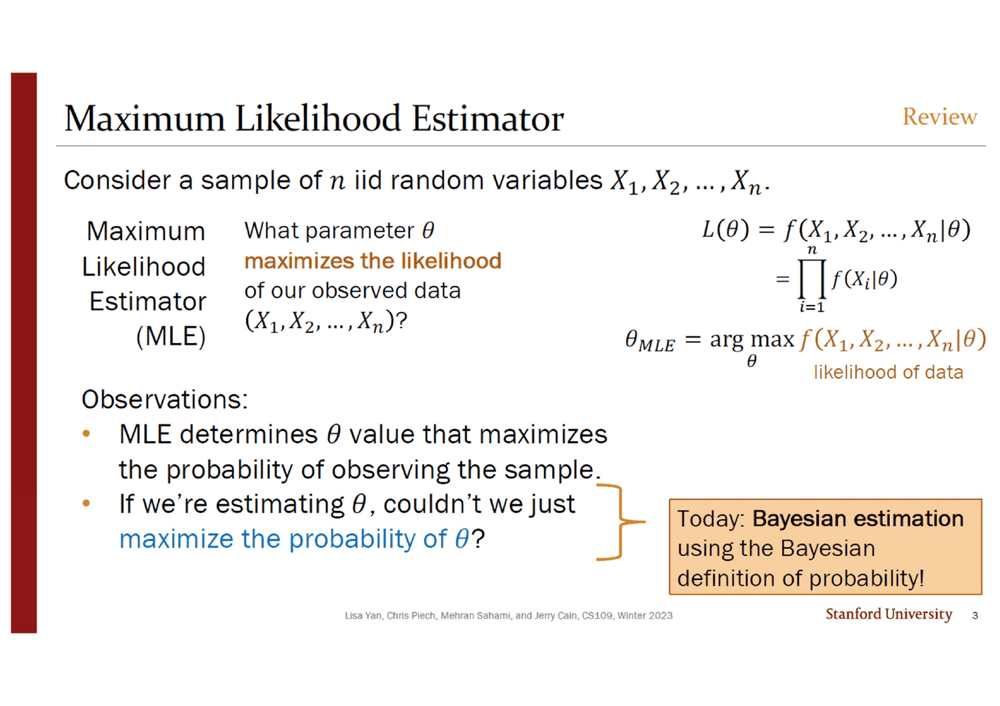
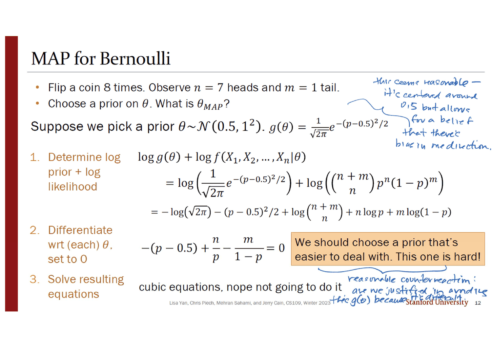
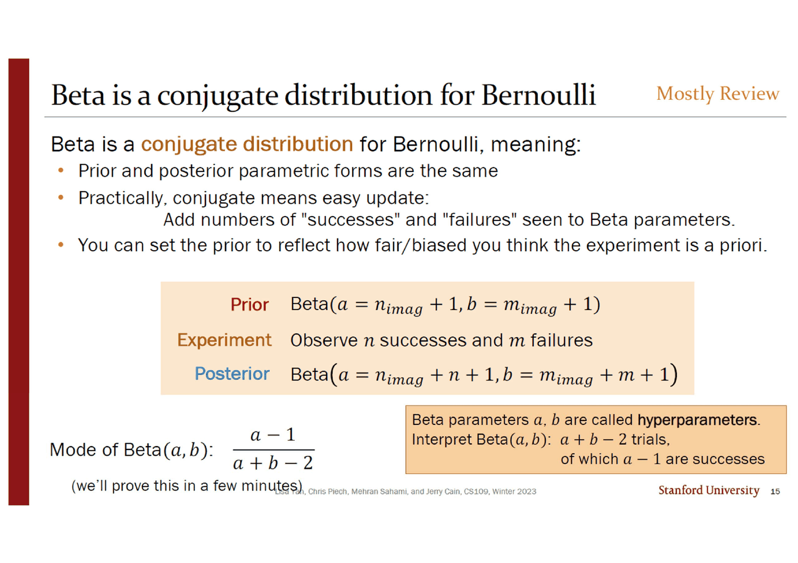
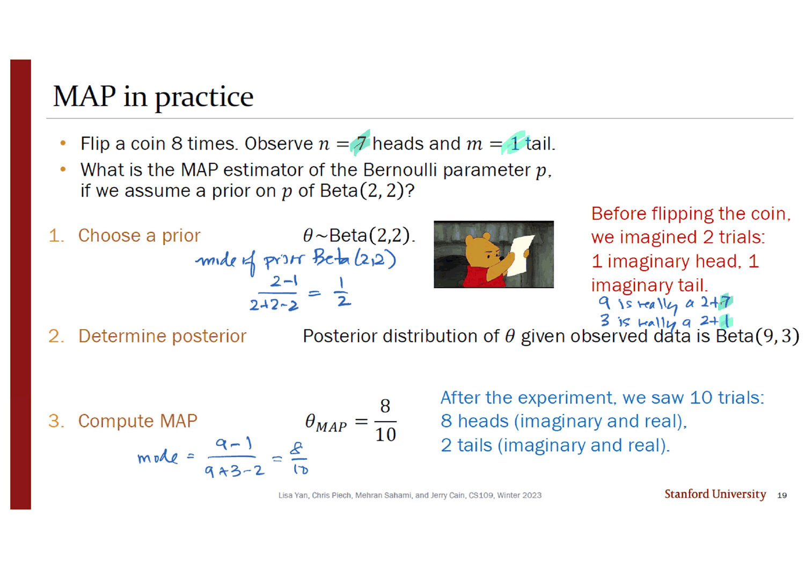
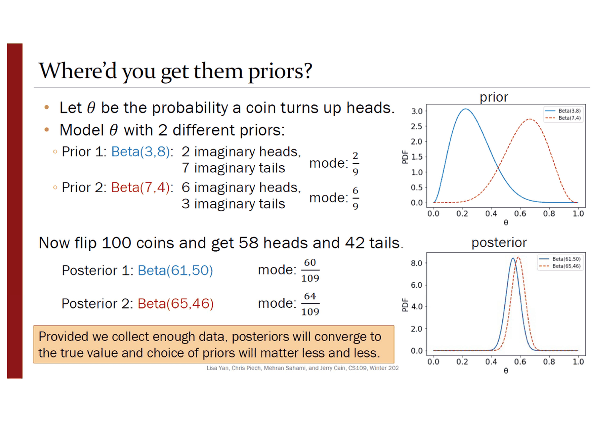
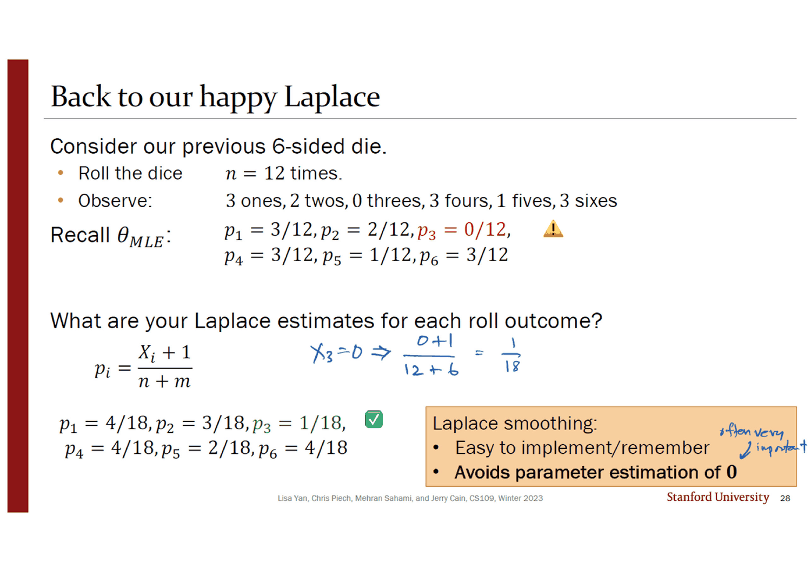
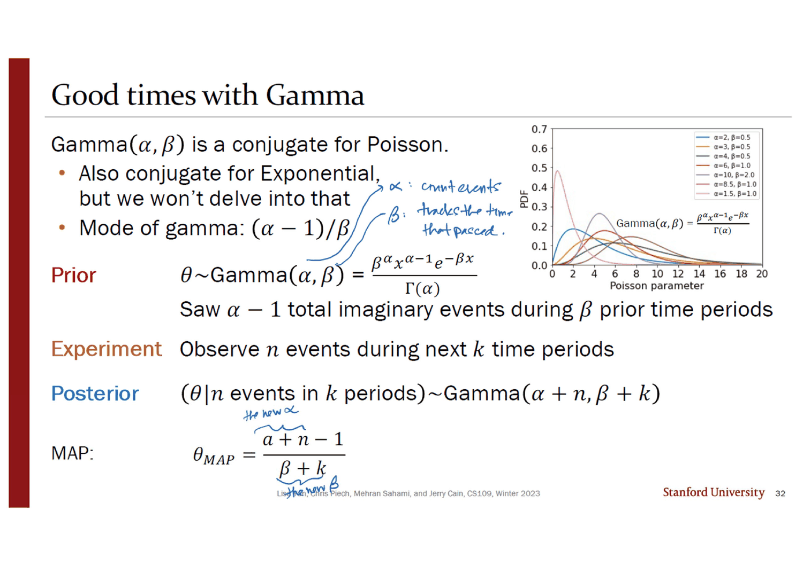

> [!abstract] 여백이 던진 질문
> 12번 슬라이드는 실패하는 계산을 보여 준다. 동전을 여덟 번 던져 앞면 일곱, 뒷면 하나를 봤고, 사전분포로 $\theta \sim \mathcal N(0.5, 1^2)$ 을 골랐다. 로그 사전분포와 로그 우도를 더해 미분하면
> $$-(p - 0.5) + \frac np - \frac{m}{1-p} = 0$$
> 이 나오고, 슬라이드가 그 아래에 이렇게 적는다. ***"cubic equations, nope not going to do it"*** 그리고 주황 상자 — *"We should choose a prior that's easier to deal with. This one is hard!"*
>
> 잉크가 그 상자 밑에 되묻는다.
>
> > *reasonable counterreaction: **are we justified in avoiding this $g(\theta)$ because it's difficult?***
>
> 정당한 질문이다. 사전분포는 **믿음**을 적는 것인데, 여기서는 **계산 편의**로 고르고 있다. 그리고 같은 잉크가 바로 위에 정규분포 사전분포를 두고 *"this seems reasonable — it's centered around 0.5 but allows for a belief that there's bias in one direction"* 이라고 적어 두었다. **말이 되는 쪽을 버리고 푸는 쪽을 고르는 것**이다.
>
> 덱은 이 질문에 직접 답하지 않는다. 대신 나머지 스무 장이 답이 된다. 켤레사전분포 $\text{Beta}(a, b)$ 의 두 초모수는 임의의 숫자가 아니라 **「상상으로 본 시행」의 개수**다 — $a = n_{imag} + 1$, $b = m_{imag} + 1$. 그러니까 믿음을 적는 방법이 **가짜 데이터를 적는 것**이 되고, 그것이 가장 다루기 쉬운 형태이기도 하다. **편의와 해석 가능성이 같은 자리에서 만난다.**
>
> 그리고 그 상상한 데이터가 20번 덱이 남긴 고장을 고친다. 주사위를 열두 번 굴려 3이 안 나왔을 때 최대우도가 내놓던 $p_3 = 0$ 이, 여기서 $\tfrac{1}{18}$ 이 된다.

---

## 같은 지도를 네 번 켠다

이 덱의 구조적 장치는 **되풀이되는 한 장**이다. 11 · 13 · 16 · 20번 슬라이드가 전부 같은 그림(`How does MAP work? (for Bernoulli)`)이고, 매번 한 갈래씩 더 켜진다.

| 슬라이드 | 켜진 부분 |
| --- | --- |
| **11** | 왼쪽 갈래만 — 임의의 $g(\theta)$ → 로그 사전분포 + 로그 우도를 최대화 → 미분 → 풀기. 주황 상자 — *"MAP depends on what $g(\theta)$ we choose."* |
| **13** | 왼쪽이 회색으로 죽고 오른쪽 갈래(켤레분포)에 별표가 붙는다 |
| **16** | 오른쪽 갈래의 끝이 채워진다 — **「사후분포의 최빈값」** |
| **20** | 양쪽이 다 켜지고 한 줄이 붙는다 — *"These are **equivalent** interpretations of $\theta_{MAP}$. We'll use this equivalence to prove the mode of Beta."* |

**20번이 12번의 질문에 대한 실제 답이다.** 왼쪽 갈래(미적분)를 피한 것이 아니라, **한 번만 걸어 두면 오른쪽 갈래가 공짜로 열린다.** 21·22번이 $\text{Beta}(a,b)$ 사전분포로 왼쪽 갈래를 정직하게 걸어가고, 그 결과가 $\frac{a+n-1}{a+n+b+m-2}$ — 정확히 $\text{Beta}(a+n, b+m)$ 의 최빈값이다.

```mermaid
flowchart TB
    Q["θ_MAP = arg max f(θ | X₁,…,Xₙ)<br/>슬라이드 4·5"]
    Q --> R["베이즈로 뒤집으면<br/>log 사전 + log 우도 · 6·7번"]
    R --> L["① 아무 g(θ)나 고른다"]
    R --> C["② 켤레분포를 고른다"]

    L --> L1["𝒩(0.5, 1) 을 골랐더니<br/>삼차방정식 · 12번<br/><i>nope not going to do it</i>"]
    L1 -.->|"잉크: 어렵다고 피하는 게<br/>정당한가?"| X["?"]

    C --> C1["Beta(a, b)<br/>사후도 Beta · 15번"]
    C1 --> C2["초모수 = 상상한 시행<br/>a = n_imag + 1<br/>b = m_imag + 1"]
    C2 --> C3["θ_MAP = 사후의 최빈값<br/>(a+n−1)/(a+n+b+m−2) · 17번"]

    L1 --> P["단, 왼쪽 갈래를 Beta 로<br/>한 번 걸어가면 · 21·22번"]
    P --> C3
    X -.->|"덱의 답: 피한 게 아니라<br/>한 번만 하면 된다"| P

    C3 --> D["p₃ = 0 → 1/18<br/>라플라스 평활 · 26~28번"]

    style X fill:transparent,stroke:var(--chart-1),stroke-width:2px,stroke-dasharray:5 4
    style C2 fill:transparent,stroke:var(--chart-2),stroke-width:2px
    style D fill:transparent,stroke:var(--chart-2),stroke-width:2px
```

---

## 조건을 뒤집는다



3번 슬라이드가 최대우도를 복습하고 그 아래에 질문 하나를 붙인다.

> - MLE는 **표본을 관측할 확률**을 최대로 하는 $\theta$ 를 정한다.
> - $\theta$ 를 추정하는 거라면, **그냥 $\theta$ 의 확률을 최대로 하면 안 되나?**

주황 상자가 답한다 — *"Today: Bayesian estimation using the Bayesian definition of probability!"* **20번 덱 뒤 덩이 17번이 정의한 「확률변수로서의 $\theta$」가 여기서 목적함수가 된다.**

4번이 두 추정량을 위아래로 놓는데, 표시가 명쾌하다. 오른쪽 위 구석에 ***"Not Review! New!"*** 라 적혀 있고, 위쪽(MLE)은 회색, 아래쪽(MAP)만 검다. 그리고 잉크가 두 식 사이에 화살표 둘을 교차시켜 그었다.

$$\theta_{MLE} = \arg\max_\theta f(X_1, \ldots, X_n \mid \theta) \qquad\longleftrightarrow\qquad \theta_{MAP} = \arg\max_\theta f(\theta \mid X_1, \ldots, X_n)$$

형광펜이 $\theta$ 와 $X_1, \ldots, X_n$ 에 각각 초록·하늘색을 칠했고, **조건 막대의 양쪽이 통째로 자리를 바꾼 것**이 화살표로 표시된다. 바뀐 것이 그것뿐이다.

5번의 잉크가 이 뒤집기의 의미를 한 줄로 적었다 — *"notice that both the prior and the posterior are focusing on $\theta$!"* 데이터는 조건 자리로 밀려나고, 앞뒤로 남는 것은 $\theta$ 의 분포다.

6·7번이 실제 계산 형태를 다섯 줄로 유도한다. **핵심은 넷째 줄에서 분모를 버리는 것**이고, 슬라이드가 그 근거를 괄호로 적는다 — *"$1/h(X_1,\ldots,X_n)$ is a positive constant w.r.t. $\theta$."* 이 슬라이드에는 한국어 주석도 인쇄되어 있다 — 분모 옆에 「$\theta$와 관련없음」, 로그를 씌우는 화살표 옆에 「log 변환」.

$$\theta_{MAP} = \arg\max_\theta \frac{g(\theta)\prod f(X_i\mid\theta)}{h(X_1,\ldots,X_n)} = \arg\max_\theta g(\theta)\prod_{i=1}^n f(X_i\mid\theta) = \arg\max_\theta\left(\log g(\theta) + \sum_{i=1}^n \log f(X_i\mid\theta)\right)$$

7번의 주황 상자가 첫 번째 해석을 붙인다 — ***"$\theta_{MAP}$ maximizes log prior + log-likelihood."*** 8번이 두 번째 해석을 붙인다 — ***"The mode of the posterior distribution of $\theta$."*** 같은 계산에 이름이 둘이고, 20번이 그 둘을 이어 증명에 쓴다.

9번이 최빈값을 통계량으로 정의하면서 단서를 하나 단다 — *"some distributions may not have a unique mode (e.g., Uniform distribution, or Bernoulli(0.5))."* **최빈값이 유일하지 않으면 MAP도 유일하지 않다.** 잉크가 주황 상자 옆에 빨간 별을 그렸다.

---

## 어려운 사전분포



12번의 계산은 처음 세 줄까지 정확하다.

$$\log g(\theta) + \log f(X_1,\ldots,X_n\mid\theta) = -\log\sqrt{2\pi} - \frac{(p-0.5)^2}{2} + \log\binom{n+m}{n} + n\log p + m\log(1-p)$$

미분하면 $-(p-0.5) + \frac np - \frac{m}{1-p} = 0$ 이고, 양변에 $p(1-p)$ 를 곱하면 $p$ 에 대한 삼차식이 된다. 슬라이드가 거기서 멈춘다.

> [!note] 삼차방정식이라는 말이 정확한가 (원본에 없는 확인)
> $-(p-0.5)p(1-p) + n(1-p) - mp = 0$ 을 전개하면 $p^3 - 1.5p^2 + (0.5 - n - m)p + n = 0$ 으로 **정확히 삼차식**이다. $n = 7$, $m = 1$ 이면 $p^3 - 1.5p^2 - 7.5p + 7 = 0$ 이고, 카르다노 공식으로 닫힌 꼴 해가 있다. 실근이 셋($-2.5393$, $0.8698$, $3.1695$)이고 $(0,1)$ 안에 정확히 하나 — **$\theta_{MAP} \approx 0.8698$** 이다. **「할 수 없다」가 아니라 「이 수업에서 할 일이 아니다」** 가 정확한 진술이고, 슬라이드의 *"nope not going to do it"* 도 그렇게 읽힌다.
>
> 값도 흥미롭다. MLE는 $\frac78 = 0.875$ 인데 이 사전분포는 그것을 **0.0052밖에 끌어내리지 못한다.** $\mathcal N(0.5, 1^2)$ 의 분산 1이 $[0,1]$ 구간에 비해 너무 커서 거의 평평한 사전분포이기 때문이다. **푸는 것이 어려운 만큼 효과가 있는 것도 아니다** — 19번의 $\text{Beta}(2,2)$ 는 훨씬 쉽게 풀리면서 0.875를 0.8까지 끌어내린다.

13번이 방향을 바꾸며 잉크가 기준을 적는다 — *"if it's up to us, choose something that's **sensible and easy to manipulate**."* 「말이 되고」와 「다루기 쉽고」가 나란히 놓여 있고, 12번의 잉크가 물은 것은 두 조건이 충돌할 때 어느 쪽을 택하느냐였다. **15번이 그 충돌을 해소한다.**

---

## 상상한 시행



15번이 켤레분포를 정의한다.

> **Beta는 베르누이의 켤레분포**다. 뜻은 —
>
> - 사전분포와 사후분포의 **모수적 형태가 같다**
> - 실질적으로 켤레란 **갱신이 쉽다**는 뜻이다 — 본 「성공」과 「실패」의 수를 Beta 모수에 **더하기만** 하면 된다
> - 실험이 사전에 얼마나 공정/편향되었다고 보는지를 사전분포로 표현할 수 있다

| | 분포 |
| --- | --- |
| **사전** | $\text{Beta}(a = n_{imag} + 1,\ b = m_{imag} + 1)$ |
| **실험** | 성공 $n$ 회, 실패 $m$ 회 관측 |
| **사후** | $\text{Beta}(a = n_{imag} + n + 1,\ b = m_{imag} + m + 1)$ |

그리고 주황 상자가 초모수를 **읽는 법**을 준다.

> Beta 모수 $a$, $b$ 를 **초모수(hyperparameters)** 라 한다.
> $\text{Beta}(a,b)$ 를 해석하면: **$a+b-2$ 번의 시행이 있었고 그중 $a-1$ 번이 성공**이었다.

**이것이 12번의 질문에 대한 답이다.** 「믿음」을 적으라고 하면 막연하지만, 「가짜 시행 몇 번에서 몇 번 성공했다고 치겠는가」는 구체적으로 답할 수 있다. 그리고 그렇게 적은 사전분포가 우연히도 계산이 가장 쉬운 형태다.

최빈값 공식 $\frac{a-1}{a+b-2}$ 도 같은 언어로 읽힌다 — **상상한 성공 횟수 ÷ 상상한 시행 횟수.** 슬라이드는 이 공식을 주면서 *"(we'll prove this in a few minutes)"* 라 적고 다섯 장 뒤 22번에서 갚는다.



19번이 숫자를 넣는다. 동전 여덟 번, 앞면 7 뒷면 1, 사전분포 $\text{Beta}(2,2)$.

- 사전분포 $\text{Beta}(2,2)$ 의 최빈값은 $\frac{2-1}{2+2-2} = \frac12$ (잉크가 직접 계산해 적었다)
- 빨간 글씨 — *"Before flipping the coin, we imagined 2 trials: 1 imaginary head, 1 imaginary tail."*
- 사후분포는 $\text{Beta}(9, 3)$
- $\theta_{MAP} = \frac{9-1}{9+3-2} = \frac{8}{10}$
- 파란 글씨 — *"After the experiment, we saw 10 trials: 8 heads (imaginary and real), 2 tails (imaginary and real)."*

잉크가 형광펜으로 $n=7$ 에 초록, $m=1$ 에 하늘색을 칠하고 오른쪽에 분해를 적었다.

> *9 is really a 2 + **7***
> *3 is really a 2 + **1***

**사후분포의 모수 안에 사전과 데이터가 따로 보인다.** 그리고 MLE라면 $\frac78 = 0.875$ 였을 값이 $\frac{8}{10} = 0.8$ 로 당겨진다 — 상상한 시행 둘이 진짜 시행 여덟과 나란히 세어지기 때문이다.

21·22번이 이 결과를 **왼쪽 갈래로** 다시 얻는다. $\text{Beta}(a,b)$ 의 로그 사전분포는 $\log\frac1\beta + (a-1)\log p + (b-1)\log(1-p)$ 이고, 로그 우도는 $\log\binom{n+m}{n} + n\log p + m\log(1-p)$ 다. **정규화상수 $\frac1\beta$ 와 이항계수는 둘 다 $p$ 와 무관해 미분에서 사라진다.**

$$\frac{a-1}{p} + \frac np - \frac{b-1}{1-p} - \frac{m}{1-p} = 0 \;\Longrightarrow\; \frac{a+n-1}{p} = \frac{b+m-1}{1-p} \;\Longrightarrow\; \theta_{MAP} = \frac{a+n-1}{a+n+b+m-2}$$

형광펜 네 색(초록·하늘·빨강·분홍)이 $(a-1)\log p$ · $(b-1)\log(1-p)$ · $n\log p$ · $m\log(1-p)$ 와 그 도함수를 짝지어 칠한다. **$p$ 의 항 둘이 합쳐져 $a+n-1$ 이 되고, $1-p$ 의 항 둘이 합쳐져 $b+m-1$ 이 되는 것**이 켤레성의 실체다 — 사전과 우도가 같은 모양이라 더해진다.

주황 상자 — *"If we choose a conjugate prior, we avoid calculus with MAP, and we can simply report mode of posterior."* **미적분을 한 번 해 두었기 때문에 앞으로 안 해도 된다.**

---

## 사전분포는 얼마나 오래 남는가



24·25번이 같은 데이터에 **정반대 사전분포** 둘을 물린다.

| | 사전분포 | 상상한 시행 | 사전 최빈값 | 사후분포 | 사후 최빈값 |
| --- | --- | --- | --- | --- | --- |
| 1 | $\text{Beta}(3, 8)$ | 앞면 2, 뒷면 7 | $\frac29 \approx 0.222$ | $\text{Beta}(61, 50)$ | $\frac{60}{109} \approx 0.550$ |
| 2 | $\text{Beta}(7, 4)$ | 앞면 6, 뒷면 3 | $\frac69 \approx 0.667$ | $\text{Beta}(65, 46)$ | $\frac{64}{109} \approx 0.587$ |

동전 100번에서 앞면 58, 뒷면 42. **사전 최빈값이 0.222와 0.667로 0.44 벌어져 있었는데, 사후 최빈값은 0.550과 0.587로 0.037까지 좁혀진다.** 오른쪽 아래 두 그래프가 그것을 보인다 — 위쪽 「prior」에서 파랑과 빨강이 멀리 떨어져 있다가, 아래쪽 「posterior」에서 거의 포개진 두 뾰족한 봉우리가 된다.

주황 상자가 결론을 낸다 — *"Provided we collect enough data, posteriors will converge to the true value and choice of priors will matter less and less."*

> [!tip] 두 사후 최빈값의 차이는 정확히 $\frac{4}{n+9}$ 다 (원본에 없는 계산)
> 두 사전분포는 **상상한 시행 횟수가 아홉으로 같고**($a+b-2 = 9$ 로 둘 다), **상상한 앞면의 수만 2와 6으로 다르다.** 그러면 앞면 $h$, 뒷면 $t$, $n = h+t$ 일 때 두 최빈값은
> $$\frac{h+2}{n+9}, \qquad \frac{h+6}{n+9}$$
> 이고 **차이가 $\dfrac{4}{n+9}$ 로, 데이터의 내용과 무관하게 $n$ 만으로 정해진다.** $n = 100$ 이면 $\frac{4}{109} = 0.0367$ — 25번의 두 값 차이와 정확히 같다.
>
> 이 식이 주황 상자의 문장을 정량화한다. 사전분포의 영향이 **$1/n$ 의 속도로** 사라지고, 분자 4는 두 사람이 상상한 앞면 수의 차이다. **사전분포를 「몇 번의 가짜 시행」으로 적어 두면, 그것이 진짜 데이터 몇 개와 맞먹는지가 바로 읽힌다.**

```html preview
<div id="cv22" style="font-family:system-ui,-apple-system,sans-serif;color:var(--foreground);background:var(--card);border:1px solid var(--border);border-radius:12px;padding:18px 16px;">
  <p style="margin:0 0 12px;font-size:13px;color:var(--muted-foreground);">
    24·25번 슬라이드의 두 사전분포 — Beta(3,8)(앞면 2·뒷면 7을 상상)과 Beta(7,4)(앞면 6·뒷면 3을 상상).
    앞면 비율 58%를 유지한 채 던진 횟수 n 만 바꾼다.</p>
  <div style="display:flex;flex-wrap:wrap;gap:12px;align-items:center;margin-bottom:14px;">
    <label style="font-size:13px;font-weight:600;">던진 횟수 n</label>
    <input id="n22" type="range" min="0" max="120" value="72" step="1" style="flex:1;min-width:170px;accent-color:var(--chart-1);">
    <output id="nv22" style="font-variant-numeric:tabular-nums;font-weight:700;font-size:15px;min-width:3.4em;">100</output>
  </div>
  <svg id="s22" viewBox="0 0 620 210" style="width:100%;height:auto;display:block;"></svg>
  <div id="o22" style="margin-top:12px;font-size:13.5px;line-height:1.95;font-variant-numeric:tabular-nums;"></div>
</div>
<script>
(function(){
  const NS='http://www.w3.org/2000/svg', svg=document.getElementById('s22');
  function el(t,a,x){const e=document.createElementNS(NS,t);for(const k in a)e.setAttribute(k,a[k]);
    if(x!==undefined)e.textContent=x; return e;}
  // 슬라이더 값 → n (로그에 가까운 눈금: 0..120 → 0..2000)
  const toN=v=>v<=60? v : Math.round(60*Math.pow(2000/60,(v-60)/60));
  const L=44,R=596,B=168,TOP=18;
  const sx=p=>L+p*(R-L), sy=row=>TOP+row*46;
  function draw(n){
    svg.textContent='';
    const h=Math.round(0.58*n), t=n-h;
    const m1=(h+2)/(n+9), m2=(h+6)/(n+9), mle=n? h/n : NaN;
    svg.appendChild(el('line',{x1:L,y1:B,x2:R,y2:B,stroke:'var(--border)'}));
    for(const p of [0,0.25,0.5,0.75,1])
      svg.appendChild(el('text',{x:sx(p),y:B+18,'text-anchor':'middle','font-size':11,
        fill:'var(--muted-foreground)'}, p.toFixed(2)));
    const rows=[
      ['사전 Beta(3,8)', 2/9, 'var(--muted-foreground)', 0],
      ['사전 Beta(7,4)', 6/9, 'var(--muted-foreground)', 1],
      ['사후 ① (앞면 2 상상)', m1, 'var(--chart-1)', 2],
      ['사후 ② (앞면 6 상상)', m2, 'var(--chart-2)', 2]
    ];
    rows.forEach(([lab,v,col,row])=>{
      const y=sy(row);
      svg.appendChild(el('circle',{cx:sx(v),cy:y,r:6,fill:col,opacity:row<2?0.45:0.95}));
      svg.appendChild(el('text',{x:sx(v),y:y-11,'text-anchor':'middle','font-size':10.5,
        fill:col,'font-weight':row<2?400:700}, v.toFixed(4)));
      svg.appendChild(el('text',{x:sx(v),y:y+20,'text-anchor':'middle','font-size':10,
        fill:'var(--muted-foreground)'}, lab));
    });
    if(n>0){
      svg.appendChild(el('line',{x1:sx(mle),y1:TOP-10,x2:sx(mle),y2:B,stroke:'var(--foreground)',
        'stroke-width':1.2,'stroke-dasharray':'4 4',opacity:0.55}));
      svg.appendChild(el('text',{x:sx(mle),y:TOP-14,'text-anchor':'middle','font-size':10.5,
        fill:'var(--foreground)',opacity:0.8}, 'MLE '+mle.toFixed(4)));
    }
    // 두 사후를 잇는 선
    svg.appendChild(el('line',{x1:sx(Math.min(m1,m2)),y1:sy(2)+30,x2:sx(Math.max(m1,m2)),y2:sy(2)+30,
      stroke:'var(--chart-1)','stroke-width':2}));
    return {n,h,t,m1,m2,mle};
  }
  function upd(){
    const n=toN(+document.getElementById('n22').value);
    document.getElementById('nv22').textContent=n;
    const r=draw(n);
    const gap=4/(n+9);
    let h='앞면 '+r.h+' · 뒷면 '+r.t+' &nbsp;|&nbsp; <b>두 사후 최빈값의 차이 = 4/('+n+'+9) = <span style="color:var(--chart-1)">'+gap.toFixed(5)+'</span></b>';
    h+='<p style="margin:8px 0 0;font-size:12.5px;color:var(--muted-foreground);line-height:1.7">'+
      (n===0 ? '데이터가 없으면 두 사후는 두 사전 그대로다 — 차이 4/9 = 0.4444. <b>사전분포가 전부인 상태.</b>'
       : n===100 ? '<b style="color:var(--chart-1)">25번 슬라이드의 자리다.</b> 사후 ① = 60/109 = 0.5505, 사후 ② = 64/109 = 0.5872. 인쇄값과 일치한다.'
       : n<=20 ? '데이터가 적으면 상상한 시행 아홉이 아직 무겁다. 두 사람의 결론이 크게 갈린다.'
       : '분모가 커질수록 차이가 <b>1/n 의 속도로</b> 줄어든다. 분자 4는 두 사람이 상상한 앞면 수의 차이(6 − 2)로, 끝까지 변하지 않는다.')+'</p>';
    document.getElementById('o22').innerHTML=h;
  }
  document.getElementById('n22').addEventListener('input',upd); upd();
})();
</script>

---

## 0이었던 확률

26번이 가장 단순한 사전분포에 이름을 붙인다.

> **라플라스 평활을 쓴 MAP**: 각 결과를 **$k$ 번씩 상상으로 관측**했다고 하는 사전분포.
> **라플라스 추정치**: $k = 1$ 로 두는 것 (라플라스의 「연속 법칙」에서 온다).

동전 100번(앞면 58, 뒷면 42)에 적용하면 $\frac{59}{102}$ 와 $\frac{43}{102}$ 다. 잉크가 그 옆에 분해해 적었다 — $\frac{58+1}{100+2}$. **분모의 2는 결과의 가짓수**다.



28번이 20번 덱의 주사위로 되돌아간다. 열두 번 굴려 1이 3번, 2가 2번, **3이 0번**, 4가 3번, 5가 1번, 6이 3번. 20번 덱이 내놓은 $p_3 = \frac{0}{12}$ 에 노란 경고 표시가 그대로 붙어 있다.

$$p_i = \frac{X_i + 1}{n + m} \quad\Longrightarrow\quad p_1 = \tfrac{4}{18},\ p_2 = \tfrac{3}{18},\ \mathbf{p_3 = \tfrac{1}{18}},\ p_4 = \tfrac{4}{18},\ p_5 = \tfrac{2}{18},\ p_6 = \tfrac{4}{18}$$

잉크가 가운데에 그 한 칸만 따로 계산해 보였다 — $X_3 = 0 \Rightarrow \frac{0+1}{12+6} = \frac{1}{18}$. 그리고 초록 체크. 주황 상자에 두 줄이 있고, 잉크가 둘째 줄 옆에 적었다.

> - 구현·기억이 쉽다
> - **0이라는 모수 추정을 피한다** ← *often very important*

**$p_3$ 만 고쳐지는 것이 아니다.** 모든 확률이 조금씩 평평해진다 — $p_1$ 은 $\frac{3}{12} = 0.25$ 에서 $\frac{4}{18} = 0.222$ 로 내려간다. **없던 질량을 만들어 내려면 있던 질량에서 떼어 와야 한다.** 아래에서 $k$ 를 바꿔 가며 그 거래를 볼 수 있다.

```html preview
<div id="ls22" style="font-family:system-ui,-apple-system,sans-serif;color:var(--foreground);background:var(--card);border:1px solid var(--border);border-radius:12px;padding:18px 16px;">
  <p style="margin:0 0 12px;font-size:13px;color:var(--muted-foreground);">
    28번 슬라이드의 주사위 — 12번 굴려 [3, 2, 0, 3, 1, 3]. 각 눈을 k 번씩 상상으로 봤다고 치면 확률이 어떻게 변하나.</p>
  <div style="display:flex;flex-wrap:wrap;gap:12px;align-items:center;margin-bottom:14px;">
    <label style="font-size:13px;font-weight:600;">상상 횟수 k</label>
    <input id="k22" type="range" min="0" max="12" value="1" step="1" style="flex:1;min-width:170px;accent-color:var(--chart-1);">
    <output id="kv22" style="font-variant-numeric:tabular-nums;font-weight:700;font-size:15px;min-width:1.4em;">1</output>
  </div>
  <svg id="ss22" viewBox="0 0 620 210" style="width:100%;height:auto;display:block;"></svg>
  <div id="so22" style="margin-top:12px;font-size:13.5px;line-height:1.9;font-variant-numeric:tabular-nums;"></div>
</div>
<script>
(function(){
  const X=[3,2,0,3,1,3], N=12, M=6;
  const NS='http://www.w3.org/2000/svg', svg=document.getElementById('ss22');
  function el(t,a,x){const e=document.createElementNS(NS,t);for(const k in a)e.setAttribute(k,a[k]);
    if(x!==undefined)e.textContent=x; return e;}
  const L=48,R=596,B=168,TOP=20, PMAX=0.30;
  function draw(k){
    svg.textContent='';
    const den=N+M*k, p=X.map(x=>(x+k)/den);
    svg.appendChild(el('line',{x1:L,y1:B,x2:R,y2:B,stroke:'var(--border)'}));
    svg.appendChild(el('line',{x1:L,y1:B-(1/6/PMAX)*(B-TOP),x2:R,y2:B-(1/6/PMAX)*(B-TOP),
      stroke:'var(--chart-2)','stroke-width':1.3,'stroke-dasharray':'5 4',opacity:0.8}));
    svg.appendChild(el('text',{x:R,y:B-(1/6/PMAX)*(B-TOP)-6,'text-anchor':'end','font-size':10.5,
      fill:'var(--chart-2)'},'공정한 주사위 1/6'));
    const W=(R-L)/6;
    p.forEach((v,i)=>{
      const x=L+i*W+W*0.22, bw=W*0.56, y=B-(v/PMAX)*(B-TOP);
      const zero=(X[i]===0);
      svg.appendChild(el('rect',{x:x,y:y,width:bw,height:B-y,rx:3,
        fill:zero?'var(--chart-1)':'var(--muted-foreground)',opacity:zero?0.9:0.5}));
      svg.appendChild(el('text',{x:x+bw/2,y:y-7,'text-anchor':'middle','font-size':11,
        fill:zero?'var(--chart-1)':'var(--foreground)','font-weight':zero?700:400},
        (X[i]+k)+'/'+den));
      svg.appendChild(el('text',{x:x+bw/2,y:B+18,'text-anchor':'middle','font-size':11.5,
        fill:'var(--muted-foreground)'}, (i+1)+'의 눈'));
      svg.appendChild(el('text',{x:x+bw/2,y:B+33,'text-anchor':'middle','font-size':10,
        fill:'var(--muted-foreground)'}, '관측 '+X[i]));
    });
    return {den,p};
  }
  function upd(){
    const k=+document.getElementById('k22').value;
    document.getElementById('kv22').textContent=k;
    const {den,p}=draw(k);
    let h='<b>p₃ = '+(0+k)+'/'+den+' = <span style="color:var(--chart-1)">'+p[2].toFixed(5)+'</span></b>'+
      ' &nbsp;·&nbsp; p₁ = '+p[0].toFixed(5)+
      ' &nbsp;<span style="color:var(--muted-foreground)">(MLE 0.25000)</span>';
    h+='<p style="margin:8px 0 0;font-size:12.5px;color:var(--muted-foreground);line-height:1.7">'+
      (k===0 ? '<b style="color:var(--chart-1)">k = 0 이면 최대우도 그대로다.</b> p₃ = 0/12 = 0 — 20번 덱 뒤 덩이 14번이 <i>“Do you really believe that?”</i> 라 물었던 자리.'
       : k===1 ? '<b style="color:var(--chart-1)">28번 슬라이드의 라플라스 추정치다.</b> p₃ = 1/18 = 0.0556. 대신 p₁ 이 0.25에서 0.2222로 내려간다 — <b>없던 질량은 있던 곳에서 온다.</b>'
       : k>=8 ? '상상이 데이터보다 무거워졌다(상상 '+(6*k)+'번 대 실제 12번). 여섯 값이 모두 1/6 = 0.1667 에 가까워진다 — <b>데이터를 거의 무시하는 사전분포</b>다.'
       : '상상 횟수가 늘수록 분포가 평평해진다. k 가 커질수록 사전분포의 무게가 실제 12회보다 커진다.')+'</p>';
    document.getElementById('so22').innerHTML=h;
  }
  document.getElementById('k22').addEventListener('input',upd); upd();
})();
</script>

---

## 같은 이야기를 세 번 더



29~34번이 켤레분포 표를 펼치고 둘을 더 본다. 잉크가 표 위에 한 줄 적었다 — *"「ideal」 model for prior and posterior."*

| 모수 | 켤레분포 |
| --- | --- |
| 베르누이 $p$ · 이항 $p$ | Beta |
| **다항 $p_i$** | **Dirichlet** (잉크: *generalization of Beta*) |
| 포아송 $\lambda$ · 지수 $\lambda$ | Gamma |
| 정규 $\mu$ | Normal |
| 정규 $\sigma^2$ | Inverse Gamma |

31번의 디리클레도, 32번의 감마도 **같은 문장 구조**로 서술된다 — 사전은 상상한 시행, 실험은 진짜 시행, 사후는 둘을 더한 것.

$$\text{Dirichlet}(a_1,\ldots,a_m): \ \left(\sum a_i\right) - m \text{ 번의 상상 시행, 그중 결과 } i \text{ 가 } a_i - 1 \text{ 번} \ \longrightarrow\ \text{Dirichlet}(a_1+n_1, \ldots, a_m+n_m)$$

$$\text{Gamma}(\alpha, \beta): \ \beta \text{ 기간 동안 } \alpha - 1 \text{ 개의 상상 사건} \ \longrightarrow\ \text{Gamma}(\alpha+n, \beta+k)$$

감마에서 잉크가 두 모수의 역할을 한 줄씩 붙였다 — ***$\alpha$: count events***, ***$\beta$: tracks the time that passed.*** **두 초모수가 각각 분자와 분모를 세는 계수기**이고, 최빈값 $\frac{\alpha-1}{\beta}$ 가 곧 「사건 수 ÷ 시간」 = 포아송 비율이다. 잉크가 MAP 식에도 화살표를 달았다 — $\frac{a+n-1}{\beta+k}$ 의 위쪽에 *"the new $\alpha$"*, 아래쪽에 *"the new $\beta$"*.

33·34번의 예제가 그 해석을 확인한다. 사전분포 $\text{Gamma}(11, 5)$ 는 *"5 기간 동안 상상 사건 10개, 즉 포아송 비율 2로 관측"* 이다. 다음 2기간에 11개를 관측하면 사후분포는 $\text{Gamma}(22, 7)$ 이고,

$$\theta_{MAP} = \frac{22-1}{7} = \mathbf{3}, \quad \text{「갱신된 포아송 비율」}$$

**데이터만 보면 $\frac{11}{2} = 5.5$ 인데, 상상한 5기간의 비율 2가 끌어내려 3이 된다.** 가중치가 기간 수 $5 : 2$ 로 정확히 갈린다 — $\frac{10 + 11}{5 + 2} = 3$. 19번 덱의 표본평균과 같은 모양이고, 17번 덱 38번의 사후 최빈점이 사전과 관측의 정밀도 가중평균이었던 것과도 같다.

**「상상한 시행」이라는 말이 이 덱에서 다섯 번(Beta · Beta 예제 두 번 · Dirichlet · Gamma) 반복된다.** 12번의 잉크가 물은 「어려워서 피해도 되는가」에 대해, 덱은 논증 대신 이 반복으로 답한다 — **켤레사전분포는 계산이 편한 우연이 아니라, 믿음을 데이터의 단위로 적는 방법이다.**

---

## 원본 오류·불일치

이번 덱은 **수치가 전부 맞는다.** $\text{Beta}(2,2) \to \text{Beta}(9,3)$, 최빈값 $\frac8{10}$, $\text{Beta}(3,8) \to \text{Beta}(61,50)$ 최빈값 $\frac{60}{109}$, $\text{Beta}(7,4) \to \text{Beta}(65,46)$ 최빈값 $\frac{64}{109}$, 라플라스 $\frac{59}{102}$·$\frac{43}{102}$, 주사위 $\frac{1}{18}$, $\text{Gamma}(11,5) \to \text{Gamma}(22,7)$ 최빈값 3 — 전부 유리수로 재계산해 대조했다. 걸리는 것은 표기와 덱 구성이다.

`표기`

- **$m$ 이 두 가지를 가리킨다** — 11~22번에서 $m$ 은 **뒷면의 수**(`n heads, m tails`)인데, 28번의 라플라스 공식 $p_i = \frac{X_i+1}{n+m}$ 과 31번의 디리클레에서는 **결과의 가짓수**(주사위면 6)다. 같은 덱 안에서 한 글자가 「실패 횟수」와 「범주 개수」 둘로 쓰인다. 28번은 $n$ 도 함께 바뀐다 — 앞에서는 성공 횟수였는데 여기서는 전체 시행 수(12)다
- **31번의 MAP 식에 $-1$ 이 하나 더 필요해 보인다** — 인쇄된 것은 $p_i = \frac{a_i + n_i - 1}{\left(\sum a_i\right) + \left(\sum n_i\right) - m}$ 이다. 이것은 $\text{Dirichlet}(a_1+n_1,\ldots)$ 의 최빈값 공식과 일치하므로 **맞다.** 다만 분모의 $-m$ 이 분자의 $-1$ 과 짝을 이루는 구조($m$ 개의 성분마다 1씩)가 슬라이드에 설명되어 있지 않아, 15번의 $a+b-2$ 와 이어 보기 전에는 읽기 어렵다
- **12번의 「삼차방정식」** — 정확하다. $p^3 - 1.5p^2 + (0.5-n-m)p + n = 0$ 이고, 닫힌 꼴 해가 있다(직접 풀면 $n{=}7$, $m{=}1$ 에서 $p \approx \mathbf{0.8698}$, MLE $0.875$ 에서 0.0052만 움직인다). *"nope not going to do it"* 은 불가능이 아니라 선택이다

`덱 구성`

- **두 장이 빠졌다** — 인쇄된 마지막 번호는 34인데 PDF는 32쪽이고, **18 · 27번**이 없다($34-2=32$). 18번은 17번(켤레 전략)과 19번(수치 예제) 사이, 27번은 26번(라플라스 정의)과 28번(주사위) 사이라 각각 문제나 중간 단계 한 장으로 보인다
- **연도가 섞여 있지 않다** — 전 슬라이드가 `Winter 2023` 이고 표지만 `March 1, 2024` 다. 20번 덱이 세 해를 섞고 두 파일이 붙어 있던 것과 대조된다
- **한국어 주석이 인쇄물에 직접 들어가 있다** — 6번 슬라이드의 「$\theta$와 관련없음」과 「log 변환」이 잉크가 아니라 **파란 고딕 활자**다. 15~19번 덱에서는 한국어가 손글씨이거나 통째로 삽입된 슬라이드였는데, 이 덱에서는 원본 슬라이드에 직접 타이핑되어 있다
- **표지 등사체 목차는 정확하다** — 다섯 줄(`2 Maximum a Posteriori` / `10 Bernoulli MAP: Clumsy Prior` / `14 Bernoulli MAP: Conjugate Prior` / `23 Choosing Hyperparameters` / `29 Extra: Other Conjugates`)이 모두 실제 절 표지와 일치한다. 다만 **절 표지에 인쇄된 이름과 목차의 이름이 다르다** — 10번 슬라이드의 제목은 `Bernoulli MAP: Choosing a prior` 인데 목차는 `Clumsy Prior` 라 부른다. **목차가 그 절을 「어설픈 사전분포」라고 스스로 평가한다**

---

## 근거 자료

- **원본**: `sources/22_map.pdf` — 32쪽, 인쇄 번호 1~34(18·27 결번). 표지에 `Jerry Cain, March 1, 2024` 와 `Lecture Discussion on Ed` 링크, 그리고 사전·우도·사후 세 곡선 그래프
- **본문에 인용한 슬라이드**: 3 · 12 · 15 · 19 · 25 · 28 · 32번 (PDF 3 · 12 · 15 · 18 · 24 · 26 · 30쪽)
- **재계산한 값**: $\text{Beta}(a,b)$ 최빈값 $\frac{a-1}{a+b-2}$ 로 확인한 $\frac12$ · $\frac8{10}$ · $\frac29$ · $\frac69$ · $\frac{60}{109}$ · $\frac{64}{109}$, 라플라스 $\frac{59}{102} = 0.57843$ 과 MLE $0.58$, 주사위 여섯 값 $\frac{4}{18}$~$\frac{1}{18}$, $\text{Gamma}(22,7)$ 최빈값 $\frac{21}{7} = 3$, **두 사후 최빈값의 차이가 정확히 $\frac{4}{n+9}$** ($n = 8$ 에서 0.23529, $n = 100$ 에서 0.03670, $n = 1000$ 에서 0.00396), 12번의 삼차식 $p^3 - 1.5p^2 - 7.5p + 7 = 0$ 의 세 실근($-2.5393$ · $\mathbf{0.8698}$ · $3.1695$)

`직전` → [[19. 참값이 최대우도에서 진다]]

19번 덱 31번이 *"we don't have this"* 라 적으며 비워 둔 자리를 20번 덱이 최대우도로 채웠고, 그 방법이 남긴 고장 — **본 적 없는 것은 확률 0** — 을 이 덱이 고친다. 고치는 방법은 데이터 바깥에서 값을 끌어오는 것이 아니라, **믿음을 데이터와 같은 단위로 적어 함께 세는 것**이다. 그래서 20번 덱 뒤 덩이 14번의 *"But what if you cannot observe any more rolls?"* 에 답할 수 있다 — 더 굴릴 수 없으면, 굴렸다고 **상상한** 것을 적어 넣는다.

남은 것은 `23_naive_bayes` 한 덱이다. 11번 덱 36번의 스팸 다항분포, 15번 덱 11번이 *"cool to remember for later"* 라 적은 로그 변환, 그리고 이 덱의 라플라스 평활 — 셋이 한자리에서 만나는 곳이다. 스팸 메일에 없던 단어의 확률이 0이면 곱 전체가 0이 되므로, **라플라스 평활 없이는 나이브 베이즈가 동작하지 않는다.**
