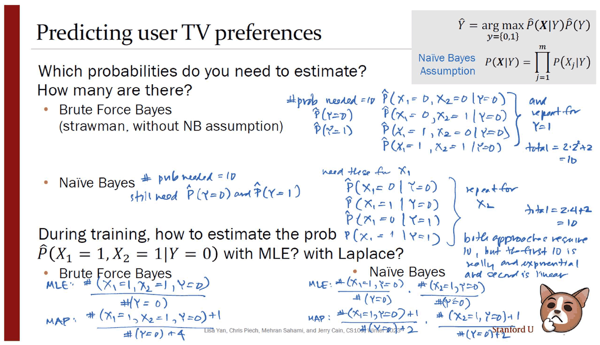
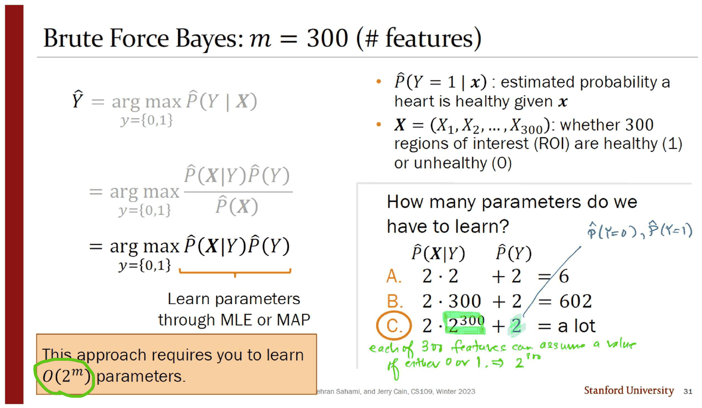
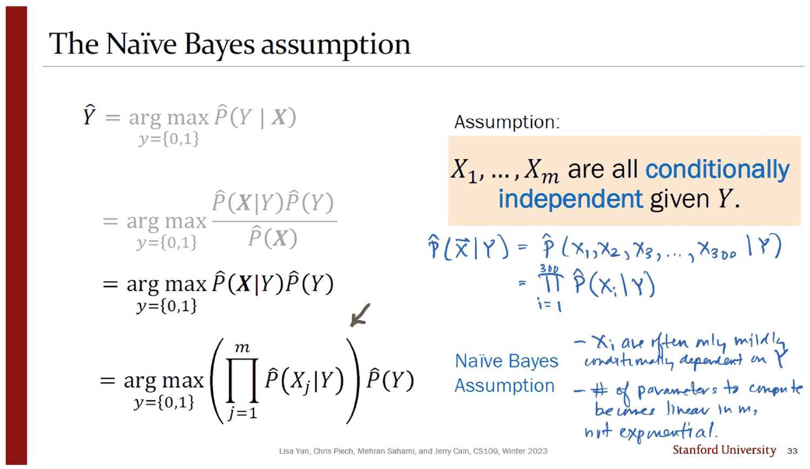
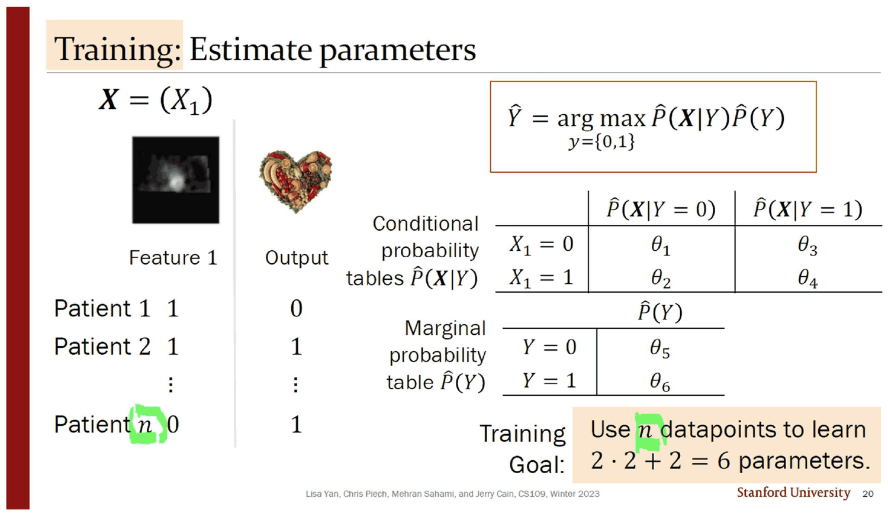
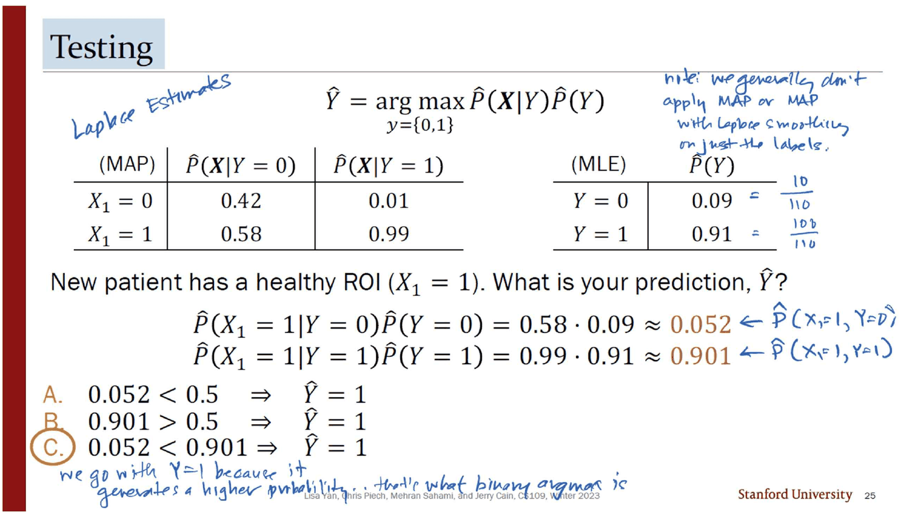
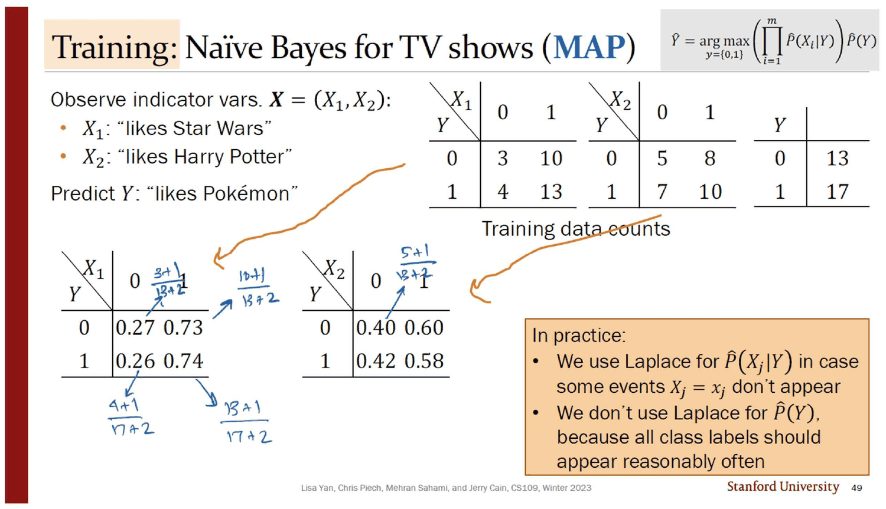
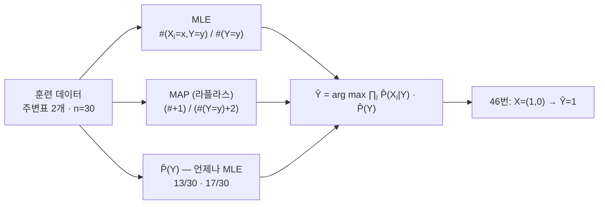
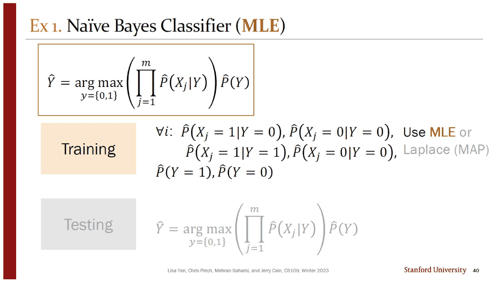
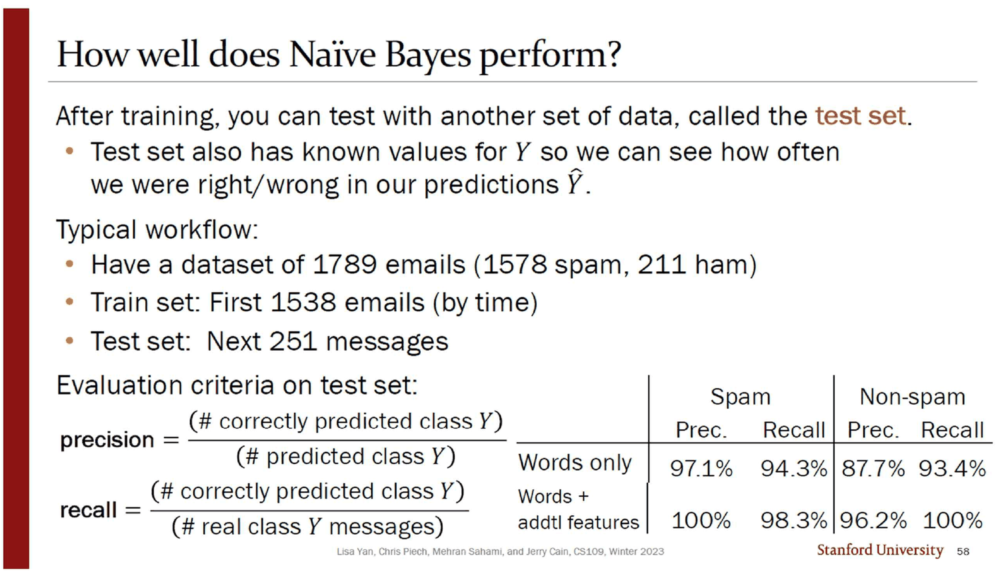

## 여백에서 두 번 세는 장면

39번 슬라이드는 두 줄짜리 질문이다. *"Which probabilities do you need to estimate? How many are there?"* 아래에 점 둘 — `Brute Force Bayes (strawman, without NB assumption)` 과 `Naïve Bayes`. 인쇄된 것은 거기까지고, 답은 여백의 잉크가 쓴다.

잉크는 위쪽 점부터 센다. $\hat P(Y=0)$, $\hat P(Y=1)$, 그리고 $Y=0$ 에 대한 네 칸 $\hat P(X_1=0,X_2=0\mid Y=0)$ … $\hat P(X_1=1,X_2=1\mid Y=0)$, `and repeat for Y=1`. 합계를 옆에 적는다 — `total = 2·2² + 2 = 10`.

그리고 아래쪽 점을 센다. $X_1$ 에 대한 네 개, `repeat for X₂`, 여전히 $\hat P(Y=0)$ 과 $\hat P(Y=1)$ 이 필요하다. 합계 — `total = 2·4 + 2 = 10`.



둘 다 **10**이다. 잉크는 이 우연을 알아채고 바로 아래에 변명을 적는다 — *"both approaches require 10, but the first 10 is really an exponential and second is linear."*

맞는 말이다. 그런데 그 문장은 이 덱에서 **산수로 확인되지 않는다.** 덱이 파라미터 수를 실제로 세는 자리는 세 곳뿐인데, 20번(특징 하나), 39번(특징 둘), 그리고 30·31번(특징 300개)이다. 앞의 둘에서 두 방법의 비용은 정확히 같고, 셋째에서는 숫자가 `a lot` 으로 적혀 있다.

> [!important] 이 노트의 척추
> 덱의 주장은 「$2^m$ 을 $m$ 으로 바꾼다」 하나다. 그런데 **주장이 사는 곳($m=300$, $m=100{,}000$)에서는 아무것도 계산하지 않고, 계산이 일어나는 곳($m=1$, $m=2$)에서는 주장이 보이지 않는다.** 덱 자신의 셈법으로 $m=1$ 과 $m=2$ 는 절약이 0인 유일한 두 값이고, 덱은 그 두 값에서만 끝까지 계산한다.

---

## 덱이 파는 물건 — $2^m$ 이라는 벽

30번이 질문을 던진다. 300개의 관심 영역(ROI)이 각각 건강한지 아닌지를 보고 심장이 건강한지 맞히는 문제다.

> How many parameters do we have to learn?
> **A.** $2 \cdot 2 + 2 = 6$ **B.** $2 \cdot 300 + 2 = 602$ **C.** $2 \cdot 2^{300} + 2 =$ a lot

31번이 C에 동그라미를 치고, 초록 잉크가 이유를 쓴다 — *"each of 300 features can assume a value of either 0 or 1 ⇒ $2^{300}$."* 왼쪽 아래 주황 상자가 결론을 붙인다. `This approach requires you to learn` $O(2^m)$ `parameters.`



> [!note] 보기 A는 버려진 답이 아니라 20번 슬라이드의 정답이다
> $2\cdot2+2=6$ 은 열 장 앞 20번 슬라이드가 **특징이 하나일 때** 실제로 학습한 파라미터 수다. 덱은 자기가 방금 푼 문제의 답을 오답 보기로 재활용한다. 보기 B($2 \cdot 300 + 2 = 602$)도 버려지지 않는다 — 33번에서 나이브 베이즈 가정을 넣으면 나올 수의 절반이다(뒤에서 다시 본다).

32번이 벽에 이름을 붙인다. *"Estimating this joint conditional distribution is intractable"* — 잉크가 조건을 덧붙인다, `if m is large`. 그리고 33번이 가정을 꺼낸다.

$$X_1, \ldots, X_m \text{ are all \textbf{conditionally independent} given } Y$$

$$\hat P(\boldsymbol X \mid Y) \;=\; \prod_{j=1}^{m} \hat P(X_j \mid Y)$$



인쇄된 것은 가정과 수식뿐이다. **왜 이 가정을 받아들일 만한지는 잉크에만 있다.**

> - $X_i$ are often only **mildly** conditionally dependent on $Y$
> - \# of parameters to compute becomes **linear in $m$, not exponential**

첫 줄이 중요하다. 가정이 참이라고 주장하지 않는다 — 어긋남이 크지 않다고만 한다. 32번의 인쇄된 문장도 같은 태도다. *"What if we could make a simplifying assumption—even if incredibly naïve—to make our parameter estimation effort computationally tractable?"* **이름 자체가 변명이다.**

34번이 답을 확정한다. `What is the Big-O of # of parameters we need to learn?` → **A. $O(m)$** (B의 $O(2^m)$ 옆에는 `Brute Force Bayes` 라는 꼬리표가 붙는다).

### 두 곡선이 언제 갈라지는가

덱은 이 비교를 그림으로 그리지 않는다. 덱 자신의 셈법 — $Y$ 의 두 값을 따로 세고, $X_j$ 의 두 값도 따로 세는 방식(35번 잉크가 `# parameters is roughly 4m + 2, and that's O(m)` 라고 적은 그 방식) — 을 그대로 써서 그려 보면 이렇게 된다.

```html preview
<div id="nbp" style="font-family:system-ui,-apple-system,sans-serif;color:var(--foreground);background:var(--card);border:1px solid var(--border);border-radius:12px;padding:18px 16px;">
  <p style="margin:0 0 14px;font-size:13px;color:var(--muted-foreground);line-height:1.7;">
    덱 자신의 셈법 — 브루트포스 <b>2·2<sup>m</sup> + 2</b>(29·30·31번), 나이브 베이즈 <b>4m + 2</b>(35번 여백의 잉크).
    세로축은 로그다. 슬라이더를 움직여 두 값을 직접 비교한다.</p>
  <div style="display:flex;flex-wrap:wrap;gap:12px;align-items:center;margin-bottom:14px;">
    <label style="font-size:13px;font-weight:600;">특징 수 m</label>
    <input id="nbm" type="range" min="1" max="24" value="2" step="1" style="flex:1;min-width:180px;accent-color:var(--chart-1);">
    <output id="nbv" style="font-variant-numeric:tabular-nums;font-weight:700;font-size:15px;min-width:2.2em;">2</output>
  </div>
  <svg id="nbs" viewBox="0 0 620 250" style="width:100%;height:auto;display:block;"></svg>
  <div id="nbo" style="margin-top:12px;font-size:13.5px;line-height:1.95;font-variant-numeric:tabular-nums;"></div>
</div>
<script>
(function(){
  const NS='http://www.w3.org/2000/svg', svg=document.getElementById('nbs');
  const el=(t,a,x)=>{const e=document.createElementNS(NS,t);for(const k in a)e.setAttribute(k,a[k]);
    if(x!==undefined)e.textContent=x;return e;};
  const MMAX=24, L=52, R=602, B=204, T=16;
  const brute=m=>2*Math.pow(2,m)+2, naive=m=>4*m+2;
  const ly=v=>Math.log10(v), Y0=ly(4), Y1=ly(brute(MMAX));
  const px=m=>L+(m-1)/(MMAX-1)*(R-L), py=v=>B-(ly(v)-Y0)/(Y1-Y0)*(B-T);
  function draw(msel){
    svg.textContent='';
    for(let e=1;e<=8;e++){
      const v=Math.pow(10,e); if(ly(v)<Y0||ly(v)>Y1) continue;
      svg.appendChild(el('line',{x1:L,y1:py(v),x2:R,y2:py(v),stroke:'var(--border)','stroke-dasharray':'3 5',opacity:0.6}));
      svg.appendChild(el('text',{x:L-8,y:py(v)+4,'text-anchor':'end','font-size':10,fill:'var(--muted-foreground)'},'10^'+e));
    }
    svg.appendChild(el('line',{x1:L,y1:B,x2:R,y2:B,stroke:'var(--border)'}));
    for(const m of [1,2,3,6,12,18,24])
      svg.appendChild(el('text',{x:px(m),y:B+18,'text-anchor':'middle','font-size':10.5,
        fill:'var(--muted-foreground)'},m));
    svg.appendChild(el('text',{x:(L+R)/2,y:B+36,'text-anchor':'middle','font-size':11,
      fill:'var(--muted-foreground)'},'특징 수 m'));
    const mk=(f,col,w)=>{let d='';for(let m=1;m<=MMAX;m++)d+=(m===1?'M':'L')+px(m)+' '+py(f(m));
      svg.appendChild(el('path',{d:d,fill:'none',stroke:col,'stroke-width':w}));};
    mk(brute,'var(--chart-2)',2.2); mk(naive,'var(--chart-1)',2.2);
    // m=1,2 동점 표시
    for(const m of [1,2]) svg.appendChild(el('circle',{cx:px(m),cy:py(brute(m)),r:5.5,
      fill:'none',stroke:'var(--foreground)','stroke-width':1.6,opacity:0.75}));
    svg.appendChild(el('text',{x:px(2)+10,y:py(brute(2))-8,'font-size':10.5,
      fill:'var(--foreground)',opacity:0.85},'m=1,2 — 둘 다 같은 값'));
    svg.appendChild(el('text',{x:px(MMAX)-4,y:py(brute(MMAX))+16,'text-anchor':'end','font-size':11,
      fill:'var(--chart-2)','font-weight':700},'브루트포스 2·2ᵐ+2'));
    svg.appendChild(el('text',{x:px(MMAX)-4,y:py(naive(MMAX))-10,'text-anchor':'end','font-size':11,
      fill:'var(--chart-1)','font-weight':700},'나이브 베이즈 4m+2'));
    for(const [f,col] of [[brute,'var(--chart-2)'],[naive,'var(--chart-1)']])
      svg.appendChild(el('circle',{cx:px(msel),cy:py(f(msel)),r:5,fill:col}));
    svg.appendChild(el('line',{x1:px(msel),y1:T,x2:px(msel),y2:B,stroke:'var(--foreground)',
      'stroke-width':1,'stroke-dasharray':'4 4',opacity:0.45}));
  }
  function upd(){
    const m=+document.getElementById('nbm').value;
    document.getElementById('nbv').textContent=m;
    draw(m);
    const b=brute(m), n=naive(m), fmt=x=>x.toLocaleString('en-US');
    let msg;
    if(m===1) msg='<b>20번 슬라이드의 자리다.</b> 2·2+2 = 6 과 4·1+2 = 6 — 절약은 <b>정확히 0</b>. 덱은 여기서 표를 채우고 새 환자를 분류한다.';
    else if(m===2) msg='<b>39~49번 슬라이드의 자리다.</b> 2·2²+2 = 10 과 4·2+2 = 10 — 여전히 <b>절약 0</b>. 덱의 완결된 예제 전체가 이 점 위에 있다.';
    else if(m===3) msg='<b>처음으로 갈라지는 점.</b> 18 대 14 — 차이 4개. 덱은 이 지점을 지나가지 않는다.';
    else if(m<=10) msg='차이가 아직 사람이 셀 수 있는 크기다. 덱이 다루지 않는 구간.';
    else msg='여기서부터가 잉크가 말한 「exponential vs linear」의 실제 모습이다. 덱은 이 구간에 숫자를 하나도 적지 않는다.';
    document.getElementById('nbo').innerHTML =
      '<span style="color:var(--chart-2);font-weight:700">브루트포스 '+fmt(b)+'</span> &nbsp;대&nbsp; '+
      '<span style="color:var(--chart-1);font-weight:700">나이브 '+fmt(n)+'</span>'+
      (b>n? ' &nbsp;— 배율 <b>'+(b/n).toFixed(b/n>100?0:2)+'배</b>':' &nbsp;— <b>동점</b>')+
      '<p style="margin:8px 0 0;font-size:12.5px;color:var(--muted-foreground);line-height:1.75">'+msg+'</p>';
  }
  document.getElementById('nbm').addEventListener('input',upd); upd();
})();
</script>

$m=1$ 과 $m=2$ 에서 $2\cdot2^m+2 = 4m+2$ 다. $m=3$ 에서 처음으로 18 대 14 로 갈라지고, 거기서부터는 다시 만나지 않는다. **덱이 표를 채우고 새 데이터를 분류하는 예제는 정확히 $m=1$ 과 $m=2$ 두 개뿐이다.**

> [!tip] 덱의 셈법은 자유 파라미터를 세지 않는다
> 30번의 보기 A가 특징 하나에 6개를 세는 것은 $\hat P(X_1=0\mid Y=0)$ 과 $\hat P(X_1=1\mid Y=0)$ 을 **따로** 세기 때문이다. 둘의 합은 1이므로 실제로 자유로운 것은 하나다. 35번 여백의 잉크가 바로 그 점을 지적한다 — $P(X_j=0\mid Y=0) = 1 - P(X_j=1\mid Y=0)$ 이라고 화살표를 그려 두었고, 같은 슬라이드의 인쇄된 훈련 목록도 $\hat P(X_j=1\mid Y=\cdot)$ 두 개만 적는다. 자유 파라미터로 다시 세면 브루트포스 $2^{m+1}-1$, 나이브 $2m+1$ 이고 **동점은 $m=1$ 하나뿐**이다($m=2$ 에서 7 대 5). 어느 셈법을 쓰든 결론은 같다 — 덱의 예제는 절약이 없거나 거의 없는 자리에 있다.

---

## 계산이 실제로 일어나는 곳 ① — 특징 하나

18~25번은 특징이 **하나**인 훈련·시험 전 과정이다. $X_1$ 은 관심 영역 하나가 건강한지, $Y$ 는 심장이 건강한지.

20번의 훈련 데이터는 네 칸이다.

| | $Y=0$ | $Y=1$ |
| --- | ---: | ---: |
| $X_1 = 0$ | 4 | 0 |
| $X_1 = 1$ | 6 | 100 |
| **합** | **10** | **100** |



슬라이드는 `Training Goal: Use n datapoints to learn 2·2 + 2 = 6 parameters` 라 적고, 잉크가 $n$ 에 동그라미를 친 뒤 `this amounts to brute force counting` 이라고 옆에 쓴다.

여기서 **$\hat P(X_1=0 \mid Y=1) = 0/100 = 0$** 이 나온다. 21번이 그 칸을 짚고, 22~24번이 라플라스 평활을 꺼낸다.

$$\hat P(X_1=x \mid Y=y) \;=\; \frac{\#(X_1=x, Y=y)+1}{\#(Y=y)+2}$$

| | $\hat P(X_1 \mid Y=0)$ | $\hat P(X_1 \mid Y=1)$ |
| --- | ---: | ---: |
| $X_1 = 0$ | $\frac{4+1}{10+2} = \frac{5}{12} \approx 0.42$ | $\frac{0+1}{100+2} = \frac{1}{102} \approx 0.01$ |
| $X_1 = 1$ | $\frac{6+1}{10+2} = \frac{7}{12} \approx 0.58$ | $\frac{100+1}{100+2} = \frac{101}{102} \approx 0.99$ |

그리고 25번이 새 환자를 분류한다. $X_1 = 1$ 일 때 어느 쪽이 큰가.



$$\hat P(X_1=1\mid Y=0)\hat P(Y=0) = 0.58 \cdot 0.09 \approx 0.052$$
$$\hat P(X_1=1\mid Y=1)\hat P(Y=1) = 0.99 \cdot 0.91 \approx 0.901$$

25번에서 눈여겨볼 것은 **표 머리의 라벨 둘**이다. $\hat P(\boldsymbol X\mid Y)$ 표에는 `(MAP)`, $\hat P(Y)$ 표에는 `(MLE)` 가 붙어 있다. 같은 한 슬라이드가 **두 추정법을 섞어 쓴다.** 왜 그런지는 인쇄되어 있지 않고, 오른쪽 위 잉크가 채운다.

> note: we generally don't apply MAP or MAP with Laplace smoothing on just the labels.

그 이유의 인쇄된 버전은 **24장 뒤 49번 슬라이드**에 가서야 나온다. 잉크가 24장을 앞당겨 준 셈이다.



> **In practice:** We use Laplace for $\hat P(X_j\mid Y)$ in case some events $X_j = x_j$ don't appear / We **don't** use Laplace for $\hat P(Y)$, because all class labels should appear reasonably often

---

## 계산이 실제로 일어나는 곳 ② — 특징 둘

37~49번은 넷플릭스 절이다. 「스타워즈를 좋아하는가($X_1$)」와 「해리 포터를 좋아하는가($X_2$)」로 「포켓몬을 좋아하는가($Y$)」를 맞힌다. 그리고 이것이 **덱에서 유일하게 끝까지 계산되는 나이브 베이즈 예제**다.

훈련 데이터는 두 개의 주변표로만 주어진다(41번).

| | $X_1=0$ | $X_1=1$ | | $X_2=0$ | $X_2=1$ | | 합 |
| --- | ---: | ---: | --- | ---: | ---: | --- | ---: |
| $Y=0$ | 3 | 10 | | 5 | 8 | | **13** |
| $Y=1$ | 4 | 13 | | 7 | 10 | | **17** |

42번의 형광펜이 행을 묶어 $n = 13 + 17 = 30$ 을 얻는다. 43번이 MLE 표를 완성하고, 49번이 MAP 표를 완성한다.



> [!warning] 주변표만으로 충분한 것이 나이브 가정의 정확한 내용이다
> 41번은 $(X_1, X_2)$ 의 **결합표를 주지 않는다.** 네 칸짜리 표 두 개뿐이다. 브루트포스 베이즈라면 이 데이터로는 훈련이 불가능하다 — $\hat P(X_1=1, X_2=1 \mid Y=0)$ 을 셀 수 없기 때문이다. 39번 여백의 잉크가 브루트포스 쪽 MLE 를 $\frac{\#(X_1=1,X_2=1,Y=0)}{\#(Y=0)}$ 로 적어 놓은 것이 그 차이를 그대로 보여 준다. **가정은 계산량만 줄이는 것이 아니라 필요한 데이터의 모양을 바꾼다.**

### 훈련된 분류기를 직접 돌려 본다

덱은 46번에서 입력 하나만 시험한다 — $X_1=1$(스타워즈 좋아함), $X_2=0$(해리 포터 싫어함). 네 가지 입력이 가능한데 나머지 셋은 묻지 않는다. 43번·49번의 인쇄된 값을 그대로 넣어 네 경우를 전부 돌려 보면 이렇게 된다.

```html preview
<div id="nbc" style="font-family:system-ui,-apple-system,sans-serif;color:var(--foreground);background:var(--card);border:1px solid var(--border);border-radius:12px;padding:18px 16px;">
  <p style="margin:0 0 14px;font-size:13px;color:var(--muted-foreground);line-height:1.7;">
    43번(MLE)과 49번(MAP)의 <b>인쇄된 값 그대로</b>. P̂(Y)는 두 경우 모두 MLE(0.43 · 0.57) — 49번 주황 상자의 지시다.</p>
  <div style="display:flex;flex-wrap:wrap;gap:18px;align-items:center;margin-bottom:6px;font-size:13px;">
    <span><b>X₁</b> 스타워즈
      <button class="nbb" data-k="x1" data-v="0">싫어함 0</button><button class="nbb on" data-k="x1" data-v="1">좋아함 1</button></span>
    <span><b>X₂</b> 해리 포터
      <button class="nbb on" data-k="x2" data-v="0">싫어함 0</button><button class="nbb" data-k="x2" data-v="1">좋아함 1</button></span>
    <span><b>추정법</b>
      <button class="nbb on" data-k="est" data-v="mle">MLE</button><button class="nbb" data-k="est" data-v="map">MAP</button></span>
  </div>
  <svg id="nbcs" viewBox="0 0 620 150" style="width:100%;height:auto;display:block;margin-top:8px;"></svg>
  <div id="nbco" style="margin-top:10px;font-size:13.5px;line-height:1.95;font-variant-numeric:tabular-nums;"></div>
  <style>
    #nbc .nbb{font:inherit;font-size:12px;padding:3px 9px;margin-left:4px;cursor:pointer;
      border:1px solid var(--border);background:transparent;color:var(--muted-foreground);border-radius:6px;}
    #nbc .nbb.on{background:var(--chart-1);border-color:var(--chart-1);color:var(--card);font-weight:700;}
  </style>
</div>
<script>
(function(){
  const NS='http://www.w3.org/2000/svg', svg=document.getElementById('nbcs');
  const el=(t,a,x)=>{const e=document.createElementNS(NS,t);for(const k in a)e.setAttribute(k,a[k]);
    if(x!==undefined)e.textContent=x;return e;};
  // 43번 슬라이드(MLE) / 49번 슬라이드(MAP)의 인쇄값
  const T={mle:{x1:[[0.23,0.77],[0.24,0.76]], x2:[[0.38,0.62],[0.41,0.59]]},
           map:{x1:[[0.27,0.73],[0.26,0.74]], x2:[[0.40,0.60],[0.42,0.58]]}};
  const PY=[0.43,0.57];
  const st={x1:1,x2:0,est:'mle'};
  function draw(){
    const t=T[st.est];
    const v0=t.x1[0][st.x1]*t.x2[0][st.x2]*PY[0];
    const v1=t.x1[1][st.x1]*t.x2[1][st.x2]*PY[1];
    const mx=Math.max(v0,v1), L=150, R=580, rowY=[46,96];
    svg.textContent='';
    [[0,v0],[1,v1]].forEach(([y,v])=>{
      const w=(R-L)*(v/0.30), col=v===mx?'var(--chart-1)':'var(--chart-2)';
      svg.appendChild(el('text',{x:L-12,y:rowY[y]+5,'text-anchor':'end','font-size':12.5,
        fill:'var(--foreground)','font-weight':v===mx?700:400},'Y = '+y+(y?'  (포켓몬 좋아함)':'  (안 좋아함)')));
      svg.appendChild(el('rect',{x:L,y:rowY[y]-14,width:Math.max(w,2),height:28,rx:4,fill:col,
        opacity:v===mx?0.95:0.42}));
      svg.appendChild(el('text',{x:L+Math.max(w,2)+10,y:rowY[y]+5,'font-size':12.5,
        fill:'var(--foreground)','font-weight':v===mx?700:400},v.toFixed(4)));
    });
    svg.appendChild(el('text',{x:L,y:130,'font-size':11,fill:'var(--muted-foreground)'},
      '막대 길이 ∝ P̂(X₁|Y)·P̂(X₂|Y)·P̂(Y)  (정규화 전 값)'));
    const t1=t.x1[0][st.x1], t2=t.x1[1][st.x1], u1=t.x2[0][st.x2], u2=t.x2[1][st.x2];
    document.getElementById('nbco').innerHTML =
      'Y=0: '+t1.toFixed(2)+' · '+u1.toFixed(2)+' · 0.43 = <b>'+v0.toFixed(4)+'</b><br>'+
      'Y=1: '+t2.toFixed(2)+' · '+u2.toFixed(2)+' · 0.57 = <b>'+v1.toFixed(4)+'</b><br>'+
      '<span style="color:var(--chart-1);font-weight:700">예측 Ŷ = '+(v1>v0?1:0)+'</span>'+
      ' &nbsp;(배율 '+(Math.max(v0,v1)/Math.min(v0,v1)).toFixed(3)+'배)'+
      '<p style="margin:8px 0 0;font-size:12.5px;color:var(--muted-foreground);line-height:1.75">'+
      (st.x1===1&&st.x2===0&&st.est==='mle'
        ? '<b style="color:var(--chart-1)">46번 슬라이드가 실제로 계산한 유일한 입력이다.</b> 인쇄된 값은 0.126 과 0.178.'
        : '네 입력 · 두 추정법 — 여덟 경우를 모두 눌러 보라. <b>Ŷ 가 한 번도 0이 되지 않는다.</b>')+'</p>';
  }
  document.querySelectorAll('#nbc .nbb').forEach(b=>b.addEventListener('click',()=>{
    const k=b.dataset.k, v=b.dataset.v;
    st[k] = (k==='est') ? v : +v;
    document.querySelectorAll('#nbc .nbb[data-k="'+k+'"]').forEach(o=>o.classList.toggle('on',o===b));
    draw();
  }));
  draw();
})();
</script>

**여덟 경우 모두 $\hat Y = 1$ 이다.** MLE로도 MAP로도, 네 가지 입력 어디에서도 이 분류기는 0을 내놓지 않는다.

이유는 표를 보면 바로 보인다. $X_1$ 의 두 행이 `0.23 / 0.77` 과 `0.24 / 0.76` 이다 — 거의 같다. $X_2$ 도 `0.38 / 0.62` 와 `0.41 / 0.59` 로 거의 같다. **두 특징이 $Y$ 에 대해 사실상 아무 정보도 나르지 않는다.** 그래서 곱을 지배하는 것은 $\hat P(Y)$ 뿐이고, 그것은 $0.43$ 대 $0.57$ 로 처음부터 $Y=1$ 쪽이다.

> [!caution] 이것은 「항상 다수 클래스를 찍는」 분류기와 같다 (원본에 없는 보충)
> 훈련된 분류기가 상수 함수이므로 훈련 데이터에서의 정확도는 입력과 무관하게 $\hat P(Y=1) = 17/30 \approx 56.7\%$ — **기저율 그 자체**다. 두 특징을 세고 표를 네 개 만들고 라플라스 평활까지 적용한 결과가, 데이터를 한 번도 보지 않고 「무조건 좋아한다고 답한다」와 정확히 같은 예측을 한다. 덱은 입력을 하나만 시험하므로 이 사실을 만나지 않는다.
>
> 이것이 나이브 가정의 실패는 **아니다.** 주어진 주변표가 실제로 거의 독립이기 때문이고(예: $\hat P(X_1{=}1\mid Y{=}0)=0.769$ 대 $\hat P(X_1{=}1\mid Y{=}1)=0.765$), 어떤 방법을 써도 이 데이터에서는 같은 결론이 나온다. 다만 **절차의 시범과 방법의 효용은 다른 것**이고, 이 슬라이드들은 전자만 보여 준다.

### 인쇄된 값과 정확한 값

46번은 반올림된 표 값을 다시 곱한다. 분수로 처음부터 계산하면 조금 다르다.

| | 인쇄된 계산 | 정확한 값 | 차이 |
| --- | ---: | ---: | ---: |
| $Y=0$ 쪽 | $0.77 \cdot 0.38 \cdot 0.43 = 0.126$ | $\frac{10}{13}\cdot\frac{5}{13}\cdot\frac{13}{30} = \frac{5}{39} = 0.12821$ | $-1.9\%$ |
| $Y=1$ 쪽 | $0.76 \cdot 0.41 \cdot 0.57 = 0.178$ | $\frac{13}{17}\cdot\frac{7}{17}\cdot\frac{17}{30} = \frac{91}{510} = 0.17843$ | $-0.2\%$ |

결론($\hat Y = 1$)은 바뀌지 않는다. 25번의 특징 하나짜리 예제에서도 같은 일이 있다 — 인쇄된 $0.58 \cdot 0.09 \approx 0.052$ 의 정확값은 $\frac{7}{12}\cdot\frac{10}{110} = 0.05303$ 으로 $1.9\%$ 차이다. **표를 소수 둘째 자리에서 끊은 뒤 곱하면 오차가 곱해진다**는 것을 두 예제가 나란히 보여 주는데, 덱은 짚지 않는다.

---

## 같은 슬라이드가 세 번 나오고, 같은 자리가 두 번 틀린다

40 · 45 · 47 · 54 · 57번은 **같은 틀의 슬라이드 다섯 장**이다. `Ex 1. (MLE)` → `Ex 2. (MAP)` → `Ex 3. ($m, n$ large)` 로 제목만 바뀌고, 훈련 줄과 시험 줄 중 그때 강조할 쪽만 검게 남는다.



훈련 줄을 그대로 옮기면 이렇다.

> $\forall i$: &nbsp; $\hat P(X_j = 1 \mid Y=0)$, $\hat P(X_j = 0 \mid Y=0)$, $\hat P(X_j = 1 \mid Y=1)$, $\hat P(X_j = 0 \mid Y=0)$

네 항 중 **넷째가 셋째의 짝이 아니다.** $\hat P(X_j = 0 \mid Y=1)$ 이어야 하는데 $\hat P(X_j=0\mid Y=0)$ 이 다시 적혀 있어, 둘째 항과 글자 하나까지 같다. 그리고 앞의 한정사가 **$\forall i$** 인데 본문의 첨자는 전부 $j$ 다.

이 줄이 다섯 장에 걸쳐 어떻게 변하는지 세어 보면 이렇게 된다.

| 슬라이드 | 제목 | 한정사 | 넷째 항 |
| --- | --- | --- | --- |
| 40 | Ex 1. (MLE) | $\forall i$ | $\hat P(X_j=0\mid Y=0)$ ❌ |
| 45 | Ex 1. (MLE) | $\forall i$ | $\hat P(X_j=0\mid Y=0)$ ❌ |
| 47 | Ex 2. (MAP) | $\forall i$ | $\hat P(X_j=0\mid Y=0)$ ❌ |
| 54 | Ex 3. ($m,n$ large) | **$\forall j$** ✅ | $\hat P(X_j=0\mid Y=0)$ ❌ |
| 57 | Ex 3. ($m,n$ large) | $\forall i$ | $\hat P(X_j=0\mid Y=0)$ ❌ |

**54번에서 한정사는 고쳐지고 넷째 항은 고쳐지지 않는다.** 그리고 57번에서 한정사가 다시 $\forall i$ 로 돌아간다. 고침이 한 장에만 남았다는 것은 이 다섯 장이 복사·붙여넣기로 만들어졌고 그중 한 장만 손댄 흔적이다.

> [!note] 35번은 같은 목록을 다르게 적는다
> 35번의 훈련 줄은 `for j = 1, …, m:` 으로 시작해 $\hat P(X_j=1\mid Y=0)$ 과 $\hat P(X_j=1\mid Y=1)$ **둘만** 적는다($X_j = 0$ 쪽은 여집합이므로 필요 없다). 잉크가 그 옆에 화살표로 $P(X_j=0\mid Y=0) = 1 - P(X_j=1\mid Y=0)$ 을 써 둔다. **정확하고 짧은 버전이 먼저 나오고, 다섯 장 뒤부터 길고 틀린 버전이 반복된다.**

---

## 주장이 사는 곳 — 어휘 10만 개

50번부터 마지막까지가 스팸 절이다. 51번이 실제 메일 서버의 `SpamAssassin` 판정 로그를 띄운다 — `8.0 BAYES_99  BODY: Bayesian spam probability is 99 to 100% [score: 1.0000]` — 그리고 그 아래 Sahami·Dumais·Heckerman·Horvitz의 1998년 논문 첫 장을 붙인다. 이 덱의 저자 목록에 있는 **Mehran Sahami** 가 그 논문의 제1저자다.

52번이 규모를 밝힌다.

> Consider a lexicon $m$ words (for English: $m \approx 100{,}000$). $X_j = 1$ if word $j$ appeared in document.

$m = 100{,}000$ 이면 브루트포스는 $2 \cdot 2^{100000} + 2$ 개, 나이브 베이즈는 $4 \cdot 100{,}000 + 2 = 400{,}002$ 개다. **덱이 파는 물건의 값어치가 가장 분명해지는 자리인데, 이 두 수 중 어느 것도 인쇄되어 있지 않다.** 52번이 적는 것은 `Note: m is huge` 한 줄이고, 그 문장은 53 · 56번에서 두 번 더 반복된다.

> [!note] 이 슬라이드에는 다른 층의 주석이 있다
> 52번에는 손글씨 잉크가 아니라 **타자된 한국어 두 개**가 붙어 있다 — `lexicon` 아래 「어휘,사전」, `indicator variables` 아래 「지표 변수」. 이 덱의 나머지 여백을 채우는 영문 필기와는 도구도 언어도 다르다. 앞선 노트들이 관찰한 「한국에서 이 자료를 다시 가르치는 사람」의 층이 이 덱에서는 두 겹으로 나타난다.

53번이 여기서 MLE 를 쓸 수 없는 이유를 댄다. 오른쪽에 주황색으로 `Many words are likely to not appear at all in the training set!` — 어휘의 대부분은 어떤 특정 메일 묶음에도 안 나온다. MLE 로는 그 단어들이 전부 0이 되고, 곱 하나가 0이면 그 클래스의 점수 전체가 0이 된다. 54번의 주황 상자가 결론을 확정한다.

> Laplace (MAP) estimates avoid estimating 0 probabilities for events that don't occur in your training data.

56번이 두 번째 문제를 꺼낸다 — 10만 개의 0과 1 사이 수를 곱하면 `Will probably lead to underflow!` 57번이 해결한다.

$$\hat Y \;=\; \arg\max_{y=\{0,1\}} \left( \log \hat P(Y) + \sum_{j=1}^{m} \log \hat P(X_j \mid Y) \right)$$

35번에 이미 나왔던 식이고, 그때 잉크가 `go with logs for numerical stability` 라고 적어 두었던 바로 그것이다.

### 마지막 두 장에서 숫자가 돌아온다 — 다른 것을 재는 숫자로

58번이 실제 실험 결과를 붙인다.



> - Have a dataset of **1789** emails (**1578** spam, **211** ham)
> - Train set: First **1538** emails (by time) · Test set: Next **251** messages

| | 스팸 정밀도 | 스팸 재현율 | 비스팸 정밀도 | 비스팸 재현율 |
| --- | ---: | ---: | ---: | ---: |
| Words only | 97.1% | 94.3% | 87.7% | 93.4% |
| Words + addtl features | 100% | 98.3% | 96.2% | 100% |

$1538 + 251 = 1789$ 이고 $1578 + 211 = 1789$ 다. 말뭉치는 맞아떨어진다. 그런데 **251통이 어떻게 나뉘는지는 덱이 말하지 않는다.** 네 퍼센트가 그것을 대신 말해 준다.

> [!tip] 네 퍼센트가 251통의 구성을 유일하게 못 박는다 (원본에 없는 보충)
> 시험 집합의 스팸 수 $S$, 비스팸 수 $N = 251 - S$, 맞힌 스팸 수 $TP$, 잘못 스팸이라 한 수 $FP$ 를 미지수로 두고 첫 행의 네 퍼센트를 소수 첫째 자리까지 재현하는 정수해를 **전부** 탐색하면 해가 **정확히 하나** 나온다.
>
> $$S = 175,\quad N = 76,\quad TP = 165,\quad FP = 5$$
>
> 확인: $165/170 = 97.06\%$, $165/175 = 94.29\%$, $71/81 = 87.65\%$, $71/76 = 93.42\%$ — 네 개 모두 인쇄값과 일치한다. 둘째 행도 같은 $175/76$ 분할에서 $TP = 172$, $FP = 0$ 으로 맞는다($172/175 = 98.29\%$, $76/79 = 96.20\%$).
>
> 퍼센트를 개수로 되돌리면 두 행의 차이가 훨씬 또렷해진다. **놓친 스팸 10통 → 3통**, **잘못 막은 정상 메일 5통 → 0통.** 「87.7% → 96.2%」보다 이쪽이 실제로 일어난 일이다.

> [!caution] 시간 순 분할이 클래스 비율을 보존하지 않는다 (원본에 없는 보충)
> 위에서 얻은 $S = 175$ 를 말뭉치와 맞춰 보면 시험 집합의 스팸 비율은 $175/251 = 69.7\%$ 인데, 말뭉치 전체는 $1578/1789 = 88.2\%$, 그러면 훈련 집합은 $(1578-175)/1538 = 91.2\%$ 다. **「First 1538 emails (by time)」라는 분할이 훈련 쪽에 스팸을 몰아넣었다.** 이 덱이 그토록 강조한 $\hat P(Y)$ 는 훈련 집합에서 추정되므로 0.912 근처가 되는데, 시험 집합의 실제 비율은 0.697 이다. 덱은 이 어긋남을 언급하지 않는다.

59번이 정밀도와 재현율을 말로 푼다. `Accuracy (# correct)/(# total) sometimes just doesn't cut it.` — 그리고 그 이유를 이 말뭉치가 직접 보여 준다. 시험 집합의 69.7%가 스팸이므로 **무조건 스팸이라 답하기만 해도 정확도 69.7%** 다. 넷플릭스 절의 분류기가 무조건 $Y=1$ 을 답해 56.7%를 얻었던 것과 같은 구조다. 덱이 두 절에서 같은 함정을 한 번은 모르고 지나가고, 한 번은 이름을 붙인다.

---

## 결번 하나와, 갚히지 않은 빚 하나

`23_naive_bayes.pdf` 는 58쪽이고 마지막 인쇄 번호는 **59**다. 1~54번은 쪽과 슬라이드가 1:1로 맞고, **55번 한 장만 빠져 있다**(PDF 55쪽이 슬라이드 56이다). 앞 회차들이 세어 온 결번 — 11번 덱 5장, 13번 덱 9장 — 에 비하면 이 덱은 거의 온전하다. 17번 덱(0장) 다음으로 결번이 적다.

빠진 자리가 어디인지는 앞뒤로 좁혀진다. 54번이 `Ex 3.` 의 훈련 쪽을 강조하고, 56번이 시험 쪽의 언더플로 문제를 꺼내며, 57번이 로그 합으로 답한다. **55번은 `Ex 3.` 의 시험 줄을 강조한 판** — 47번이 45번에 대해 했던 역할 — 이었을 가능성이 높다. 다섯 장짜리 반복 틀에서 한 장만 사라진 것이다.

### 앞선 노트들이 이 덱에 넘긴 것 넷 중 셋이 갚혔다

| 넘긴 곳 | 넘긴 내용 | 이 덱에서 |
| --- | --- | --- |
| [[15. 조건부확률의 정의를 그대로 실행하는 다섯 줄]] | 조건부독립의 곱을 로그 합으로 바꾸는 변환 — 15번 덱 11번이 *"cool to remember for later"* 로만 적어 두었다 | **갚혔다.** 35번에 식이 나오고 잉크가 이유를 적으며, 56·57번이 그 이유(언더플로)를 인쇄물로 확정한다 |
| [[20. 사전 믿음을 상상한 데이터로 적는다]] | 라플라스 평활 — 본 적 없는 결과에 0을 주지 않는 장치 | **갚혔다.** 21~24번이 $0/100$ 이라는 실제 0에서 출발하고, 53·54번이 어휘 10만 개 규모에서 이것이 선택이 아니라 필수임을 못 박는다 |
| [[11. 두 번 포기한다 — 분포를 근사하고, 결합분포를 버린다]] | 11번 덱 36번의 스팸 분류 — 48개 단어의 **빈도**로 스팸 여부를 가르는 형식 | **절반만.** 스팸 분류는 나오지만 모형이 다르다. 52번의 $X_j$ 는 *"1 if word $j$ appeared in document"* — **횟수가 아니라 등장 여부**다. 11번 덱이 예고한 다항분포는 끝내 나오지 않는다 |
| 06번 노트(기댓값) | 06번 덱이 6주 뒤로 미룬 것 — 넷플릭스의 잠재변수 $K$ 를 데이터에서 정하는 법 | **갚히지 않았다.** 36~49번의 제목이 `Netflix and Learn` 이고 내용은 지도 학습 분류다. $Y$ 는 관측되고, 잠재변수는 한 번도 등장하지 않는다 |

마지막 줄이 이 과목의 마지막 미결이다. 06번 덱이 「6주 뒤」라고 적은 자리에 실제로 온 것은 잠재변수가 아니라 **넷플릭스 로고를 쓴 지도 학습 예제**였다. 강의 덱 스물아홉 편이 여기서 끝나므로, 그 빚은 갚히지 않은 채로 남는다.

---

## 원본에서 발견한 것

`계산·표기 오류`

- **40 · 45 · 47 · 54 · 57번** — 훈련 목록의 **네 번째 항이 다섯 장 모두 $\hat P(X_j=0\mid Y=0)$** 이다. $\hat P(X_j=0\mid Y=1)$ 이어야 하고, 현재 상태로는 두 번째 항과 완전히 같은 식이 중복된다
- **40 · 45 · 47 · 57번** — 같은 줄의 한정사가 **$\forall i$** 인데 본문 첨자는 전부 $j$ 다. **54번 한 장에서만 $\forall j$ 로 고쳐져 있고 57번에서 다시 $\forall i$ 로 돌아간다**
- **39번 ↔ 49번** — 오른쪽 위에 붙는 같은 요약 상자가 39번에서는 $\prod_{j=1}^{m} P(X_j\mid Y)$, 49번에서는 $\prod_{i=1}^{m}\hat P(X_i\mid Y)$ 다. 같은 상자가 두 첨자로 인쇄되어 있다
- **19 · 25 · 26 · 30 · 31 · 32 · 33 · 34 · 35번 등** — $\arg\max$ 의 아래첨자가 전부 **$y=\{0,1\}$** 이다. 원소 기호 $y \in \{0,1\}$ 이어야 한다. 덱 전체에서 한 번도 고쳐지지 않는다
- **46번** — 반올림된 표 값으로 다시 곱해 $0.77\cdot0.38\cdot0.43 = 0.126$ 을 얻는데, 분수로 계산한 값은 $\frac{5}{39} = 0.12821$ 이다(1.9% 차이). 25번의 $0.58\cdot0.09\approx0.052$ 도 정확값 $0.05303$ 과 같은 크기로 어긋난다. 두 예제 모두 결론은 바뀌지 않는다

`문장의 흔들림`

- **4 · 9 · 14번** — 같은 회색 글머리표가 세 가지 문장으로 인쇄되어 있다. *"prediction **given prior** observations"*(4번) · *"prediction **from** observations"*(9번) · *"prediction **based on** observations"*(14번). 이 줄은 절마다 같은 자리를 차지하는 목차성 문장이므로 원래 같아야 한다
- **13번** — 시험 데이터를 *"see how well you can predict $Y$ on **known** data"* 라고 적는다. 58번은 같은 것을 *"Test set also has known values for $Y$ so we can see how often we were right/wrong"* 로 풀어 쓰는데, 13번의 짧은 문장만 읽으면 시험이 **본 적 있는** 데이터에서 이뤄진다고 읽힌다
- **13번** — 시험 집합 크기를 $n_{test}$ 라 정의해 놓고, 바로 아래 나열은 $(\boldsymbol x^{(1)}, y^{(1)}), \ldots, (\boldsymbol x^{(n)}, y^{(n)})$ 으로 **훈련 집합과 같은 $n$** 으로 끝난다

`구성`

- **결번 한 장** — 슬라이드 55번(PDF 55쪽이 슬라이드 56). 그 외에는 1~54번이 쪽 번호와 1:1로 맞는다
- **17번 절 표지에만 설명이 붙어 있다** — 다른 네 표지(2 · 27 · 36 · 50번)는 제목 한 줄뿐인데, 17번에는 다른 서체로 *"Brute-Force Bayes Concept Learning Algorithm finds the maximum a posteriori hypothesis ($h_{MAP}$), based on Bayes theorem"* 한 문단이 덧붙어 있다. **$h_{MAP}$ 라는 기호는 이 덱 어디에도 다시 나오지 않는다** — 다른 교재에서 옮겨 온 문장이다
- **타자된 한국어 주석** — 52번의 「어휘,사전」과 「지표 변수」. 이 덱의 나머지 여백은 전부 영문 손글씨이므로 주석 층이 둘이다

`인쇄되지 않은 것 — 잉크가 채운 자리`

- **33번** — 나이브 가정을 **왜 받아들일 만한지**가 인쇄되어 있지 않다. *"$X_i$ are often only mildly conditionally dependent on $Y$"* 와 *"\# of parameters becomes linear in $m$, not exponential"* 은 둘 다 잉크다. 인쇄된 것은 가정 문장과 수식뿐이다
- **25번** — 같은 슬라이드가 $\hat P(\boldsymbol X\mid Y)$ 에는 MAP, $\hat P(Y)$ 에는 MLE 를 쓰는데 **그 이유가 24장 뒤(49번)에 가서야 인쇄된다.** 잉크가 그 자리에서 미리 적는다 — *"we generally don't apply MAP … with Laplace smoothing on just the labels"*
- **39번** — `Which probabilities do you need to estimate? How many are there?` 의 **답이 통째로 잉크**다. 브루트포스 10개, 나이브 베이즈 10개, 그리고 둘의 차이에 대한 해설까지
- **31번** — $2^{300}$ 이 어디서 오는지의 설명(`each of 300 features can assume a value of either 0 or 1`)이 초록 잉크다
- **35번** — 여집합으로 파라미터를 반으로 줄일 수 있다는 지적($P(X_j=0\mid Y=0) = 1-P(X_j=1\mid Y=0)$)과 총 개수 `roughly 4m + 2` 가 잉크에만 있다

`재계산해 얻은 것 (원본에 없는 보충)`

- **덱의 셈법으로 $2\cdot2^m+2 = 4m+2$ 가 되는 $m$ 은 1과 2뿐이다.** 그리고 덱이 표를 끝까지 채우는 예제는 정확히 그 두 값에서만 일어난다($m=1$ — 20~25번, $m=2$ — 39~49번). 처음 갈라지는 $m=3$ 은 18 대 14인데 덱이 지나가지 않는다. 자유 파라미터로 다시 세면($2^{m+1}-1$ 대 $2m+1$) 동점은 $m=1$ 하나로 줄지만 그림은 같다
- **46번이 훈련한 분류기는 네 가지 입력 전부에 $\hat Y = 1$ 을 답한다.** MLE·MAP 모두, 인쇄값·정확값 모두 그렇다. 두 조건부표의 행이 서로 거의 같아($0.23/0.77$ 대 $0.24/0.76$, $0.38/0.62$ 대 $0.41/0.59$) 곱을 지배하는 것이 $\hat P(Y) = 0.43/0.57$ 하나뿐이기 때문이다. 훈련 정확도는 $17/30 = 56.7\%$ 로 기저율과 같다. 덱은 입력 하나만 시험하므로 이 사실을 만나지 않는다
- **58번의 네 퍼센트가 251통의 구성을 유일하게 결정한다.** 정수해 전수 탐색 결과 $S=175$(스팸) · $N=76$(정상) · $TP=165$ · $FP=5$ 하나뿐이고, 둘째 행도 같은 분할에서 $TP=172$ · $FP=0$ 으로 맞는다. 개수로 되돌리면 **놓친 스팸 10 → 3통, 잘못 막은 정상 메일 5 → 0통**이다
- **시험 집합의 스팸 비율(69.7%)이 훈련 집합(91.2%)과 크게 다르다.** `First 1538 emails (by time)` 라는 분할이 만든 결과다. 59번이 정확도를 못 믿을 것으로 선언하는데, 이 말뭉치에서는 무조건 스팸이라 답하기만 해도 정확도가 69.7% 나온다

---

## 근거 자료

`sources/23_naive_bayes.pdf` — 58쪽, 인쇄 슬라이드 1~59번(55번 결번). Stanford CS109, `Lisa Yan, Chris Piech, Mehran Sahami, and Jerry Cain, CS109, Winter 2023`. 이 덱은 **`page_chars` 합계가 58쪽 전체에서 189자**로, 쪽당 평균 3.3자다. 텍스트 추출은 사실상 한 글자도 잡지 못하므로 58쪽 전부를 130 dpi로 렌더해 눈으로 읽었다.

| 절 | 슬라이드 | 이 노트에서 |
| --- | --- | --- |
| Preamble: Machine Learning | 2~16 | 지도 학습의 틀, 훈련/시험 표기, 4·9·14번의 흔들리는 문장 |
| Brute Force Bayes | 17~26 | $m=1$ 의 완결된 예제(20~25번), $\arg\max$ 전개(26번) |
| Naïve Bayes | 27~35 | $m=300$ 의 $2^{300}$(28~31번), 가정(33번), $O(m)$(34번), 로그 합(35번) |
| Netflix and Learn | 36~49 | $m=2$ 의 완결된 예제 — MLE(41~46번)와 MAP(47~49번) |
| Spam and Learning | 50~59 | 어휘 10만 개(52번), 라플라스의 필연(53·54번), 언더플로(56·57번), 실험 결과(58·59번) |

인용한 슬라이드 여덟 장 — 20 · 25 · 31 · 33 · 39 · 40 · 49 · 58번. 모든 수치는 파이썬 유리수 연산(`fractions.Fraction`)으로 재계산해 인쇄값과 대조했고, 58번의 정수해는 $0 \le S \le 251$ 전 범위를 완전 탐색해 구했다.

### 이어지는 곳

- [[20. 사전 믿음을 상상한 데이터로 적는다]] — 라플라스 평활이 「상상한 시행」이라는 해석을 얻는 자리. 이 덱의 21~24번은 그 장치를 실제 0 위에서 쓴다
- [[19. 참값이 최대우도에서 진다]] — MLE 가 본 적 없는 사건에 0을 주는 성질. 53번의 `Many words are likely to not appear at all` 이 그 성질을 10만 개 규모로 옮긴 것이다
- [[15. 조건부확률의 정의를 그대로 실행하는 다섯 줄]] — 조건부독립을 인수분해로 쓰는 법. 33번의 $\prod_j \hat P(X_j\mid Y)$ 는 그 가장 얕은 형태(부모가 $Y$ 하나뿐인 베이즈망)다
- [[11. 두 번 포기한다 — 분포를 근사하고, 결합분포를 버린다]] — 「결합분포를 버린다」의 두 번째 사례가 이 덱이다. 11번 덱은 독립을 **가정**했고, 이 덱은 **조건부** 독립을 가정한다
