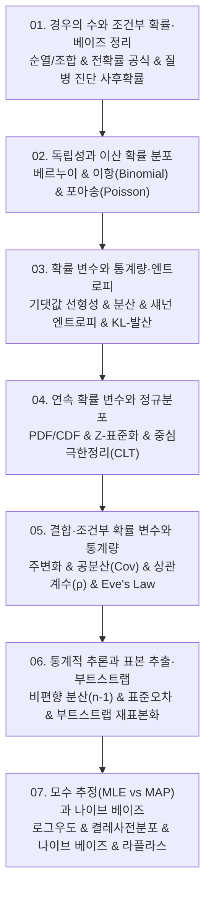

# 📚 확률과 통계 (Probability & Statistics for CS/AI) 전체 강의 로드맵

경우의 수와 베이즈 정리부터 이산·연속 확률 분포, 섀넌 정보 엔트로피, 다변량 결합 분포와 공분산, 부트스트랩 비모수 추론, 모수 추정(MLE/MAP) 및 나이브 베이즈 분류기까지 총망라합니다.

---

## 🗺️ 강의 목차 (Curriculum Overview)

---

## 📑 개별 정리 문서 목록

1. [01. 확률과 경우의 수 문제](file:///Users/um-yunsang/work/edu/ComputerScience/02_math-theory/probability-statistics/notes/01.%20%ED%99%95%EB%A5%A0%EA%B3%BC%20%EA%B2%BD%EC%9A%B0%EC%9D%98%20%EC%88%98%20%EB%AC%B8%EC%A0%9C.md)
   - 순열·조합, 전확률 정리, 베이지안 질병 진단 사후 확률(PPV) 시뮬레이터
2. [02. 독립성과 베르누이·이항 분포](file:///Users/um-yunsang/work/edu/ComputerScience/02_math-theory/probability-statistics/notes/02.%20%EB%8F%85%EB%A6%BD%EC%84%B1%EA%B3%BC%20%EB%B2%A0%EB%A5%B4%EB%88%84%EC%9D%B4%C2%B7%EC%9D%B4%ED%95%AD%20%EB%B6%84%ED%8F%AC.md)
   - 베르누이 시행, 이항 분포($E=np, \text{Var}=np(1-p)$), 포아송 극한 계산기
3. [03. 확률변수와 분산·엔트로피](file:///Users/um-yunsang/work/edu/ComputerScience/02_math-theory/probability-statistics/notes/03.%20%ED%99%95%EB%A5%A0%EB%B3%80%EC%88%98%EC%99%80%20%EB%B6%84%EC%82%B0%C2%B7%EC%97%94%ED%8A%B8%EB%A1%9C%ED%84%BC.md)
   - 기댓값 선형성, 분산 대수 법칙, 섀넌 정보 엔트로피 $H(p)$ 곡선 분석기
4. [04. 연속확률변수와 정규분포](file:///Users/um-yunsang/work/edu/ComputerScience/02_math-theory/probability-statistics/notes/04.%20%EC%97%B0%EC%86%8D%ED%99%95%EB%A5%A0%EB%B3%80%EC%88%98%EC%99%80%20%EC%A0%95%EA%B7%9C%EB%B6%84%ED%8F%AC.md)
   - 확률 밀도 함수(PDF), 가우스 68-95-99.7 법칙, Z-점수 및 누적 확률 적분기
5. [05. 결합·조건부 확률변수와 통계량](file:///Users/um-yunsang/work/edu/ComputerScience/02_math-theory/probability-statistics/notes/05.%20%EA%B2%B0%ED%95%A9%C2%B7%EC%A1%B0%EA%B1%B4%EB%B6%80%20%ED%99%95%EB%A5%A0%EB%B3%80%EC%88%98%EC%99%80%20%ED%86%B5%EA%B3%84%EB%9F%89.md)
   - 주변화, 공분산, 상관계수($\rho$), 전체 분산의 법칙(Eve's Law) 2x2 계산기
6. [06. 추론·표본추출과 부트스트랩](file:///Users/um-yunsang/work/edu/ComputerScience/02_math-theory/probability-statistics/notes/06.%20%EC%B6%94%EB%A1%A0%C2%B7%ED%91%9C%EB%B3%B8%EC%B6%94%EC%B6%9C%EA%B3%BC%20%EB%B6%80%ED%8A%B8%EC%8A%A4%ED%8A%B8%EB%9E%A9.md)
   - 비편향 표본 분산($n-1$), 표준오차, 부트스트랩 1,000회 재표본화 및 95% CI 엔진
7. [07. 최대우도·MAP·나이브 베이즈](file:///Users/um-yunsang/work/edu/ComputerScience/02_math-theory/probability-statistics/notes/07.%20%EC%B5%9C%EB%8C%80%EC%9 human%EB%8F%84%C2%B7MAP%C2%B7%EB%82%98%EC%9D%B4%EB%B8%8C%20%EB%B2%A0%EC%9D%B4%EC%A6%88.md)
   - 최대 우도 추정(MLE) vs MAP(베타 사전분포), 나이브 베이즈 및 라플라스 스무딩
