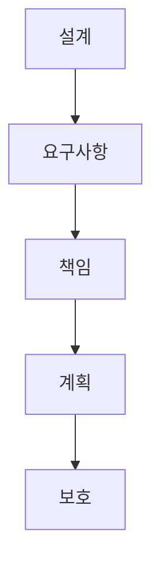

> [!abstract] 한 줄 요약
> 이 과정은 ==문제 정의==에서 출발해 요구사항·책임·계획·보호 전략으로 AI 시스템 설계를 연결한다.

## 학습 경로



## 노트 목록

| # | 노트 | 다루는 것 |
| :-- | :-- | :-- |
| 01 | [공학설계와 AI 시스템 설계](./notes/01.%20공학설계와%20AI%20시스템%20설계.md) | 설계 과정과 AI 고려사항 |
| 02 | [공학 설계 프로세스와 요구사항](./notes/02.%20공학%20설계%20프로세스와%20요구사항.md) | 기능·비기능 요구사항 |
| 03 | [공학 윤리와 지식재산권](./notes/03.%20공학%20윤리와%20지식재산권.md) | 안전·공정·권리 |
| 04 | [팀 설계와 설계 계획서](./notes/04.%20팀%20설계와%20설계%20계획서.md) | 발표와 계획서 |
| 05 | [AI 아이디어와 보호 전략](./notes/05.%20AI%20아이디어와%20보호%20전략.md) | 아이디어 구체화와 보호 |

<details>
<summary>읽는 순서</summary>

설계 관점을 세우고, 요구사항을 문장으로 만들며, 윤리와 권리를 검토한 뒤 팀 계획과 아이디어 보호 전략으로 확장한다.

</details>

<Tabs>
  <Tab label="문제와 요구">
    [01. 공학설계와 AI 시스템 설계](./notes/01.%20공학설계와%20AI%20시스템%20설계.md)와 [02. 공학 설계 프로세스와 요구사항](./notes/02.%20공학%20설계%20프로세스와%20요구사항.md)를 먼저 읽는다.
  </Tab>
  <Tab label="책임과 실행">
    [03. 공학 윤리와 지식재산권](./notes/03.%20공학%20윤리와%20지식재산권.md)부터 [05. AI 아이디어와 보호 전략](./notes/05.%20AI%20아이디어와%20보호%20전략.md)까지 책임·계획·보호를 잇는다.
  </Tab>
</Tabs>

$$
5=1+1+1+1+1
$$

```html preview
<div style="font-family:system-ui,sans-serif;padding:20px">
  <div id="cards" style="display:flex;gap:14px;flex-wrap:wrap"></div>
  <script>
    var stats = [
      ['강의 노트', '5편', '현재 인덱스의 실제 노트', 'var(--chart-2)'],
      ['설계 흐름', '5단계', '설계에서 보호까지', 'var(--chart-1)'],
      ['링크 대상', '5개', '모두 노트 문서', 'var(--chart-5)']
    ];
    document.getElementById('cards').innerHTML = stats.map(function (s) {
      return '<div style="flex:1;min-width:150px;padding:16px;background:var(--card);' +
        'color:var(--card-foreground);border:1px solid var(--border);' +
        'border-radius:var(--radius)">' +
        '<div style="font-size:13px;color:var(--muted-foreground)">' + s[0] + '</div>' +
        '<div style="font-size:26px;font-weight:700;margin-top:4px">' + s[1] + '</div>' +
        '<div style="font-size:12px;font-weight:600;margin-top:4px;color:' + s[3] + '">' +
        s[2] + '</div>' +
        '</div>';
    }).join('');
  </script>
</div>
```

> [!tip] 사용 방법
> 각 노트의 “스스로 점검”으로 핵심 구분을 다시 확인하고, 표의 링크 순서대로 읽는다.

<details>
<summary>공개 노트의 경계</summary>

각 노트는 현재 로컬 추출문을 바탕으로 재작성했다. 원본 PDF 링크, 쪽수 표기, 원본 슬라이드 이미지와 assets 임베드는 포함하지 않는다.

</details>

> [!warning] 소스 경고
> 강의 예시와 양식의 자리표시자는 실제 프로젝트의 확정 사실로 해석하지 않는다.

<details>
<summary>스스로 점검</summary>

**Q.** 이 인덱스의 마지막 단계는 무엇인가?

**A.** AI 아이디어의 보호 전략이다.

</details>
