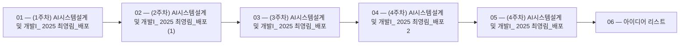

 > [!abstract] 사용법
 > 이 지도는 현재 폴더의 원본 PDF를 파일 순서대로 묶어 **강의 진행 → 핵심 단서 → 점검 포인트**를 연결합니다. 세부 개념은 같은 폴더의 주제 노트와 함께 대조하세요.

## 강의 흐름



<Tabs>
  <Tab label="파일 순서">파일명에 포함된 주차·장·버전 표기를 먼저 읽어 강의의 큰 흐름을 잡습니다.</Tab>
  <Tab label="중복 자료">같은 접두사나 버전이 겹치면 앞 자료를 기준으로 뒤 자료의 보충·실습 여부를 비교합니다.</Tab>
  <Tab label="검증">첫 페이지 단서는 방향만 제시하므로 정의·식·코드·수치는 원본 PDF에서 다시 확인합니다.</Tab>
</Tabs>

## 원본 PDF 목록

| 파일 | 쪽수 | 첫 페이지 단서 |
| :-- | --: | :-- |
| (1주차) AI시스템설계 및 개발Ⅰ_ 2025 최영림_배포.pdf | 42 | AI시스템설계 및 개발Ⅰ - 최영림 - |
| (2주차) AI시스템설계 및 개발Ⅰ_ 2025 최영림_배포 (1).pdf | 43 | 텍스트 추출 단서 없음 |
| (3주차) AI시스템설계 및 개발Ⅰ_ 2025 최영림_배포.pdf | 23 | 텍스트 추출 단서 없음 |
| (4주차) AI시스템설계 및 개발Ⅰ_ 2025 최영림_배포 2.pdf | 22 | 텍스트 추출 단서 없음 |
| (4주차) AI시스템설계 및 개발Ⅰ_ 2025 최영림_배포.pdf | 22 | 텍스트 추출 단서 없음 |
| 아이디어 리스트.pdf | 5 | 아이디어 리스트 1. 대출 추천 AI n 기술 설명: 사용자 신용 점수, 금융 기록을 분석하여 최적의 대출 상품을 추천하는 AI 시스템 n 특허 vs 저작권 논의 포인트: 특허 가능성: 독창적인 대출 추천 알고리즘이 있다면 특허 가능 저작권 가능성: 코드와 데이터 모델 보호 가능 결정: 새로운 대출 추천 방식이라면 특허? 단순한 AI 모델이라면 저작권? 2. AI 기반 뉴스 요약 서비스 n |

## 원본 단계 인터랙티브

```html preview
<div style="font-family:system-ui,sans-serif;padding:20px;color:var(--foreground)">
  <label for="flow3107472957" style="font-size:14px;font-weight:600">원본 자료 단계</label>
  <div id="flow3107472957-out" style="font-size:24px;font-weight:700;color:var(--chart-1);margin:6px 0">(1주차) AI시스템설계 및 개발Ⅰ_ 2025 최영림_배포</div>
  <input id="flow3107472957" type="range" min="1" max="6" step="1" value="1" style="width:100%;accent-color:var(--primary)" />
  <p style="font-size:13px;color:var(--muted-foreground)">슬라이더를 움직이면 파일명 순서대로 자료의 위치를 확인합니다.</p>
  <script>
    var flow3107472957 = document.getElementById('flow3107472957');
    var flow3107472957Out = document.getElementById('flow3107472957-out');
    var flow3107472957Steps = ["(1주차) AI시스템설계 및 개발Ⅰ_ 2025 최영림_배포","(2주차) AI시스템설계 및 개발Ⅰ_ 2025 최영림_배포 (1)","(3주차) AI시스템설계 및 개발Ⅰ_ 2025 최영림_배포","(4주차) AI시스템설계 및 개발Ⅰ_ 2025 최영림_배포 2","(4주차) AI시스템설계 및 개발Ⅰ_ 2025 최영림_배포","아이디어 리스트"];
    flow3107472957.addEventListener('input', function () {
      flow3107472957Out.textContent = flow3107472957Steps[Number(flow3107472957.value) - 1] || '';
    });
  </script>
</div>
```

## 점검 포인트

- **범위:** 6개 PDF, 총 157쪽.
- **근거:** 표의 쪽수와 첫 페이지 단서는 현재 sources/ 파일에서 직접 추출했습니다.
- **학습 순서:** 흐름도와 슬라이더를 먼저 훑은 뒤, 주제 노트의 정의·절차·실습 결과를 순서대로 대조합니다.

> [!warning] 과해석 방지
> 이 지도에는 파일명·쪽수·첫 페이지 추출 단서만 기록했습니다. PDF에 없는 구현 세부, 성능 수치, 권장 설정은 추가하지 않습니다.

<details>
<summary>다음 읽기</summary>

현재 단계의 원본을 열어 제목·절차·도식을 확인한 뒤, 같은 폴더의 주제 노트에 해당 근거가 반영되었는지 점검하세요.

</details>
