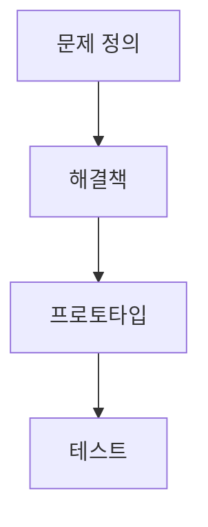

> [!abstract] 한 줄 요약
> 공학설계는 문제를 해결할 해답을 만들고 시험하는 과정이며, AI 시스템에서는 ==기술==만이 아니라 사용자·데이터·윤리·법을 함께 설계해야 한다.

## 이 노트의 지도



## 1. 공학설계의 단계

강의는 3단계, 5단계, 7단계의 공학설계 과정을 함께 제시한다. 공통 흐름은 문제와 제약을 확인하고, 여러 해결책을 만들며, 결과를 시험·개선하는 것이다.

$$
P_3=3,
\qquad
P_5=5,
\qquad
P_7=7
$$

<details>
<summary>3단계와 5단계</summary>

3단계 과정은 아이디어 만들기, 실행하기, 테스트하기다. NASA 5단계 과정은 질의, 상상, 계획, 생성, 개선으로 제시된다. 두 과정 모두 해결책을 만든 뒤 평가와 개선으로 이어진다.

</details>

<details>
<summary>7단계 과정</summary>

강의의 7단계는 문제 정의, 정보 수집, 해결책 생성, 분석과 선택, 프로토타입 만들기, 테스트와 성능 개선, 설계 구현과 생산 계획이다. 특히 해결책 생성에서는 팀의 다양한 의견을 수렴하고, 프로토타입에서는 실제와 같은 기능과 요구사항 충족을 확인한다.

</details>

> [!important] 설계의 기준
> 공학설계는 아이디어만 적는 일이 아니라, ==요구사항과 제한사항==을 명시하고 시험 가능한 형태로 구체화하는 일이다.

## 2. AI 시스템에서 함께 보는 관점

강의는 AI 시스템 설계 고려사항을 기술적 요소, 윤리적 고려, 사용자 경험, 데이터 관리 및 보안, 법적 준수의 다섯 범주로 제시한다.

$$
C=\{\text{기술},\ \text{윤리},\ \text{UX},\ \text{데이터·보안},\ \text{법}\}
$$

<Tabs>
  <Tab label="기술">
    해결할 문제와 목표를 명확히 하고, 적합한 AI 모델을 선택·튜닝하며, 실제 환경 배포와 확장 계획을 마련한다.
  </Tab>
  <Tab label="책임 설계">
    편향을 줄이고 공정성을 고려하며, 사용자가 이해하기 쉬운 경험·지속적 피드백·데이터 사용의 윤리성·관련 법규 준수를 함께 검토한다.
  </Tab>
</Tabs>

<details>
<summary>다섯 관점의 질문</summary>

| 관점 | 강의에서 확인할 질문 |
| :-- | :-- |
| 기술 | 문제·목표가 명확한가, 모델 선택과 튜닝이 적절한가 |
| 윤리 | 편향 없이 공정한 서비스를 제공하는가 |
| UX | 사용자가 이해하고 사용할 수 있는가 |
| 데이터·보안 | 수집 데이터 사용이 윤리적인가 |
| 법 | 규제, 저작권, 외부 자원 계약을 확인했는가 |

</details>

```html preview
<div style="font-family:system-ui,sans-serif;padding:20px;color:var(--foreground)">
  <h3 style="margin:0 0 14px;font-size:15px;font-weight:600">강의에서 제시한 설계 과정 수</h3>
  <div id="bars" style="display:flex;align-items:flex-end;gap:14px;height:170px"></div>
  <script>
    var data = [['기본', 3], ['NASA', 5], ['상세', 7]];
    var max = Math.max.apply(null, data.map(function (d) { return d[1]; }));
    document.getElementById('bars').innerHTML = data.map(function (d, i) {
      return '<div style="flex:1;display:flex;flex-direction:column;align-items:center;' +
        'gap:6px;height:100%;justify-content:flex-end">' +
        '<span style="font-size:12px;font-weight:600">' + d[1] + '</span>' +
        '<div style="width:100%;height:' + (d[1] / max * 100) + '%;' +
        'background:var(--chart-' + (i + 1) + ');' +
        'border-radius:var(--radius) var(--radius) 0 0"></div>' +
        '<span style="font-size:12px;color:var(--muted-foreground)">' + d[0] + '</span>' +
        '</div>';
    }).join('');
  </script>
</div>
```

## 3. 팀에서 설계를 실행하기

강의는 팀 리더가 방향·목표·일정·최종 의사결정·품질을 맡고, 구성원은 할당 업무를 수행하며 진행 상황·문제·아이디어를 공유한다고 제시한다.

<details>
<summary>역할을 나누는 이유</summary>

리더의 계획과 품질 관리, 구성원의 수행과 공유는 서로 대체되는 일이 아니다. 강의의 역할 구분은 목표를 공유하고 일정 안에 프로젝트를 완료하기 위한 운영 구조다.

</details>

> [!tip] 시작점
> 설계안을 만들 때는 먼저 문제와 제약을 문장으로 적고, 그 다음에 다섯 관점에서 빠진 조건이 없는지 확인한다.

<details>
<summary>적용 범위</summary>

강의의 다섯 범주는 체크리스트의 출발점이다. 실제 설계에서는 해당 시스템의 목표와 제약에 맞춰 구체적인 기준을 정해야 한다.

</details>

<details>
<summary>스스로 점검</summary>

**Q.** 7단계 과정에서 프로토타입 다음에는 무엇을 확인하는가?

**A.** 강의는 테스트와 성능 개선으로, 프로토타입이 설계 목표에 부합하는지 확인한다고 제시한다.

</details>

## 출처와 한계

- 근거: 현재 로컬 “1주차 AI시스템설계 및 개발 I” 추출문.
- 원본 PDF 링크, 쪽수 표기, 원본 슬라이드 이미지와 assets 임베드는 이 공개 노트에서 제외했다.
