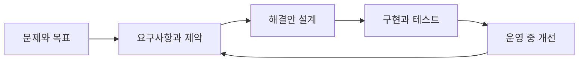

> [!abstract] 한 줄 요약
> AI 시스템 설계는 모델을 고르는 일에 앞서, **문제·제약·사람·데이터·권리**를 함께 설계하는 일이다.

공학설계는 목적물을 만들거나 바꾸기 위한 계획이며, 아이디어·목표·블록 다이어그램·요구사항·제한사항을 함께 다룬다. 이 강의는 소프트웨어 작성과 분석도 그 범위에 포함시킨다. 따라서 AI 시스템은 모델 하나가 아니라, 목표를 실제 환경에서 작동하게 하는 설계 결정들의 묶음이다.



> [!important] 설계의 출발점
> ==무엇을 만들 것인가==보다 먼저, 누구의 어떤 문제를 어떤 제약 아래 해결할지를 명확히 한다. 이 순서가 흔들리면 데이터·모델·배포 판단도 함께 흔들린다.

## 설계 프로세스를 읽는 세 가지 해상도

강의는 설계 과정을 3단계, 5단계, 7단계로 제시한다. 이름은 다르지만 모두 해답을 만들고, 검증하고, 다시 고치는 흐름을 분명히 한다.

```html preview h=220
<div style="font-family:system-ui,sans-serif;padding:18px;color:var(--foreground)">
  <div style="display:flex;gap:12px;flex-wrap:wrap">
    <div style="flex:1;min-width:180px;padding:14px;border:1px solid var(--border);border-radius:var(--radius);background:var(--card)">
      <div style="font-weight:700;color:var(--chart-1)">3단계</div>
      <div style="font-size:13px;color:var(--muted-foreground);margin-top:6px">아이디어 → 실행 → 테스트</div>
    </div>
    <div style="flex:1;min-width:180px;padding:14px;border:1px solid var(--border);border-radius:var(--radius);background:var(--card)">
      <div style="font-weight:700;color:var(--chart-2)">5단계</div>
      <div style="font-size:13px;color:var(--muted-foreground);margin-top:6px">질의 → 상상 → 계획 → 생성 → 개선</div>
    </div>
    <div style="flex:1;min-width:180px;padding:14px;border:1px solid var(--border);border-radius:var(--radius);background:var(--card)">
      <div style="font-weight:700;color:var(--chart-4)">7단계</div>
      <div style="font-size:13px;color:var(--muted-foreground);margin-top:6px">정의·수집·생성·선택·프로토타입·개선·구현</div>
    </div>
  </div>
  <div style="margin-top:14px;padding:10px 12px;border-left:4px solid var(--chart-3);background:var(--card);font-size:13px">
    세 표현은 모두 “해답을 한 번 정하고 끝내지 않는다”는 점을 공유한다.
  </div>
</div>
```

<details>
<summary>3·5·7단계를 한 설계 흐름으로 겹쳐 보기</summary>

| 설계에서 하는 일 | 3단계 | 5단계 | 7단계 |
| :-- | :-- | :-- | :-- |
| 문제와 제약을 확인 | 아이디어 만들기 전제 | 질의 | 문제 정의 |
| 여러 해법을 만든다 | 아이디어 만들기 | 상상 | 해결책 생성 |
| 실행안을 구체화 | 실행하기 | 계획·생성 | 분석·선택·프로토타입 |
| 결과를 확인하고 바꾼다 | 테스트하기 | 개선 | 테스트와 성능 개선 |
| 실제 적용을 준비 | 실행하기 | 생성 | 설계 구현과 생산 계획 |

세 모델 중 하나를 “정답 절차”로 고르기보다, 프로젝트의 복잡도에 맞는 해상도로 읽는 것이 좋다.
</details>

## AI 시스템에서 추가되는 다섯 관점

<Tabs>
  <Tab label="기술">
문제와 목표를 명료하게 세우고, 데이터 수집·정제·라벨링, 모델 선택과 튜닝, 정확도·속도·일반화 기준, 배포와 확장 계획을 함께 다룬다.
  </Tab>
  <Tab label="윤리·UX">
편향을 줄이고 결정의 투명성을 확보하며 개인정보를 보호해야 한다. 사용자가 이해하고 쉽게 사용할 수 있는 인터페이스와 지속적인 피드백 경로도 필요하다.
  </Tab>
  <Tab label="데이터·법">
저장 데이터 보호, 접근 권한 관리, 데이터 사용의 윤리성을 검토한다. 관련 법규·규제, 데이터와 알고리즘의 권리, 외부 자원의 계약 조건도 설계 범위다.
  </Tab>
</Tabs>

==기술적 성능==만으로는 충분하지 않다. 강의의 다섯 관점은 배포 가능한 AI 시스템이 모델 성능, 사용자 경험, 데이터 보안, 윤리, 법적 준수를 함께 충족해야 함을 뜻한다.

```html preview h=230
<div style="font-family:system-ui,sans-serif;padding:18px;color:var(--foreground)">
  <svg viewBox="0 0 720 170" style="display:block;width:100%;height:auto;max-width:100%" role="img" aria-label="AI 시스템 설계에서 다섯 관점을 동시에 점검하는 독자 제작 다이어그램">
    <g style="fill:var(--card);stroke:var(--border);stroke-width:2">
      <rect x="282" y="58" width="156" height="54" rx="14"></rect>
      <rect x="18" y="58" width="150" height="54" rx="14"></rect>
      <rect x="150" y="10" width="150" height="54" rx="14"></rect>
      <rect x="420" y="10" width="150" height="54" rx="14"></rect>
      <rect x="552" y="58" width="150" height="54" rx="14"></rect>
      <rect x="285" y="116" width="150" height="44" rx="14"></rect>
    </g>
    <g style="stroke:var(--muted-foreground);stroke-width:2">
      <path d="M168 85h110"></path><path d="M274 61l8 24-24-1z" style="fill:var(--muted-foreground)"></path>
      <path d="M300 48l-18 13"></path><path d="M420 48l18 13"></path>
      <path d="M438 85h110"></path><path d="M546 73l8 12-8 12" style="fill:none"></path>
      <path d="M360 112v4"></path>
    </g>
    <g text-anchor="middle" style="fill:var(--foreground);font-family:system-ui,sans-serif">
      <text x="360" y="90" font-size="16" font-weight="700">AI 시스템</text>
      <text x="93" y="90" font-size="14">기술 목표</text>
      <text x="225" y="42" font-size="14">윤리·공정성</text>
      <text x="495" y="42" font-size="14">사용자 경험</text>
      <text x="627" y="90" font-size="14">데이터 보안</text>
      <text x="360" y="143" font-size="14">법적 준수</text>
    </g>
  </svg>
</div>
```

> [!note] 요구사항은 설계의 언어다
> 아이디어를 블록 다이어그램·요구사항·제한사항으로 표현하고, 프로그램이라면 의사코드 수준까지 구체화한 뒤 테스트와 적응으로 이어간다.

## 팀에서 설계를 작동시키는 법

리더는 목표·계획·일정·역할·의사결정·소통·품질을 책임지고, 구성원은 맡은 일을 수행하면서 기술을 발전시키고 문제·진행 상황·아이디어를 공유하며 피드백을 주고받는다.

<details>
<summary>리더와 구성원의 역할을 실행 질문으로 바꾸기</summary>

| 역할 | 설계 중 확인할 질문 |
| :-- | :-- |
| 팀 리더 | 목표와 일정이 공유됐는가? 강점에 맞게 역할을 배분했는가? 품질 판단과 소통 경로가 있는가? |
| 팀 구성원 | 맡은 일을 적극적으로 수행하는가? 막힌 문제와 진행 상황을 공유하는가? 동료의 피드백을 열어 두는가? |

역할은 직책 목록이 아니라, 프로젝트가 멈추지 않도록 하는 반복 행동으로 읽는다.
</details>

> [!tip] 엔지니어의 능력은 산출물로 드러난다
> 강의는 지식 응용, 실험 계획과 수행, 제한 요소를 반영한 설계, 도구 활용, 의사소통, 직업적·윤리적 책임을 함께 든다. 좋은 결과물은 이 능력들이 분리되지 않고 연결된 흔적이다.

## 핵심 정리

| 개념 | 이 노트에서의 의미 |
| :-- | :-- |
| 공학설계 | 목표·요구사항·제약을 실제 해답으로 바꾸는 계획과 실행 |
| 설계 프로세스 | 해법 생성, 구현, 테스트, 개선을 반복하는 흐름 |
| AI 시스템 설계 | 기술·윤리·UX·데이터 보안·법을 동시에 다루는 설계 |
| 팀 역할 | 목표·품질·진행 상황을 투명하게 연결하는 협업 책임 |

> [!question]- 스스로 점검
> 새 AI 기능을 제안할 때, 모델 이름보다 먼저 써야 할 세 가지는 무엇인가?
>
> 해결하려는 문제, 사용자의 요구와 제약, 그리고 검증 가능한 성공 기준이다. 그 다음에 데이터·모델·배포 선택을 연결한다.
