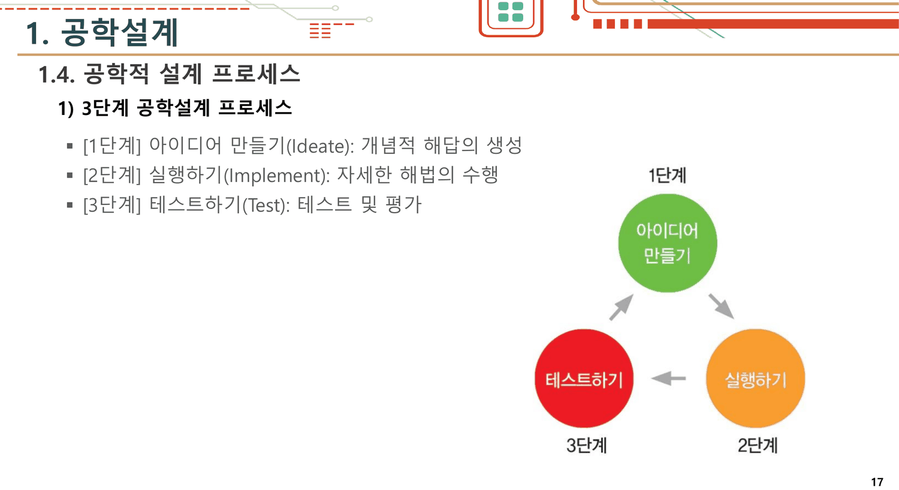
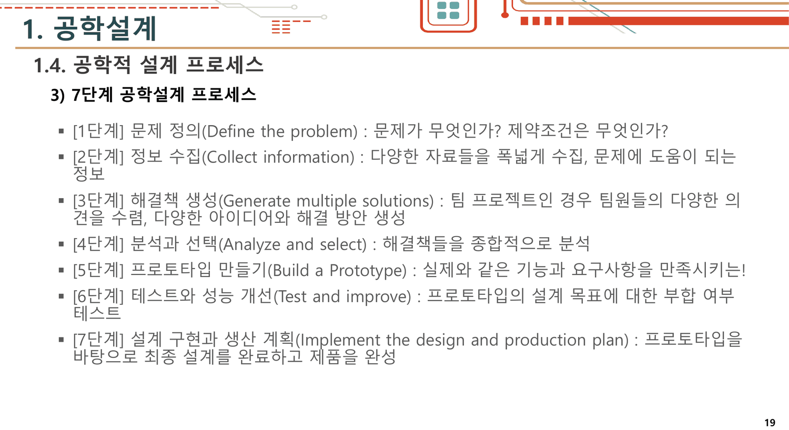
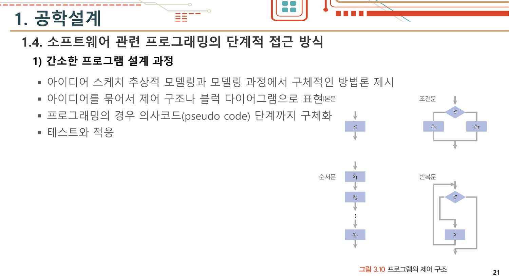
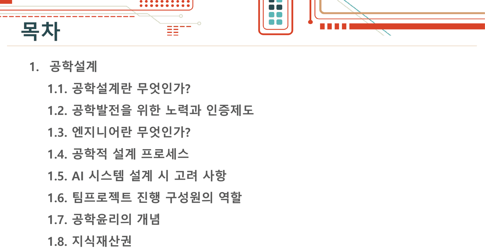
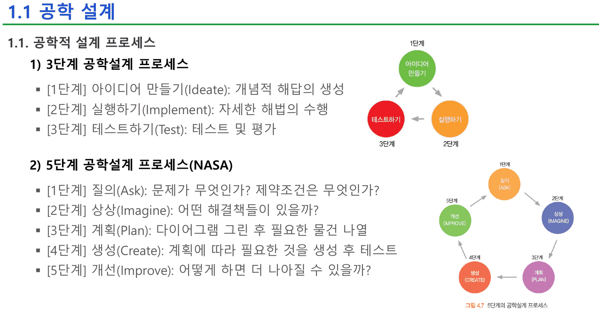
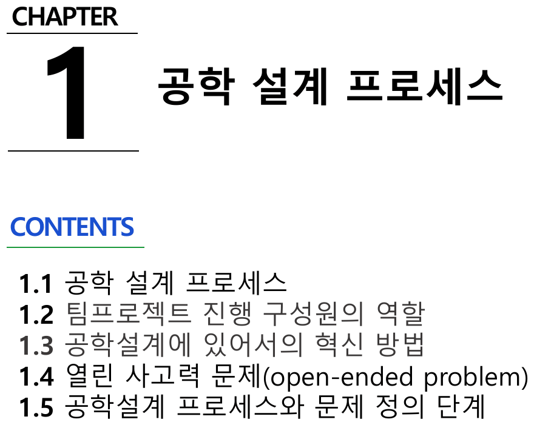
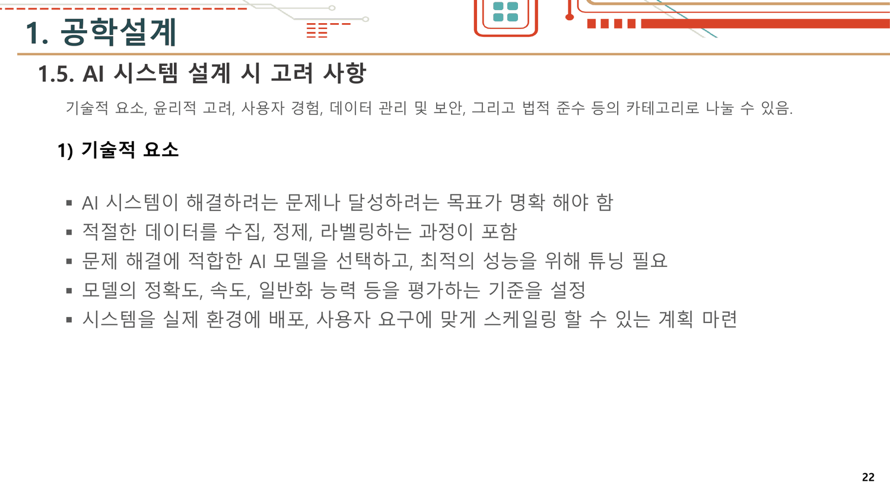
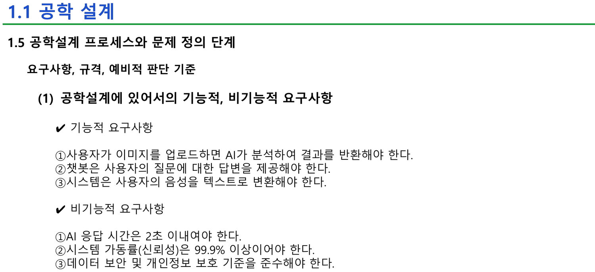
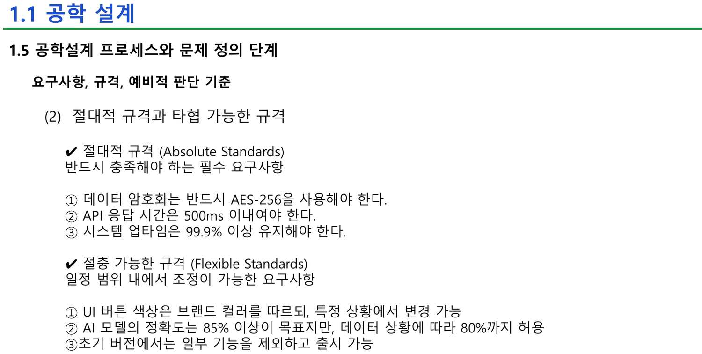
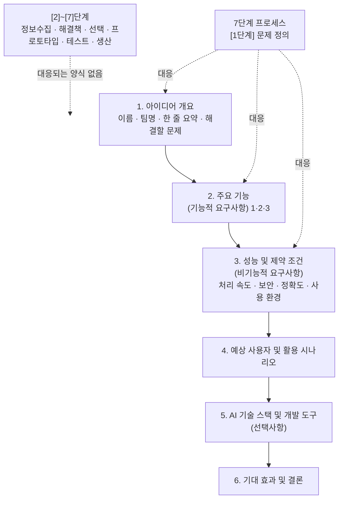

## 세 장에 걸쳐 세 개의 프로세스

1주차 17번부터 19번까지가 연속된 세 장이다. 제목이 셋 다 같다 — `1.4. 공학적 설계 프로세스`.

### 17번 — 3단계

> [1단계] 아이디어 만들기(Ideate): 개념적 해답의 생성
> [2단계] 실행하기(Implement): 자세한 해법의 수행
> [3단계] 테스트하기(Test): 테스트 및 평가



### 18번 — 5단계(NASA)

> [1단계] 질의(Ask) · [2단계] 상상(Imagine) · [3단계] 계획(Plan) · [4단계] 생성(Create) · [5단계] 개선(Improve)

### 19번 — 7단계

> [1단계] 문제 정의 · [2단계] 정보 수집 · [3단계] 해결책 생성 · [4단계] 분석과 선택 · [5단계] 프로토타입 만들기 · [6단계] 테스트와 성능 개선 · [7단계] 설계 구현과 생산 계획



세 장 사이에 비교도, 대조도, 「이 수업에서는 이것을 쓴다」도 없다. 20번은 같은 제목 아래 그림 하나뿐이고, 그다음 21번으로 넘어간다.

> [!important] 이 노트의 척추
> 이 강의는 **설계 프로세스를 네 개 제시하고, 그중 무엇을 언제 쓰는지는 한 줄도 말하지 않는다.** 네 번째는 절 번호까지 앞 것과 겹쳐서 목차에도 없다. 그런데 학생이 실제로 채워야 하는 문서 양식(2주차 20~23번)은 **일곱 단계 중 첫 단계 하나**에만 대응한다. 프로세스가 넷인 것은 선택지가 넷이라는 뜻이 아니라, **어느 것도 이 수업의 척도가 아니라는 뜻**이다.

---

## 21번 — 목차에 없는 네 번째

21번의 제목은 이렇다.

> **1.4. 소프트웨어 관련 프로그래밍의 단계적 접근 방식**



절 번호가 **1.4** 다. 17~20번의 `1.4. 공학적 설계 프로세스` 와 같은 번호인데 제목이 다르다. 그리고 5번 슬라이드의 목차를 보면 이렇다.

> 1.1. 공학설계란 무엇인가? / 1.2. 공학발전을 위한 노력과 인증제도 / 1.3. 엔지니어란 무엇인가? / **1.4. 공학적 설계 프로세스** / 1.5. AI 시스템 설계 시 고려 사항 / 1.6. 팀프로젝트 진행 구성원의 역할 / 1.7. 공학윤리의 개념 / 1.8. 지식재산권



**목차에 1.4 는 하나뿐이다.** 21번은 목차가 만들어진 뒤에 끼워 넣어졌고, 번호를 새로 붙이는 대신 앞 절의 번호를 그대로 달았다. 내용은 네 단계다.

> 아이디어 스케치 → 추상적 모델링과 구체적 방법론 제시 → 제어 구조나 블럭 다이어그램으로 표현 → 의사코드(pseudo code) 단계까지 구체화 → 테스트와 적응

그리고 **이 네 번째 프로세스만 소프트웨어를 명시적으로 다룬다.** 「의사코드 단계까지 구체화」는 앞의 세 프로세스 어디에도 없는 말이고, 이 과목이 AI 시스템을 만드는 과목이라는 점을 생각하면 가장 가까운 것이 목차 밖에 있는 셈이다.

### 네 프로세스를 겹쳐 본다

네 개를 같은 축 위에 놓으면 무엇이 같고 무엇이 어긋나는지가 한눈에 보인다. 원본 슬라이드의 단계 이름을 그대로 쓴다.

```html preview
<div id="dp" style="font-family:system-ui,-apple-system,sans-serif;color:var(--foreground);background:var(--card);border:1px solid var(--border);border-radius:12px;padding:18px 16px;">
  <p style="margin:0 0 14px;font-size:13px;color:var(--muted-foreground);line-height:1.7;">
    1주차 17 · 18 · 19 · 21번의 네 프로세스를 「문제 → 아이디어 → 설계 → 만들기 → 검증 → 출시」 여섯 국면에 맞춰 늘어놓았다.
    국면을 눌러 어느 프로세스가 그 자리를 갖고 있는지 본다.</p>
  <div id="dpb" style="display:flex;flex-wrap:wrap;gap:5px;margin-bottom:14px;"></div>
  <svg id="dps" viewBox="0 0 620 210" style="width:100%;height:auto;display:block;"></svg>
  <div id="dpo" style="margin-top:10px;font-size:13.5px;line-height:1.9;"></div>
  <style>#dp .pb{font:inherit;font-size:12px;padding:4px 10px;cursor:pointer;border:1px solid var(--border);
    background:transparent;color:var(--muted-foreground);border-radius:6px;}
    #dp .pb.on{background:var(--chart-1);border-color:var(--chart-1);color:var(--card);font-weight:700;}</style>
</div>
<script>
(function(){
  const NS='http://www.w3.org/2000/svg', svg=document.getElementById('dps');
  const el=(t,a,x)=>{const e=document.createElementNS(NS,t);for(const k in a)e.setAttribute(k,a[k]);
    if(x!==undefined)e.textContent=x;return e;};
  const PH=['문제','아이디어','설계','만들기','검증','출시'];
  // [프로세스명, 슬라이드, 국면별 단계 이름(없으면 null)]
  const P=[
    ['3단계 (17번)','17',[null,'아이디어 만들기',null,'실행하기','테스트하기',null]],
    ['5단계 NASA (18번)','18',['질의','상상','계획','생성','개선',null]],
    ['7단계 (19번)','19',['문제 정의 · 정보 수집','해결책 생성','분석과 선택','프로토타입 만들기','테스트와 성능 개선','설계 구현과 생산 계획']],
    ['SW 4단계 (21번)','21',[null,'아이디어 스케치','블럭 다이어그램 · 의사코드',null,'테스트와 적응',null]]
  ];
  let sel=0;
  const L=138, R=606, T=26, rowH=42;
  const cx=i=>L+(i+0.5)*(R-L)/PH.length;
  function draw(){
    svg.textContent='';
    PH.forEach((p,i)=>svg.appendChild(el('text',{x:cx(i),y:16,'text-anchor':'middle','font-size':11,
      'font-weight':i===sel?700:400, fill:i===sel?'var(--chart-1)':'var(--muted-foreground)'},p)));
    svg.appendChild(el('rect',{x:cx(sel)-(R-L)/PH.length/2,y:20,width:(R-L)/PH.length,height:P.length*rowH+8,
      fill:'var(--chart-1)',opacity:0.10,rx:5}));
    P.forEach((pr,r)=>{
      const y=T+r*rowH+16;
      svg.appendChild(el('text',{x:L-10,y:y+4,'text-anchor':'end','font-size':11,
        fill:'var(--foreground)','font-weight':600},pr[0]));
      pr[2].forEach((s,i)=>{
        if(!s){ svg.appendChild(el('circle',{cx:cx(i),cy:y,r:3,fill:'var(--border)'})); return; }
        svg.appendChild(el('rect',{x:cx(i)-34,y:y-13,width:68,height:26,rx:5,
          fill: i===sel?'var(--chart-1)':'var(--chart-2)', opacity:i===sel?0.9:0.35}));
        const words=s.split(' · ')[0];
        svg.appendChild(el('text',{x:cx(i),y:y+4,'text-anchor':'middle','font-size':9.5,
          fill: i===sel?'var(--card)':'var(--foreground)'}, words.length>8?words.slice(0,7)+'…':words));
      });
    });
    const have=P.filter(p=>p[2][sel]);
    document.getElementById('dpo').innerHTML =
      '<b>'+PH[sel]+'</b> 국면 — 네 프로세스 중 <b style="color:var(--chart-1)">'+have.length+'개</b>가 이 자리를 갖는다.'+
      '<ul style="margin:6px 0 0;padding-left:20px;font-size:12.5px;color:var(--muted-foreground);line-height:1.8">'+
      P.map(p=>'<li>'+p[0]+' — '+(p[2][sel]? '<span style="color:var(--foreground)">'+p[2][sel]+'</span>' : '<i>없음</i>')+'</li>').join('')+
      '</ul>';
  }
  const bar=document.getElementById('dpb');
  PH.forEach((p,i)=>{const b=document.createElement('button');b.className='pb'+(i===0?' on':'');b.textContent=p;
    b.onclick=()=>{sel=i;[...bar.children].forEach((c,j)=>c.classList.toggle('on',j===i));draw();};bar.appendChild(b);});
  draw();
})();
</script>

두 가지가 드러난다.

- **「출시」 국면을 가진 것은 7단계 하나뿐이다.** 3단계는 테스트에서 끝나고, NASA 5단계는 「개선」으로 돌아가며, 21번의 소프트웨어 4단계도 「테스트와 적응」으로 끝난다. 학기말에 데모를 요구하는 이 과목에서 **완성·인도 단계를 그리는 프로세스는 넷 중 하나**다.
- **「문제」 국면은 반대로 3단계와 소프트웨어 4단계에 없다.** 둘 다 아이디어에서 시작한다. 그런데 2주차 15~18번과 4주차 전체가 「문제 정의」에 매달리는 것을 보면, 이 과목의 실제 출발점은 7단계 쪽이다.

> [!note] 2주차는 세 프로세스를 한 장으로 압축한다
> 2주차 4번이 17번과 18번을 합쳐 3단계와 5단계를 한 장에 넣고, 5번이 7단계를 그대로 옮긴다. 1주차의 다섯 장(17~21)이 2주차에서는 세 장(4~6)이 된다. **줄어드는 과정에서 21번의 소프트웨어 4단계가 사라진다.** 네 번째 프로세스는 처음부터 목차에 없었고, 두 번째 강의에서 아예 없어진다.



2주차 3번의 장 표지가 이 덱의 1장 구성을 다섯 줄로 적는다 — `1.1 공학 설계 프로세스` · `1.2 팀프로젝트 진행 구성원의 역할` · `1.3 공학설계에 있어서의 혁신 방법` · `1.4 열린 사고력 문제` · `1.5 공학설계 프로세스와 문제 정의 단계`.



그런데 본문 슬라이드의 머리글은 4~18번 내내 `1.1 공학 설계` 로 고정되어 있고 그 아래 줄만 바뀐다. **표지가 약속한 다섯 절 중 넷은 머리글에 나타나지 않는다.**

---

## AI 시스템 설계 고려 사항 — 다섯 범주, 열일곱 줄

1주차 22~24번(2주차 7~9번과 같은 내용)이 AI 시스템을 설계할 때 볼 것을 다섯 범주로 나눈다.

| 범주 | 줄 수 | 대표 문장 |
| --- | ---: | --- |
| 1) 기술적 요소 | 5 | 「문제나 목표가 **명확** 해야 함」 |
| 2) 윤리적 고려 | 3 | 「모델이 **편향되지 않도록** 주의」 |
| 3) 사용자 경험(UX) | 3 | 「**직관적이고** 사용하기 쉬운 인터페이스」 |
| 4) 데이터 관리 및 보안 | 3 | 「**안전하게** 보호되어야 함」 |
| 5) 법적 준수 | 3 | 「관련 **법규와 규제를 준수**하는지 확인」 |



열일곱 줄 전부가 **형용사로 끝난다.** 명확해야 하고, 적절해야 하고, 안전해야 하고, 직관적이어야 한다. 얼마나 명확해야 하는지, 무엇을 재서 판정하는지는 없다.

이 목록이 이 과목 안에서 실제로 쓰일 수 있는 형태가 되는 자리는 **2주차 17번과 18번 두 장**이다.

---

## 숫자가 처음 나오는 두 장

2주차 17번이 요구사항을 기능적/비기능적으로 가른다.



> **기능적 요구사항** ① 사용자가 이미지를 업로드하면 AI가 분석하여 결과를 반환해야 한다 ② 챗봇은 사용자의 질문에 대한 답변을 제공해야 한다 ③ 시스템은 사용자의 음성을 텍스트로 변환해야 한다
>
> **비기능적 요구사항** ① AI 응답 시간은 **2초 이내**여야 한다 ② 시스템 가동률(신뢰성)은 **99.9% 이상**이어야 한다 ③ 데이터 보안 및 개인정보 보호 기준을 준수해야 한다

18번이 한 걸음 더 간다 — 같은 종류의 요구사항을 **깎을 수 있는 것과 없는 것**으로 다시 가른다.



> **절대적 규격** ① 데이터 암호화는 반드시 **AES-256** ② API 응답 시간은 **500ms 이내** ③ 시스템 업타임 **99.9% 이상**
>
> **절충 가능한 규격** ① UI 버튼 색상은 브랜드 컬러를 따르되 상황에 따라 변경 가능 ② AI 모델 정확도는 **85% 목표**지만 데이터 상황에 따라 **80%까지 허용** ③ 초기 버전에서는 일부 기능을 제외하고 출시 가능

> [!tip] 두 장 사이에서 응답 시간이 네 배 빨라진다 (원본에 없는 보충)
> 17번의 비기능적 요구사항 ①은 **2초**, 18번의 절대적 규격 ②는 **500ms** 다. 같은 「AI 응답 시간」을 두 장 연속으로 다르게 적는데, 슬라이드는 하나를 예시라 하고 다른 하나를 절대 기준이라 하므로 형식적으로는 모순이 아니다. 다만 **절대 기준이 예시보다 네 배 엄격한 것**이 설명 없이 놓여 있고, 「99.9% 가동률」만 두 장에 같은 값으로 나타난다.
>
> 정작 설계에서 물어야 할 질문은 그 차이다 — 2초를 500ms로 줄이는 비용이 얼마인가. 정확도 85%를 80%로 낮춰 얻는 것이 얼마인가. 18번은 **깎을 수 있는 축과 없는 축을 구분하는 법**을 가르치는 장이고, 이 강의에서 「고려 사항」이 의사결정으로 바뀌는 유일한 자리다.

### 절충을 숫자로 만져 본다

18번의 세 절충 가능 항목 중 값이 붙은 것은 정확도 하나(85% 목표 / 80% 허용)다. 그 5%p 가 무엇을 사는지는 슬라이드가 말하지 않는다. 대신 17·18번이 준 값만으로 「절대 규격을 지키면서 절충 규격을 어디까지 밀 수 있는가」를 직접 굴려 볼 수 있다.

```html preview
<div id="rq" style="font-family:system-ui,-apple-system,sans-serif;color:var(--foreground);background:var(--card);border:1px solid var(--border);border-radius:12px;padding:18px 16px;">
  <p style="margin:0 0 14px;font-size:13px;color:var(--muted-foreground);line-height:1.7;">
    2주차 18번의 값만 쓴다 — 절대 규격 <b>응답 500ms 이내 · 가동률 99.9% 이상</b>, 절충 규격 <b>정확도 85% 목표(80%까지 허용)</b>.
    두 손잡이를 움직여 세 조건이 동시에 만족되는지 확인한다.</p>
  <div style="display:flex;flex-wrap:wrap;gap:16px;align-items:center;margin-bottom:6px;font-size:13px;">
    <label style="display:flex;gap:8px;align-items:center;flex:1;min-width:230px;">목표 정확도
      <input id="rqa" type="range" min="78" max="95" value="85" step="1" style="flex:1;accent-color:var(--chart-1);">
      <output id="rqav" style="font-variant-numeric:tabular-nums;font-weight:700;min-width:3em;">85%</output></label>
    <label style="display:flex;gap:8px;align-items:center;flex:1;min-width:230px;">기능 개수
      <input id="rqf" type="range" min="1" max="6" value="3" step="1" style="flex:1;accent-color:var(--chart-1);">
      <output id="rqfv" style="font-variant-numeric:tabular-nums;font-weight:700;min-width:2em;">3</output></label>
  </div>
  <svg id="rqs" viewBox="0 0 620 170" style="width:100%;height:auto;display:block;"></svg>
  <div id="rqo" style="margin-top:8px;font-size:13.5px;line-height:1.95;font-variant-numeric:tabular-nums;"></div>
</div>
<script>
(function(){
  const NS='http://www.w3.org/2000/svg', svg=document.getElementById('rqs');
  const el=(t,a,x)=>{const e=document.createElementNS(NS,t);for(const k in a)e.setAttribute(k,a[k]);
    if(x!==undefined)e.textContent=x;return e;};
  // 단순 모형: 정확도를 1%p 올리면 모델이 무거워져 지연이 늘고, 기능이 늘수록 호출이 쌓인다.
  // 기준점은 18번의 값 — 정확도 85%, 기능 3개일 때 정확히 500ms 에 닿도록 눈금을 맞췄다.
  const lat=(a,f)=>Math.round(40*f + 12*Math.pow(1.35, a-78) + 60);
  const up =(f)=>99.99 - 0.03*f;   // 기능이 늘수록 장애 표면이 넓어진다
  const L=150,R=596,rows=[44,96];
  function draw(a,f){
    svg.textContent='';
    const l=lat(a,f), u=up(f);
    const items=[['응답 시간', l, 500, 'ms', v=>v<=500, 900],
                 ['가동률', u, 99.9, '%', v=>v>=99.9, null]];
    items.forEach(([lab,v,lim,unit,ok,max],r)=>{
      const y=rows[r], pass=ok(v);
      const frac = max ? Math.min(v/max,1) : Math.min(Math.max((v-99.8)/0.25,0),1);
      const limF = max ? lim/max : (lim-99.8)/0.25;
      svg.appendChild(el('text',{x:L-12,y:y+5,'text-anchor':'end','font-size':12.5,fill:'var(--foreground)'},lab));
      svg.appendChild(el('rect',{x:L,y:y-13,width:R-L,height:26,rx:4,fill:'var(--border)',opacity:0.35}));
      svg.appendChild(el('rect',{x:L,y:y-13,width:Math.max((R-L)*frac,2),height:26,rx:4,
        fill: pass?'var(--chart-1)':'var(--chart-2)'}));
      svg.appendChild(el('line',{x1:L+(R-L)*limF,y1:y-19,x2:L+(R-L)*limF,y2:y+19,
        stroke:'var(--foreground)','stroke-width':1.6,'stroke-dasharray':'3 3'}));
      svg.appendChild(el('text',{x:L+(R-L)*limF,y:y-24,'text-anchor':'middle','font-size':10,
        fill:'var(--muted-foreground)'},'절대 규격 '+lim+unit));
      svg.appendChild(el('text',{x:R+0,y:y+5,'text-anchor':'end','font-size':12,fill:'var(--card)',
        'font-weight':700}, (unit==='%'? v.toFixed(2):v)+unit));
    });
    svg.appendChild(el('text',{x:L,y:150,'font-size':10.5,fill:'var(--muted-foreground)'},
      '※ 지연·가동률 모형은 설명용 보충이다. 슬라이드가 준 값은 500ms · 99.9% · 85%(80%까지) 셋뿐이다.'));
    return {l,u};
  }
  function upd(){
    const a=+document.getElementById('rqa').value, f=+document.getElementById('rqf').value;
    document.getElementById('rqav').textContent=a+'%';
    document.getElementById('rqfv').textContent=f;
    const {l,u}=draw(a,f);
    const okA=l<=500, okU=u>=99.9, okAcc=a>=80;
    const bad=[!okA&&'응답 시간 초과', !okU&&'가동률 미달', !okAcc&&'정확도가 허용 하한 80% 아래'].filter(Boolean);
    document.getElementById('rqo').innerHTML =
      (bad.length===0
        ? '<b style="color:var(--chart-1)">세 조건 모두 만족.</b> 18번이 말하는 「절충 가능」이 실제로 가능한 영역이다.'
        : '<b style="color:var(--chart-2)">위반: '+bad.join(' · ')+'</b>')+
      '<p style="margin:6px 0 0;font-size:12.5px;color:var(--muted-foreground);line-height:1.75">'+
      (a>=90 ? '정확도를 목표 위로 밀면 지연이 먼저 무너진다 — <b>절대 규격이 절충 규격의 상한을 정한다</b>는 것이 18번이 가른 두 종류의 실제 관계다.'
       : a<80 ? '정확도 80%는 18번이 적은 허용 하한이다. 그 아래는 「절충」이 아니라 요구사항 위반이다.'
       : '기능 개수를 늘려 보라. 절충 항목 ③ 「초기 버전에서는 일부 기능을 제외하고 출시 가능」이 왜 절충 항목인지가 여기서 보인다.')+'</p>';
  }
  ['rqa','rqf'].forEach(id=>document.getElementById(id).addEventListener('input',upd)); upd();
})();
</script>

> [!caution] 위 모형의 지연·가동률 곡선은 원본에 없는 보충이다
> 슬라이드가 준 숫자는 **500ms · 99.9% · 85%(80%까지 허용) · 2초** 넷뿐이고, 그 사이의 관계는 어떤 슬라이드도 말하지 않는다. 위 도구는 「절대 규격이 절충 규격의 상한을 정한다」는 구조를 보이기 위한 설명용 모형이며, 계수에 근거는 없다. **원본에서 가져온 것은 눈금 위의 기준선 두 개뿐**이다.

---

## 그래서 학생이 채우는 문서는 무엇인가

2주차 20~23번이 실습 양식이다. 제목은 `AI 시스템 아이디어 기획 및 요구사항 정의` 이고 여섯 절이다.



양식 여섯 절 전부가 **7단계 프로세스의 1단계 안**에 들어간다. 정보 수집도, 해결책을 여럿 만들어 고르는 단계도, 프로토타입도 양식에 자리가 없다. 19번이 일곱 단계를 가르치고 스무 장 뒤 양식은 첫 단계만 묻는다.

> [!note] 21·22번이 같은 표를 두 번 인쇄한다
> 2주차 21번의 「3. 시스템의 성능 및 제약 조건」 네 줄(처리 속도 · 데이터 보안 요구사항 · AI 모델의 정확도 기준 · 사용 환경)이 **22번 맨 위에 그대로 다시 나온다.** 21번은 그 항목으로 끝나고 22번이 같은 항목으로 시작하므로, 두 쪽에 걸친 표가 이음매에서 한 번 겹친 것이다.

---

## 원본에서 발견한 것

`구성 · 번호`

- **1주차 21번의 절 번호가 17~20번과 같은 `1.4` 인데 제목이 다르다.** 5번의 목차에는 `1.4. 공학적 설계 프로세스` 하나뿐이므로, 21번은 목차 작성 이후에 끼워졌고 번호를 새로 받지 못했다. 그리고 2주차에서는 이 장 자체가 사라진다
- **1주차 1.3절 안에서 하위 번호가 두 번 1)부터 시작한다.** 9번 `1) 엔지니어가 갖추어야 할 능력` · 10번 `2) 기업의 고용주가 가장 선호하는…` 다음에 11번이 다시 `1) 자기소개서 준비는 얼마나?` 로 돌아가고 12번이 `2) 네카라쿠배당토? 면접은?`, 16번이 `3) 자기소개서 [과제]` 다. 같은 절에 1)·2) 짝이 두 벌 있다
- **2주차 7~9번의 하위 번호도 두 겹이다.** 큰 제목이 `4) AI 시스템 설계 시 고려 사항` 인데 그 아래가 다시 `1) 기술적 요소` … `5) 법적 준수` 로, 한 슬라이드 안에 `4)` 와 `1)` 이 동시에 있다. 1주차 22~24번은 같은 내용을 `1.5.` 라는 절 번호로 달아 이 충돌이 없었다
- **2주차 3번의 장 표지 목차가 본문과 어긋난다.** `1.1 공학 설계 프로세스` 부터 `1.5 공학설계 프로세스와 문제 정의 단계` 까지 다섯 줄인데, 본문 슬라이드의 머리글은 전부 `1.1 공학 설계` 로 고정되어 있고 그 아래 줄만 바뀐다. 4~9번은 `1.1.` 이라는 번호를 단 채 표지의 1.1 항목보다 넓은 내용(AI 고려 사항)까지 담는다

`값의 불일치`

- **2주차 17번 ↔ 18번** — 같은 「AI 응답 시간」이 `2초 이내`(17번 비기능적 요구사항 ①)와 `500ms 이내`(18번 절대적 규격 ②)로 두 장 연속 다르게 인쇄된다. 두 장은 각각 「예시」와 「절대 기준」이라 형식적 모순은 아니지만, **절대 기준이 예시보다 네 배 엄격하다는 점에 설명이 없다.** 가동률 99.9%는 두 장에서 같다

`같은 내용의 중복`

- **2주차 21번 끝 ↔ 22번 시작** — 「3. 시스템의 성능 및 제약 조건」의 네 항목이 두 쪽에 걸쳐 그대로 한 번 더 인쇄된다
- **1주차 22~24번 ↔ 2주차 7~9번** — AI 설계 고려 사항 다섯 범주 열일곱 줄이 글자까지 같다. 다만 절 번호만 `1.5.` 에서 `4)` 로 바뀐다
- **1주차 25~26번 ↔ 2주차 10~11번** — 팀 리더 일곱 줄과 팀 구성원 다섯 줄이 그대로 반복된다

---

## 근거 자료

| 원본 | 쪽 | 이 노트에서 쓴 곳 |
| --- | --- | --- |
| `[1주차] … 배포.pdf` | 5 · 17~24 | 목차, 세 프로세스, 번호 겹친 네 번째, AI 고려 사항 다섯 범주 |
| `[2주차] … 배포 (1).pdf` | 3~9 · 17~23 | 압축된 프로세스 두 장, 기능/비기능 요구사항, 절대/절충 규격, 실습 양식 여섯 절 |

인용한 슬라이드 아홉 장 — 1주차 5 · 17 · 19 · 21 · 22번, 2주차 3 · 4 · 17 · 18번. 이 두 덱은 이 과목에서 **텍스트 추출이 정상 작동하는 드문 자료**다(1주차 42쪽 8,492자, 2주차 43쪽 8,654자, 쪽당 200자 안팎). 그래서 손글씨를 좇는 대신 인쇄된 문장을 그대로 대조할 수 있었고, 위의 번호 충돌과 값 불일치는 전부 추출 텍스트를 나란히 놓고 확인한 것이다.

### 이어지는 곳

- [[02. 「엔지니어란 무엇인가」를 면접 질문으로 답한다]] — 같은 1주차 덱의 1.3절. 프로세스가 네 개인 것과 같은 종류의 공백이 그 절에도 있다
- [[05. 문제를 찾는 다섯 가지 방법과, 학생에게 매출 목표를 묻는 양식]] — 7단계의 [1단계] 「문제 정의」가 4주차에서 다섯 가지 발상법으로 펼쳐진다. 이 노트가 「양식이 1단계만 묻는다」고 한 그 1단계다
- [[03. 경고를 무시한 이야기 셋, 경고가 없었던 이야기 둘]] — 2주차 32번의 「공학설계 실패 원인」 여덟 줄이 이 노트의 프로세스들이 막으려는 것의 목록이다
