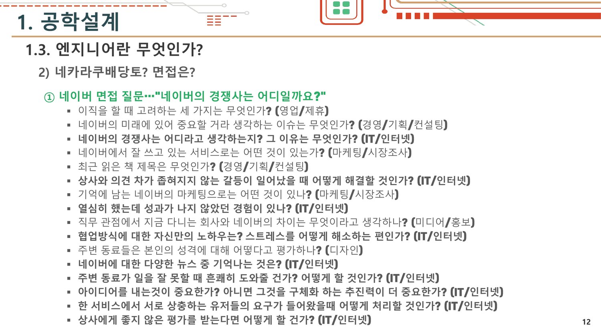
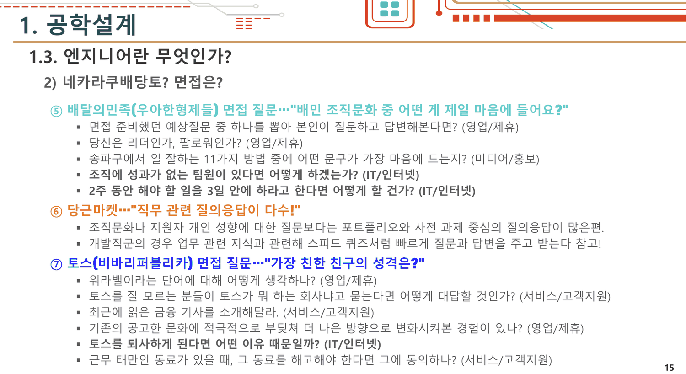
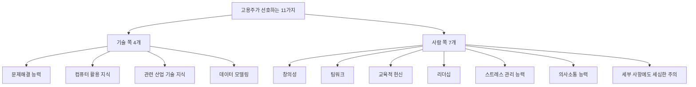
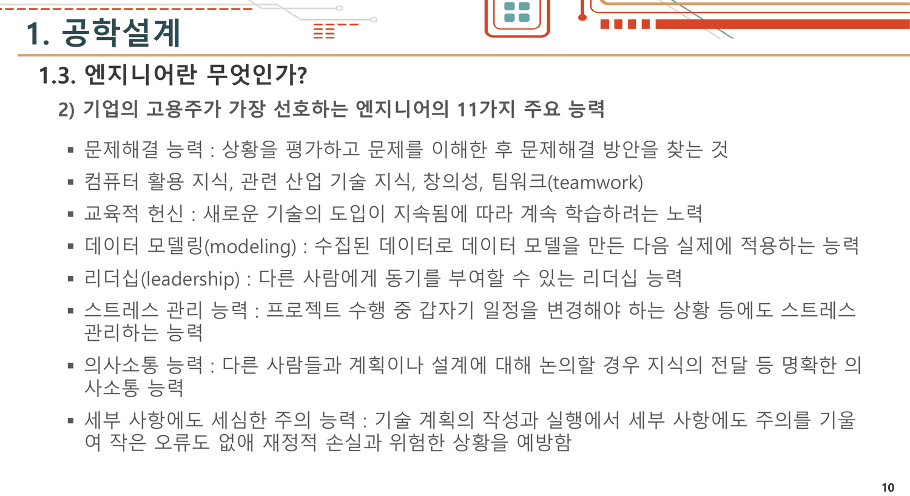
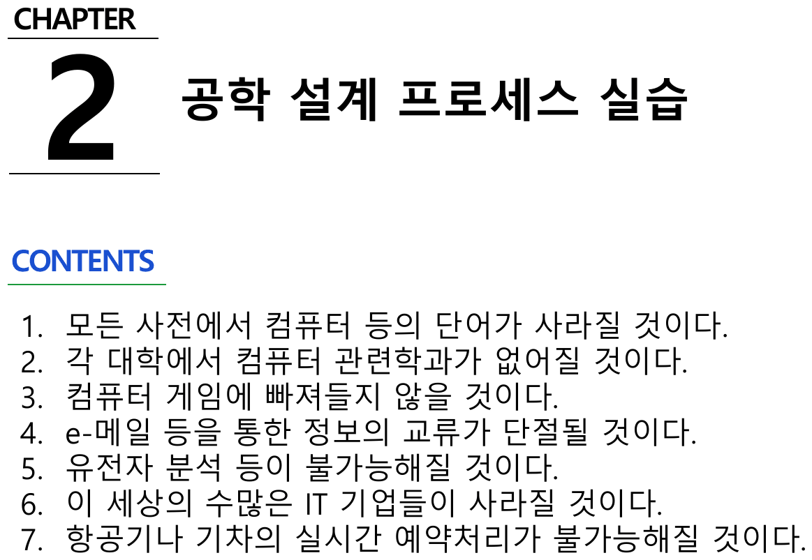

## 절 하나를 여덟 장으로 세어 본다

1주차의 1.3절 제목은 `엔지니어란 무엇인가?` 다. 9번부터 16번까지 여덟 장이 그 아래 있다.

| 슬라이드 | 하위 제목 | 내용 |
| ---: | --- | --- |
| 9 | 1) 엔지니어가 갖추어야 할 능력(요약) | 여섯 줄 |
| 10 | 2) 기업의 고용주가 가장 선호하는 엔지니어의 11가지 주요 능력 | 열한 항목 |
| 11 | **1)** 자기소개서 준비는 얼마나? | 네이버 자기소개서 문항 전문 |
| 12 | **2)** 네카라쿠배당토? 면접은? ① 네이버 | 질문 16개 |
| 13 | 〃 ② 카카오 | 질문 9개 |
| 14 | 〃 ③ 라인플러스 · ④ 쿠팡 | 질문 15개 |
| 15 | 〃 ⑤ 배달의민족 · ⑥ 당근마켓 · ⑦ 토스 | 질문 11개 + 설명 2줄 |
| 16 | 3) 자기소개서 [과제] | 과제 세 줄 |

여덟 장 중 **다섯 장(11~15번)이 취업 자료**다. 그리고 10번에서 2)까지 갔던 하위 번호가 11번에서 다시 1)로 돌아간다 — 같은 절 안에 1)·2) 짝이 두 벌 있다.



> [!important] 이 노트의 척추
> 절 제목은 정의를 묻는다 — **「엔지니어란 무엇인가?」** 아홉 번째와 열 번째 장이 능력 목록으로 답하고, 그다음 다섯 장은 **일곱 회사가 실제로 무엇을 묻는지**로 답한다. 그 쉰한 개 질문을 세어 보면 **기술을 묻는 것이 하나도 없다.** 엔지니어의 정의가 「고용주가 선호하는 것」으로 넘어가고, 고용주가 선호하는 것을 실제 질문으로 확인해 보니 거기에도 공학이 없다.

---

## 쉰한 개를 직무별로 세어 본다

12~15번의 질문에는 전부 오른쪽에 직무 꼬리표가 붙어 있다. 꼬리표가 붙은 질문만 세면 쉰한 개다.

```html preview
<div id="iv" style="font-family:system-ui,-apple-system,sans-serif;color:var(--foreground);background:var(--card);border:1px solid var(--border);border-radius:12px;padding:18px 16px;">
  <p style="margin:0 0 14px;font-size:13px;color:var(--muted-foreground);line-height:1.7;">
    1주차 12~15번의 질문을 슬라이드에 붙은 직무 꼬리표 그대로 집계했다(꼬리표 없는 줄 제외 · 총 51개).
    막대를 눌러 회사별 내역을 본다.</p>
  <svg id="ivs" viewBox="0 0 620 300" style="width:100%;height:auto;display:block;"></svg>
  <div id="ivo" style="margin-top:10px;font-size:13.5px;line-height:1.9;"></div>
</div>
<script>
(function(){
  const NS='http://www.w3.org/2000/svg', svg=document.getElementById('ivs');
  const el=(t,a,x)=>{const e=document.createElementNS(NS,t);for(const k in a)e.setAttribute(k,a[k]);
    if(x!==undefined)e.textContent=x;return e;};
  const D={'네이버':{'IT/인터넷':9,'경영/기획/컨설팅':2,'마케팅/시장조사':2,'영업/제휴':1,'미디어/홍보':1,'디자인':1},
    '카카오':{'IT/인터넷':3,'경영/기획/컨설팅':2,'디자인':2,'미디어/홍보':1,'마케팅/시장조사':1},
    '라인플러스':{'IT/인터넷':3,'경영/기획/컨설팅':2},
    '쿠팡':{'유통/무역':4,'경영/기획/컨설팅':2,'마케팅/시장조사':2,'인사/총무':1,'생산관리/품질관리':1},
    '배달의민족':{'영업/제휴':2,'IT/인터넷':2,'미디어/홍보':1},
    '토스':{'서비스/고객지원':3,'영업/제휴':2,'IT/인터넷':1}};
  const tot={}; for(const c in D) for(const k in D[c]) tot[k]=(tot[k]||0)+D[c][k];
  const tags=Object.keys(tot).sort((a,b)=>tot[b]-tot[a]);
  const TOTAL=Object.values(tot).reduce((a,b)=>a+b,0);
  let sel=tags[0];
  const L=142,R=598,T=14,H=26;
  function draw(){
    svg.textContent='';
    tags.forEach((k,i)=>{
      const y=T+i*H+13, w=(R-L)*tot[k]/tot[tags[0]];
      svg.appendChild(el('text',{x:L-10,y:y+4,'text-anchor':'end','font-size':11,
        fill: k===sel?'var(--chart-1)':'var(--foreground)','font-weight':k===sel?700:400},k));
      const r=el('rect',{x:L,y:y-10,width:Math.max(w,2),height:20,rx:4,
        fill: k===sel?'var(--chart-1)':'var(--chart-2)', opacity:k===sel?0.95:0.45,style:'cursor:pointer'});
      r.addEventListener('click',()=>{sel=k;draw();});
      svg.appendChild(r);
      svg.appendChild(el('text',{x:L+Math.max(w,2)+8,y:y+4,'font-size':11,
        fill:'var(--muted-foreground)'}, tot[k]+'개 · '+(tot[k]/TOTAL*100).toFixed(1)+'%'));
    });
    const yb=T+tags.length*H+22;
    svg.appendChild(el('line',{x1:L-120,y1:yb,x2:R,y2:yb,stroke:'var(--border)'}));
    svg.appendChild(el('text',{x:L-120,y:yb+22,'font-size':12,fill:'var(--foreground)','font-weight':700},
      '기술 지식을 묻는 질문'));
    svg.appendChild(el('text',{x:L-120,y:yb+42,'font-size':12,fill:'var(--chart-2)','font-weight':700},
      '0개 / 51개 — 쉰한 개 중 하나도 없다'));
    svg.appendChild(el('text',{x:L-120,y:yb+62,'font-size':10.5,fill:'var(--muted-foreground)'},
      '15번의 당근마켓 설명 두 줄만 「업무 관련 지식 스피드 퀴즈」를 언급하고, 예시는 주지 않는다'));
  }
  function upd(){ draw();
    const rows=Object.keys(D).filter(c=>D[c][sel]).map(c=>c+' '+D[c][sel]+'개');
    document.getElementById('ivo').innerHTML='<b style="color:var(--chart-1)">'+sel+'</b> — '+
      (rows.length? rows.join(' · ') : '해당 없음')+
      '<p style="margin:6px 0 0;font-size:12.5px;color:var(--muted-foreground);line-height:1.75">'+
      (sel==='IT/인터넷'
        ? '가장 많은 꼬리표이고, 개발 직군에 가장 가깝다. 그런데 이 18개도 내용은 「상사와 의견 차가 좁혀지지 않을 때」·「주변 동료가 일을 잘 못할 때」처럼 전부 조직 생활에 관한 것이다.'
        : sel==='유통/무역'
        ? '넷 모두 쿠팡 질문이다. 한 회사의 꼬리표가 통째로 한 직무에 몰린 유일한 경우.'
        : '이 꼬리표를 단 질문도 공학 지식을 묻지 않는다.')+'</p>';
  }
  svg.addEventListener('click',()=>setTimeout(upd,0)); upd();
})();
</script>

가장 큰 덩어리인 `IT/인터넷` 열여덟 개조차 이런 것들이다.

> 상사와 의견 차가 좁혀지지 않는 갈등이 일어났을 때 어떻게 해결할 것인가 · 주변 동료가 일을 잘 못할 때 흔쾌히 도와줄 건가 · 아이디어를 내는 것이 중요한가 아니면 구체화하는 추진력이 더 중요한가 · 조직에 성과가 없는 팀원이 있다면 어떻게 하겠는가 · 2주 동안 해야 할 일을 3일 안에 하라고 한다면

**쉰한 개 중 자료구조·알고리즘·시스템 설계·언어·모델을 묻는 것이 하나도 없다.** 기술 면접이 존재한다는 언급은 15번의 당근마켓 항목 두 줄뿐이고, 거기서도 예시는 주지 않는다.

> 개발직군의 경우 업무 관련 지식과 관련해 스피드 퀴즈처럼 빠르게 질문과 답변을 주고 받는다 참고!

그 한 줄이 실린 15번은 이 다섯 장의 마지막이고, 한 슬라이드에 세 회사(배달의민족 · 당근마켓 · 토스)를 몰아넣는다.



---

## 학부생에게 물을 수 없는 질문들

쉰한 개를 다시 읽으면, 몇 개는 **이미 직장에 다니는 사람**을 전제한다.

| 질문 | 회사 | 전제 |
| --- | --- | --- |
| 이직을 할 때 고려하는 세 가지는 무엇인가 | 네이버 | 현재 직장이 있다 |
| 직무 관점에서 **지금 다니는 회사**와 네이버의 차이는 무엇이라고 생각하나 | 네이버 | 〃 |
| **작은 회사에서 근무하다가** 큰 회사에 입사하는 건데, 적응할 수 있을까? | 라인플러스 | 〃 |
| 다른 회사에서 더 높은 연봉을 부른다면, 이직을 할 건가 | 쿠팡 | 〃 |
| **선임한테서** 배울 게 없다고 생각되면 어떻게 할 건가 | 카카오 | 배속된 조직이 있다 |
| 토스를 **퇴사하게** 된다면 어떤 이유 때문일까 | 토스 | 입사를 이미 가정한다 |
| **근무 태만인 동료**가 있을 때, 그 동료를 해고해야 한다면 | 토스 | 〃 |

일곱 개다. 신입 공채 대비 자료로 모은 목록이 아니라 **경력 면접 후기를 포함한 채로 옮겨진 것**임을 보여 준다. 16번이 이 다섯 장을 받아 과제를 낸다.

> 입사 하고 싶은 곳 자기 소개서 양식을 구해서 작성하여 제출 / 만약 창업을 하려 한다면 본인이 사람을 채용한다고 생각하고 자기소개서 양식을 만들고 거기에 본인이 작성 / 포트폴리오만 받는 회사라고 한다면 본인 포트폴리오 정리해서 그 양식으로 제출

세 갈래인데 **세 번째만 이 과목의 산출물과 이어진다.** 학기 내내 만드는 것이 포트폴리오가 될 시스템이기 때문이다. 그런데 앞의 다섯 장은 포트폴리오 이야기를 한 줄도 하지 않는다 — 당근마켓 항목의 `포트폴리오와 사전 과제 중심의 질의응답이 많은편` 한 줄이 전부다.

---

## 10번 — 고용주가 선호하는 열한 가지

11~15번 바로 앞에 놓인 10번이 이 절의 실제 답이다. `기업의 고용주가 가장 선호하는 엔지니어의 11가지 주요 능력`.





열한 개 중 기술에 닿는 것은 넷이고, 그중 설명 문장이 붙은 것은 **문제해결 능력**과 **데이터 모델링** 둘뿐이다(`컴퓨터 활용 지식, 관련 산업 기술 지식, 창의성, 팀워크(teamwork)` 는 한 줄에 이름만 나열된다). 나머지 일곱은 전부 설명이 붙어 있고 전부 사람에 관한 것이다.

그러니까 **면접 질문 다섯 장은 10번의 비율을 그대로 확대한 것**이다. 기술 넷 대 사람 일곱이 질문 0개 대 51개가 된다.

> [!note] 9번과 10번이 서로를 비춘다
> 9번은 ABEEK 인증 기준을 요약한 여섯 줄이다 — 「수학, 기초과학, 공학의 지식과 정보기술을 응용할 수 있는 능력」으로 시작해 「직업적 책임과 윤리적 책임에 대한 인식」으로 끝난다. 10번은 기업 쪽 목록이다. 두 장을 겹쳐 보면 **공통으로 살아남는 것은 의사소통 하나**다. 인증기관이 첫 줄에 놓은 「수학·기초과학·공학의 지식」은 기업 목록에서 `관련 산업 기술 지식` 이라는 한 낱말로 줄어든다.

---

## 2주차가 같은 자리를 다르게 채운다

2주차에는 면접 질문이 없다. 같은 「엔지니어」 자리를 27~28번이 채운다.

**27번 — 엔지니어의 표상 다섯 줄 + 갖추려고 노력해야 할 가치관 다섯 줄.** 앞의 다섯 줄은 1주차 28번과 글자까지 같고, 뒤의 다섯 줄이 새로 붙는다.

> 창의적인 작업의 추구와 변화하는 공학기술에 대한 자세 확립 / 끊임없는 노력으로 실패의 위험 요소에 대해 도전 / 실제적이고 유용한 제품을 출시해야 한다는 사실을 인식 / 공학과 과학이 요구하는 가치에 대한 믿음을 가짐 / 자원의 낭비를 막고 품질 향상을 최우선으로 생각

**28번 — ABET·IEEE·NSPE의 윤리 규정 종합 여섯 줄.** 1주차에는 없던 내용이다.

> 공공은 엔지니어에게 최고의 윤리적 행위를 수행할 것을 요구 / 공공의 안전과 건강 및 복지를 유지하는데 헌신

1주차가 「고용주가 무엇을 원하는가」로 엔지니어를 정의했다면 2주차는 「공공이 무엇을 요구하는가」로 정의한다. **두 정의가 한 학기 안에 나란히 있고, 둘을 잇는 문장은 없다.** 그리고 1주차 쪽에만 다섯 장이 배정되어 있다.

---

## 팀과 혁신 — 역할표와 격언 사이

2주차 10~11번(1주차 25~26번과 동일)이 팀 역할을 나눈다.

| | 줄 수 | 동사 |
| --- | ---: | --- |
| 팀 리더 | 7 | 설정 · 수립 · 분배 · 결정 · 소통 · 지원 · 관리 |
| 팀 구성원 | 5 | 수행 · 발전 · 해결 · 공유 · 피드백 |

리더에게는 **의사 결정과 품질 관리**가 배정되고(「프로젝트 진행 중 발생하는 다양한 문제에 대한 최종 의사 결정을 담당」, 「코드 리뷰 등을 통해 결과물의 질을 보장」), 구성원에게는 **수행과 공유**가 배정된다. 분업이 명확한 대신, 열두 줄 어디에도 **팀이 합의에 이르지 못했을 때의 절차**가 없다. 리더가 최종 결정한다는 한 줄이 그 자리를 대신한다.

2주차 12~14번이 혁신 방법으로 넘어가는데, 여기서 문장의 성격이 바뀐다.

> • 개인의 습관이나 경험에 사로잡히지 않는다 • 브레인스토밍을 통해 팀의 의견을 공유한다 • 변화에 대한 공포를 극복하고, 실패를 두려워하지 않는다 (12번)
>
> • 불필요한 제한조건을 가능하면 설정하지 않는다 • 선입견과 틀에 박힌 생각을 버린다 • 복잡한 문제의 경우 여러 부분으로 나눠 차례로 풀어나간다 (13번)
>
> 「천재는 1%의 영감과 99%의 노력으로 이루어진다」 「나는 실패하지 않았다. 나는 통하지 않는 방법 1만 가지를 발견했다」 — 에디슨 (14번)

열 줄이 전부 **하지 말아야 할 것**이거나 태도다. 13번의 「복잡한 문제의 경우 여러 부분으로 나눠 차례로 풀어나간다」 하나만 실행 가능한 절차인데, 그것을 어떻게 나누는지는 말하지 않는다. 14번에 이르면 방법이 격언으로 바뀐다.

15번이 그 흐름을 문제 유형으로 정리한다 — **열린 사고력 문제(open-ended problem)**.

> 열린 사고력 향상 6계명: 다른 방법은 없을까? / 다른 용도에 적용한다면 어떨까? / 확대 또는 축소한다면 어떨까? / 다른 것과 결합하면 어떨까? / 거꾸로 생각한다면 어떨까? / 주어진 조건을 변경한다면 어떨까?

이 여섯 줄은 4주차의 다섯 가지 문제 발상법으로 다시 나타난다. 그러니까 이 과목에서 **실제로 반복되며 살아남는 발상 도구는 이 여섯 계명 하나**다.

---

## 답이 목차 자리에 들어간 한 장

2주차 16번이 「열린 사고력 문제」의 풀이 예시를 든다. 문제는 인쇄되어 있지 않고 `[풀이] 여러 가지 아이디어 생성 가능` 아래 일곱 줄만 있다.

> • 모든 사전에서 컴퓨터 등의 단어가 사라질 것이다 • 각 대학에서 컴퓨터 관련학과가 없어질 것이다 • 컴퓨터 게임에 빠져들지 않을 것이다 • e-메일 등을 통한 정보의 교류가 단절될 것이다 • 유전자 분석 등이 불가능해질 것이다 • 이 세상의 수많은 IT 기업들이 사라질 것이다 • 항공기나 기차의 실시간 예약처리가 불가능해질 것이다

문제는 「컴퓨터가 없다면 어떻게 될까?」였을 것이다 — 20번의 양식 예시가 `컴퓨터가 없는 세상에서도 정보 공유가 가능한 AI 기반 커뮤니케이션 시스템` 을 들기 때문이다. **질문이 인쇄된 슬라이드는 이 덱에 없다.**

그리고 세 장 뒤, 19번이 새 장(CHAPTER 2)의 표지다.



> **CHAPTER 2 — 공학 설계 프로세스 실습**
>
> **CONTENTS**
> — 1. 모든 사전에서 컴퓨터 등의 단어가 사라질 것이다.
> — 2. 각 대학에서 컴퓨터 관련학과가 없어질 것이다.
> — …
> — 7. 항공기나 기차의 실시간 예약처리가 불가능해질 것이다.

**목차 자리에 16번의 답 일곱 줄이 번호만 붙어 그대로 복사되어 있다.** 3번 슬라이드의 CHAPTER 1 표지는 `1.1 공학 설계 프로세스` … `1.5 …` 로 제대로 된 목차를 갖고 있고, 24번의 CHAPTER 3 표지도 `3.1 · 3.2 · 3.3` 이다. **표지 셋 중 하나만 목차가 아닌 것으로 채워져 있다.**

이것이 사소한 사고로만 보이지는 않는다. 그 뒤에 오는 20~23번의 양식이 실제로 이 일곱 줄 중 하나를 골라 채우게 되어 있고(20번의 예시가 그중 네 번째 「정보 교류 단절」에 대응한다), 그래서 **표지가 「이 장에서 다룰 것」이 아니라 「이 장에서 고를 것」의 목록이 되어 버린 것**이다. 의도였다면 번호 매긴 선택지 일곱 개가 맞고, 사고였다면 CONTENTS 라벨이 남은 것이 틀렸다.

---

## 원본에서 발견한 것

`구성 · 번호`

- **1주차 1.3절의 하위 번호가 두 번 1)로 돌아간다** — 9번 `1)` · 10번 `2)` 다음 11번이 다시 `1)`, 12번 `2)`, 16번 `3)`. 같은 절 안에 두 벌의 번호 체계가 있다
- **면접 질문 다섯 장(11~15번)은 2주차에서 통째로 사라진다.** 같은 「엔지니어」 자리를 2주차는 27~28번 두 장(표상 · ABET 윤리 코드)으로 채운다. 1주차 28번의 다섯 줄만 2주차 27번 위쪽에 그대로 살아남는다

`내용의 어긋남`

- **절 제목은 정의를 묻는데 다섯 장이 채용 자료다.** 꼬리표가 붙은 질문 51개 가운데 **공학 지식을 묻는 것이 0개**다. 기술 면접이 있다는 언급은 15번 당근마켓 항목의 두 줄뿐이고 예시가 없다
- **학부생에게 성립하지 않는 질문이 일곱 개 있다** — 「이직을 할 때 고려하는 세 가지」·「지금 다니는 회사와 네이버의 차이」(네이버), 「작은 회사에서 근무하다가 큰 회사에 입사하는 건데」(라인플러스), 「다른 회사에서 더 높은 연봉을 부른다면 이직을 할 건가」(쿠팡), 「선임한테서 배울 게 없다고 생각되면」(카카오), 「토스를 퇴사하게 된다면」·「근무 태만인 동료를 해고해야 한다면」(토스). 전부 현재 직장이나 입사를 전제한다
- **12번 첫 줄에 꼬리표가 없다** — `네이버의 경쟁사는 어디일까요` 는 그 장의 제목 역할을 하는 굵은 줄인데, 네 번째 질문 `네이버의 경쟁사는 어디라고 생각하는지 그 이유는 무엇인가` 와 같은 질문이다. 같은 질문이 제목으로 한 번, 목록 항목으로 한 번 인쇄되어 있다. 13~15번도 같은 구조다(「자신과 닮은 카카오 프렌즈는?」·「라인이 한국에서도 성공할까요」·「쿠팡의 리더십 원칙을 아나요」·「배민 조직문화 중 어떤 게 제일 마음에 들어요」·「가장 친한 친구의 성격은」)
- **10번의 열한 항목 중 넷만 설명 없이 나열된다** — `컴퓨터 활용 지식, 관련 산업 기술 지식, 창의성, 팀워크(teamwork)` 가 쉼표로 이어진 한 줄이고, 나머지 일곱에는 각각 콜론과 설명이 붙는다. **설명이 빠진 넷 중 셋이 기술 항목**이다

`같은 내용의 중복`

- **2주차 19번의 장 표지 `CONTENTS` 가 목차가 아니다** — 16번 「열린 사고력 문제」의 답 일곱 줄이 번호만 붙어 그대로 들어가 있다. 같은 덱의 다른 두 장 표지(3번 · 24번)는 정상적인 절 목록을 갖는다
- **2주차 16번에 문제가 인쇄되어 있지 않다** — `[풀이]` 만 있고 질문이 없다. 20번의 양식 예시(`컴퓨터가 없는 세상에서도…`)로 역산해야 질문을 알 수 있다

- **1주차 25~26번 ↔ 2주차 10~11번** — 팀 리더 일곱 줄과 팀 구성원 다섯 줄이 글자까지 같다
- **1주차 27번 ↔ 2주차 25번** — 공학윤리 개념 슬라이드가 그대로 반복된다
- **1주차 28번 ↔ 2주차 27번 위쪽** — 「이상적인 엔지니어의 표상」 다섯 줄이 같다. 2주차에서 제목만 `엔지니어의 표상` 으로 「이상적인」이 빠진다

---

## 근거 자료

| 원본 | 쪽 | 이 노트에서 쓴 곳 |
| --- | --- | --- |
| `[1주차] … 배포.pdf` | 9~16 · 25~28 | 1.3절 여덟 장, 면접 질문 51개, 고용주의 열한 가지, 팀 역할 |
| `[2주차] … 배포 (1).pdf` | 10~20 · 25 · 27~28 | 팀 역할 재인쇄, 혁신 방법 세 장, 열린 사고력 6계명과 풀이, 답이 목차가 된 표지, ABET 윤리 코드 |

인용한 슬라이드 네 장 — 1주차 10 · 12 · 15번과 2주차 19번. 직무별 집계는 12~15번의 인쇄된 꼬리표를 하나씩 세어 파이썬으로 합산했고(총 51개, 꼬리표 없는 줄 제외), 회사별 합계 16 · 9 · 5 · 10 · 5 · 6 이 총합과 맞는지 확인했다.

### 이어지는 곳

- [[01. 설계 프로세스를 네 번 가르치고 고르는 법은 가르치지 않는다]] — 같은 덱의 1.4~1.5절. 프로세스가 넷인데 고르는 법이 없는 것과, 정의를 묻고 채용으로 답하는 것은 같은 종류의 공백이다
- [[03. 경고를 무시한 이야기 셋, 경고가 없었던 이야기 둘]] — 2주차 28번의 ABET 윤리 코드가 실제 사고들과 만나는 자리
- [[05. 문제를 찾는 다섯 가지 방법과, 학생에게 매출 목표를 묻는 양식]] — 2주차 15번의 「열린 사고력 향상 6계명」이 4주차에서 다섯 가지 발상법으로 다시 나타난다
