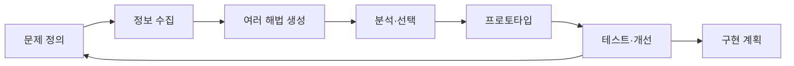
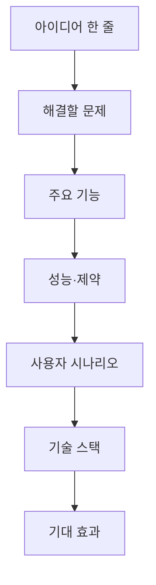

## 설계 프로세스와 요구사항

> [!abstract] 한 줄 요약
> 설계의 품질은 아이디어의 수가 아니라, ==문제 정의를 검증 가능한 요구사항==으로 바꾸는 데서 결정된다.

이 회차는 3·5·7단계 설계 프로세스를 다시 짚은 뒤, 팀 역할·창의적 사고·열린 문제·요구사항 정의를 하나의 실습 흐름으로 연결한다. 핵심은 “좋아 보이는 해답”을 바로 만들지 않고, 문제와 제약을 먼저 문서화하는 것이다.



## 요구사항은 무엇을 고정하는가

기능적 요구사항은 시스템이 **해야 하는 일**을, 비기능적 요구사항은 시스템이 **어떤 기준으로 동작해야 하는지**를 적는다. 강의의 예시는 이미지 분석 결과 반환, 챗봇 응답, 음성의 텍스트 변환을 기능으로 들고, 응답 시간·가동률·보안·개인정보 보호를 비기능 기준으로 든다.

<Tabs>
  <Tab label="기능">
사용자나 다른 시스템이 관찰할 수 있는 동작이다. “이미지를 받으면 분석 결과를 반환한다”처럼 입력과 결과를 연결해 쓴다.
  </Tab>
  <Tab label="비기능">
속도, 신뢰성, 보안, 사용 환경처럼 품질과 제약을 명시한다. “응답 시간은 2초 이내”처럼 측정 가능한 문장으로 바꾼다.
  </Tab>
  <Tab label="규격">
반드시 충족해야 하는 절대적 규격과 일정 범위에서 조정할 수 있는 규격을 구분한다. 구분하지 않으면 일정이 밀릴 때 무엇을 지켜야 하는지 판단하기 어렵다.
  </Tab>
</Tabs>

```html preview h=225
<div style="font-family:system-ui,sans-serif;padding:18px;color:var(--foreground)">
  <div style="display:grid;grid-template-columns:repeat(auto-fit,minmax(180px,1fr));gap:12px">
    <div style="padding:14px;border:1px solid var(--border);border-radius:var(--radius);background:var(--card)">
      <div style="font-weight:700;color:var(--chart-1)">기능</div>
      <div style="font-size:13px;color:var(--muted-foreground);margin-top:6px">사용자가 무엇을 할 수 있는가?</div>
      <div style="margin-top:10px;font-size:12px">예: 입력을 받아 분석 결과를 돌려준다.</div>
    </div>
    <div style="padding:14px;border:1px solid var(--border);border-radius:var(--radius);background:var(--card)">
      <div style="font-weight:700;color:var(--chart-2)">품질</div>
      <div style="font-size:13px;color:var(--muted-foreground);margin-top:6px">얼마나 빠르고 안정적인가?</div>
      <div style="margin-top:10px;font-size:12px">예: 응답 시간, 가동률, 보안 기준.</div>
    </div>
    <div style="padding:14px;border:1px solid var(--border);border-radius:var(--radius);background:var(--card)">
      <div style="font-weight:700;color:var(--chart-4)">판단</div>
      <div style="font-size:13px;color:var(--muted-foreground);margin-top:6px">무엇을 절대 지킬 것인가?</div>
      <div style="margin-top:10px;font-size:12px">예: 필수 조건과 조정 가능한 목표.</div>
    </div>
  </div>
</div>
```

> [!important] 측정할 수 있어야 설계할 수 있다
> “빠르게 응답한다”는 바람에 가깝다. 반면 응답 시간·가동률·정확도·보안 요구를 구체적인 기준으로 쓰면, 테스트와 우선순위 판단의 기준이 된다.

<details>
<summary>절대적 규격과 절충 가능한 규격을 나누는 질문</summary>

| 구분 | 질문 | 강의의 예시 |
| :-- | :-- | :-- |
| 절대적 규격 | 충족하지 못하면 출시·운영이 불가능한가? | 암호화 방식, API 응답 한계, 가동률 |
| 절충 가능한 규격 | 상황에 따라 범위를 조정할 수 있는가? | UI 색상, 초기 모델 정확도 목표, 일부 기능의 초기 제외 |

강의의 수치는 예시다. 실제 프로젝트에서는 서비스 위험과 사용 환경에 맞추어 기준을 새로 합의해야 한다.
</details>

## 아이디어를 해답으로 고정하지 않는 법

공학적 혁신은 습관과 경험에 갇히지 않고 브레인스토밍으로 의견을 모으며, 실패 원인을 분석하고 변화를 두려워하지 않는 태도와 연결된다. 열린 사고력 문제는 예·아니오 하나로 닫히지 않으며, 여러 방향의 탐구를 요구한다.

```html preview h=190
<div style="font-family:system-ui,sans-serif;padding:18px;color:var(--foreground)">
  <div style="display:flex;gap:10px;flex-wrap:wrap;align-items:stretch">
    <div style="flex:1;min-width:150px;padding:12px;background:var(--card);border:1px solid var(--border);border-radius:var(--radius)">
      <div style="font-weight:700;color:var(--chart-3)">질문 바꾸기</div>
      <div style="font-size:12px;color:var(--muted-foreground);margin-top:6px">다른 방법·용도·규모는 없는가?</div>
    </div>
    <div style="flex:1;min-width:150px;padding:12px;background:var(--card);border:1px solid var(--border);border-radius:var(--radius)">
      <div style="font-weight:700;color:var(--chart-4)">해법 늘리기</div>
      <div style="font-size:12px;color:var(--muted-foreground);margin-top:6px">여러 해결안을 만든 뒤 비교한다.</div>
    </div>
    <div style="flex:1;min-width:150px;padding:12px;background:var(--card);border:1px solid var(--border);border-radius:var(--radius)">
      <div style="font-weight:700;color:var(--chart-5)">제약 다시 보기</div>
      <div style="font-size:12px;color:var(--muted-foreground);margin-top:6px">불필요한 제한은 걷어 내고 필요한 제한은 명시한다.</div>
    </div>
  </div>
</div>
```

<details>
<summary>열린 사고력 문제를 위한 여섯 질문</summary>

- 다른 방법은 없을까?
- 다른 용도에 적용하면 어떨까?
- 확대하거나 축소하면 어떨까?
- 다른 것과 결합하면 어떨까?
- 거꾸로 생각하면 어떨까?
- 주어진 조건을 바꾸면 어떨까?

이 질문들은 정답을 보장하는 공식이 아니라, 한 가지 해법에 성급히 고정되는 것을 막는 장치다.
</details>

> [!note] 팀 역할의 최소 연결
> 리더는 목표·일정·역할 배분·의사결정·소통·품질 관리를 맡고, 구성원은 할당 업무 수행, 기술 공유, 문제 식별, 진행 상황 공유, 피드백 교환으로 설계를 앞으로 움직인다.

## 아이디어 기획 문서로 옮기기

강의 실습 양식은 아이디어 한 줄 요약에서 시작해 문제, 주요 기능, 성능·제약, 예상 사용자와 활용 시나리오, 기술 스택, 기대 효과로 이어진다.



> [!tip] 발표는 설계 검증의 한 장면이다
> 문제·사용자·기능·제약을 다른 사람이 이해할 수 있게 설명하는 과정에서 빠진 가정과 모호한 기준이 드러난다.

## 핵심 정리

| 개념 | 핵심 |
| :-- | :-- |
| 기능적 요구사항 | 시스템이 제공해야 하는 동작 |
| 비기능적 요구사항 | 속도·신뢰성·보안처럼 동작의 품질과 제약 |
| 절대적 규격 | 반드시 충족해야 하는 조건 |
| 열린 사고력 | 여러 해법을 만들고 제약을 다시 보는 문제 해결 태도 |
| 문제 정의 | 이후의 데이터·모델·아키텍처 판단을 고정하는 출발점 |

> [!question]- 스스로 점검
> “AI가 사용자를 돕는다”를 요구사항으로 바꾸려면 무엇이 더 필요한가?
>
> 어떤 사용자가 어떤 입력을 주고 어떤 결과를 받는지, 결과가 얼마나 빠르고 안전하고 정확해야 하는지, 무엇이 절대 조건인지를 적어야 한다.
