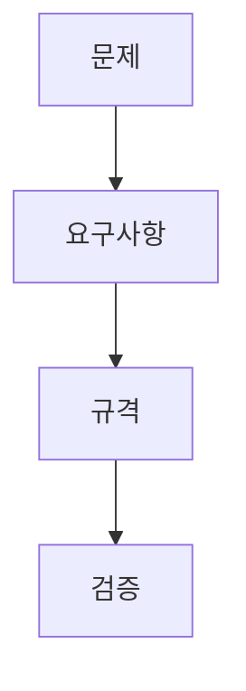

> [!abstract] 한 줄 요약
> 요구사항은 AI 시스템이 ==무엇을 해야 하는지==와 어떤 성능·제약 아래 동작해야 하는지를 분리해 정의하는 설계의 출발점이다.

## 이 노트의 지도



## 1. 문제에서 요구사항으로

강의는 7단계 설계 과정에서 문제 정의와 정보 수집 다음에 여러 해결책을 만들고, 분석·선택·프로토타입·테스트·구현으로 이어지는 흐름을 제시한다.

<details>
<summary>문제 정의에서 확인할 것</summary>

문제와 제약조건을 묻고, 폭넓은 자료를 수집하며, 팀의 여러 의견을 모아 해결책을 생성한다. 이 단계가 불명확하면 이후의 규격과 테스트 기준도 흔들린다.

</details>

$$
R=R_f\cup R_{nf}
$$

여기서 $R_f$는 기능적 요구사항,$R_{nf}$는 비기능적 요구사항을 뜻하는 강의의 구분을 압축한 표기다.

<Tabs>
  <Tab label="기능 요구">
    사용자가 이미지를 업로드하면 AI가 분석하여 결과를 반환해야 한다는 식으로, 시스템이 제공할 동작을 적는다.
  </Tab>
  <Tab label="비기능 요구">
    AI 응답 시간이 2초 이내여야 한다는 식으로, 성능·환경·제약 기준을 적는다.
  </Tab>
</Tabs>

<details>
<summary>규격과 예비 판단 기준</summary>

강의는 요구사항, 규격, 예비적 판단 기준을 함께 둔다. 필수 요구사항은 반드시 충족해야 하고, 조정 가능한 요구사항은 일정 범위 안에서 바뀔 수 있다.

</details>

> [!important] 문장의 차이
> “분석 결과를 반환한다”는 기능을, “2초 이내에 반환한다”는 ==측정 가능한 제약==을 말한다.

## 2. 수치 예시를 읽는 법

강의의 예시는 응답 시간과 정확도 기준을 함께 사용한다.

$$
t_{response}\le2\ \text{seconds},
\qquad
accuracy\ge85\%,
\qquad
accuracy\ge80\%\ \text{allowed}
$$

```html preview
<div style="font-family:system-ui,sans-serif;padding:20px">
  <div id="cards" style="display:flex;gap:14px;flex-wrap:wrap"></div>
  <script>
    var stats = [
      ['응답 시간', '2초', '비기능 요구 예시', 'var(--chart-2)'],
      ['목표 정확도', '85%', '강의 예시', 'var(--chart-1)'],
      ['허용 정확도', '80%', '조정 가능 범위', 'var(--chart-5)']
    ];
    document.getElementById('cards').innerHTML = stats.map(function (s) {
      return '<div style="flex:1;min-width:150px;padding:16px;background:var(--card);' +
        'color:var(--card-foreground);border:1px solid var(--border);' +
        'border-radius:var(--radius)">' +
        '<div style="font-size:13px;color:var(--muted-foreground)">' + s[0] + '</div>' +
        '<div style="font-size:26px;font-weight:700;margin-top:4px">' + s[1] + '</div>' +
        '<div style="font-size:12px;font-weight:600;margin-top:4px;color:' + s[3] + '">' +
        s[2] + '</div>' +
        '</div>';
    }).join('');
  </script>
</div>
```

<details>
<summary>AI 아이디어 기획 문서의 항목</summary>

강의 실습 문서는 아이디어 개요, 주요 기능, 성능 및 제약 조건, 사용 상황, 기술 스택·개발 도구, 기대 효과를 차례로 묻는다. 이 순서는 아이디어를 검증 가능한 설계 문장으로 바꾸는 틀이다.

</details>

> [!tip] 작성 순서
> 먼저 사용자와 문제를 한 문장으로 정한 뒤, 기능 요구와 성능·보안·정확도 같은 비기능 요구를 분리해 적는다.

<details>
<summary>스스로 점검</summary>

**Q.** “AI가 이미지를 분석해 결과를 반환한다”와 “2초 이내에 반환한다”는 어떻게 다른가?

**A.** 전자는 기능적 요구사항, 후자는 비기능적 요구사항의 예시다.

</details>

> [!caution] 소스 읽기 경고
> 강의의 2초·85%·80%는 요구사항 형식을 설명하기 위한 예시다. 특정 시스템의 확정 성능으로 옮기지 않는다.

### 요구사항 단계 탐색

```html preview
<div style="font-family:system-ui,sans-serif;padding:20px;color:var(--foreground)">
<label for="amt" style="font-size:14px;font-weight:600">요구사항 확인 항목</label>
<div id="out" style="font-size:30px;font-weight:700;color:var(--chart-1);margin:6px 0">1항목</div>
<input id="amt" type="range" min="1" max="5" step="1" value="1" style="width:100%;accent-color:var(--primary)" />
<p style="font-size:13px;color:var(--muted-foreground)">강의에서 제시한 요구사항 관점을 순서대로 확인한다.</p>
<script>
var amt=document.getElementById('amt'); var out=document.getElementById('out');
amt.addEventListener('input',function(){out.textContent=Number(amt.value).toLocaleString()+'항목';});
</script>
</div>
```

## 출처와 한계

- 근거: 현재 로컬 “2주차 AI시스템설계 및 개발 I” 추출문.
- 원본 PDF 링크, 쪽수 표기, 원본 슬라이드 이미지와 assets 임베드는 이 공개 노트에서 제외했다.
