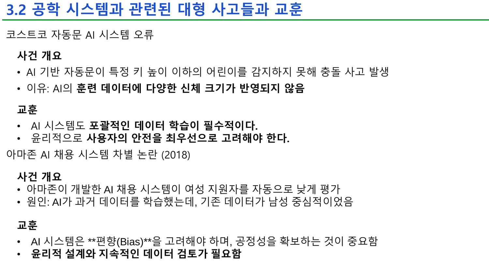
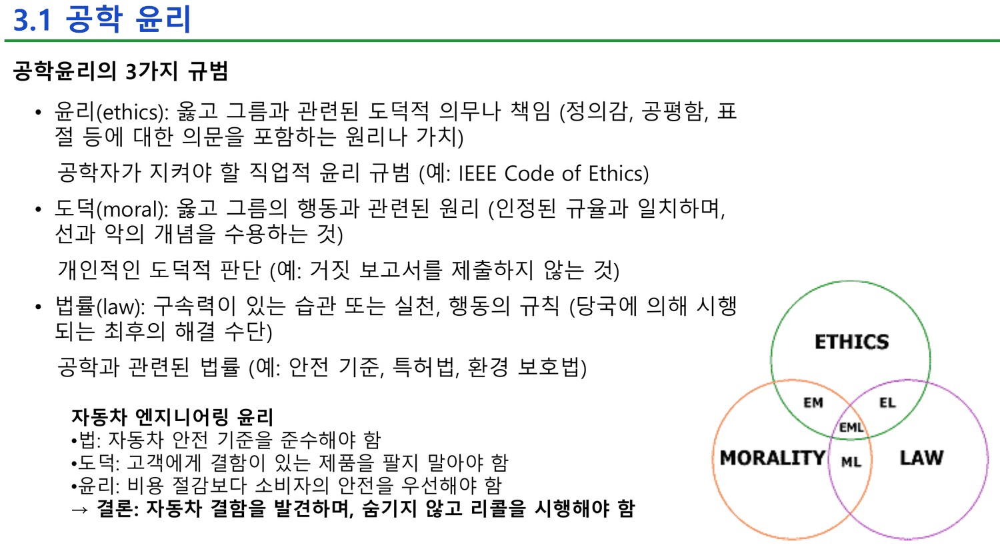
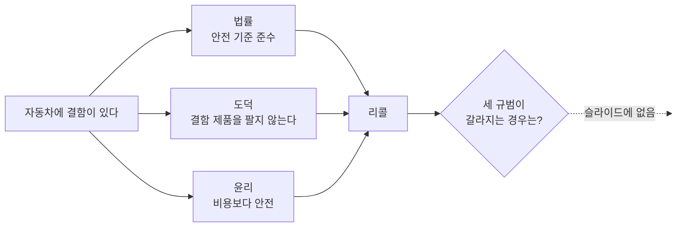
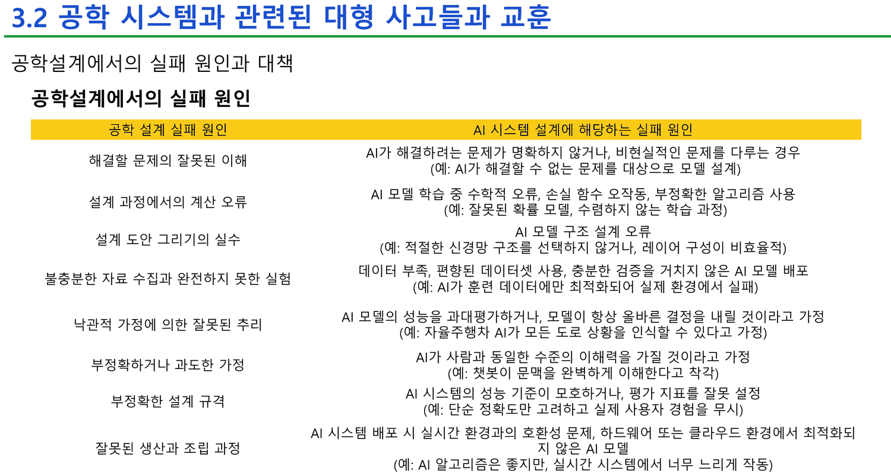
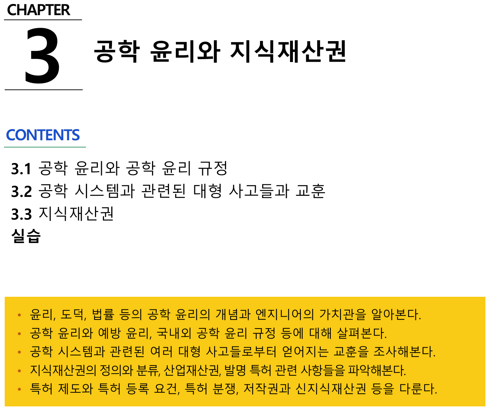

## 다섯 건을 한 줄씩 줄여 본다

2주차 29~31번이 사고 다섯 건을 든다. 각각 「사건 개요」와 「교훈」 두 덩이로 되어 있다. 원인 문장만 뽑으면 이렇다.

| 사고 | 연도 | 슬라이드가 적은 원인 |
| --- | ---: | --- |
| 체르노빌 원자력 발전소 | 1986 | 「원자로 실험 중 **안전 절차를 무시하고** 운전하다가 폭발」 |
| 스페이스 셔틀 챌린저호 | 1986 | 「엔지니어들이 문제를 **보고했으나 관리층이 무시하고** 발사 강행」 |
| 컬럼비아 우주왕복선 | 2003 | 「단열재 손상을 **확인했지만 「큰 문제 없을 것」이라고 판단**」 |
| 코스트코 자동문 AI | — | 「AI의 **훈련 데이터에** 다양한 신체 크기가 **반영되지 않음**」 |
| 아마존 AI 채용 시스템 | 2018 | 「AI가 과거 데이터를 학습했는데, **기존 데이터가 남성 중심적**이었음」 |



> [!important] 이 노트의 척추
> 위 셋과 아래 둘은 **실패의 종류가 반대다.** 앞의 셋에서는 **누군가 이미 알고 있었고** 그 앎이 조직 안에서 묵살됐다. 뒤의 둘에서는 **아무도 알 수 없었다** — 알아야 할 것이 애초에 데이터에 들어 있지 않았다. 덱은 다섯 건을 같은 제목 아래 같은 형식으로 늘어놓고 「교훈」도 같은 어조로 붙인다. 그런데 26번이 가르치는 윤리 세 규범은 **앞의 셋만** 설명하고, 32번이 정리하는 실패 원인 여덟 줄은 **둘 다 놓친다**(전부 설계자의 기술적 오류만 다룬다). 이 절의 가장 중요한 내용이 두 목록 사이의 틈에 있다.

### 다섯 건을 두 축에 놓는다

```html preview
<div id="ac" style="font-family:system-ui,-apple-system,sans-serif;color:var(--foreground);background:var(--card);border:1px solid var(--border);border-radius:12px;padding:18px 16px;">
  <p style="margin:0 0 12px;font-size:13px;color:var(--muted-foreground);line-height:1.7;">
    가로축 — 사고 전에 <b>위험을 아는 사람이 있었는가</b>. 세로축 — 그 앎이 <b>조직 안에서 전달되었는가</b>.
    두 축 모두 슬라이드가 적은 원인 문장에서 직접 읽어 낸 것이다. 점을 누르면 슬라이드의 교훈이 나온다.</p>
  <svg id="acs" viewBox="0 0 620 300" style="width:100%;height:auto;display:block;"></svg>
  <div id="aco" style="margin-top:10px;font-size:13.5px;line-height:1.9;min-height:5.6em;"></div>
</div>
<script>
(function(){
  const NS='http://www.w3.org/2000/svg', svg=document.getElementById('acs');
  const el=(t,a,x)=>{const e=document.createElementNS(NS,t);for(const k in a)e.setAttribute(k,a[k]);
    if(x!==undefined)e.textContent=x;return e;};
  const D=[
    {n:'체르노빌',y:'1986',kx:0.82,ky:0.30,ai:false,
     why:'원자로 실험 중 안전 절차를 무시하고 운전',
     les:['안전 시스템이 있을지라도 절차를 준수하지 않으면 위험하다','안전 설계는 최악의 경우까지 고려해야 한다','투명한 정보 공유가 중요 (사고 초기 은폐로 피해가 커짐)']},
    {n:'챌린저',y:'1986',kx:0.92,ky:0.22,ai:false,
     why:'엔지니어들이 문제를 보고했으나 관리층이 무시하고 발사 강행',
     les:['공학적 결함을 발견하면 보고해야 하고, 이를 무시하면 안 된다','관리층이 엔지니어의 의견을 존중해야 한다','시스템 안전 검토 과정이 철저해야 한다']},
    {n:'컬럼비아',y:'2003',kx:0.86,ky:0.34,ai:false,
     why:'단열재 손상을 확인했지만 「큰 문제 없을 것」이라고 판단',
     les:['공학적 결함을 발견하면 보고해야 하고, 이를 무시하면 안 된다','관리층이 엔지니어의 의견을 존중해야 한다','시스템 안전 검토 과정이 철저해야 한다']},
    {n:'코스트코 자동문 AI',y:'연도 없음',kx:0.14,ky:0.80,ai:true,
     why:'AI의 훈련 데이터에 다양한 신체 크기가 반영되지 않음',
     les:['AI 시스템도 포괄적인 데이터 학습이 필수적이다','윤리적으로 사용자의 안전을 최우선으로 고려해야 한다']},
    {n:'아마존 AI 채용',y:'2018',kx:0.20,ky:0.74,ai:true,
     why:'AI가 과거 데이터를 학습했는데, 기존 데이터가 남성 중심적이었음',
     les:['AI 시스템은 편향(Bias)을 고려해야 하며, 공정성을 확보하는 것이 중요함','윤리적 설계와 지속적인 데이터 검토가 필요함']}];
  const L=60,R=596,T=22,B=232;
  const px=v=>L+v*(R-L), py=v=>T+v*(B-T);
  let sel=1;
  function draw(){
    svg.textContent='';
    svg.appendChild(el('rect',{x:L,y:T,width:(R-L)/2,height:(B-T),fill:'var(--chart-2)',opacity:0.07}));
    svg.appendChild(el('rect',{x:L+(R-L)/2,y:T,width:(R-L)/2,height:(B-T),fill:'var(--chart-1)',opacity:0.07}));
    svg.appendChild(el('line',{x1:L,y1:B,x2:R,y2:B,stroke:'var(--border)'}));
    svg.appendChild(el('line',{x1:L,y1:T,x2:L,y2:B,stroke:'var(--border)'}));
    svg.appendChild(el('text',{x:L+(R-L)*0.25,y:B+20,'text-anchor':'middle','font-size':11.5,
      fill:'var(--chart-2)','font-weight':700},'아무도 몰랐다 — 데이터에 없었다'));
    svg.appendChild(el('text',{x:L+(R-L)*0.75,y:B+20,'text-anchor':'middle','font-size':11.5,
      fill:'var(--chart-1)','font-weight':700},'누군가 알고 있었다'));
    svg.appendChild(el('text',{x:L-8,y:T+10,'text-anchor':'end','font-size':10.5,
      fill:'var(--muted-foreground)'},'전달됨'));
    svg.appendChild(el('text',{x:L-8,y:B-2,'text-anchor':'end','font-size':10.5,
      fill:'var(--muted-foreground)'},'막힘'));
    D.forEach((d,i)=>{
      const g=el('g',{style:'cursor:pointer'});
      g.appendChild(el('circle',{cx:px(d.kx),cy:py(d.ky),r:i===sel?11:8,
        fill: d.ai?'var(--chart-2)':'var(--chart-1)', opacity:i===sel?1:0.55,
        stroke:i===sel?'var(--foreground)':'none','stroke-width':1.6}));
      g.appendChild(el('text',{x:px(d.kx),y:py(d.ky)-17,'text-anchor':'middle','font-size':11,
        fill:'var(--foreground)','font-weight':i===sel?700:400},d.n));
      g.appendChild(el('text',{x:px(d.kx),y:py(d.ky)+25,'text-anchor':'middle','font-size':10,
        fill: d.y==='연도 없음'?'var(--chart-2)':'var(--muted-foreground)',
        'font-weight': d.y==='연도 없음'?700:400},d.y));
      g.addEventListener('click',()=>{sel=i;upd();});
      svg.appendChild(g);
    });
    svg.appendChild(el('text',{x:L,y:B+42,'font-size':10.5,fill:'var(--muted-foreground)'},
      '※ 점의 위치는 슬라이드의 원인 문장을 두 축으로 읽은 것이다. 슬라이드에는 이런 그림이 없다.'));
  }
  function upd(){
    draw();
    const d=D[sel];
    document.getElementById('aco').innerHTML =
      '<b>'+d.n+'</b> ('+d.y+') — <span style="color:var(--muted-foreground)">'+d.why+'</span>'+
      '<ul style="margin:6px 0 0;padding-left:20px;font-size:12.5px;line-height:1.8">'+
      d.les.map(l=>'<li>'+l+'</li>').join('')+'</ul>';
  }
  upd();
})();
</script>

오른쪽 셋의 교훈은 전부 **사람과 조직**을 향한다 — 보고해라, 존중해라, 검토해라, 은폐하지 마라. 왼쪽 둘의 교훈은 전부 **데이터**를 향한다 — 포괄적으로 학습해라, 편향을 고려해라, 지속적으로 검토해라.

그리고 이 두 종류를 잇는 문장이 덱에 없다. 예컨대 「데이터에 무엇이 빠졌는지 알아챈 사람이 있었는데 묵살당했다면?」이라는 경우는 다섯 사례 어디에도 없고, 그것이 실제 AI 조직에서 가장 흔한 형태인데도 그렇다.

> [!caution] 다섯 건 중 하나만 연도가 없다
> 체르노빌(1986) · 챌린저(1986) · 컬럼비아(2003) · 아마존(2018)에는 연도가 붙어 있고, **코스트코 자동문 AI 사고에만 연도가 없다.** 출처도 어느 사고에도 없지만, 나머지 넷은 연도와 고유명사만으로 확인할 수 있는 사건이고 이것은 그렇지 않다. 이 슬라이드를 근거로 쓸 때는 이 한 건을 따로 취급하는 편이 안전하다.
>
> 체르노빌의 숫자들도 출처 없이 인쇄되어 있다 — 「사고 당시 31명이 죽고 **5년간 7천여 명 사망, 70여만 명 치료**」, 「방사선 정상화에 앞으로 **900년** 걸릴 것 예상」. 사망자 추계는 기관마다 크게 갈리는 수치이고, 900년은 이 덱 전체에서 가장 먼 미래를 가리키는 수다.

---

## 26번 — 윤리 · 도덕 · 법률을 한 사례로 겹친다

29~31번의 사고들에 앞서 26번이 판단의 틀을 준다.



| 규범 | 정의(슬라이드) | 자동차 예시 |
| --- | --- | --- |
| **법률**(law) | 구속력이 있는 습관 또는 실천 — 당국에 의해 시행되는 **최후의 해결 수단** | 자동차 안전 기준을 준수해야 함 |
| **도덕**(moral) | 옳고 그름의 행동과 관련된 원리 — 개인적인 도덕적 판단 | 고객에게 결함이 있는 제품을 팔지 말아야 함 |
| **윤리**(ethics) | 도덕적 의무나 책임 — 공학자가 지켜야 할 **직업적** 윤리 규범 | 비용 절감보다 소비자의 안전을 우선해야 함 |

> → 결론: 자동차 결함을 발견하며, 숨기지 않고 리콜을 시행해야 한다

세 규범이 같은 결론으로 수렴하도록 사례가 짜여 있다. 법도 리콜을 요구하고, 도덕도 요구하고, 윤리도 요구한다. **세 규범을 구분할 필요가 전혀 없는 사례**다.



세 규범을 따로 가르치는 이유는 **셋이 어긋날 때 무엇을 따를지** 정하기 위해서다. 26번은 셋이 일치하는 사례만 들고 끝난다. 그런데 바로 세 장 뒤 챌린저 사례가 정확히 어긋나는 경우다 — **발사 강행은 당시 규정을 위반하지 않았고**(그래서 법률 축에서는 걸리지 않는다), 걸린 것은 엔지니어들의 직업적 판단뿐이었다. 슬라이드가 적은 교훈 「관리층이 엔지니어의 의견을 존중해야 한다」는 법률이 아니라 윤리 축에서만 나오는 요구다. 덱은 이 연결을 하지 않는다.

> [!note] 25번이 「연구 윤리」를 끼워 넣고 다시 꺼내지 않는다
> 25번은 공학 윤리를 정의한 뒤 바로 아래 **연구 윤리**를 별도로 정의한다 — 「연구 과정이나 내용을 조작하지 않을 윤리」. 그런데 이 덱에서 연구 윤리가 다시 나오는 자리가 없다. 1주차 30번이 같은 자리에 「우리나라에서 논문조작 사건과 빈번한 논문 표절 시비를 겪음 / 데이터나 이론의 날조, 변조, 표절 등 엄격한 윤리관 확립이 중요」라는 두 줄을 갖고 있었는데, **2주차에서 그 두 줄이 사라지고 정의만 남았다.**

---

## 32번 — 여덟 줄로 다시 쓴 실패

이 절에서 가장 밀도 높은 한 장이다. 왼쪽에 고전적인 공학설계 실패 원인 여덟 가지, 오른쪽에 그 각각이 AI 시스템 설계에서 무엇이 되는지가 일대일로 놓인다.



```html preview
<div id="fl" style="font-family:system-ui,-apple-system,sans-serif;color:var(--foreground);background:var(--card);border:1px solid var(--border);border-radius:12px;padding:18px 16px;">
  <p style="margin:0 0 12px;font-size:13px;color:var(--muted-foreground);line-height:1.7;">
    2주차 32번의 여덟 줄. 왼쪽을 누르면 슬라이드가 대응시킨 AI 쪽 원인과 예시가 나온다.</p>
  <div style="display:flex;gap:14px;flex-wrap:wrap;">
    <div id="fll" style="flex:1;min-width:210px;"></div>
    <div id="flr" style="flex:1.25;min-width:250px;background:var(--background,transparent);
      border:1px solid var(--border);border-radius:8px;padding:12px 14px;font-size:13px;line-height:1.8;"></div>
  </div>
  <div id="flo" style="margin-top:12px;font-size:12.5px;color:var(--muted-foreground);line-height:1.8;"></div>
  <style>#fl .fr{display:block;width:100%;text-align:left;font:inherit;font-size:12.5px;padding:7px 10px;
    margin-bottom:5px;cursor:pointer;border:1px solid var(--border);background:transparent;
    color:var(--foreground);border-radius:6px;}
    #fl .fr.on{background:var(--chart-1);border-color:var(--chart-1);color:var(--card);font-weight:700;}</style>
</div>
<script>
(function(){
  const D=[
    ['해결할 문제의 잘못된 이해','AI가 해결하려는 문제가 명확하지 않거나, 비현실적인 문제를 다루는 경우','AI가 해결할 수 없는 문제를 대상으로 모델 설계','정의'],
    ['설계 과정에서의 계산 오류','AI 모델 학습 중 수학적 오류, 손실 함수 오작동, 부정확한 알고리즘 사용','잘못된 확률 모델, 수렴하지 않는 학습 과정','구현'],
    ['설계 도안 그리기의 실수','AI 모델 구조 설계 오류','적절한 신경망 구조를 선택하지 않거나, 레이어 구성이 비효율적','구현'],
    ['불충분한 자료 수집과 완전하지 못한 실험','데이터 부족, 편향된 데이터셋 사용, 충분한 검증을 거치지 않은 AI 모델 배포','AI가 훈련 데이터에만 최적화되어 실제 환경에서 실패','데이터'],
    ['낙관적 가정에 의한 잘못된 추리','AI 모델의 성능을 과대평가하거나, 모델이 항상 올바른 결정을 내릴 것이라고 가정','자율주행차 AI가 모든 도로 상황을 인식할 수 있다고 가정','가정'],
    ['부정확하거나 과도한 가정','AI가 사람과 동일한 수준의 이해력을 가질 것이라고 가정','챗봇이 문맥을 완벽하게 이해한다고 착각','가정'],
    ['부정확한 설계 규격','AI 시스템의 성능 기준이 모호하거나, 평가 지표를 잘못 설정','단순 정확도만 고려하고 실제 사용자 경험을 무시','정의'],
    ['잘못된 생산과 조립 과정','AI 시스템 배포 시 실시간 환경과의 호환성 문제, 하드웨어 또는 클라우드 환경에서 최적화되지 않은 AI 모델','AI 알고리즘은 좋지만, 실시간 시스템에서 너무 느리게 작동','배포']];
  const L=document.getElementById('fll'), R=document.getElementById('flr'), O=document.getElementById('flo');
  let sel=3;
  function paint(){
    L.innerHTML='';
    D.forEach((d,i)=>{const b=document.createElement('button');
      b.className='fr'+(i===sel?' on':''); b.textContent=(i+1)+'. '+d[0];
      b.onclick=()=>{sel=i;paint();}; L.appendChild(b);});
    R.innerHTML='<div style="font-size:11px;color:var(--muted-foreground);margin-bottom:5px">AI 시스템 설계에 해당하는 실패 원인</div>'+
      '<b>'+D[sel][1]+'</b><div style="margin-top:8px;font-size:12px;color:var(--muted-foreground)">예: '+D[sel][2]+'</div>'+
      '<div style="margin-top:10px;font-size:11.5px"><span style="background:var(--chart-1);color:var(--card);padding:2px 8px;border-radius:5px">'+D[sel][3]+' 단계</span></div>';
    const g={}; D.forEach(d=>g[d[3]]=(g[d[3]]||0)+1);
    O.innerHTML='여덟 줄을 단계별로 묶으면 — '+
      Object.entries(g).map(([k,v])=>'<b style="color:var(--foreground)">'+k+' '+v+'</b>').join(' · ')+
      '. <b style="color:var(--chart-2)">여덟 줄 모두 설계자 한 사람의 판단 오류다</b> — 「알고 있었는데 보고가 막혔다」는 항목이 없다.';
  }
  paint();
})();
</script>

여덟 줄을 단계별로 묶으면 정의 2 · 구현 2 · 가정 2 · 데이터 1 · 배포 1 이다. 고전 공학의 「도안 그리기 실수」가 「신경망 구조 설계 오류」가 되고, 「생산과 조립」이 「배포와 실시간 성능」이 된다. 대응이 꽤 정확하다.

그런데 **여덟 줄 전부가 한 사람 머릿속에서 일어나는 실수**다. 세 장 앞에서 방금 읽은 챌린저와 컬럼비아 — 알고 있었는데 위로 전달되지 않았다 — 에 해당하는 줄이 하나도 없다. 거꾸로 29~31번의 교훈 열두 줄에는 「손실 함수 오작동」이나 「평가 지표를 잘못 설정」에 해당하는 것이 하나도 없다.

> [!tip] 두 목록을 합쳐야 이 절이 완성된다 (원본에 없는 보충)
> 32번의 여덟 줄은 **기술적 실패**를 빠짐없이 다루고, 29~31번의 교훈 열두 줄은 **조직적 실패**를 빠짐없이 다룬다. 어느 쪽도 상대를 언급하지 않는다. 실제 AI 프로젝트에서 자주 일어나는 조합은 그 사이에 있다 — 예컨대 32번의 4번 줄(「편향된 데이터셋 사용」)을 **누군가 이미 알아챘는데** 일정 압박으로 배포가 강행되는 경우다. 아마존 사례가 실제로 그 형태에 가깝지만, 슬라이드는 그것을 「데이터가 남성 중심적이었다」는 데이터 문제로만 적는다.
>
> 이 과목의 팀 프로젝트에 옮기면 질문은 이렇게 된다 — **우리 팀에서 32번의 여덟 줄 중 하나를 알아챈 사람이 있을 때, 그것이 리더까지 올라가는 경로가 있는가.** 2주차 10~11번의 팀 역할표에는 그 경로가 「적극적으로 공유」 한 줄로만 있다.

---

## 3주차는 이 아홉 장을 그대로 다시 인쇄한다

3주차 덱은 23쪽인데, **그중 19쪽이 2주차의 재인쇄**다. 정확히 이렇다.

| 3주차 쪽 | 2주차 쪽 | 내용 |
| --- | --- | --- |
| 1 · 2 | (표지) · 2 | 표지, 수업계획서 |
| **3** | 24와 유사 | CHAPTER 3 표지 — **`실습` 한 줄이 추가됨** |
| **4 ~ 22** | **25 ~ 43** | 공학 윤리 · 사고 다섯 건 · 실패 원인 표 · 지식재산권 전부, **글자까지 동일** |
| 23 | (없음) | 마지막 쪽 |



두 덱의 추출 텍스트를 쪽 단위로 대조하면 4~22쪽이 2주차 25~43쪽과 **완전히 일치**한다. 새로 생긴 것은 표지의 `실습` 한 줄뿐이다.

그 한 줄이 가리키는 것이 별도 파일 `아이디어 리스트.pdf` 다. 3주차의 실질적 내용은 **재인쇄 19쪽이 아니라 그 다섯 쪽**이고, 그것은 [[04. 컴퓨터 프로그램은 발명이 아니라고 가르친 뒤 특허를 내라고 한다]]에서 다룬다.

---

## 원본에서 발견한 것

`출처와 연도`

- **사고 다섯 건 중 코스트코 자동문 AI 사고에만 연도가 없다.** 나머지 넷은 1986 · 1986 · 2003 · 2018이 적혀 있다. 다섯 건 모두 출처 표기는 없다
- **체르노빌의 수치가 출처 없이 인쇄되어 있다** — 「31명이 죽고 5년간 7천여 명 사망, 70여만 명 치료」, 「정상화에 앞으로 900년」. 사망자 추계는 기관에 따라 크게 갈리는 종류의 수치다

`내용의 어긋남`

- **26번의 세 규범 예시가 셋 다 같은 결론으로 간다.** 법률·도덕·윤리가 모두 리콜을 요구하는 사례만 들어서, **세 규범을 구분해야 하는 이유가 사례에 나타나지 않는다.** 세 장 뒤 챌린저 사례가 정확히 어긋나는 경우인데 둘을 잇지 않는다
- **29~31번의 교훈은 전부 조직적이고, 32번의 실패 원인은 전부 기술적이다.** 어느 목록도 상대편 실패 양식을 포함하지 않는다. 사고 다섯 건 중 AI 두 건은 「데이터에 없었다」이고 고전 세 건은 「알고 있었는데 막혔다」인데, 덱은 둘을 구분하지 않고 같은 형식으로 나열한다
- **25번의 「연구 윤리」가 정의만 되고 다시 나오지 않는다.** 1주차 30번에 있던 논문 조작·표절 두 줄이 2주차에서 빠지면서, 연구 윤리를 실제로 설명하던 유일한 내용이 사라졌다
- **30번이 한 장에 사고 두 건을 넣고 교훈은 하나만 준다.** 챌린저와 컬럼비아의 「사건 개요」가 각각 있는데 「교훈」 세 줄은 슬라이드 아래에 한 벌만 있다. 31번도 같은 구조인데 거기서는 교훈이 사고마다 따로 붙는다

`덱 구성`

- **3주차 4~22쪽이 2주차 25~43쪽의 완전한 재인쇄다.** 23쪽 중 19쪽(83%)이 같고, 새로 생긴 것은 3쪽 표지의 `실습` 한 줄뿐이다. 두 덱의 추출 텍스트를 쪽 단위로 비교해 확인했다
- **두 덱 모두 첫 쪽이 텍스트 0자다** — 표지가 이미지로 되어 있다. 나머지 쪽은 쪽당 200자 안팎으로 추출이 정상 작동한다

---

## 근거 자료

| 원본 | 쪽 | 이 노트에서 쓴 곳 |
| --- | --- | --- |
| `[2주차] … 배포 (1).pdf` | 24~32 | 장 표지, 공학윤리 개념, 세 규범, 엔지니어 표상, ABET 코드, 사고 다섯 건, 실패 원인 표 |
| `[3주차] … 배포.pdf` | 3 · 4~22 | 「실습」이 추가된 표지, 재인쇄 범위 대조 |

인용한 슬라이드 네 장 — 2주차 26 · 31 · 32번, 3주차 3번. 두 덱의 중복 범위는 추출된 쪽별 텍스트를 문자열로 비교해 확정했고(3주차 4~22 ↔ 2주차 25~43 완전 일치), 32번의 여덟 줄은 인쇄된 표를 그대로 옮긴 뒤 설계 단계별로 묶었다.

### 이어지는 곳

- [[04. 컴퓨터 프로그램은 발명이 아니라고 가르친 뒤 특허를 내라고 한다]] — 3주차 표지에 추가된 「실습」 한 줄이 가리키는 곳
- [[02. 「엔지니어란 무엇인가」를 면접 질문으로 답한다]] — 2주차 28번의 ABET 윤리 코드가 「공공의 안전과 건강 및 복지」를 말하는 자리. 1주차가 같은 절을 채용 질문으로 채운 것과 대비된다
- [[01. 설계 프로세스를 네 번 가르치고 고르는 법은 가르치지 않는다]] — 32번의 「부정확한 설계 규격」이 2주차 17~18번의 요구사항·규격 두 장과 직접 이어진다
