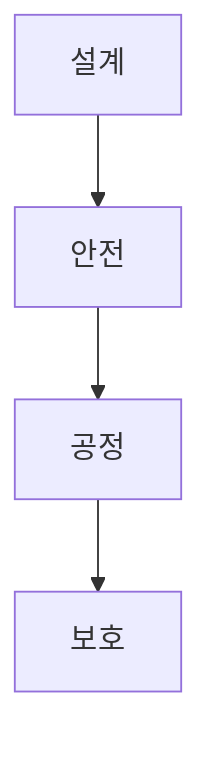

> [!abstract] 한 줄 요약
> 공학 윤리는 안전과 공정을 설계 과정에 넣는 기준이며, 지식재산권은 ==발명·창작·새 기술==을 서로 다른 방식으로 보호하는 틀이다.

## 이 노트의 지도



## 1. 공학 윤리의 세 규범

강의는 공학 윤리에서 윤리, 도덕, 법률의 세 규범을 고려한다고 제시한다. 엔지니어의 행위를 제어하는 규칙과 기준, 그리고 연구 과정이나 내용을 조작하지 않는 연구 윤리도 함께 다룬다.

$$
E=\{\text{윤리},\ \text{도덕},\ \text{법률}\}
$$

<Tabs>
  <Tab label="윤리·도덕">
    윤리는 직업적 의무와 책임의 원리, 도덕은 개인의 옳고 그름에 대한 판단으로 설명된다.
  </Tab>
  <Tab label="법률">
    법률은 당국이 시행하는 구속력 있는 행동 규칙이며, 안전 기준·특허법·환경 보호법이 예시로 제시된다.
  </Tab>
</Tabs>

<details>
<summary>자동차 결함 예시</summary>

강의는 자동차 결함을 발견하면 비용 절감보다 소비자 안전을 우선하고, 결함을 숨기지 않고 리콜해야 한다는 결론을 제시한다. 이 예시는 법·도덕·윤리가 같은 안전 문제에 서로 다른 기준을 제공함을 보여 준다.

</details>

> [!important] AI 설계에 적용하기
> AI 시스템도 데이터의 ==편향==을 고려하고, 안전과 공정성을 우선하며, 지속적으로 데이터를 검토해야 한다.

## 2. 실패 원인에서 배우기

강의는 안전 절차 무시, 결함 보고의 묵살, 다양하지 않은 훈련 데이터, 과거 데이터의 편향을 사고·오류의 맥락으로 제시한다.

<details>
<summary>AI 설계 실패 원인</summary>

문제의 잘못된 이해, 계산 오류, 모델 구조 설계 오류, 불충분한 자료 수집과 실험, 낙관적·과도한 가정, 부정확한 설계 규격, 배포 환경과 맞지 않는 생산·조립 과정이 AI 시스템 설계에 해당하는 실패 원인으로 제시된다.

</details>

> [!tip] 검토 질문
> 모델 성능만 보지 말고, 데이터가 다양한 사용자를 포함하는지와 실제 배포 환경의 제약을 함께 확인한다.

## 3. 지식재산권의 구분

강의는 지식재산권을 산업재산권, 저작권, 신지식재산권을 포괄하는 무형적 권리로 정의한다. 산업재산권에는 특허권·실용신안권·디자인권·상표권이 포함된다.

$$
IP=\{\text{산업재산권},\ \text{저작권},\ \text{신지식재산권}\}
$$

<details>
<summary>특허와 저작권</summary>

강의는 특허 제도를 기술공개의 대가로 특허권을 부여하는 제도로 설명하고, 특허권의 존속기간을 출원일로부터 20년, 실용신안권을 10년으로 제시한다. 저작권은 창작과 동시에 보호되며 설계도와 컴퓨터 프로그램 등이 예시다.

</details>

```html preview
<div style="font-family:system-ui,sans-serif;padding:20px;color:var(--foreground)">
  <label for="amt" style="font-size:14px;font-weight:600">권리 존속 기간</label>
  <div id="out" style="font-size:30px;font-weight:700;color:var(--chart-1);margin:6px 0">20년</div>
  <input id="amt" type="range" min="10" max="20" step="10" value="20"
    style="width:100%;accent-color:var(--primary)" />
  <p style="font-size:13px;color:var(--muted-foreground)">10년은 실용신안권, 20년은 특허권의 강의 예시다.</p>
  <script>
    var amt = document.getElementById('amt');
    var out = document.getElementById('out');
    amt.addEventListener('input', function () {
      out.textContent = amt.value + '년';
    });
  </script>
</div>
```

> [!caution] 소스 범위
> 이 노트는 강의의 분류와 예시를 정리한 것이며, 특정 아이디어의 특허 가능성이나 법적 권리를 판단하지 않는다.

<details>
<summary>스스로 점검</summary>

**Q.** 강의에서 저작권 보호의 예로 든 산출물은 무엇인가?

**A.** 설계도와 컴퓨터 프로그램 등이 예시로 제시된다.

</details>

## 출처와 한계

- 근거: 현재 로컬 “3주차 AI시스템설계 및 개발 I” 추출문.
- 원본 PDF 링크, 쪽수 표기, 원본 슬라이드 이미지와 assets 임베드는 이 공개 노트에서 제외했다.
