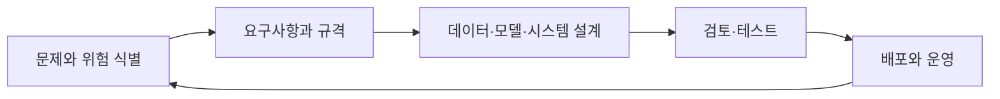
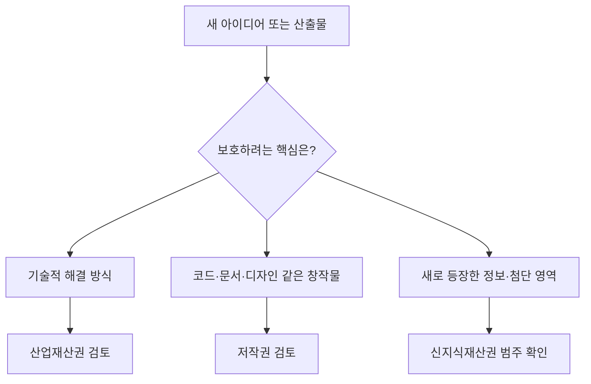

> [!abstract] 한 줄 요약
> 공학 윤리는 결과가 나온 뒤 평가하는 장식이 아니라, 안전·공정성·투명성·권리 판단을 설계 단계에 넣는 방법이다.

이 회차는 윤리·도덕·법률의 구분, 사고 사례가 주는 설계 교훈, AI 시스템 실패 원인, 그리고 지식재산권의 보호 범위를 함께 다룬다. 공통 질문은 하나다. ==문제가 생긴 뒤 책임을 찾는 대신, 문제가 생기기 어렵게 무엇을 설계할 것인가==.



## 윤리·도덕·법률은 같은가

강의는 세 규범을 구분한다. 법률은 당국이 시행하는 구속력 있는 규칙, 도덕은 개인적 행동 판단의 원리, 윤리는 직업 수행에서 옳고 그름에 대한 책임과 기준으로 설명한다. 실제 설계에서는 셋이 충돌하는지 살피기보다, 어느 하나도 빠지지 않게 검토하는 편이 안전하다.

```html preview h=210
<div style="font-family:system-ui,sans-serif;padding:18px;color:var(--foreground)">
  <div style="display:grid;grid-template-columns:repeat(auto-fit,minmax(170px,1fr));gap:12px">
    <div style="padding:14px;border:1px solid var(--border);border-radius:var(--radius);background:var(--card)">
      <div style="font-weight:700;color:var(--chart-1)">법률</div>
      <div style="font-size:13px;color:var(--muted-foreground);margin-top:7px">안전 기준·특허·환경처럼 지켜야 하는 규칙</div>
    </div>
    <div style="padding:14px;border:1px solid var(--border);border-radius:var(--radius);background:var(--card)">
      <div style="font-weight:700;color:var(--chart-3)">도덕</div>
      <div style="font-size:13px;color:var(--muted-foreground);margin-top:7px">거짓 보고를 하지 않는 것처럼 개인의 행동을 판단하는 기준</div>
    </div>
    <div style="padding:14px;border:1px solid var(--border);border-radius:var(--radius);background:var(--card)">
      <div style="font-weight:700;color:var(--chart-5)">공학 윤리</div>
      <div style="font-size:13px;color:var(--muted-foreground);margin-top:7px">안전·건강·복지와 직업적 책임을 함께 고려하는 기준</div>
    </div>
  </div>
</div>
```

> [!important] 안전은 최적화 대상만이 아니다
> 강의의 사고 사례들은 안전 절차 무시, 경고의 무시, 정보 은폐가 피해를 키운다는 공통 교훈을 보인다. 따라서 위험 신호를 보고·검토·기록하는 경로는 설계의 일부여야 한다.

<Tabs>
  <Tab label="데이터">
포괄적이지 않거나 편향된 데이터는 특정 사용자를 감지·평가하지 못하는 결과로 이어질 수 있다. 데이터의 범위와 공정성을 반복 검토한다.
  </Tab>
  <Tab label="모델">
부정확한 알고리즘, 계산 오류, 부적절한 모델 구조, 과대평가는 모델이 실제 환경에서 실패할 수 있는 원인이다.
  </Tab>
  <Tab label="시스템">
문제가 불명확하거나 성능 기준이 모호하고, 배포 환경과 호환되지 않으면 모델 자체가 좋아도 서비스는 실패할 수 있다.
  </Tab>
</Tabs>

<details>
<summary>강의의 실패 원인을 설계 점검표로 바꾸기</summary>

| 실패 원인 | 설계 중 확인할 질문 |
| :-- | :-- |
| 문제 이해 오류 | AI가 실제로 해결 가능한 문제인가? |
| 불충분한 자료·실험 | 데이터 범위와 검증 환경이 충분한가? |
| 낙관적·과도한 가정 | 모델이 못하는 일과 실패 조건을 적었는가? |
| 부정확한 설계 규격 | 성능·사용자 경험·안전 기준이 측정 가능한가? |
| 배포·환경 불일치 | 운영 환경에서 속도와 호환성을 검토했는가? |

이 표는 특정 제품의 인증 기준이 아니라, 강의가 든 실패 원인을 설계 질문으로 재구성한 것이다.
</details>

## 권리를 설계 자산으로 읽기

지식재산권은 법령으로 보호되는 지식재산에 관한 권리이며, 강의는 산업재산권·저작권·신지식재산권을 포괄하는 무형의 권리로 설명한다. 보호는 권리 확보만이 아니라 기술 공개와 활용, 분쟁 예방, 사업화 판단과도 연결된다.

```html preview h=220
<div style="font-family:system-ui,sans-serif;padding:18px;color:var(--foreground)">
  <svg viewBox="0 0 720 160" style="display:block;width:100%;height:auto;max-width:100%" role="img" aria-label="지식재산권을 세 갈래로 읽는 독자 제작 분류 다이어그램">
    <g style="fill:var(--card);stroke:var(--border);stroke-width:2">
      <rect x="276" y="16" width="168" height="46" rx="14"></rect>
      <rect x="30" y="96" width="186" height="46" rx="14"></rect>
      <rect x="267" y="96" width="186" height="46" rx="14"></rect>
      <rect x="504" y="96" width="186" height="46" rx="14"></rect>
    </g>
    <g style="stroke:var(--muted-foreground);stroke-width:2">
      <path d="M324 62l-170 34"></path><path d="M360 62v34"></path><path d="M396 62l170 34"></path>
    </g>
    <g text-anchor="middle" style="fill:var(--foreground);font-family:system-ui,sans-serif">
      <text x="360" y="45" font-size="16" font-weight="700">지식재산권</text>
      <text x="123" y="124" font-size="14">산업재산권</text>
      <text x="360" y="124" font-size="14">저작권</text>
      <text x="597" y="124" font-size="14">신지식재산권</text>
    </g>
  </svg>
</div>
```

<details>
<summary>강의가 제시한 보호 범위</summary>

| 분류 | 강의에서의 범위 |
| :-- | :-- |
| 산업재산권 | 특허권·실용신안권·디자인권·상표권을 포괄하며, 등록을 통해 배타적 권리가 부여되는 권리 |
| 저작권 | 저작물에 대한 창작자의 권리이며, 강의는 컴퓨터 프로그램·설계도 등을 예로 든다 |
| 신지식재산권 | 산업재산권·저작권에 속하지 않는 새 보호 영역으로, 첨단산업·산업저작·정보재산 등을 포함한다고 설명한다 |

실제 보호 가능성은 구현 내용과 적용 법령에 따라 달라질 수 있으므로, 이 표는 강의 개념 정리로만 사용한다.
</details>

> [!note] 특허와 저작권은 같은 질문에 답하지 않는다
> 강의는 특허를 기술 공개의 대가로 권리를 주는 제도로, 저작권을 창작과 동시에 보호되는 권리로 구분한다. 무엇을 보호하려는지에 따라 검토 대상도 달라진다.



==AI 시스템은 데이터·모델·코드·UI·운영 절차가 함께 움직이므로, 권리 검토도 하나의 이름표로 끝내기 어렵다.==

> [!tip] 윤리와 권리는 출시 직전 체크박스가 아니다
> 데이터 수집, 모델 선택, 사용자 경험, 로그와 배포 방식을 정할 때부터 안전·공정성·투명성·권리 관점을 넣어야 나중에 설계 전체를 되돌리는 비용을 줄일 수 있다.

## 핵심 정리

| 개념 | 핵심 |
| :-- | :-- |
| 공학 윤리 | 공공의 안전·건강·복지와 직업적 책임을 설계에 반영하는 기준 |
| 실패 원인 분석 | 데이터·모델·규격·배포 환경의 가정을 드러내는 일 |
| 산업재산권 | 특허·실용신안·디자인·상표를 포함하는 등록 기반 권리 |
| 저작권 | 창작물에 대한 권리 |
| 신지식재산권 | 새 기술·정보 영역을 포괄하는 보호 범주 |

> [!question]- 스스로 점검
> AI 시스템의 편향 문제를 “모델 문제” 하나로만 보면 놓치는 것은 무엇인가?
>
> 데이터의 대표성, 문제 정의, 성능 기준, 사용자 안전, 지속적인 검토와 배포 환경까지 함께 놓칠 수 있다.
