## 한 문장이 학생 전원을 겨냥한다

2주차 38번은 「발명과 특허」를 설명하는 장이다. 여섯 줄 중 마지막이 이렇다.

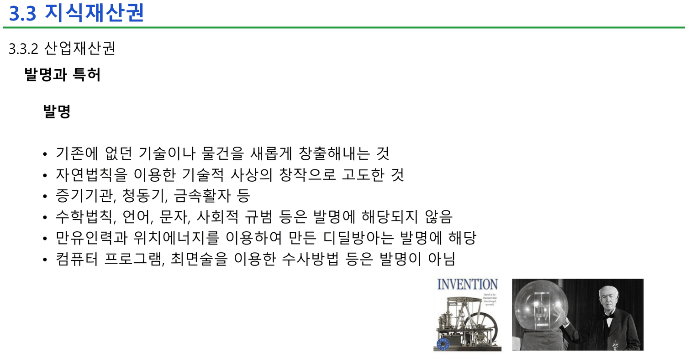

> • 기존에 없던 기술이나 물건을 새롭게 창출해내는 것
> • 자연법칙을 이용한 기술적 사상의 창작으로 고도한 것
> • 증기기관, 청동기, 금속활자 등
> • 수학법칙, 언어, 문자, 사회적 규범 등은 발명에 해당되지 않음
> • 만유인력과 위치에너지를 이용하여 만든 디딜방아는 발명에 해당
> • **컴퓨터 프로그램, 최면술을 이용한 수사방법 등은 발명이 아님**

AI 시스템을 설계하는 과목의 슬라이드가, 수강생이 학기 내내 만들 물건을 **발명이 아니라고 선언한다.** 그리고 같은 덱의 39번이 한 번 더 못 박는다 — 특허 대상이 아닌 것 다섯 가지 중 첫째가 `자연법칙 자체, 추상적인 아이디어`, 셋째가 `자연법칙을 이용하지 않는 것(경제법칙, 수학공식, 작도법 등)` 이다.

그런데 같은 주차의 실습 자료는 정반대를 시킨다.

> [!important] 이 노트의 척추
> **네 장 안에서 소프트웨어의 집이 세 번 바뀐다.** 35번의 특허청 체계도는 `컴퓨터프로그램, 인공지능, 데이터베이스` 를 **신지식재산권 → 산업저작권** 칸에 넣고, 38번은 **발명이 아니라** 하고, 42번은 저작권의 종류에 **컴퓨터 프로그램**을 적는다. 세 칸 중 **특허는 하나도 없다.** 그리고 실습 자료 『아이디어 리스트』는 열 개 주제 전부에 「독창적인 알고리즘이 있다면 **특허 가능**」을 적고, 모범 답안은 최종적으로 **특허**를 고른다. 강의와 실습이 같은 질문에 반대로 답하고, 둘을 잇는 설명이 어디에도 없다.

---

## 소프트웨어가 놓이는 세 칸

35번이 특허청 출처(`그림 10.9 지식재산권의 체계(출처: 특허청)`)의 체계도를 그대로 붙인다.

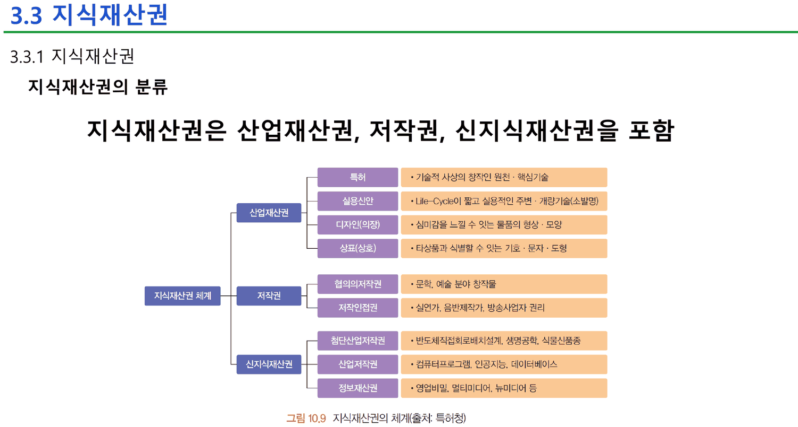

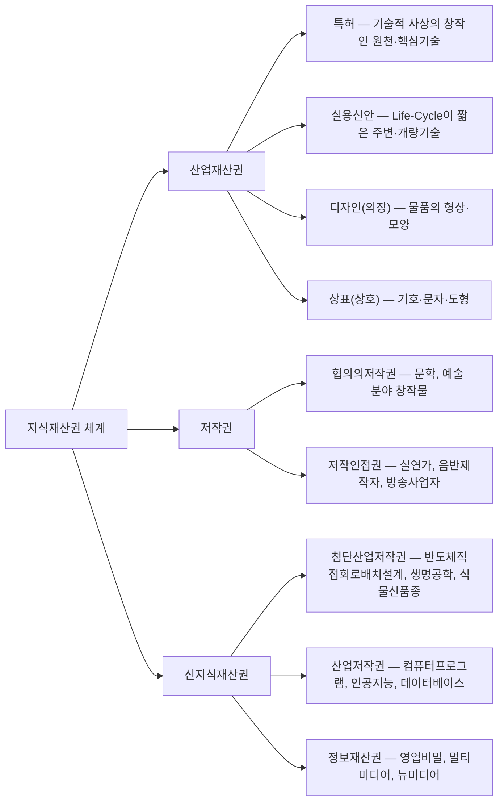

체계도에서 `인공지능` 은 **특허와 가장 먼 칸**에 있다. 그리고 42번과 43번이 같은 말을 두 번 더 한다.

| 슬라이드 | 소프트웨어를 어디에 넣는가 | 인쇄된 문장 |
| ---: | --- | --- |
| 35 | 신지식재산권 → 산업저작권 | `컴퓨터프로그램, 인공지능, 데이터베이스` |
| 38 | **아무 데도** — 발명이 아니다 | `컴퓨터 프로그램 … 은 발명이 아님` |
| 39 | 특허 대상 아님 | `자연법칙을 이용하지 않는 것(경제법칙, 수학공식, 작도법 등)` · `단순한 정보제공을 위한 데이터베이스` |
| 42 | 저작권 | `종류는 소설, 시, 강연, 논문, 건축물, 설계도, **컴퓨터 프로그램** 등` |
| 43 | 신지식재산권 | `반도체 설계, **인공지능** 등의 새로운 기술 등의 재산권을 포함` |

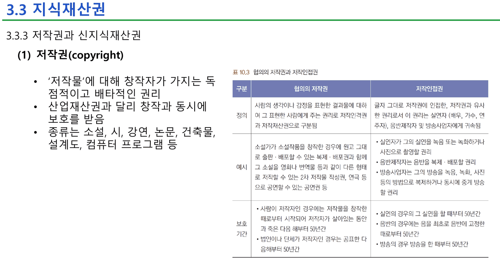

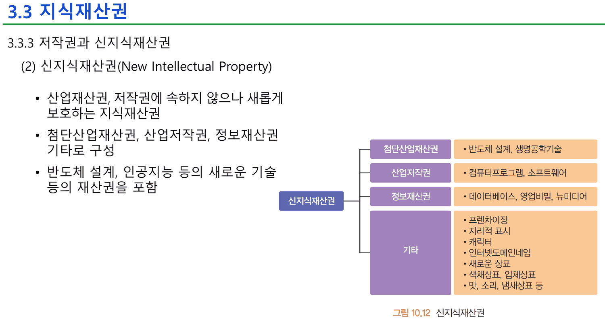

같은 배정이 **1주차에도 이미 있었다.** 1주차 36번이 같은 문장으로 컴퓨터 프로그램을 발명에서 빼내고, 39번이 특허 대상이 아닌 것 다섯 가지를 든다.

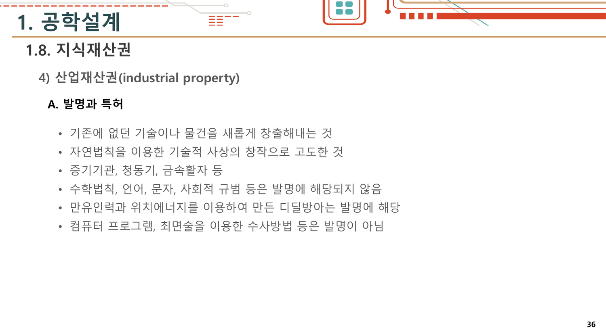

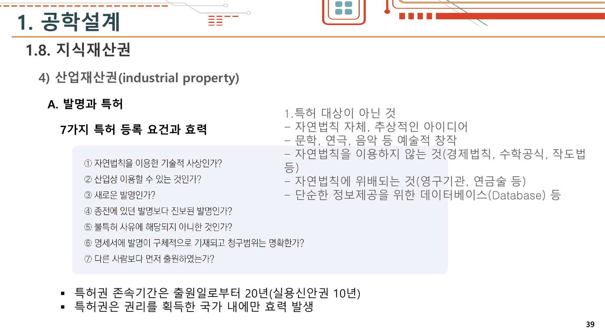

두 주차의 차이는 절 번호(`1.8.` 대 `3.3`)와 편집뿐이고, **「컴퓨터 프로그램은 발명이 아님」이라는 줄은 두 번 모두 그대로 인쇄된다.**

> [!caution] 35번과 39번이 데이터베이스를 두고 정면으로 갈린다
> 35번 체계도는 `데이터베이스` 를 신지식재산권 산업저작권 칸에 **보호 대상으로** 넣는다. 39번은 특허 대상이 아닌 것 목록에 `단순한 정보제공을 위한 데이터베이스(Database) 등` 을 넣는다. 두 문장은 「특허는 아니지만 다른 권리로는 보호된다」로 읽으면 모순이 아니다. **문제는 그 한 줄을 어느 슬라이드도 쓰지 않는다는 것이다.** 네 장을 순서대로 읽는 학생에게 남는 인상은 「데이터베이스는 보호된다」와 「데이터베이스는 안 된다」 둘이다.

### 슬라이드가 말한 것만으로 각 권리를 비교하면

35 · 39 · 41 · 42번에 인쇄된 값만 모으면 이 정도 표가 된다. 덱은 이것을 한 장에 모으지 않는다.

```html preview
<div id="ip" style="font-family:system-ui,-apple-system,sans-serif;color:var(--foreground);background:var(--card);border:1px solid var(--border);border-radius:12px;padding:18px 16px;">
  <p style="margin:0 0 12px;font-size:13px;color:var(--muted-foreground);line-height:1.7;">
    2주차 35 · 39 · 41 · 42번에 <b>인쇄된 값만</b> 모았다. 막대를 눌러 각 권리의 조건과 기간을 본다.</p>
  <svg id="ips" viewBox="0 0 620 200" style="width:100%;height:auto;display:block;"></svg>
  <div id="ipo" style="margin-top:10px;font-size:13.5px;line-height:1.9;min-height:6em;"></div>
</div>
<script>
(function(){
  const NS='http://www.w3.org/2000/svg', svg=document.getElementById('ips');
  const el=(t,a,x)=>{const e=document.createElementNS(NS,t);for(const k in a)e.setAttribute(k,a[k]);
    if(x!==undefined)e.textContent=x;return e;};
  const D=[
    {n:'특허권', yr:20, s:'41',
     how:'특허청에 출원하여 등록 (7가지 요건 심사)',
     note:'「자연법칙을 이용한 기술적 사상인가?」가 첫 요건이다. 38번이 컴퓨터 프로그램을 빼낸 근거가 바로 이 줄이다.',
     sw:'38번이 제외'},
    {n:'실용신안권', yr:10, s:'41',
     how:'특허청에 출원하여 등록',
     note:'35번의 설명은 「Life-Cycle이 짧고 실용적인 주변·개량기술(소발명)」. 37번의 자동차 예시에서는 백미러가 여기다.',
     sw:'언급 없음'},
    {n:'저작권', yr:null, s:'42',
     how:'등록 없이 창작과 동시에 보호',
     note:'「산업재산권과 달리 창작과 동시에 보호를 받음」 — 덱에서 등록 절차가 필요 없다고 명시된 유일한 권리다.',
     sw:'42번이 종류에 포함'},
    {n:'신지식재산권', yr:null, s:'35 · 43',
     how:'(덱에 절차 설명 없음)',
     note:'「산업재산권, 저작권에 속하지 않으나 새롭게 보호하는 지식재산권」. 35번 체계도의 산업저작권 칸에 컴퓨터프로그램·인공지능·데이터베이스가 있다.',
     sw:'35 · 43번이 명시적으로 포함'}];
  let sel=0;
  const L=110,R=470,T=22,H=40;
  function draw(){
    svg.textContent='';
    const MAX=22;
    D.forEach((d,i)=>{
      const y=T+i*H+14;
      svg.appendChild(el('text',{x:L-10,y:y+4,'text-anchor':'end','font-size':12,
        fill: i===sel?'var(--chart-1)':'var(--foreground)','font-weight':i===sel?700:400},d.n));
      if(d.yr){
        const w=(R-L)*d.yr/MAX;
        const r=el('rect',{x:L,y:y-11,width:w,height:22,rx:4,
          fill:i===sel?'var(--chart-1)':'var(--chart-2)',opacity:i===sel?0.95:0.45,style:'cursor:pointer'});
        r.addEventListener('click',()=>{sel=i;upd();}); svg.appendChild(r);
        svg.appendChild(el('text',{x:L+w+8,y:y+4,'font-size':11.5,fill:'var(--muted-foreground)'},
          '존속 '+d.yr+'년 (출원일부터)'));
      } else {
        const r=el('rect',{x:L,y:y-11,width:R-L,height:22,rx:4,fill:'var(--border)',opacity:0.45,style:'cursor:pointer'});
        r.addEventListener('click',()=>{sel=i;upd();}); svg.appendChild(r);
        svg.appendChild(el('text',{x:L+8,y:y+4,'font-size':11,fill:'var(--muted-foreground)'},
          '덱에 존속기간 없음'));
      }
      svg.appendChild(el('text',{x:608,y:y+4,'text-anchor':'end','font-size':10.5,
        fill:'var(--muted-foreground)'},d.s+'번'));
    });
    svg.appendChild(el('text',{x:L,y:T+D.length*H+24,'font-size':10.5,fill:'var(--muted-foreground)'},
      '※ 41번이 적은 존속기간은 특허 20년 · 실용신안 10년 둘뿐이다. 나머지 둘은 덱 어디에도 기간이 없다.'));
  }
  function upd(){ draw(); const d=D[sel];
    document.getElementById('ipo').innerHTML =
      '<b style="color:var(--chart-1)">'+d.n+'</b> — 취득: '+d.how+
      '<div style="margin-top:6px;font-size:12.5px;color:var(--muted-foreground);line-height:1.75">'+d.note+'</div>'+
      '<div style="margin-top:6px;font-size:12.5px">소프트웨어 취급: <b>'+d.sw+'</b></div>';
  }
  upd();
})();
</script>

41번이 적은 존속기간은 **특허 20년 · 실용신안 10년** 둘뿐이다. 저작권과 신지식재산권에는 기간이 없다 — 이 덱에서는. 그런데 실습 자료는 학생에게 「20년 동안 독점할 가치가 있는가?」를 묻고 두 권리를 비교하라고 한다. **비교의 한쪽 축이 덱에 없다.**

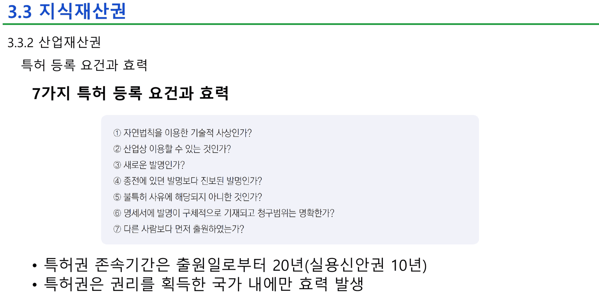

> ① 자연법칙을 이용한 기술적 사상인가? ② 산업상 이용할 수 있는 것인가? ③ 새로운 발명인가? ④ 종전에 있던 발명보다 진보된 발명인가? ⑤ 불특허 사유에 해당되지 아니한 것인가? ⑥ 명세서에 발명이 구체적으로 기재되고 청구범위는 명확한가? ⑦ 다른 사람보다 먼저 출원하였는가?

일곱 요건 중 **①과 ⑤가 38·39번이 컴퓨터 프로그램을 빼낸 바로 그 관문**이다. 실습 자료의 네 질문(혁신성 · 모방 난이도 · 20년의 가치 · 비용과 심사 기간)에는 ①도 ⑤도 들어 있지 않다.

---

## 실습 자료 — 열 개 주제, 같은 질문 열 번

`아이디어 리스트.pdf` 는 다섯 쪽이다. 1~2쪽이 AI 주제 열 개를 나열하고, 3~5쪽이 채워진 모범 답안이다.

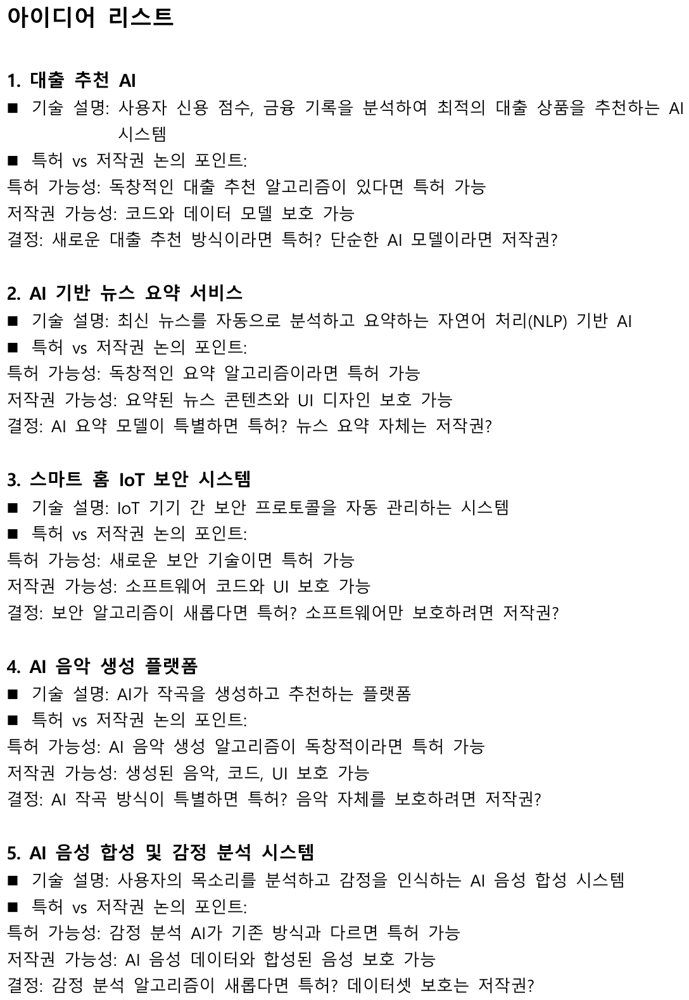

열 개 주제는 이렇다 — 대출 추천 AI · 뉴스 요약 · 스마트홈 IoT 보안 · AI 음악 생성 · 음성 합성 및 감정 분석 · 헬스케어 챗봇 · 코드 자동 생성기 · 가상 고객센터 · SNS 콘텐츠 생성기 · 쇼핑 추천. 그리고 열 개 **전부**가 같은 세 줄을 갖는다.

> **특허 가능성**: 독창적인 ○○ 알고리즘이 있다면 특허 가능
> **저작권 가능성**: 코드와 데이터 모델 보호 가능
> **결정**: 새로운 ○○ 방식이라면 특허? 단순한 AI 모델이라면 저작권?

**열 번 반복되는 이 형식이 강의 슬라이드와 정면으로 어긋난다.** 「독창적인 알고리즘이 있다면 특허 가능」은 39번이 특허 대상이 아니라고 적은 `추상적인 아이디어` · `수학공식` 과 같은 것을 가리키고, 38번의 `컴퓨터 프로그램 … 은 발명이 아님` 과 직접 충돌한다.

일곱 번째 주제만 자기 모순을 눈치챈다.

> 7. AI 기반 코드 자동 생성기 — 저작권 가능성: **AI가 만든 코드 자체는 보호 가능할까?**

열 개 중 유일하게 **물음표로 끝나는 「가능성」 줄**이다. 나머지 아홉은 전부 「보호 가능」으로 단언한다.

### 모범 답안이 고르는 것

3~5쪽이 「스마트 키친 AI 연구팀」의 채워진 답안이다. 주제는 `AI 기반 스마트 요리 보조 시스템`.

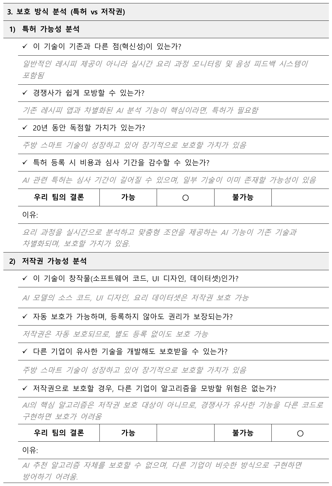

| 항목 | 답안이 적은 것 |
| --- | --- |
| **특허 가능성 → 결론** | **가능 ○** — 「요리 과정을 실시간으로 분석하고 맞춤형 조언을 제공하는 AI 기능이 기존 기술과 차별화되며, 보호할 가치가 있음」 |
| **저작권 가능성 → 결론** | **불가능 ○** — 「AI 추천 알고리즘 자체를 보호할 수 없으며, 다른 기업이 비슷한 방식으로 구현하면 방어하기 어려움」 |
| **최종 선택** | **특허 ○** |

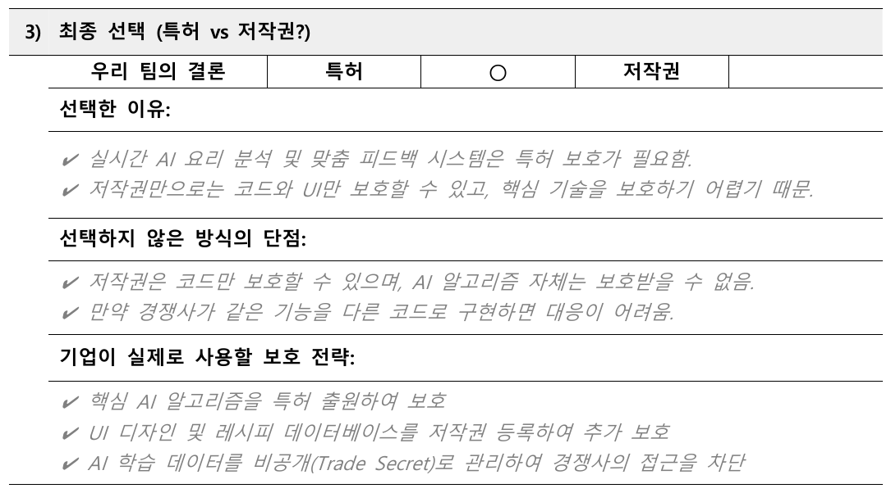

> [!note] 답안이 내놓는 마지막 세 줄은 슬라이드보다 앞서 있다
> 5쪽의 「기업이 실제로 사용할 보호 전략」 세 줄이 이 자료 전체에서 가장 실무에 가깝다.
>
> > ✔ 핵심 AI 알고리즘을 **특허 출원**하여 보호 / ✔ UI 디자인 및 레시피 데이터베이스를 **저작권 등록**하여 추가 보호 / ✔ AI 학습 데이터를 **비공개(Trade Secret)** 로 관리하여 경쟁사의 접근을 차단
>
> **「특허냐 저작권이냐」가 아니라 세 겹으로 쌓는다**는 것이 결론이고, 이것이 옳다. 그런데 `Trade Secret`(영업비밀)은 강의 슬라이드 어디에도 설명되어 있지 않다 — 35번 체계도의 `정보재산권 · 영업비밀, 멀티미디어, 뉴미디어` 칸에 낱말로 한 번 나올 뿐이다. **실습의 정답이 강의가 가르치지 않은 개념에 기대고 있다.**

### 네 슬라이드와 실습을 겹쳐 본다

```html preview
<div id="sw" style="font-family:system-ui,-apple-system,sans-serif;color:var(--foreground);background:var(--card);border:1px solid var(--border);border-radius:12px;padding:18px 16px;">
  <p style="margin:0 0 12px;font-size:13px;color:var(--muted-foreground);line-height:1.7;">
    같은 대상(소프트웨어 · AI)을 다섯 자료가 어디에 배정하는지. 자료를 눌러 인쇄된 문장을 본다.</p>
  <div id="swb" style="display:flex;flex-wrap:wrap;gap:5px;margin-bottom:14px;"></div>
  <svg id="sws" viewBox="0 0 620 160" style="width:100%;height:auto;display:block;"></svg>
  <div id="swo" style="margin-top:8px;font-size:13.5px;line-height:1.9;min-height:4.4em;"></div>
  <style>#sw .sb{font:inherit;font-size:12px;padding:4px 10px;cursor:pointer;border:1px solid var(--border);
    background:transparent;color:var(--muted-foreground);border-radius:6px;}
    #sw .sb.on{background:var(--chart-1);border-color:var(--chart-1);color:var(--card);font-weight:700;}</style>
</div>
<script>
(function(){
  const NS='http://www.w3.org/2000/svg', svg=document.getElementById('sws');
  const el=(t,a,x)=>{const e=document.createElementNS(NS,t);for(const k in a)e.setAttribute(k,a[k]);
    if(x!==undefined)e.textContent=x;return e;};
  const HOMES=['특허','저작권','신지식재산권','어디도 아님'];
  const S=[
    ['35번 체계도', 2, '신지식재산권 → 산업저작권 칸: 「컴퓨터프로그램, 인공지능, 데이터베이스」 (출처: 특허청)'],
    ['38번 발명과 특허', 3, '「컴퓨터 프로그램, 최면술을 이용한 수사방법 등은 발명이 아님」'],
    ['39번 특허 대상 제외', 3, '「자연법칙 자체, 추상적인 아이디어」 · 「자연법칙을 이용하지 않는 것(경제법칙, 수학공식, 작도법 등)」 · 「단순한 정보제공을 위한 데이터베이스(Database) 등」'],
    ['42번 저작권', 1, '「종류는 소설, 시, 강연, 논문, 건축물, 설계도, 컴퓨터 프로그램 등」'],
    ['43번 신지식재산권', 2, '「반도체 설계, 인공지능 등의 새로운 기술 등의 재산권을 포함」'],
    ['아이디어 리스트 (실습)', 0, '열 개 주제 전부: 「독창적인 ○○ 알고리즘이 있다면 특허 가능」 · 모범 답안 최종 선택 「특허 ○」']];
  let sel=0;
  const L=118,R=598,T=18,W=(R-L)/HOMES.length;
  function draw(){
    svg.textContent='';
    HOMES.forEach((h,i)=>{
      svg.appendChild(el('rect',{x:L+i*W,y:T,width:W-4,height:96,rx:6,
        fill: i===S[sel][1]?'var(--chart-1)':'var(--border)', opacity: i===S[sel][1]?0.18:0.28}));
      svg.appendChild(el('text',{x:L+i*W+W/2-2,y:T+16,'text-anchor':'middle','font-size':11.5,
        fill: i===S[sel][1]?'var(--chart-1)':'var(--muted-foreground)',
        'font-weight': i===S[sel][1]?700:400}, h));
    });
    S.forEach((s,i)=>{
      const x=L+s[1]*W+W/2-2, y=T+34+ (S.filter((t,j)=>j<i&&t[1]===s[1]).length)*17;
      svg.appendChild(el('text',{x:x,y:y+8,'text-anchor':'middle','font-size':10.5,
        fill: i===sel?'var(--chart-1)':'var(--foreground)','font-weight':i===sel?700:400,
        opacity: i===sel?1:0.62}, s[0].split(' ')[0]));
    });
    svg.appendChild(el('text',{x:L,y:140,'font-size':10.5,fill:'var(--muted-foreground)'},
      '강의 슬라이드 다섯 장 중 「특허」 칸에 들어가는 것은 하나도 없다. 실습만 거기 있다.'));
  }
  function upd(){ draw();
    document.getElementById('swo').innerHTML='<b>'+S[sel][0]+'</b> → <b style="color:var(--chart-1)">'+
      HOMES[S[sel][1]]+'</b><div style="margin-top:5px;font-size:12.5px;color:var(--muted-foreground);line-height:1.75">'+
      S[sel][2]+'</div>';
  }
  const bar=document.getElementById('swb');
  S.forEach((s,i)=>{const b=document.createElement('button');b.className='sb'+(i===0?' on':'');
    b.textContent=s[0]; b.onclick=()=>{sel=i;[...bar.children].forEach((c,j)=>c.classList.toggle('on',j===i));upd();};
    bar.appendChild(b);}); upd();
})();
</script>

> [!tip] 이 어긋남을 풀 수 있는 한 문장 (원본에 없는 보충)
> 38번의 「컴퓨터 프로그램은 발명이 아니다」는 **프로그램 그 자체**(코드·명령의 나열)를 가리키는 말이고, 실습이 말하는 「독창적인 알고리즘」은 **그 프로그램이 하드웨어와 결합해 수행하는 방법**을 가리킨다. 이 둘을 가르는 것이 41번 요건 ①의 「자연법칙을 이용한 **기술적 사상**」이다 — 코드는 기술적 사상이 아니고, 코드가 구현하는 방법은 기술적 사상일 수 있다.
>
> 그래서 실습의 모범 답안이 특허를 고른 것도, 38번이 프로그램을 빼낸 것도 각자의 자리에서는 틀리지 않았다. **덱에 빠진 것은 둘을 잇는 이 한 문장**이고, 그것 없이 다섯 자료를 순서대로 읽으면 모순으로만 보인다. 슬라이드에 없는 내용이므로 여기서는 보충임을 밝혀 둔다.

---

## 표와 그림 번호가 다른 책에서 왔다

이 절의 슬라이드들에는 원본 교재의 번호가 남아 있다.

- 35번 — `그림 10.9 지식재산권의 체계(출처: 특허청)`
- 39번 — `표 10.2 세계를 움직인 획기적인 발명품`

**이 덱의 장 번호는 3(`CHAPTER 3 공학 윤리와 지식재산권`)인데 그림과 표는 10장 것이다.** 2주차 덱은 세 개의 장(1 · 2 · 3)으로 나뉘어 있고, 그중 3장의 자료가 어떤 교재의 10장에서 옮겨졌다.

39번의 표 자체도 볼 만하다. 열네 줄인데 두 줄이 형식을 깬다.

| | 인쇄된 대로 |
| --- | --- |
| 1377년 | 금속활자(한국, **고려 초** 직지심경) |
| 1986년 | 인터넷(미국) — **발명자·주체가 없는 유일한 줄** |
| 1996년 | 복제 양(영국, **생명공학의 새로운 바탕**) — 사람 이름 자리에 설명이 들어 있다 |

고려는 918년에 서고 1392년에 진다. **1377년은 고려의 끝자락이지 「고려 초」가 아니다.** 나머지 열두 줄은 `국가, 발명자` 형식을 정확히 지킨다(종이=채륜, 나침반=왕충, 전화기=그레이엄 벨, 전구=에디슨, 비행기=라이트형제, 텔레비전=베어드, 페니실린=플레밍, 트랜지스터=쇼클리, 인공위성=스푸트니크 1호, 64K DRAM=삼성전자).

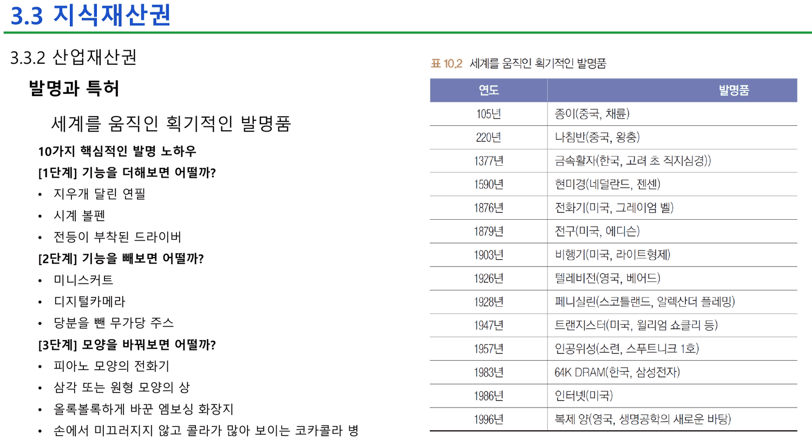

그리고 같은 장의 왼쪽이 **`10가지 핵심적인 발명 노하우`** 라고 굵게 적어 놓고 `[1단계] 기능을 더해보면 어떨까?` · `[2단계] 기능을 빼보면 어떨까?` · `[3단계] 모양을 바꿔보면 어떨까?` **세 개만 인쇄한다.** 나머지 일곱은 이 덱에도, 1주차 덱에도, 3주차 덱에도 없다.

---

## 원본에서 발견한 것

`서로 어긋나는 배정`

- **소프트웨어·AI가 네 장 안에서 세 칸에 배정된다** — 35번(신지식재산권 → 산업저작권) · 38·39번(발명이 아님, 특허 대상 아님) · 42번(저작권) · 43번(신지식재산권). **강의 슬라이드 중 특허 칸에 넣는 것은 하나도 없다.** 그런데 실습 자료 『아이디어 리스트』는 열 개 주제 전부에 「특허 가능」을 적고 모범 답안도 특허를 고른다. 둘을 잇는 설명이 어디에도 없다
- **데이터베이스가 두 장에서 반대로 다뤄진다** — 35번은 산업저작권의 보호 대상으로, 39번은 특허 대상이 아닌 것으로. 「특허는 아니되 다른 권리로는 보호된다」는 한 줄이 있으면 풀리는데 그 줄이 없다
- **실습의 판단 기준 넷에 강의의 요건 일곱 중 결정적인 둘이 빠져 있다** — 실습은 혁신성 · 모방 난이도 · 20년의 가치 · 비용과 심사 기간을 묻는데, 41번 요건 ①(자연법칙을 이용한 기술적 사상인가)과 ⑤(불특허 사유에 해당되지 아니한 것인가)가 없다. 컴퓨터 프로그램이 걸리는 관문이 정확히 그 둘이다
- **모범 답안의 최종 전략이 강의가 설명하지 않은 개념에 기댄다** — `Trade Secret`(영업비밀)은 35번 체계도의 한 칸에 낱말로만 나오고 정의도 설명도 없다

`수·사실 오류`

- **39번 표 10.2 `1377년 금속활자(한국, 고려 초 직지심경)`** — 고려는 918~1392년이므로 **1377년은 고려 말**이다. 「고려 초」가 아니다
- **39번 표 10.2 `1986년 인터넷(미국)`** — 열네 줄 중 **발명자·주체가 없는 유일한 줄**이다. 다른 열두 줄은 `국가, 발명자` 를 지킨다. `1996년 복제 양(영국, 생명공학의 새로운 바탕)` 은 발명자 자리에 설명이 들어간 또 다른 예외다
- **39번 `10가지 핵심적인 발명 노하우` 라고 쓰고 세 단계만 인쇄한다** — [1단계] 기능 더하기 · [2단계] 기능 빼기 · [3단계] 모양 바꾸기. 나머지 일곱은 세 덱 어디에도 없다
- **『아이디어 리스트』 4쪽의 저작권 항목 세 번째 답이 질문과 맞지 않는다** — 질문은 「다른 기업이 유사한 기술을 개발해도 보호받을 수 있는가?」인데 답이 「주방 스마트 기술이 성장하고 있어 장기적으로 보호할 가치가 있음」이다. **이 문장은 같은 쪽 특허 항목 세 번째(「20년 동안 독점할 가치가 있는가?」)의 답과 글자까지 같다.** 답 한 칸이 복사되어 엉뚱한 질문 아래 붙어 있다

`다른 교재의 흔적`

- **덱의 장 번호는 3인데 그림·표 번호는 10장 것이다** — 35번 `그림 10.9`, 39번 `표 10.2`. 3장 자료가 어떤 교재의 10장에서 옮겨졌음을 보여 준다

`덱 구성`

- **같은 내용이 세 덱에 실린다** — 1주차 31~41번(11장), 2주차 33~43번(11장), 3주차 12~22번(2주차의 완전한 재인쇄). 1주차 → 2주차에서 바뀐 것은 절 번호(`1.8.` → `3.3`)와 장별 소제목 정리이고, 내용 문장은 거의 그대로다. 1주차 33번의 분류 슬라이드에는 체계도 그림이 없고 2주차 35번에 들어온다
- **열 개 주제 중 일곱 번째만 「가능성」 줄이 물음표로 끝난다** — 「AI가 만든 코드 자체는 보호 가능할까?」. 나머지 아홉은 전부 「보호 가능」으로 단언한다. 자료 안에서 유일하게 판단을 유보하는 자리다

---

## 근거 자료

| 원본 | 쪽 | 이 노트에서 쓴 곳 |
| --- | --- | --- |
| `[2주차] … 배포 (1).pdf` | 33~43 | 지식재산권 정의·필요성·분류, 특허청 체계도, 산업재산권 4종, 발명과 특허, 노하우와 발명품 표, 7요건, 저작권, 신지식재산권 |
| `아이디어 리스트.pdf` | 1~5 | 주제 열 개, 모범 답안(특허 가능 · 저작권 불가능 · 최종 특허), 세 겹 보호 전략 |
| `[1주차] … 배포.pdf` | 31~41 | 같은 내용의 축약판 — 절 번호 `1.8.` 로 대조 |
| `[3주차] … 배포.pdf` | 12~22 | 2주차 33~43의 재인쇄 확인 |

인용한 슬라이드 열 장 — 2주차 35 · 38 · 39 · 41 · 42 · 43번, 1주차 36 · 39번, 『아이디어 리스트』 1 · 4 · 5쪽. 41번의 일곱 요건과 39번의 발명품 표는 추출 텍스트에 잡히지 않아 170 dpi로 다시 렌더해 눈으로 옮겼고, 세 덱의 중복 범위는 쪽별 추출 텍스트를 문자열로 비교해 확정했다.

### 이어지는 곳

- [[03. 경고를 무시한 이야기 셋, 경고가 없었던 이야기 둘]] — 같은 CHAPTER 3의 앞쪽 절반. 3주차 표지에 추가된 「실습」 한 줄이 이 노트의 『아이디어 리스트』를 가리킨다
- [[01. 설계 프로세스를 네 번 가르치고 고르는 법은 가르치지 않는다]] — 2주차 17~18번의 「절대 규격 대 절충 규격」이 여기의 「특허냐 저작권이냐」와 같은 모양의 선택 문제다. 그쪽에는 숫자가 있고 이쪽에는 없다
- [[05. 문제를 찾는 다섯 가지 방법과, 학생에게 매출 목표를 묻는 양식]] — 39번의 「기능을 더해보면 · 빼보면 · 모양을 바꿔보면」 세 단계가 4주차의 발상법 다섯 가지와 겹친다. 2주차 15번의 「열린 사고력 향상 6계명」까지 합하면 같은 도구가 세 번 나온다
