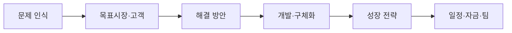
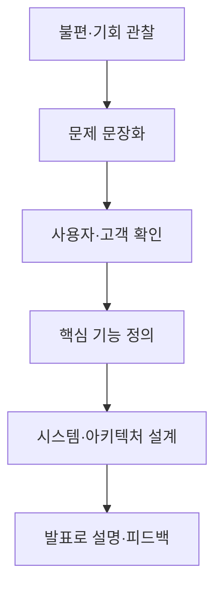

> [!abstract] 한 줄 요약
> 팀 프로젝트의 설계 계획서는 “무엇을 만들지”를 넘어, 문제·고객·실현 방법·성장 경로·일정·역할을 서로 맞물리게 쓰는 문서다.

이 회차는 팀 구성과 발표 평가 항목에서 시작해, 설계 계획서의 문제인식·실현가능성·성장전략·팀 구성을 살피고, 문제를 새롭게 인식하는 방법과 초기 발표 구성을 제시한다.



## 발표는 단계별로 무엇을 보여 주는가

<Tabs>
  <Tab label="초기 발표">
아이템 한 줄 설명, 배경과 필요성, 목표 시장과 고객, 경쟁 상황, 구체화 방안, 개발 일정, 개발자와 질의응답을 중심으로 아직 풀어야 할 문제를 설명한다.
  </Tab>
  <Tab label="중간 발표">
아이템 개요는 유지하되, 만드는 과정에서 바뀐 점과 현재 진행 상황, 달라진 개발 일정에 초점을 둔다.
  </Tab>
  <Tab label="기말 발표">
문제·시장·현황뿐 아니라 개발 과정과 데모, 사업화 전략까지 포함해 결과물과 다음 행동을 함께 보여 준다.
  </Tab>
</Tabs>

```html preview h=225
<div style="font-family:system-ui,sans-serif;padding:18px;color:var(--foreground)">
  <div style="display:flex;gap:12px;flex-wrap:wrap">
    <div style="flex:1;min-width:170px;padding:14px;background:var(--card);border:1px solid var(--border);border-radius:var(--radius)">
      <div style="font-weight:700;color:var(--chart-1)">초기</div>
      <div style="font-size:13px;color:var(--muted-foreground);margin-top:6px">왜 이 문제인가? 누구에게 필요한가?</div>
    </div>
    <div style="flex:1;min-width:170px;padding:14px;background:var(--card);border:1px solid var(--border);border-radius:var(--radius)">
      <div style="font-weight:700;color:var(--chart-3)">중간</div>
      <div style="font-size:13px;color:var(--muted-foreground);margin-top:6px">무엇이 검증됐고 무엇이 바뀌었는가?</div>
    </div>
    <div style="flex:1;min-width:170px;padding:14px;background:var(--card);border:1px solid var(--border);border-radius:var(--radius)">
      <div style="font-weight:700;color:var(--chart-2)">기말</div>
      <div style="font-size:13px;color:var(--muted-foreground);margin-top:6px">무엇을 만들었고 어떻게 이어 갈 것인가?</div>
    </div>
  </div>
</div>
```

> [!important] 한 줄 설명은 압축이 아니라 기준점이다
> 아이템을 한 문장으로 설명하면, 문제·고객·핵심 기능·아키텍처·발표 내용이 같은 대상을 가리키는지 계속 확인할 수 있다.

## 설계 계획서의 네 기둥

강의의 계획서 구조는 문제인식(Problem), 실현가능성(Solution), 성장전략(Scale-up), 팀 구성(Team)으로 이루어진다. 이 네 항목은 순서대로 채우는 빈칸이 아니라, 서로의 근거를 요구하는 구조다.

```html preview h=245
<div style="font-family:system-ui,sans-serif;padding:18px;color:var(--foreground)">
  <svg viewBox="0 0 720 180" style="display:block;width:100%;height:auto;max-width:100%" role="img" aria-label="설계 계획서의 네 기둥을 연결하는 독자 제작 다이어그램">
    <g style="fill:var(--card);stroke:var(--border);stroke-width:2">
      <rect x="36" y="58" width="144" height="64" rx="14"></rect>
      <rect x="204" y="58" width="144" height="64" rx="14"></rect>
      <rect x="372" y="58" width="144" height="64" rx="14"></rect>
      <rect x="540" y="58" width="144" height="64" rx="14"></rect>
    </g>
    <g style="stroke:var(--muted-foreground);stroke-width:3">
      <path d="M180 90h20"></path><path d="M348 90h20"></path><path d="M516 90h20"></path>
    </g>
    <g text-anchor="middle" style="fill:var(--foreground);font-family:system-ui,sans-serif">
      <text x="108" y="84" font-size="15" font-weight="700">문제인식</text>
      <text x="108" y="104" font-size="12">배경·고객·근거</text>
      <text x="276" y="84" font-size="15" font-weight="700">실현가능성</text>
      <text x="276" y="104" font-size="12">현황·핵심 기능</text>
      <text x="444" y="84" font-size="15" font-weight="700">성장전략</text>
      <text x="444" y="104" font-size="12">시장 진입·지속성</text>
      <text x="612" y="84" font-size="15" font-weight="700">팀 구성</text>
      <text x="612" y="104" font-size="12">역량·역할·보완</text>
    </g>
  </svg>
</div>
```

<details>
<summary>네 기둥을 채우는 질문</summary>

| 기둥 | 강의가 요구하는 핵심 질문 |
| :-- | :-- |
| 문제인식 | 어떤 배경과 필요성에서 문제를 찾았는가? 목표시장과 고객은 누구이며 어떤 근거가 있는가? |
| 실현가능성 | 현재 아이템은 어디까지 왔고, 핵심 기능·성능·차별성은 어떻게 구현할 것인가? |
| 성장전략 | 고객 확보, 수익 창출, 출시·홍보·유통, 지속 성과를 어떻게 설계할 것인가? |
| 팀 구성 | 필요한 역량은 무엇이며, 현재 팀과 추가 인력은 어떻게 역할을 나눌 것인가? |

</details>

==문제인식과 시장 분석 없이 해결 방안을 먼저 정하면, “만들 수 있는 것”과 “필요한 것”을 혼동하기 쉽다.==

> [!note] 근거가 필요한 곳
> 강의는 배경·필요성·고객 요구·경쟁 상황을 쓸 때 자체 판단만이 아니라 조사·분석 결과와 객관적 근거를 제시하라고 요구한다.

## 문제를 발견하는 관점

문제 인식은 미처 문제로 보지 못했던 것을 새롭게 문제로 보는 일이다. 강의는 인간의 욕망을 분석하는 접근도 소개하지만, 추출 텍스트의 후속 예시는 매우 적다. 따라서 이 노트에서는 구체적인 욕망 분류를 보충하지 않고, 관점 전환 자체를 출발점으로만 둔다.

<details>
<summary>문제 인식에서 바로 검증할 세 가지</summary>

1. 불편함 또는 기회가 누구에게 발생하는가?
2. 지금의 대안은 왜 충분하지 않은가?
3. 해결 뒤 무엇이 달라졌는가를 어떻게 관찰할 것인가?

이 세 질문은 강의의 문제 인식·고객·기대 효과 항목을 실행 가능한 확인 순서로 재구성한 것이다.
</details>



> [!tip] 아키텍처는 기능 목록의 그림 버전이 아니다
> 초기 발표에서 아키텍처는 모듈별 기능과 데이터 흐름을 설명하는 수단이다. 각 모듈이 어떤 요구사항을 만족하는지 말할 수 있어야 한다.

```html preview h=190
<div style="font-family:system-ui,sans-serif;padding:18px;color:var(--foreground)">
  <div style="display:grid;grid-template-columns:repeat(auto-fit,minmax(170px,1fr));gap:12px">
    <div style="padding:13px;border:1px solid var(--border);border-radius:var(--radius);background:var(--card)">
      <div style="font-weight:700;color:var(--chart-1)">입력</div>
      <div style="font-size:12px;color:var(--muted-foreground);margin-top:6px">사용자·환경에서 얻은 문제 신호</div>
    </div>
    <div style="padding:13px;border:1px solid var(--border);border-radius:var(--radius);background:var(--card)">
      <div style="font-weight:700;color:var(--chart-4)">판단</div>
      <div style="font-size:12px;color:var(--muted-foreground);margin-top:6px">핵심 기능과 AI 처리의 역할</div>
    </div>
    <div style="padding:13px;border:1px solid var(--border);border-radius:var(--radius);background:var(--card)">
      <div style="font-weight:700;color:var(--chart-2)">결과</div>
      <div style="font-size:12px;color:var(--muted-foreground);margin-top:6px">사용자에게 제공할 가치와 피드백</div>
    </div>
  </div>
</div>
```

## 핵심 정리

| 개념 | 핵심 |
| :-- | :-- |
| 초기·중간·기말 발표 | 문제에서 진행 상황, 결과와 사업화까지 점차 증거를 늘리는 단계 |
| 문제인식 | 새롭게 인식한 불편·기회를 문제와 고객 언어로 바꾸는 일 |
| 실현가능성 | 현재 상태와 개발·개선 방안을 연결하는 설명 |
| 성장전략 | 시장 진입·수익·지속 성과를 위한 계획 |
| 팀 구성 | 아이템을 실현하고 성과를 낼 역량과 역할의 배치 |

> [!question]- 스스로 점검
> 목표시장 분석이 “누가 쓸까”에서 멈추면 무엇이 빠지는가?
>
> 고객의 요구, 시장 특성, 경쟁 강도, 제공할 가치, 그리고 그 판단을 지지하는 근거가 빠진다.
