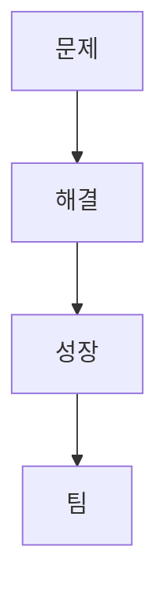

> [!abstract] 한 줄 요약
> 팀 설계는 아이디어를 발표와 계획서로 ==검증 가능한 약속==으로 만들고, 문제·해결·성장·팀의 근거를 연결하는 작업이다.

## 이 노트의 지도



## 1. 발표를 통해 설계를 설명하기

강의는 초기·중간·기말 발표를 구분한다. 초기 발표는 아이템 개요, 배경과 필요성, 시장과 고객, 현황, 구체화 방안, 일정, 개발자, 질의응답을 다룬다. 중간 발표는 진행 과정과 일정 변경을, 기말 발표는 개발 과정·데모·사업화 전략까지 확장한다.

<details>
<summary>초기 발표의 핵심</summary>

프로젝트 제목은 한 문장으로 소개하고, 해결하려는 사회적·실생활 문제와 주제 선정 이유를 설명한다. 목표와 핵심 기능, 관련 AI 기술과 트렌드, 시스템 구조, 팀 역할, 질의응답이 초기 발표 평가 항목으로 제시된다.

</details>

<Tabs>
  <Tab label="초기">
    문제와 고객, 아이템 현황, 구체화 방안과 일정을 제시한다.
  </Tab>
  <Tab label="기말">
    개발 과정과 데모, 사업화 전략까지 포함해 결과와 다음 행동을 설명한다.
  </Tab>
</Tabs>

> [!important] 발표의 역할
> 발표는 기능 목록을 읽는 자리가 아니라, ==문제·고객·해결방안==이 서로 맞물리는지 확인하는 설계 검토다.

## 2. 설계계획서의 네 축

강의의 설계계획서는 문제인식, 실현가능성, 성장전략, 팀 구성으로 구성된다.

$$
D=\{\text{Problem},\ \text{Solution},\ \text{Scale-up},\ \text{Team}\}
$$

<details>
<summary>문제인식과 실현가능성</summary>

문제인식에는 아이템 배경·필요성, 목표시장과 고객 현황, 요구사항 조사·분석과 객관적 근거를 기록한다. 실현가능성에는 현재 개발 단계와 목표시장 반응, 최종 제품·서비스의 개발·개선 방안, 고객 요구에 대한 세부 대응 방안을 적는다.

</details>

<details>
<summary>성장전략과 팀</summary>

성장전략은 목표시장 확보·수익 창출·생산·출시·홍보·유통·판매와 같은 사업화 방안을 다룬다. 팀 구성은 아이템 실현과 성과 창출을 위한 팀의 보유역량, 추가 필요 인력과 활용 계획을 다룬다.

</details>

```html preview
<div style="font-family:system-ui,sans-serif;padding:20px">
  <div id="cards" style="display:flex;gap:14px;flex-wrap:wrap"></div>
  <script>
    var stats = [
      ['발표 단계', '3개', '초기, 중간, 기말', 'var(--chart-2)'],
      ['계획서 축', '4개', '문제, 해결, 성장, 팀', 'var(--chart-1)'],
      ['초기 발표', '7항목', '제목부터 Q&A까지', 'var(--chart-5)']
    ];
    document.getElementById('cards').innerHTML = stats.map(function (s) {
      return '<div style="flex:1;min-width:150px;padding:16px;background:var(--card);' +
        'color:var(--card-foreground);border:1px solid var(--border);' +
        'border-radius:var(--radius)">' +
        '<div style="font-size:13px;color:var(--muted-foreground)">' + s[0] + '</div>' +
        '<div style="font-size:26px;font-weight:700;margin-top:4px">' + s[1] + '</div>' +
        '<div style="font-size:12px;font-weight:600;margin-top:4px;color:' + s[3] + '">' +
        s[2] + '</div>' +
        '</div>';
    }).join('');
  </script>
</div>
```

> [!tip] 계획서 작성 순서
> 배경과 고객 요구의 근거를 먼저 정리한 뒤, 해결방안·일정·팀 역량·사업화 계획을 연결한다.

<details>
<summary>소스 경고</summary>

강의의 로드맵 표에는 “00년”, “00.00” 같은 서식용 자리표시자가 있다. 이를 실제 프로젝트 일정으로 바꾸지 않고 계획서 형식의 예시로만 다룬다.

</details>

<details>
<summary>스스로 점검</summary>

**Q.** 기말 발표에서 초기 발표보다 추가되는 핵심 항목은 무엇인가?

**A.** 강의는 개발 과정, 데모, 사업화 전략을 추가로 제시한다.

</details>

### 팀 설계 역할 탐색

```html preview
<div style="font-family:system-ui,sans-serif;padding:20px;color:var(--foreground)">
<label for="amt" style="font-size:14px;font-weight:600">팀 역할 단계</label>
<div id="out" style="font-size:30px;font-weight:700;color:var(--chart-1);margin:6px 0">1단계</div>
<input id="amt" type="range" min="1" max="4" step="1" value="1" style="width:100%;accent-color:var(--primary)" />
<p style="font-size:13px;color:var(--muted-foreground)">설계 계획서 작성에서 역할·일정·검토 순서를 움직인다.</p>
<script>
var amt=document.getElementById('amt'); var out=document.getElementById('out');
amt.addEventListener('input',function(){out.textContent=Number(amt.value).toLocaleString()+'단계';});
</script>
</div>
```

## 출처와 한계

- 근거: 현재 로컬 “4주차 AI시스템설계 및 개발 I” 추출문.
- 원본 PDF 링크, 쪽수 표기, 원본 슬라이드 이미지와 assets 임베드는 이 공개 노트에서 제외했다.
