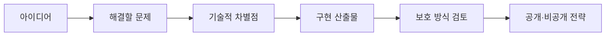
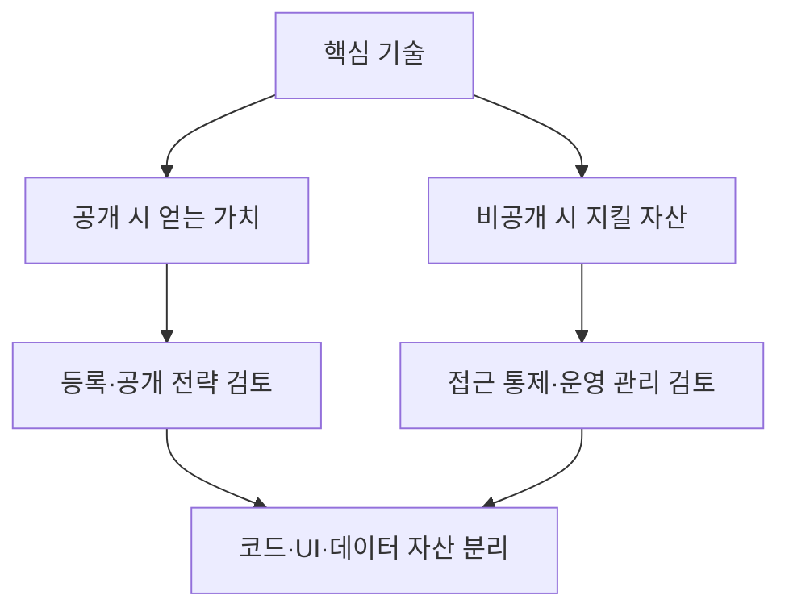

> [!abstract] 한 줄 요약
> AI 아이디어는 기능 목록으로 끝나지 않는다. 기술의 차별점, 구현 산출물, 데이터, 공개 범위를 나누어 보고 보호 전략을 함께 설계한다.

아이디어 목록은 대출 추천, 뉴스 요약, 스마트 홈 보안, 음악 생성, 음성 합성·감정 분석, 헬스케어 챗봇, 코드 생성, 가상 고객센터, SNS 콘텐츠 생성, 쇼핑 추천처럼 서로 다른 AI 서비스를 제시한다. 공통 실습 질문은 “특허와 저작권 중 무엇을 선택할까”가 아니라, ==무엇을 어떤 방식으로 보호하려는가==이다.



## 아이디어를 네 층으로 분해하기

<Tabs>
  <Tab label="문제">
사용자의 불편이나 기회를 한 문장으로 적고, 누가 영향을 받는지 정한다. 예시는 금융 선택, 정보 요약, 주거 보안, 건강 정보, 고객 응대처럼 서로 다른 맥락을 다룬다.
  </Tab>
  <Tab label="기술">
추천·요약·이미지 인식·음성 처리·챗봇·생성 모델처럼 시스템의 핵심 처리 방식을 적는다. 기술 이름보다 어떤 입력을 어떤 판단으로 바꾸는지가 중요하다.
  </Tab>
  <Tab label="산출물">
코드, UI, 데이터셋, 모델 운용 방식, API처럼 실제로 만들어지는 결과를 구분한다. 하나의 아이디어가 여러 산출물을 가질 수 있다.
  </Tab>
</Tabs>

```html preview h=225
<div style="font-family:system-ui,sans-serif;padding:18px;color:var(--foreground)">
  <div style="display:grid;grid-template-columns:repeat(auto-fit,minmax(160px,1fr));gap:12px">
    <div style="padding:14px;background:var(--card);border:1px solid var(--border);border-radius:var(--radius)">
      <div style="font-weight:700;color:var(--chart-1)">문제</div>
      <div style="font-size:12px;color:var(--muted-foreground);margin-top:6px">왜 필요한가?</div>
    </div>
    <div style="padding:14px;background:var(--card);border:1px solid var(--border);border-radius:var(--radius)">
      <div style="font-weight:700;color:var(--chart-3)">기술</div>
      <div style="font-size:12px;color:var(--muted-foreground);margin-top:6px">무엇이 다르게 작동하는가?</div>
    </div>
    <div style="padding:14px;background:var(--card);border:1px solid var(--border);border-radius:var(--radius)">
      <div style="font-weight:700;color:var(--chart-4)">산출물</div>
      <div style="font-size:12px;color:var(--muted-foreground);margin-top:6px">코드·UI·데이터·운영 중 무엇이 남는가?</div>
    </div>
    <div style="padding:14px;background:var(--card);border:1px solid var(--border);border-radius:var(--radius)">
      <div style="font-weight:700;color:var(--chart-2)">전략</div>
      <div style="font-size:12px;color:var(--muted-foreground);margin-top:6px">공개·등록·비공개를 어떻게 조합할까?</div>
    </div>
  </div>
</div>
```

> [!important] 아이디어의 이름과 보호 대상은 다르다
> “AI 추천 서비스”라는 서비스 이름만으로는 보호 전략을 정할 수 없다. 새로운 기술적 해결 방식인지, 코드·UI 같은 창작물인지, 데이터와 운영 노하우인지 나누어야 검토가 시작된다.

<details>
<summary>강의 아이디어 목록을 보는 공통 질문</summary>

1. 사용자는 어떤 문제를 겪고 있는가?
2. AI가 처리하는 입력과 결과는 무엇인가?
3. 기존 방식과 비교할 때 기술적 차별점은 무엇인가?
4. 코드·UI·데이터·알고리즘 중 무엇이 핵심 자산인가?
5. 경쟁사가 다른 구현으로 유사 기능을 만들면 무엇이 남는가?

이 질문은 강의의 기술 설명과 특허 대 저작권 논의 포인트를 한 실습 순서로 재구성한 것이다.
</details>

## 스마트 키친 사례를 설계 언어로 읽기

강의의 작성 예시는 냉장고 재료를 분석해 요리를 추천하고, 음성 가이드와 스마트 디스플레이로 과정을 안내하는 AI 요리 보조 시스템이다. 추천 모델, 재료 이미지 인식, 대화·음성 인터페이스, 모바일 또는 웹 구현, 클라우드 또는 온디바이스 배포가 함께 등장한다.

```html preview h=240
<div style="font-family:system-ui,sans-serif;padding:18px;color:var(--foreground)">
  <svg viewBox="0 0 720 182" style="display:block;width:100%;height:auto;max-width:100%" role="img" aria-label="스마트 키친 AI의 입력, 처리, 안내 흐름을 설명하는 독자 제작 다이어그램">
    <g style="fill:var(--card);stroke:var(--border);stroke-width:2">
      <rect x="22" y="68" width="144" height="52" rx="14"></rect>
      <rect x="200" y="68" width="144" height="52" rx="14"></rect>
      <rect x="378" y="24" width="144" height="52" rx="14"></rect>
      <rect x="378" y="110" width="144" height="52" rx="14"></rect>
      <rect x="556" y="68" width="144" height="52" rx="14"></rect>
    </g>
    <g style="stroke:var(--muted-foreground);stroke-width:3">
      <path d="M166 94h30"></path><path d="M344 94h28"></path><path d="M372 94l-12-8v16z" style="fill:var(--muted-foreground)"></path>
      <path d="M450 76v30"></path><path d="M522 50l32 30"></path><path d="M522 136l32-30"></path>
    </g>
    <g text-anchor="middle" style="fill:var(--foreground);font-family:system-ui,sans-serif">
      <text x="94" y="91" font-size="14" font-weight="700">재료·사용자 입력</text>
      <text x="272" y="91" font-size="14" font-weight="700">인식·추천</text>
      <text x="450" y="48" font-size="14" font-weight="700">레시피 판단</text>
      <text x="450" y="134" font-size="14" font-weight="700">진행 상황 반영</text>
      <text x="628" y="91" font-size="14" font-weight="700">음성·화면 안내</text>
    </g>
  </svg>
</div>
```

<details>
<summary>사례에서 분리해야 하는 세 가지 자산</summary>

| 자산 | 사례에서의 모습 | 검토의 출발점 |
| :-- | :-- | :-- |
| 기술적 해결 방식 | 실시간 분석과 맞춤 피드백을 묶는 방식 | 기존과 다른 기술적 차별점이 있는가 |
| 창작 산출물 | 소스 코드, UI, 요리 데이터 | 창작물로서 무엇이 남는가 |
| 운영·데이터 | 학습 데이터, API 운용, 배포 선택 | 공개할 것과 비공개로 관리할 것을 어떻게 나눌까 |

이 표는 보호 가능성을 단정하지 않는다. 강의 사례가 제시한 논의 대상을 분리한 것이다.
</details>

> [!warning] 수업용 결론과 실제 법률 판단을 구분하기
> 강의 예시는 특허·저작권·비공개 관리를 조합하는 결론을 제안한다. 하지만 개별 아이디어의 실제 보호 가능성·등록 여부·권리 범위는 구현과 관할 법령에 따라 달라진다. 이 노트는 법률 자문이 아니라 설계 단계의 질문 목록이다.

## 조합 전략으로 보기



==한 가지 보호 수단만 고르는 문제가 아니라, 기술·창작물·데이터·운영 정보를 서로 다른 방식으로 관리하는 문제==로 읽는다.

```html preview h=185
<div style="font-family:system-ui,sans-serif;padding:18px;color:var(--foreground)">
  <div style="display:flex;gap:12px;flex-wrap:wrap">
    <div style="flex:1;min-width:180px;padding:14px;border-left:4px solid var(--chart-1);background:var(--card);border-radius:var(--radius)">
      <div style="font-weight:700">기술 차별점</div>
      <div style="font-size:12px;color:var(--muted-foreground);margin-top:6px">무엇이 새롭고 재현 가능한 해결 방식인가?</div>
    </div>
    <div style="flex:1;min-width:180px;padding:14px;border-left:4px solid var(--chart-4);background:var(--card);border-radius:var(--radius)">
      <div style="font-weight:700">창작 산출물</div>
      <div style="font-size:12px;color:var(--muted-foreground);margin-top:6px">코드·UI·문서·데이터 표현은 무엇인가?</div>
    </div>
    <div style="flex:1;min-width:180px;padding:14px;border-left:4px solid var(--chart-2);background:var(--card);border-radius:var(--radius)">
      <div style="font-weight:700">운영 정보</div>
      <div style="font-size:12px;color:var(--muted-foreground);margin-top:6px">공개하지 않을 데이터와 노하우는 무엇인가?</div>
    </div>
  </div>
</div>
```

> [!tip] 아이디어 목록을 선택 기준으로 바꾸기
> 대출·뉴스·보안·음악·음성·헬스케어·코드·고객센터·SNS·쇼핑 가운데 무엇을 고르든, 문제·기술·데이터·사용자 위험·보호 자산을 한 장으로 설명할 수 있는 주제가 다음 설계 단계로 이어진다.

## 핵심 정리

| 개념 | 핵심 |
| :-- | :-- |
| 아이디어 구체화 | 문제·입력·처리·결과·차별점을 분명히 하는 일 |
| 보호 대상 분리 | 기술적 해결 방식, 창작 산출물, 데이터·운영 자산을 구분하는 일 |
| 특허 대 저작권 논의 | 하나를 즉시 고르는 것이 아니라 무엇을 보호하려는지 묻는 과정 |
| 조합 전략 | 공개·등록·비공개 관리의 장단점을 함께 검토하는 접근 |

> [!question]- 스스로 점검
> 코드와 UI를 만들었다는 사실만으로 핵심 AI 기능 전체를 설명할 수 있는가?
>
> 아니다. 코드·UI는 중요한 산출물이지만, 기술적 차별점, 데이터, 모델 운용 방식, 공개·비공개 전략도 따로 설명해야 한다.
