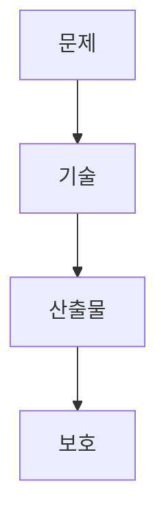

> [!abstract] 한 줄 요약
> AI 아이디어는 해결 문제와 구현 기술을 구체화한 뒤, ==핵심 방식·코드·UI·데이터==를 무엇으로 보호할지 분리해 검토한다.

## 이 노트의 지도



## 1. 아이디어를 기술 계획으로 바꾸기

강의의 아이디어 목록은 대출 추천, 뉴스 요약, IoT 보안, 음악 생성, 음성 합성, 헬스케어 챗봇, 코드 생성, 가상 고객센터, 콘텐츠 생성, 쇼핑 추천 같은 AI 시스템 예시를 제시한다.

<details>
<summary>스마트 요리 보조 예시</summary>

선택 예시는 냉장고 재료를 분석해 요리법을 추천하고, 음성 가이드와 스마트 디스플레이로 요리 과정을 안내하는 AI 시스템이다. 강의는 추천 모델, 이미지 인식, 챗봇·음성 인식, 앱 또는 웹, 클라우드·온디바이스 배포, API 보호 전략을 구현 고려사항으로 제시한다.

</details>

$$
I=\{\text{문제},\ \text{기술},\ \text{차별점},\ \text{도전 과제}\}
$$

<Tabs>
  <Tab label="문제">
    냉장고 재료를 효율적으로 활용하지 못해 음식물 쓰레기가 생기는 문제와, 요리를 어려워하는 사용자의 단계별 안내 필요가 제시된다.
  </Tab>
  <Tab label="차별점">
    단순 레시피 제공과 달리, 맞춤 요리법 추천과 실시간 진행 상황 분석을 통한 단계별 조정을 차별점으로 제시한다.
  </Tab>
</Tabs>

> [!important] 구체화의 기준
> 아이디어 이름만으로는 부족하다. 해결 문제, 필요한 개발 기술, 기존 방식과의 차별점, 가장 어려운 구현 과제를 함께 적어야 한다.

## 2. 보호 방식을 나누기

강의는 특허 가능성을 혁신성·모방 가능성·장기 독점 가치·비용과 심사 기간의 질문으로, 저작권 가능성을 코드·UI·데이터셋 같은 창작물과 자동 보호의 질문으로 검토한다.

<details>
<summary>특허와 저작권의 질문</summary>

특허 검토는 기존 기술과의 차이와 핵심 기술의 모방 방어를 중심으로 한다. 저작권 검토는 소프트웨어 코드, UI 디자인, 데이터셋처럼 창작물로 볼 수 있는 산출물을 중심으로 한다. 강의 예시는 핵심 알고리즘을 다른 코드로 구현할 수 있다면 저작권만으로 방어하기 어렵다는 점을 제시한다.

</details>

$$
S=\{\text{특허},\ \text{저작권},\ \text{비공개 관리}\}
$$

```html preview
<div style="font-family:system-ui,sans-serif;padding:20px">
  <div id="cards" style="display:flex;gap:14px;flex-wrap:wrap"></div>
  <script>
    var stats = [
      ['아이디어 예시', '10개', '강의의 AI 시스템 목록', 'var(--chart-2)'],
      ['보호 방식', '2가지', '특허 또는 저작권 검토', 'var(--chart-1)'],
      ['추가 관리', '1가지', '학습 데이터 비공개 관리', 'var(--chart-5)']
    ];
    document.getElementById('cards').innerHTML = stats.map(function (s) {
      return '<div style="flex:1;min-width:150px;padding:16px;background:var(--card);' +
        'color:var(--card-foreground);border:1px solid var(--border);' +
        'border-radius:var(--radius)">' +
        '<div style="font-size:13px;color:var(--muted-foreground)">' + s[0] + '</div>' +
        '<div style="font-size:26px;font-weight:700;margin-top:4px">' + s[1] + '</div>' +
        '<div style="font-size:12px;font-weight:600;margin-top:4px;color:' + s[3] + '">' +
        s[2] + '</div>' +
        '</div>';
    }).join('');
  </script>
</div>
```

<details>
<summary>강의 예시의 최종 선택</summary>

스마트 요리 보조 예시는 실시간 AI 요리 분석과 맞춤 피드백의 보호를 위해 특허를 선택하고, UI 디자인과 레시피 데이터베이스의 저작권 등록, 학습 데이터의 비공개 관리를 함께 제시한다.

</details>

> [!tip] 분해해서 검토하기
> 기술의 작동 방식, 구현 코드와 UI, 데이터 자산을 한 덩어리로 보지 않고 각 자산에 맞는 보호 질문을 적용한다.

<details>
<summary>소스 경고</summary>

아이디어 리스트의 팀명·날짜·학번·이름은 예시 양식의 자리표시자다. 이 노트는 이를 실제 팀 정보나 제출 결과로 다루지 않는다.

</details>

<details>
<summary>스스로 점검</summary>

**Q.** 강의 예시에서 저작권만으로 보호하기 어렵다고 한 대상은 무엇인가?

**A.** 다른 코드로 구현될 수 있는 AI의 핵심 알고리즘이다.

</details>

### 아이디어 보호 점검

```html preview
<div style="font-family:system-ui,sans-serif;padding:20px;color:var(--foreground)">
<label for="amt" style="font-size:14px;font-weight:600">보호 전략 점검</label>
<div id="out" style="font-size:30px;font-weight:700;color:var(--chart-1);margin:6px 0">1단계</div>
<input id="amt" type="range" min="1" max="5" step="1" value="1" style="width:100%;accent-color:var(--primary)" />
<p style="font-size:13px;color:var(--muted-foreground)">아이디어 설명·선행기술·권리화 검토 순서를 확인한다.</p>
<script>
var amt=document.getElementById('amt'); var out=document.getElementById('out');
amt.addEventListener('input',function(){out.textContent=Number(amt.value).toLocaleString()+'단계';});
</script>
</div>
```

## 출처와 한계

- 근거: 현재 로컬 “아이디어 리스트” 추출문.
- 원본 PDF 링크, 쪽수 표기, 원본 슬라이드 이미지와 assets 임베드는 이 공개 노트에서 제외했다.
