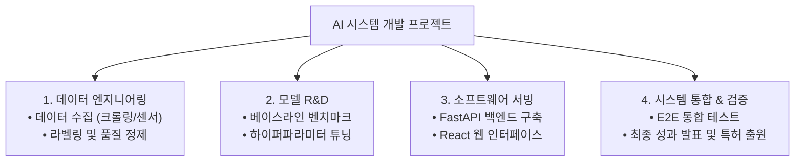

> [!abstract] 핵심 요약
> 공학 프로젝트의 성패는 뛰어난 알고리즘뿐만 아니라 **체계적인 프로젝트 기획과 위험 관리(Risk Management)**에 달려 있다.
> 목표를 측정 가능한 소작업 단위로 쪼개는 **WBS**와 작업 간 선후행 관계를 시각화하는 **간트 차트**를 통해 임계 경로(Critical Path)를 추적하며, 데이터 부족이나 모델 미수렴 같은 AI 고유 위험 요소를 사전에 식별하고 대응 전략(Contingency Plan)을 수립해야 한다.

---

## 1. AI 캡스톤 프로젝트 WBS 4대 대분류



---

## 2. RACI 책임 할당 매트릭스

| 역할 코드 | 명칭 | 정의 및 프로젝트 내 책임 범위 |
| :-- | :-- | :-- |
| **R** | **Responsible (실무 담당자)** | 해당 작업을 실제로 수행하여 완료할 실무자 |
| **A** | **Accountable (최종 승인자)** | 작업의 성공/실패에 대한 최종 의사결정권자 (단 1명만 지정) |
| **C** | **Consulted (자문자)** | 작업 수행에 필요한 전문 지식을 제공하는 양방향 소통 대상자 |
| **I** | **Informed (통보 대상자)** | 진행 상황 및 완료 결과를 일방향으로 공유받는 이해관계자 |

---

## 3. 실시간 AI 프로젝트 임계 경로(Critical Path) 일정 시뮬레이터

```html preview
<div style="font-family:system-ui,-apple-system,sans-serif;padding:20px;background:var(--card);color:var(--card-foreground);border:1px solid var(--border);border-radius:var(--radius)">
  <div style="font-size:16px;font-weight:700;margin-bottom:14px;color:var(--primary);display:flex;align-items:center;gap:8px">
    <span>📅 AI 프로젝트 단계별 일정 & 임계 경로(Critical Path) 계산기</span>
  </div>

  <div style="display:grid;grid-template-columns:repeat(3, 1fr);gap:10px;margin-bottom:14px">
    <div>
      <label style="font-size:10px;color:var(--muted-foreground)">데이터 수집 (주):</label>
      <input id="inWkData" type="number" value="3" min="1" max="10" style="width:100%;padding:4px;background:var(--background);color:var(--foreground);border:1px solid var(--border);border-radius:var(--radius);font-weight:700" />
    </div>
    <div>
      <label style="font-size:10px;color:var(--muted-foreground)">모델 학습 (주):</label>
      <input id="inWkModel" type="number" value="4" min="1" max="10" style="width:100%;padding:4px;background:var(--background);color:var(--foreground);border:1px solid var(--border);border-radius:var(--radius);font-weight:700" />
    </div>
    <div>
      <label style="font-size:10px;color:var(--muted-foreground)">서빙/UI 개발 (주):</label>
      <input id="inWkUi" type="number" value="3" min="1" max="10" style="width:100%;padding:4px;background:var(--background);color:var(--foreground);border:1px solid var(--border);border-radius:var(--radius);font-weight:700" />
    </div>
  </div>

  <div style="display:grid;grid-template-columns:1fr 1fr;gap:12px;margin-bottom:12px">
    <div style="padding:10px;background:var(--background);border:1px solid var(--border);border-radius:var(--radius);text-align:center">
      <div style="font-size:10px;color:var(--muted-foreground)">총 프로젝트 기간 (Critical Path)</div>
      <div id="totalWeeksOut" style="font-family:monospace;font-size:16px;font-weight:800;color:var(--primary);margin-top:2px">10 주</div>
    </div>
    <div style="padding:10px;background:var(--background);border:1px solid var(--border);border-radius:var(--radius);text-align:center">
      <div style="font-size:10px;color:var(--muted-foreground)">학기 내 완수 가능 여부 (16주 기준)</div>
      <div id="termStatusOut" style="font-size:12px;font-weight:800;color:var(--primary);margin-top:4px">✅ 여유 일정 6주 확보</div>
    </div>
  </div>

  <script>
    function updateSchedule() {
      var d = parseInt(document.getElementById('inWkData').value) || 0;
      var m = parseInt(document.getElementById('inWkModel').value) || 0;
      var u = parseInt(document.getElementById('inWkUi').value) || 0;

      var total = d + m + u;
      document.getElementById('totalWeeksOut').textContent = total + " 주";

      var status = document.getElementById('termStatusOut');
      var remain = 16 - total;
      if (remain >= 0) {
        status.innerHTML = "✅ <span style='color:var(--primary)'>여유 일정 " + remain + "주 확보</span>";
      } else {
        status.innerHTML = "⚠️ <span style='color:var(--destructive,#ef4444)'>일정 초과 (" + Math.abs(remain) + "주 지연)</span>";
      }
    }

    ['inWkData', 'inWkModel', 'inWkUi'].forEach(function(id) {
      document.getElementById(id).addEventListener('input', updateSchedule);
    });
    updateSchedule();
  </script>
</div>
```
