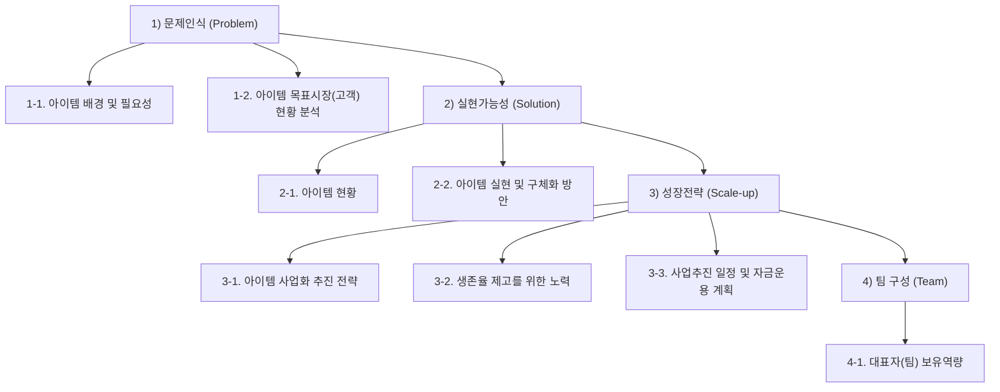
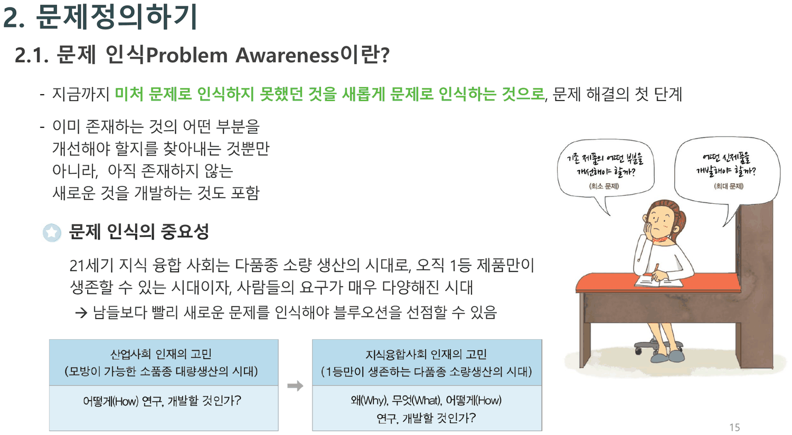
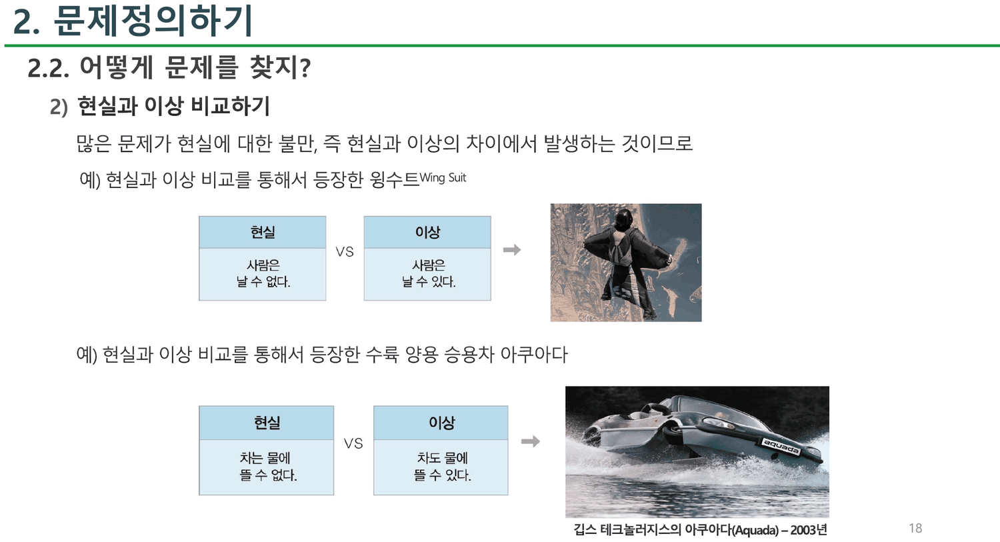
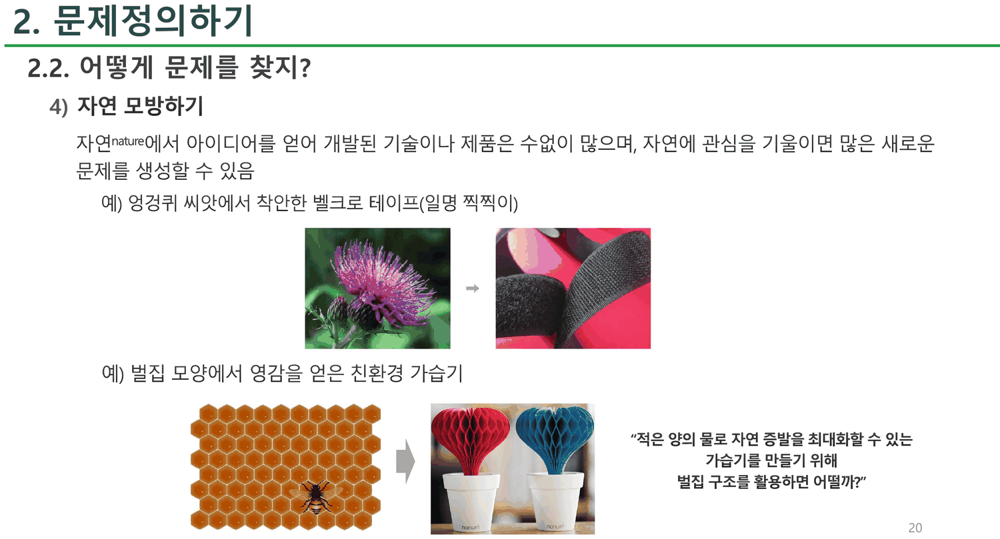
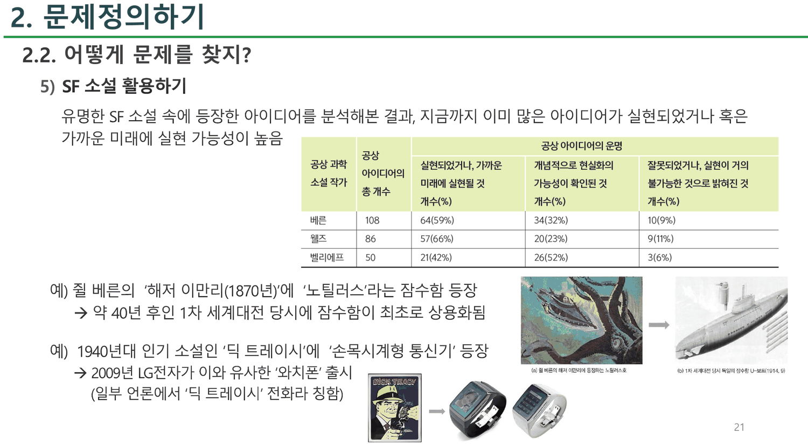
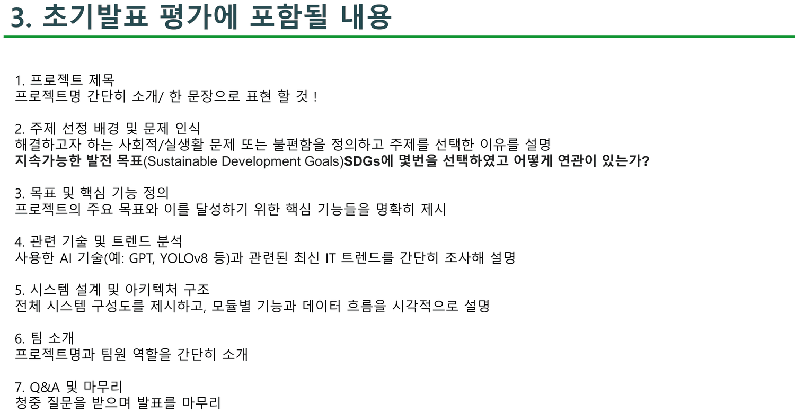

## 한 덱, 세 개의 문서

4주차 덱은 22쪽인데 머리글이 네 번 바뀐다.

| 쪽 | 머리글 | 성격 |
| ---: | --- | --- |
| 2~5 | `0. 팀 설계` | 팀 구성 투표, 발표 방식, 주제(SDGs) 공개 |
| 6~14 | `1. 설계계획서 작성하기?` | **정부 창업지원 사업계획서 양식** |
| 15~21 | `2. 문제정의하기` | **발상법 교재** — 문제를 찾는 다섯 가지 방법 |
| 22 | `3. 초기발표 평가에 포함될 내용` | 평가 항목 일곱 |

세 덩이가 서로를 참조하지 않는다. 6~14번의 양식은 15~21번의 발상법을 쓰라고 하지 않고, 22번의 평가 항목은 6~14번의 양식 어느 칸도 가리키지 않는다.

> [!important] 이 노트의 척추
> 6~14번의 양식은 **학부 팀 프로젝트용으로 만들어진 문서가 아니다.** 「본 사업 참여 시」·「협약 기간 내」·「사업화 성과 창출 목표(**매출, 투자, 고용** 등)」·「기간 종료 이후 사업 지속」 같은 표현이 그대로 있다. 정부 창업지원 사업의 P-S-S-T 양식(문제인식 Problem · 실현가능성 Solution · 성장전략 Scale-up · 팀 구성 Team)이 낱말 하나 고치지 않고 들어와 있다. 그리고 여덟 쪽 뒤 22번이 실제 평가 항목을 내놓는데, **거기에 매출도 투자도 고용도 협약 기간도 없다.** 학생이 채워야 하는 양식과 학생이 평가받는 기준이 서로 다른 문서다.

---

## 6~14번 — P-S-S-T 양식이 그대로 들어온다

9쪽에 걸친 양식의 골격은 정확히 넷이다.



각 칸의 `※` 지시문을 그대로 옮기면 이 양식이 누구를 대상으로 쓰인 것인지가 드러난다.

| 칸 | 인쇄된 지시문 |
| --- | --- |
| 1-1 | 「②내부적 배경 및 동기(예: **대표자** 경험, 가치관, 비전 등의 관점)」 |
| 2-1 | 「**사업 신청 시점**의 아이템 개발·구체화 현황」 |
| 2-2 | 「최종 및 **협약 기간 내** 실현, 구체화하고자 하는 개발 방안」 |
| 3-1 | 「**본 사업 참여 시** 개발 또는 구체화할 아이템의 수익화 모델(비즈니스 모델)」 |
| 3-2 | 「**기간 내 달성하고자 하는 사업화 성과(매출, 투자, 고용 등) 기재**」 |
| 3-2 | 「기간 **종료 이후** 사업 지속 및 성과 창출을 위한 구체적인 계획수립」 |
| 3-3 | 표: 순번 · 추진 내용 · 추진 기간(`00년 상반기`, `00.00 ~ 00.00`) · 세부 내용 |
| 4-1 | 「**대표자**(팀) 보유역량」 · 「팀 구성 현황 및 **추가 필요인력**, 활용 계획」 |

`대표자` · `사업 신청 시점` · `협약 기간` · `본 사업 참여 시` · `매출, 투자, 고용` · `추가 필요인력` — 여덟 칸 중 여섯 칸이 학부생에게 그대로는 성립하지 않는 낱말을 담고 있다. 3-3의 일정 표 눈금이 `00년 상반기` · `00년 하반기` 로 **반기 단위**인 것도 같은 이유다. 한 학기짜리 프로젝트의 일정을 반기로 쪼갤 수는 없다.

> [!note] 이 양식이 이 과목에 아주 안 맞는 것은 아니다
> P-S-S-T 의 앞 절반(문제인식 · 실현가능성)은 [[01. 설계 프로세스를 네 번 가르치고 고르는 법은 가르치지 않는다]]에서 본 7단계 프로세스의 1~5단계와 잘 겹친다. 문제를 정의하고, 시장을 보고, 현황을 적고, 구체화 방안을 쓰는 순서는 그대로 쓸 수 있다. **어긋나는 것은 뒤 절반(성장전략)** 이고, 그 세 칸이 아홉 쪽 중 세 쪽을 차지한다.

---

## 15~21번 — 문제를 찾는 다섯 가지 방법

성격이 완전히 바뀐다. 15번이 「문제 인식(Problem Awareness)」을 정의한다.



> - 지금까지 **미처 문제로 인식하지 못했던 것을 새롭게 문제로 인식하는 것으로**, 문제 해결의 첫 단계
> - 이미 존재하는 것의 어떤 부분을 개선해야 할지를 찾아내는 것뿐만 아니라, 아직 존재하지 않는 새로운 것을 개발하는 것도 포함

오른쪽 그림이 그 둘에 이름을 붙인다 — 「기존 제품의 어떤 부분을 개선해야 할까?(**최소 문제**)」와 「어떤 신제품을 개발해야 할까?(**최대 문제**)」. 아래 두 상자가 시대를 나눈다.

| 산업사회 인재의 고민 | 지식융합사회 인재의 고민 |
| --- | --- |
| (모방이 가능한 소품종 대량생산의 시대) | (1등만이 생존하는 다품종 소량생산의 시대) |
| **어떻게(How)** 연구, 개발할 것인가? | **왜(Why), 무엇(What), 어떻게(How)** 연구, 개발할 것인가? |

그리고 16~21번이 다섯 가지 방법을 하나씩 든다. 각각 예시가 둘씩 붙는다.

```html preview
<div id="id5" style="font-family:system-ui,-apple-system,sans-serif;color:var(--foreground);background:var(--card);border:1px solid var(--border);border-radius:12px;padding:18px 16px;">
  <p style="margin:0 0 14px;font-size:13px;color:var(--muted-foreground);line-height:1.7;">
    4주차 17~21번의 다섯 가지 방법. 각 방법이 <b>무엇과 무엇을 대비시켜</b> 문제를 만들어 내는지를 슬라이드의 두 칸 그대로 옮겼다.</p>
  <div id="id5b" style="display:flex;flex-wrap:wrap;gap:5px;margin-bottom:14px;"></div>
  <svg id="id5s" viewBox="0 0 620 150" style="width:100%;height:auto;display:block;"></svg>
  <div id="id5o" style="margin-top:8px;font-size:13.5px;line-height:1.95;min-height:4.6em;"></div>
  <style>#id5 .ib{font:inherit;font-size:12px;padding:4px 10px;cursor:pointer;border:1px solid var(--border);
    background:transparent;color:var(--muted-foreground);border-radius:6px;}
    #id5 .ib.on{background:var(--chart-1);border-color:var(--chart-1);color:var(--card);font-weight:700;}</style>
</div>
<script>
(function(){
  const NS='http://www.w3.org/2000/svg', svg=document.getElementById('id5s');
  const el=(t,a,x)=>{const e=document.createElementNS(NS,t);for(const k in a)e.setAttribute(k,a[k]);
    if(x!==undefined)e.textContent=x;return e;};
  const M=[
    {n:'1) 인간의 욕망 분석하기', s:'17', a:'노화', b:'젊음', al:'인간의 욕망 분석',
     ex:['인간의 젊어지고 싶어 하는 욕망 → 노화된 피부를 재생하는 기술'],
     line:'심리학적 연구를 토대로 인간의 욕망을 분석하면, 새로운 시각에서 문제를 창안할 수 있음'},
    {n:'2) 현실과 이상 비교하기', s:'18', a:'사람은 날 수 없다', b:'사람은 날 수 있다', al:'현실 vs 이상',
     ex:['윙수트(Wing Suit)','수륙 양용 승용차 아쿠아다 — 깁스 테크놀러지스, 2003년'],
     line:'많은 문제가 현실에 대한 불만, 즉 현실과 이상의 차이에서 발생하는 것이므로'},
    {n:'3) 사물을 바라보는 관점 바꾸기', s:'19', a:'저렴할수록 잘 팔린다', b:'비싸도 잘 팔릴 수 있다', al:'기존 관점 vs 관점 변화',
     ex:['웨스톤 ES3X 고급 이어폰(약 127만원)','프라다 포코노백 — 명품가방은 가죽으로 만들어야 한다 → 포코노로 만들 수 있다'],
     line:'제품이나 서비스의 사용 목적이나 장소, 시간, 가격 등에 대한 선입견을 버리고 의식적으로 관점을 바꿔봄으로써'},
    {n:'4) 자연 모방하기', s:'20', a:'자연에 있는 구조', b:'제품이 필요로 하는 기능', al:'자연 → 제품',
     ex:['엉겅퀴 씨앗 → 벨크로 테이프(일명 찍찍이)','벌집 모양 → 친환경 가습기 (적은 양의 물로 자연 증발을 최대화)'],
     line:'자연에서 아이디어를 얻어 개발된 기술이나 제품은 수없이 많으며'},
    {n:'5) SF 소설 활용하기', s:'21', a:'공상 아이디어', b:'실현된 기술', al:'공상 → 현실',
     ex:['쥘 베른 『해저 이만리』(1870) 노틸러스 → 1차 세계대전 당시 잠수함','『딕 트레이시』 손목시계형 통신기 → 2009년 LG전자 와치폰'],
     line:'유명한 SF 소설 속에 등장한 아이디어를 분석해본 결과, 지금까지 이미 많은 아이디어가 실현되었거나 혹은 가까운 미래에 실현 가능성이 높음'}];
  let sel=1;
  function draw(){
    const m=M[sel]; svg.textContent='';
    const bx=[[96,'var(--chart-2)',m.a],[386,'var(--chart-1)',m.b]];
    svg.appendChild(el('text',{x:310,y:20,'text-anchor':'middle','font-size':11.5,
      fill:'var(--muted-foreground)'},m.al));
    bx.forEach(([x,c,t])=>{
      svg.appendChild(el('rect',{x:x,y:38,width:150,height:56,rx:7,fill:c,opacity:0.16,
        stroke:c,'stroke-width':1.4}));
      const words=t.length>14? [t.slice(0,Math.ceil(t.length/2)), t.slice(Math.ceil(t.length/2))] : [t];
      words.forEach((w,k)=>svg.appendChild(el('text',{x:x+75,y:66+(k-(words.length-1)/2)*16,
        'text-anchor':'middle','font-size':12,fill:'var(--foreground)'},w)));
    });
    svg.appendChild(el('text',{x:310,y:72,'text-anchor':'middle','font-size':16,
      fill:'var(--muted-foreground)','font-weight':700},'VS'));
    svg.appendChild(el('path',{d:'M552 66 L590 66 M582 60 L590 66 L582 72',stroke:'var(--chart-1)',
      'stroke-width':2,fill:'none'}));
    svg.appendChild(el('text',{x:310,y:120,'text-anchor':'middle','font-size':11,
      fill:'var(--muted-foreground)'},'→ 새 문제 / 새 제품'));
    svg.appendChild(el('text',{x:310,y:140,'text-anchor':'middle','font-size':10.5,
      fill:'var(--muted-foreground)'},'슬라이드 '+m.s+'번'));
  }
  function upd(){ draw(); const m=M[sel];
    document.getElementById('id5o').innerHTML='<span style="color:var(--muted-foreground);font-size:12.5px">'+
      m.line+'</span><ul style="margin:6px 0 0;padding-left:20px;font-size:13px;line-height:1.8">'+
      m.ex.map(e=>'<li>'+e+'</li>').join('')+'</ul>';
  }
  const bar=document.getElementById('id5b');
  M.forEach((m,i)=>{const b=document.createElement('button');b.className='ib'+(i===sel?' on':'');
    b.textContent=m.n.split(') ')[1]; b.onclick=()=>{sel=i;
      [...bar.children].forEach((c,j)=>c.classList.toggle('on',j===i));upd();};bar.appendChild(b);});
  upd();
})();
</script>



다섯 가지가 전부 **두 칸을 나란히 놓고 그 사이의 간격을 문제로 만드는** 같은 형식이다(욕망 vs 현재, 현실 vs 이상, 기존 관점 vs 바뀐 관점, 자연 vs 제품, 공상 vs 실현). 이 형식은 2주차 15번의 「열린 사고력 향상 6계명」과 같은 도구이고, 2주차 39번의 발명 노하우 세 단계(기능 더하기·빼기·모양 바꾸기)와도 겹친다. **세 덱이 같은 도구를 세 가지 이름으로 세 번 가르친다.**



---

## 21번의 표 — 100%를 맞추려고 고친 퍼센트

다섯 번째 방법에만 데이터가 붙는다. 공상과학 소설가 셋의 아이디어가 실제로 어떻게 되었는지를 센 표다.



| 작가 | 총 개수 | 실현되었거나 가까운 미래에 실현될 것 | 개념적으로 현실화의 가능성이 확인된 것 | 잘못되었거나 실현이 거의 불가능한 것 |
| --- | ---: | ---: | ---: | ---: |
| 베른 | 108 | 64 (59%) | 34 (**32%**) | 10 (9%) |
| 웰즈 | 86 | 57 (66%) | 20 (23%) | 9 (**11%**) |
| 벨리에프 | 50 | 21 (42%) | 26 (52%) | 3 (6%) |

개수는 세 줄 다 정확히 맞는다 — 64+34+10 = 108, 57+20+9 = 86, 21+26+3 = 50.

**그런데 퍼센트 두 개가 반올림과 어긋난다.**

```html preview
<div id="sf" style="font-family:system-ui,-apple-system,sans-serif;color:var(--foreground);background:var(--card);border:1px solid var(--border);border-radius:12px;padding:18px 16px;">
  <p style="margin:0 0 12px;font-size:13px;color:var(--muted-foreground);line-height:1.7;">
    21번 표의 개수를 그대로 나눠 계산한 값과 인쇄된 퍼센트를 나란히 놓았다.
    작가를 눌러 각 줄의 합이 어떻게 100이 되는지 본다.</p>
  <div id="sfb" style="display:flex;gap:5px;margin-bottom:14px;"></div>
  <svg id="sfs" viewBox="0 0 620 190" style="width:100%;height:auto;display:block;"></svg>
  <div id="sfo" style="margin-top:8px;font-size:13.5px;line-height:1.95;font-variant-numeric:tabular-nums;min-height:4.2em;"></div>
  <style>#sf .fb{font:inherit;font-size:12px;padding:4px 12px;cursor:pointer;border:1px solid var(--border);
    background:transparent;color:var(--muted-foreground);border-radius:6px;}
    #sf .fb.on{background:var(--chart-1);border-color:var(--chart-1);color:var(--card);font-weight:700;}</style>
</div>
<script>
(function(){
  const NS='http://www.w3.org/2000/svg', svg=document.getElementById('sfs');
  const el=(t,a,x)=>{const e=document.createElementNS(NS,t);for(const k in a)e.setAttribute(k,a[k]);
    if(x!==undefined)e.textContent=x;return e;};
  const COL=['실현되었거나 가까운 미래에','개념적으로 가능성 확인','잘못되었거나 거의 불가능'];
  const D=[['베른',108,[64,34,10],[59,32,9]],['웰즈',86,[57,20,9],[66,23,11]],['벨리에프',50,[21,26,3],[42,52,6]]];
  let sel=0;
  function draw(){
    const [nm,tot,cnt,pct]=D[sel]; svg.textContent='';
    const L=178,R=520,T=18,H=48;
    cnt.forEach((c,i)=>{
      const y=T+i*H+18, real=c/tot*100, rd=Math.round(real), ok=rd===pct[i];
      svg.appendChild(el('text',{x:L-10,y:y+4,'text-anchor':'end','font-size':10.5,
        fill:'var(--muted-foreground)'},COL[i].length>14?COL[i].slice(0,14)+'…':COL[i]));
      const w=(R-L)*real/100;
      svg.appendChild(el('rect',{x:L,y:y-11,width:Math.max(w,2),height:22,rx:4,
        fill: ok?'var(--chart-1)':'var(--chart-2)', opacity:0.9}));
      svg.appendChild(el('text',{x:L+6,y:y+4,'font-size':11.5,fill:'var(--card)','font-weight':700},
        c+'/'+tot));
      svg.appendChild(el('text',{x:R+10,y:y+4,'font-size':11.5,fill:'var(--foreground)'},
        real.toFixed(2)+'%  →  인쇄 '+pct[i]+'%'+(ok?'':'  ✗')));
    });
    const sp=pct.reduce((a,b)=>a+b,0), sr=cnt.map(c=>Math.round(c/tot*100)).reduce((a,b)=>a+b,0);
    svg.appendChild(el('line',{x1:L-160,y1:T+3*H+6,x2:600,y2:T+3*H+6,stroke:'var(--border)'}));
    svg.appendChild(el('text',{x:L-10,y:T+3*H+26,'text-anchor':'end','font-size':11.5,
      fill:'var(--foreground)','font-weight':700},'합계'));
    svg.appendChild(el('text',{x:L,y:T+3*H+26,'font-size':11.5,
      fill: sp===100?'var(--chart-1)':'var(--chart-2)','font-weight':700},'인쇄된 퍼센트 합 '+sp));
    svg.appendChild(el('text',{x:L+178,y:T+3*H+26,'font-size':11.5,
      fill: sr===100?'var(--chart-1)':'var(--chart-2)','font-weight':700},'정직하게 반올림하면 '+sr));
  }
  function upd(){ draw(); const [nm,tot,cnt,pct]=D[sel];
    const bad=cnt.map((c,i)=>[i,c/tot*100,pct[i]]).filter(([i,r,p])=>Math.round(r)!==p);
    document.getElementById('sfo').innerHTML =
      '<b>'+nm+'</b> — 개수 합 '+cnt.reduce((a,b)=>a+b,0)+' = 인쇄된 총 개수 '+tot+' ✓'+
      '<p style="margin:6px 0 0;font-size:12.5px;color:var(--muted-foreground);line-height:1.8">'+
      (bad.length===0
        ? '세 퍼센트 모두 반올림과 정확히 맞고, 합도 저절로 100이 된다. <b>세 줄 중 이 줄만 고칠 필요가 없었다.</b>'
        : '<b style="color:var(--chart-2)">'+COL[bad[0][0]]+' 칸이 '+bad[0][1].toFixed(2)+'% → '+Math.round(bad[0][1])+
          '% 여야 하는데 '+bad[0][2]+'% 로 인쇄되어 있다.</b> 정직하게 반올림하면 세 칸의 합이 99가 되므로, 한 칸을 1 올려 100을 만든 것으로 보인다.')+
      '</p>';
  }
  const bar=document.getElementById('sfb');
  D.forEach((d,i)=>{const b=document.createElement('button');b.className='fb'+(i===0?' on':'');
    b.textContent=d[0]; b.onclick=()=>{sel=i;[...bar.children].forEach((c,j)=>c.classList.toggle('on',j===i));upd();};
    bar.appendChild(b);}); upd();
})();
</script>

- **베른** — $34/108 = 31.48\%$ 인데 `32%` 로 인쇄되어 있다. 정직하게 반올림하면 $59 + 31 + 9 = 99$ 가 되므로 한 칸을 1 올려 100을 만들었다.
- **웰즈** — $9/86 = 10.47\%$ 인데 `11%` 다. 같은 이유로 $66 + 23 + 10 = 99$ 를 100으로 만든 것이다.
- **벨리에프** — 50으로 나누므로 세 값이 정확히 42 · 52 · 6 이고 합이 저절로 100이다. **고칠 필요가 없었던 유일한 줄이 유일하게 정확한 줄**이다.

> [!caution] 이 표를 인용할 때
> 반올림 합을 100으로 맞추는 관행 자체는 흔하지만, 이 표에는 **어느 칸을 올렸는지 표시가 없다.** 세 줄 중 둘이 손을 탔고, 손을 타지 않은 한 줄은 애초에 맞아떨어지는 분모(50)를 가졌다. 개수는 세 줄 다 정확하므로 **인용할 때는 퍼센트가 아니라 개수를 쓰는 편이 안전하다.**

21번의 두 예시도 슬라이드가 적은 그대로 옮길 때 주의가 필요하다.

- 「쥘 베른의 『해저 이만리(1870년)』에 노틸러스라는 잠수함 등장 → **약 40년 후인 1차 세계대전 당시**에 잠수함이 최초로 상용화됨」 — 같은 슬라이드의 사진 설명이 `1차 세계대전 당시 독일의 잠수함 U-보트(1914. 9)` 이므로 **1870년에서 44년 뒤**다. 「약 40년」은 그 간격을 조금 줄여 말한 것이다
- 「**1940년대 인기 소설**인 『딕 트레이시』에 손목시계형 통신기 등장」 — 슬라이드가 그 옆에 붙인 그림은 **만화 컷**이다. 이 항목의 제목이 `SF 소설 활용하기` 인데 예시 하나가 소설이 아니다

---

## 3번과 22번 — 같은 발표에 대한 두 개의 일곱 항목

덱의 처음과 끝이 같은 것을 두 번 정의한다. 3번이 초기발표의 평가 항목을 적고, 열아홉 쪽 뒤 22번이 다시 적는다.



| | 3번 (`발표하는 방법 (평가 항목)`) | 22번 (`초기발표 평가에 포함될 내용`) |
| ---: | --- | --- |
| 1 | 아이템 개요 — 한 문장으로 설명 | 프로젝트 제목 — 한 문장으로 표현 |
| 2 | 배경 및 필요성 — 왜 만드는가, 목표 시장과 고객은 누구인가 | 주제 선정 배경 및 문제 인식 — **SDGs 몇 번을 선택했고 어떻게 연관되는가** |
| 3 | 아이템 현황 — **경쟁사가 있는가** | 목표 및 핵심 기능 정의 |
| 4 | 구체화 방안 — 어떻게 만들 것인가 | **관련 기술 및 트렌드 분석 — GPT, YOLOv8 등** |
| 5 | **개발일정** | 시스템 설계 및 아키텍처 구조 — 구성도, 모듈별 기능, 데이터 흐름 |
| 6 | 개발자 | 팀 소개 |
| 7 | 질의 응답 | Q&A 및 마무리 |

둘 다 일곱 항목이고, 1 · 6 · 7번은 사실상 같다. **갈라지는 것은 가운데 넷이다.**

- **3번에만 있는 것**: 경쟁사 현황, 개발일정
- **22번에만 있는 것**: SDGs 연계 번호, 기술·트렌드 분석(GPT · YOLOv8), 시스템 아키텍처 구조

성격이 정확히 반대다. **3번은 사업계획서 쪽 어휘(경쟁사·일정)이고, 22번은 공학 설계 쪽 어휘(아키텍처·데이터 흐름·모델 이름)다.** 6~14번의 아홉 쪽짜리 양식은 3번 쪽에 붙고, 22번은 그 양식 어느 칸도 가리키지 않는다. 학생 입장에서 두 목록을 모두 만족시키려면 열한 항목을 준비해야 한다.

> [!note] SDGs 는 주제 제약인데 목록이 없다
> 5번이 주제를 공개한다 — `지속가능한 발전 목표(Sustainable Development Goals) SDGs` 와 「웹, 앱, 시스템 등 어떤것이든!」 한 줄. 22번이 「SDGs에 **몇번을** 선택하였고 어떻게 연관이 있는가?」를 묻는다. **번호로 답해야 하는데 이 덱에는 SDGs 열일곱 개의 목록이 없다.** 1~3주차 덱에도 없다

---

## 원본에서 발견한 것

`수치`

- **21번 표에서 퍼센트 두 개가 반올림과 어긋난다** — 베른의 `34(32%)` 는 $34/108 = 31.48\%$ 라 31%가 맞고, 웰즈의 `9(11%)` 는 $9/86 = 10.47\%$ 라 10%가 맞다. 둘 다 정직하게 반올림하면 행 합이 99가 되므로 한 칸씩 올려 100을 만든 것으로 보인다. **표시는 없다.** 벨리에프 행은 분모가 50이라 손대지 않아도 42+52+6 = 100이 된다. 개수는 세 행 모두 정확히 맞는다
- **21번의 「약 40년 후」** — 1870년(『해저 이만리』)에서 슬라이드 자신이 붙인 사진 설명 `U-보트(1914. 9)` 까지는 **44년**이다

`분류 오류`

- **21번의 절 제목은 `SF 소설 활용하기` 인데 두 예시 중 하나가 소설이 아니다** — 「1940년대 인기 소설인 『딕 트레이시』」에 슬라이드가 붙인 그림은 만화 컷이다

`서로 다른 두 기준`

- **3번과 22번이 같은 「초기발표」에 대해 서로 다른 일곱 항목을 요구한다.** 셋(제목 · 팀 · Q&A)만 겹치고, 3번은 경쟁사·개발일정을, 22번은 SDGs 번호·기술 트렌드·시스템 아키텍처를 각각 상대에 없는 항목으로 요구한다
- **22번이 SDGs 번호를 묻는데 덱에 SDGs 목록이 없다.** 1~4주차 어느 덱에도 열일곱 목표가 나열되어 있지 않다

`문서의 성격`

- **6~14번 양식이 학부 팀 프로젝트용이 아니다.** `대표자` · `사업 신청 시점` · `협약 기간 내` · `본 사업 참여 시` · `사업화 성과 창출 목표(매출, 투자, 고용 등)` · `기간 종료 이후 사업 지속` · `추가 필요인력` 이 그대로 남아 있고, 3-3의 일정 표 눈금은 `00년 상반기` 로 **반기 단위**다. 정부 창업지원 사업의 P-S-S-T 양식이 낱말 하나 고치지 않고 옮겨진 것으로 보인다
- **22번의 평가 항목에는 매출도 투자도 고용도 협약 기간도 없다.** 학생이 채우는 양식과 학생이 평가받는 기준이 서로 다른 문서다
- **2번(팀 구성 투표)이 질문만 던지고 끝난다** — 「아는 사람 끼리? **VS** 무작위로??」 두 선택지에 그림만 있고, 어느 쪽을 택했는지도 판단 기준도 덱에 없다

`추출 특성`

- **18~21번은 추출 텍스트가 25자로 나와 빈 슬라이드처럼 보이지만 내용이 가득 차 있다.** 제목과 번호만 텍스트로 잡히고 본문이 이미지 위에 있기 때문이다. `page_chars` 만 보고 건너뛰면 다섯 가지 방법 중 넷을 통째로 놓친다

---

## 근거 자료

`sources/[4주차] AI시스템설계 및 개발Ⅰ_ 2025 최영림_배포.pdf` — 22쪽. 같은 파일이 `… 배포 2.pdf` 로 한 번 더 있고 바이트 크기가 동일하다.

| 쪽 | 내용 |
| --- | --- |
| 2~5 | 팀 구성 투표, 초기·중간·기말 발표 항목, 주제(SDGs) 공개 |
| 6~14 | 설계계획서 양식 — P(1-1 · 1-2) · S(2-1 · 2-2) · S(3-1 · 3-2 · 3-3) · T(4-1) |
| 15~21 | 문제 인식의 정의와 문제를 찾는 다섯 가지 방법 |
| 22 | 초기발표 평가에 포함될 내용 일곱 |

인용한 슬라이드 네 장 — 15 · 18 · 20 · 21 · 22번. 21번 표의 퍼센트는 인쇄된 개수를 파이썬으로 다시 나눠 소수 둘째 자리까지 구한 뒤 인쇄값과 대조했고, 행별 합계(인쇄 100 대 정직한 반올림 99)도 함께 확인했다. 18~21번은 추출 텍스트가 25자뿐이라 130 dpi 렌더 이미지를 직접 읽었다.

### 이어지는 곳

- [[01. 설계 프로세스를 네 번 가르치고 고르는 법은 가르치지 않는다]] — 7단계 프로세스의 [1단계] 「문제 정의」가 이 노트의 다섯 가지 방법으로 펼쳐진다. 2주차의 실습 양식이 그 1단계만 묻는다는 관찰도 거기 있다
- [[02. 「엔지니어란 무엇인가」를 면접 질문으로 답한다]] — 2주차 15번의 「열린 사고력 향상 6계명」이 같은 도구의 첫 번째 판본이다
- [[04. 컴퓨터 프로그램은 발명이 아니라고 가르친 뒤 특허를 내라고 한다]] — 2주차 39번의 발명 노하우 세 단계(기능 더하기·빼기·모양 바꾸기)가 세 번째 판본이다. 같은 도구가 세 덱에 세 이름으로 나온다
