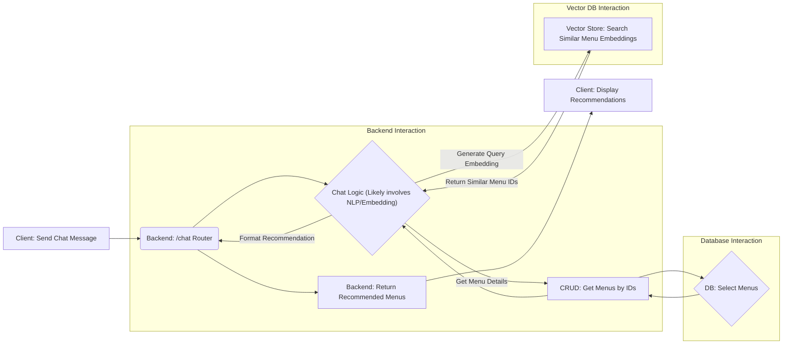

---

```mermaid
graph LR
    A["Client: Send Chat Message"] --> B("Backend: /chat Router");
    B --> C{"Chat Logic (Likely involves NLP/Embedding)"};
    C -- "Generate Query Embedding" --> D["Vector Store: Search Similar Menu Embeddings"];
    D -- "Return Similar Menu IDs" --> C;
    C -- "Get Menu Details" --> E["CRUD: Get Menus by IDs"];
    E --> F{"DB: Select Menus"};
    F --> E;
    E --> C;
    C -- "Format Recommendation" --> B;
    B --> G["Backend: Return Recommended Menus"];
    G --> H["Client: Display Recommendations"];

    subgraph "Backend Interaction"
        B; C; E; G;
    end
    subgraph "Database Interaction"
        F;
    end
    subgraph "Vector DB Interaction"
        D;
    end
```
