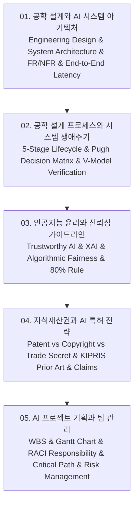

# 📚 AI 시스템 설계 및 개발 (AI System Design & Capstone Engineering) 전체 강의 로드맵

공학 설계의 기초 원리와 AI 시스템 계층 아키텍처(데이터 수집-특성공학-추론 엔진-API 서빙-모니터링), 기능적/비기능적 요구사항(FR vs NFR) 명세, 5단계 공학 설계 생애주기와 V-모델(V-Model) 검증 체계, 신뢰할 수 있는 AI 윤리 가이드라인 및 설명가능성(XAI)·공정성(Fairness), 지식재산권(IP)과 KIPRIS 선행기술조사 기반 AI 특허 청구항 전략, 그리고 WBS·간트 차트·RACI 매트릭스 기반 프로젝트 기획 및 리스크 관리까지 성공적인 AI 시스템 구축을 위한 공학 전 주기를 다룹니다.

---

## 🗺️ 강의 목차 (Curriculum Overview)

---

## 📑 개별 정리 문서 목록

1. [01. 공학 설계와 AI 시스템 아키텍처 - 공학 문제 정의, 시스템 요구사항 명세와 계층적 모듈 설계](file:///Users/um-yunsang/work/edu/ComputerScience/03_ai-ml-data/ai-system-design/notes/01.%20%EA%B3%B5%ED%95%99%20%EC%84%A4%EA%B3%84%EC%99%80%20AI%20%EC%8B%9C%EC%8A%A4%ED%85%9C%20%EC%95%84%ED%82%A4%ED%85%8D%EC%B2%98%20-%20%EA%B3%B5%ED%95%99%20%EB%AC%B8%EC%A0%9C%20%EC%A0%95%EC%9D%98,%20%EC%8B%9C%EC%8A%A4%ED%85%9C%20%EC%9 human%EA%B5%AC%EC%82%AC%ED%95%AD%20%EB%AA%85%EC%84%B8%EC%99%80%20%EA%B3%84%EC%B8%B5%EC%A0%81%20%EB%AA%A8%EB%93%88%20%EC%84%A4%EA%B3%84.md)
   - AI 시스템 3계층 아키텍처, 기능적/비기능적 요구사항, 실시간 E2E 지연 시간 & SLA 계산기
2. [02. 공학 설계 프로세스와 시스템 생애주기 - 개념 설계, 예비·상세 설계와 V-모델 검증 체계](file:///Users/um-yunsang/work/edu/ComputerScience/03_ai-ml-data/ai-system-design/notes/02.%20%EA%B3%B5%ED%95%99%20%EC%84%A4%EA%B3%84%20%ED%40%84%EB%A1%9C%EC%84%B8%EC%8A%A4%EC%99%80%20%EC%8B%9C%EC%8A%A4%ED%85%9C%20%EC%83%9D%EC%95%A0%EC%A3%BC%EA%B8%B0%20-%20%EA%B0%9C%EB%85%90%20%EC%84%A4%EA%B3%84,%20%EC%98%88%EB%B9%84%C2%B7%EC%83%81%EC%84%B8%20%EC%84%A4%EA%B3%84%EC%99%80%20V-%EB%AA%A8%EB%8D%B8%20%EA%B2%80%EC%A6%9D%20%EC%B2%B4%EA%B3%84.md)
   - 5단계 설계 프로세스, V-모델 테스트 매핑, 개념 설계 Pugh 대안 평가 매트릭스 시뮬레이터
3. [03. 인공지능 윤리와 신뢰성 가이드라인 - 설명가능성(XAI), 공정성·투명성 및 책임성 원칙](file:///Users/um-yunsang/work/edu/ComputerScience/03_ai-ml-data/ai-system-design/notes/03.%20%EC%9D%B8%EA%B3%B5%EC%A7%80%EB%8A%A5%20%EC%9C%A4%EB%A6%AC%EC%99%80%20%EC%8B%A0%EB%A2%B0%EC%84%B1%20%EA%B0%80%EC%9D%B4%EB%93%9C%EB%9D%BC%EC%9D%B8%20-%20%EC%84%A4%EB%AA%85%EA%B0%80%EB%8A%A5%EC%84%B1(XAI),%20%EA%B3%B5%EC%A0%95%EC%84%B1%C2%B7%ED%88%AC%EB%AA%85%EC%84%B1%20%EB%B0%8F%20%EC%B1%85%EC%9E%84%EC%84%B1%20%EC%9B%90%EC%B9%99.md)
   - Trustworthy AI 4대 축, 과기정통부/EU AI 윤리 표준, 알고리즘 공정성(Demographic Parity 80% 룰) 검사기
4. [04. 지식재산권과 AI 특허 전략 - 특허 요건(신규성·진보성), 선행기술조사(KIPRIS)와 권리 보호](file:///Users/um-yunsang/work/edu/ComputerScience/03_ai-ml-data/ai-system-design/notes/04.%20%EC%A7%80%EC%8B%9D%EC%9E%AC%EC%82%B0%EA%B5%8C%EA%B3%BC%20AI%20%ED%8A%B9%ED%97%88%20%EC%A0%84%EB%9E%B5%20-%20%ED%8A%B9%ED%97%88%20%EC%9A%94%EA%B1%B4(%EC%8B%A0%EA%B7%9C%EC%84%B1%C2%B7%EC%A7%84%EB%B3%B4%EC%84%B1),%20%EC%84%A0%ED%96%89%EA%B8%B0%EC%88%A0%EC%A1%B0%EC%82%AC(KIPRIS)%EC%99%80%20%EA%B6%8C%EB%A6%AC%20%EB%B3%B4%ED%98%B8.md)
   - 4대 지재권 및 저작권 비교, KIPRIS 불리언 검색, AI 특허 3대 요건 체크리스트 시뮬레이터
5. [05. AI 프로젝트 기획과 팀 관리 - WBS(작업분할구조도), 간트 차트 및 위험 관리(Risk Management)](file:///Users/um-yunsang/work/edu/ComputerScience/03_ai-ml-data/ai-system-design/notes/05.%20AI%20%ED%94%84%EB%A1%9C%EC%A0%9D%ED%8A%B8%20%EA%B8%B0%ED%9A%8D%EA%B3%BC%20%ED%8C%80%20%EA%B4%80%EB%A6%AC%20-%20WBS(%EC%9E%91%EC%97%85%EB%B6%84%ED%95%A0%EA%B5%AC%EC%A1%B0%EB%8F%84),%20%EA%B0%84%ED%8A%B8%20%EC%B0%A8%ED%8A%B8%20%EB%B0%8F%20%EC%9C%84%ED%97%98%20%EA%B4%80%EB%A6%AC(Risk%20Management).md)
   - 캡스톤 WBS 계층 구조, RACI 매트릭스, 임계 경로(Critical Path) 일정 계산기
