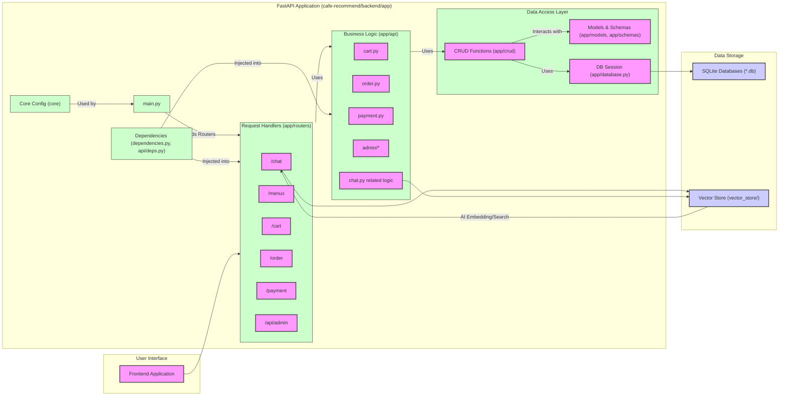

domain:: [[ComputerScience/03_ai-ml-data/AI ML 데이터 인터페이스|AI ML 데이터 인터페이스]]
stage:: [[ComputerScience/00_graph-interfaces/stages/5단계 통합 프로젝트 인터페이스|5단계 통합 프로젝트 인터페이스]]
module:: [[ComputerScience/00_graph-interfaces/courses/AI 시스템 설계 인터페이스|AI 시스템 설계 인터페이스]]
bridge:: [[ComputerScience/00_graph-interfaces/bridges/AI 구현 브리지|AI 구현 브리지]], [[ComputerScience/00_graph-interfaces/bridges/데이터 서비스 브리지|데이터 서비스 브리지]], [[ComputerScience/00_graph-interfaces/bridges/산출물 포트폴리오 브리지|산출물 포트폴리오 브리지]]
up:: [[ComputerScience/03_ai-ml-data/ai-system-design/3주차/3주차 발표자료|3주차 발표자료]]
prerequisites:: [[ComputerScience/03_ai-ml-data/artificial-intelligence/3. Backpropagation/이론/Backpropagation|Backpropagation]], [[ComputerScience/05_software-engineering/database-systems/7. 데이터베이스 언어 SQL/데이터 베이스 언어 SQL|데이터 베이스 언어 SQL]]
related:: [[ComputerScience/03_ai-ml-data/ai-system-design/아키텍쳐/주요 데이터 흐름/AI 메뉴 추천|AI 메뉴 추천]], [[ComputerScience/03_ai-ml-data/ai-system-design/아키텍쳐/주요 데이터 흐름/주문 생성|주문 생성]], [[ComputerScience/03_ai-ml-data/ai-system-design/아키텍쳐/주요 데이터 흐름/장바구니에 메뉴 추가|장바구니에 메뉴 추가]], [[ComputerScience/03_ai-ml-data/ai-system-design/스마트 오더 플랫폼 B2B 어드민 기능 제안|스마트 오더 플랫폼 B2B 어드민 기능 제안]], [[ComputerScience/03_ai-ml-data/ai-system-design/주문 및 결제 AI 시스템 개발|주문 및 결제 AI 시스템 개발]], [[ComputerScience/03_ai-ml-data/ai-system-design/ot/AI 시스템 아이디어 기획 요구사항 정의 발표 스크립트|AI 시스템 아이디어 기획 요구사항 정의 발표 스크립트]], [[ComputerScience/03_ai-ml-data/ai-system-design/아키텍쳐/주요 데이터 흐름/메뉴 조회|메뉴 조회]], [[ComputerScience/03_ai-ml-data/ai-system-design/3주차/AI 챗봇 특허 저작권 보호 전략 발표 스크립트|AI 챗봇 특허 저작권 보호 전략 발표 스크립트]], [[ComputerScience/03_ai-ml-data/big-data-analysis/md/아키텍처 다이어그램|아키텍처 다이어그램]], [[ComputerScience/03_ai-ml-data/big-data-analysis/md/K-POP 아티스트 인기도 분석 시스템|K-POP 아티스트 인기도 분석 시스템]], [[ComputerScience/03_ai-ml-data/artificial-intelligence/4. Optimization/실습/LearningRateControl|LearningRateControl]], [[ComputerScience/03_ai-ml-data/artificial-intelligence/2. MLP(Multi Layer Perceptron)/이론/MLP 이론|MLP 이론]], [[ComputerScience/03_ai-ml-data/artificial-intelligence/2. MLP(Multi Layer Perceptron)/실습/MLP (Multi Layer Perceptron)|MLP (Multi Layer Perceptron)]], [[ComputerScience/03_ai-ml-data/artificial-intelligence/3. Backpropagation/실습/Overfitting 해결/Data Augmentation|Data Augmentation]], [[ComputerScience/03_ai-ml-data/artificial-intelligence/5. CNN/실습/LeNet/LR control|LR control]], [[ComputerScience/03_ai-ml-data/artificial-intelligence/4. Optimization/실습/Momentum|Momentum]], [[ComputerScience/03_ai-ml-data/artificial-intelligence/5. CNN/실습/LeNet/pooling|pooling]], [[ComputerScience/03_ai-ml-data/artificial-intelligence/3. Backpropagation/실습/Vanishing Gradient 해결/활성화 함수 변경|활성화 함수 변경]], [[ComputerScience/03_ai-ml-data/artificial-intelligence/3. Backpropagation/실습/Overfitting 해결/Dropout|Dropout]], [[ComputerScience/03_ai-ml-data/artificial-intelligence/3. Backpropagation/실습/Overfitting 해결/Batch Normalization|Batch Normalization]], [[ComputerScience/03_ai-ml-data/artificial-intelligence/중간시험/CIFAR10 MLP 이미지 분류 중간 실습시험|CIFAR10 MLP 이미지 분류 중간 실습시험]], [[ComputerScience/03_ai-ml-data/artificial-intelligence/5. CNN/실습/LeNet/CNN 모듈|CNN 모듈]], [[ComputerScience/03_ai-ml-data/artificial-intelligence/3. Backpropagation/실습/CIFAR10/CIFAR10|CIFAR10]], [[ComputerScience/03_ai-ml-data/artificial-intelligence/2. MLP(Multi Layer Perceptron)/실습/SLP (Single Layer Perceptron)|SLP (Single Layer Perceptron)]], [[ComputerScience/03_ai-ml-data/large-language-models/검색 증강 생성 RAG/Vector store|Vector store]], [[ComputerScience/03_ai-ml-data/artificial-intelligence/5. CNN/실습/VGGNet/VGGCA|VGGCA]], [[ComputerScience/03_ai-ml-data/machine-learning/Linear_Regression/Linear Regression|Linear Regression]], [[ComputerScience/03_ai-ml-data/artificial-intelligence/기말시험/시험 예상 문제|시험 예상 문제]], [[ComputerScience/03_ai-ml-data/artificial-intelligence/5. CNN/실습/VGGNet/VGG|VGG]], [[ComputerScience/03_ai-ml-data/artificial-intelligence/5. CNN/실습/VGGNet/UMNet|UMNet]], [[ComputerScience/03_ai-ml-data/artificial-intelligence/5. CNN/실습/VGGNet/VGGDense|VGGDense]], [[ComputerScience/03_ai-ml-data/artificial-intelligence/5. CNN/실습/VGGNet/VGGskip|VGGskip]], [[ComputerScience/03_ai-ml-data/artificial-intelligence/4. Optimization/실습/Adam|Adam]], [[ComputerScience/03_ai-ml-data/artificial-intelligence/5. CNN/실습/ResNet/ResNet|ResNet]], [[ComputerScience/03_ai-ml-data/artificial-intelligence/1. Perceptron/이론/AND, NAND, OR 게이트|AND, NAND, OR 게이트]], [[ComputerScience/03_ai-ml-data/artificial-intelligence/1. Perceptron/실습/AND, NAND, OR 게이트 실습|AND, NAND, OR 게이트 실습]], [[ComputerScience/03_ai-ml-data/large-language-models/ChatGPT API/ChatGPT API|ChatGPT API]], [[ComputerScience/03_ai-ml-data/generative-ai-fine-tuning/Civitai LoRA 실내공간 스타일 생성 과제|Civitai LoRA 실내공간 스타일 생성 과제]], [[ComputerScience/03_ai-ml-data/neural-networks/AIE309_HW1_풀이|AIE309_HW1_풀이]], [[ComputerScience/03_ai-ml-data/large-language-models/ChatGPT API/openai API 활용|openai API 활용]], [[ComputerScience/05_software-engineering/database-systems/3. DB 시스템/DB 시스템|DB 시스템]], [[ComputerScience/03_ai-ml-data/large-language-models/ChatGPT API/Embedding|Embedding]], [[ComputerScience/05_software-engineering/database-systems/1. 기본 개념/기본 개념|기본 개념]], [[ComputerScience/05_software-engineering/database-systems/0. 시험/7장 문제|7장 문제]], [[ComputerScience/05_software-engineering/database-systems/2. 관리 시스템/관리 시스템|관리 시스템]], [[ComputerScience/05_software-engineering/database-systems/7. 데이터베이스 언어 SQL/뷰(view)|뷰(view)]], [[ComputerScience/05_software-engineering/database-systems/12. 데이터베이스 응용 기술/데이터베이스 응용 기술|데이터베이스 응용 기술]], [[ComputerScience/05_software-engineering/database-systems/13. 데이터 과학과 빅데이터/데이터 과학과 빅데이터|데이터 과학과 빅데이터]], [[ComputerScience/05_software-engineering/database-systems/0. 시험/기말시험 범위 및 연습문제|기말시험 범위 및 연습문제]], [[ComputerScience/05_software-engineering/database-systems/0. 시험/중간 주관식 예상(답)|중간 주관식 예상(답)]], [[ComputerScience/05_software-engineering/database-systems/11. 보안과 권한 관리/보안과 권한 관리|보안과 권한 관리]], [[ComputerScience/05_software-engineering/database-systems/0. 시험/레포트|레포트]], [[ComputerScience/05_software-engineering/database-systems/4. 데이터 모델링/데이터 모델링|데이터 모델링]], [[ComputerScience/05_software-engineering/database-systems/6. 관계 데이터 연산/관계 데이터 연산|관계 데이터 연산]], [[ComputerScience/05_software-engineering/database-systems/5. 관계 데이터 모델/관계 데이터 모델 (용어 암기)|관계 데이터 모델 (용어 암기)]], [[ComputerScience/05_software-engineering/database-systems/0. 시험/데이터베이스 연습문제|데이터베이스 연습문제]], [[ComputerScience/05_software-engineering/database-systems/9. 정규화/고급 정규형|고급 정규형]], [[ComputerScience/05_software-engineering/database-systems/0. 시험/중간 주관식 예상|중간 주관식 예상]], [[ComputerScience/05_software-engineering/database-systems/9. 정규화/정규화|정규화]], [[ComputerScience/05_software-engineering/database-systems/8. 데이터베이스 설계/데이터베이스 설계|데이터베이스 설계]], [[ComputerScience/05_software-engineering/database-systems/10. 회복과 병행제어/회복과 병행 제어|회복과 병행 제어]]

kg_profile:: [[ComputerScience/00_graph-interfaces/archive-kg/courses/AI 시스템 설계 지식그래프|AI 시스템 설계]]
kg_evidence:: [[ComputerScience/00_graph-interfaces/archive-kg/evidence/AI 시스템 설계 근거 인덱스|AI 시스템 설계 근거 인덱스]]
kg_concepts:: [[ComputerScience/00_graph-interfaces/archive-kg/concepts/ai-system-design/ai|ai]], [[ComputerScience/00_graph-interfaces/archive-kg/concepts/ai-system-design/cnn|cnn]], [[ComputerScience/00_graph-interfaces/archive-kg/concepts/ai-system-design/api|api]], [[ComputerScience/00_graph-interfaces/archive-kg/concepts/ai-system-design/cifar10|cifar10]], [[ComputerScience/00_graph-interfaces/archive-kg/concepts/ai-system-design/sql|sql]]
kg_query_mode:: [[ComputerScience/00_graph-interfaces/archive-kg/query-modes/Fact Retrieval|Fact Retrieval]], [[ComputerScience/00_graph-interfaces/archive-kg/query-modes/Complex Reasoning|Complex Reasoning]], [[ComputerScience/00_graph-interfaces/archive-kg/query-modes/Contextual Summarize|Contextual Summarize]]

---

