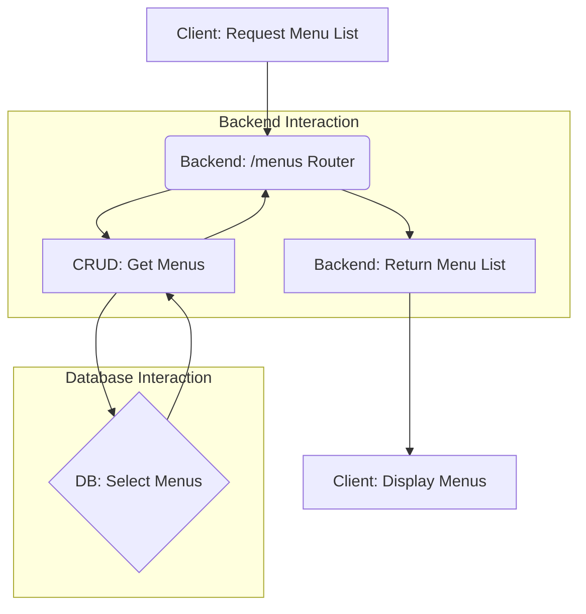

---

```mermaid
graph TD
    A["Client: Request Menu List"] --> B("Backend: /menus Router");
    B --> C["CRUD: Get Menus"];
    C --> D{"DB: Select Menus"};
    D --> C;
    C --> B;
    B --> E["Backend: Return Menu List"];
    E --> F["Client: Display Menus"];

    subgraph "Backend Interaction"
        B; C; E;
    end
    subgraph "Database Interaction"
        D;
    end
```
