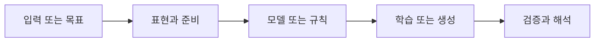

> [!abstract] 핵심
> 이미지 기반 아바타 생성 실습은 원하는 요소, 제외할 요소, 장르와 생성 조건을 분리해 프롬프트를 설계하는 과정이다.

## 문제를 학습 흐름으로 바꾸기

실습은 생성하고 싶은 이미지의 묘사와 제외하고 싶은 내용의 묘사를 나누어 사용한다. 이미지 장르를 고르고, 사용자의 요구를 따르는 정도와 연산 횟수 같은 생성 조건을 조절한다. 조건은 결과의 내용·스타일·화질에 서로 다른 방식으로 영향을 줄 수 있다.



| 관점 | 확인할 질문 | 학습할 때의 점검 |
| --- | --- | --- |
| 원하는 묘사 | 포함할 대상·품질·스타일 | 목표를 구체적인 요소로 나눈다 |
| 제외 묘사 | 피하고 싶은 속성 | 원하는 묘사와 분리해 기록한다 |
| 생성 조건 | 요구 반영도와 연산 횟수 | 변경 전후 결과를 비교한다 |

> [!note] 흐름
> 목표 인물과 장르를 짧은 핵심 요소로 정리한 뒤, 제외할 요소를 별도로 적는다. 생성 조건은 한 번에 하나만 조정하고, 결과를 기준에 맞춰 비교한 뒤 다음 프롬프트에 반영한다.

```html preview h=170
<div style="font-family:system-ui,sans-serif;padding:16px;border:1px solid var(--border);background:var(--card);color:var(--foreground);border-radius:var(--radius)">
  <div style="font-weight:700;margin-bottom:10px">01. AI 아바타 만들기 실습 · 점검 흐름</div>
  <div style="display:grid;grid-template-columns:repeat(4,minmax(0,1fr));gap:8px">
    <div style="padding:9px;border:1px solid var(--border);border-radius:var(--radius)">입력</div>
    <div style="padding:9px;border:1px solid var(--border);border-radius:var(--radius)">준비</div>
    <div style="padding:9px;border:1px solid var(--border);border-radius:var(--radius)">실행</div>
    <div style="padding:9px;border:1px solid var(--border);border-radius:var(--radius)">점검</div>
  </div>
</div>
```

## 관점을 나누어 보기

<Tabs>
<Tab label="개념">

프롬프트는 원하는 요소를 적는 문장만이 아니라 제외 조건과 장르 선택을 포함한 입력 설계다.

</Tab>
<Tab label="실행">

처음 결과를 기준으로 문구 또는 조건 하나를 수정한다. 여러 조건을 같이 바꾸면 어떤 변화가 효과를 냈는지 알기 어렵다.

</Tab>
<Tab label="검증">

결과 평가는 목표 요소가 포함됐는지, 제외 요소가 나타나지 않았는지, 품질이 충분한지로 나누어 기록한다.

</Tab>
</Tabs>

<details>
<summary>복습 질문</summary>

원하는 묘사와 제외 묘사를 분리하면 어떤 비교가 쉬워지는가? 생성 조건을 한 항목씩 조절해야 하는 이유는 무엇인가?

</details>

> [!tip] 학습 전략
> 목표, 입력, 평가 기준을 한 문장으로 연결해 본다. 한 번에 여러 조건을 바꾸지 말고 결과 변화의 원인을 기록한다.
> [!warning] 해석 주의
> 생성 결과가 프롬프트를 따르는 정도와 출력 품질은 같은 척도가 아니다. 두 기준을 분리해 평가한다.
