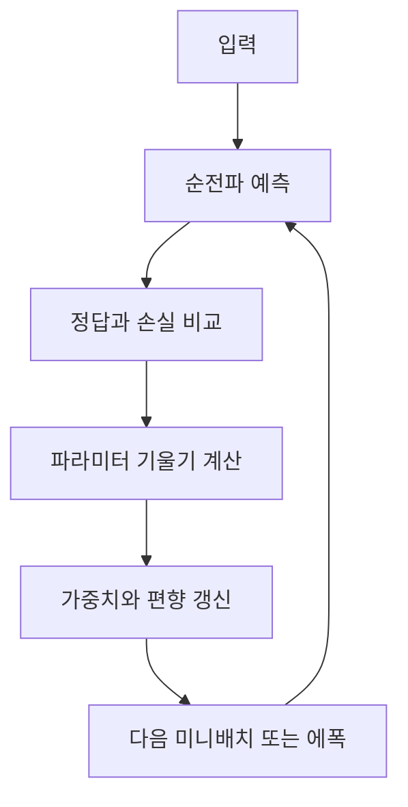

# Backpropagation의 가중치 갱신

> [!abstract] 핵심
> 역전파는 계산 결과와 정답의 오차를 이용해 가중치와 편향을 오차가 작아지는 방향으로 반복 수정하는 기법이다. 갱신은 미니배치 또는 에폭 단위로 수행될 수 있다.

## 손실을 줄이는 한 번의 갱신

경사 하강법은 현재 파라미터에서 기울기의 반대 방향으로 이동한다. 학습률 $\mu$를 사용하면 $w_{t+1}\leftarrow w_t-\mu\nabla f(w_t)$로 표현할 수 있다.



| 항목 | 역할 | 확인할 점 |
| --- | --- | --- |
| 가중치와 편향 | 학습 가능한 파라미터 | 갱신 대상인지 확인 |
| 손실 | 예측과 정답의 차이 | 최소화 대상 |
| 기울기 | 손실이 커지는 방향 | 반대 방향으로 이동 |
| 학습률 | 이동 크기 | 갱신 폭 조절 |

> [!note] 갱신 단위
> 역전파 과정에서 파라미터는 매 미니배치나 에폭마다 갱신할 수 있다. 어느 단위를 선택했는지 기록해야 학습 반복을 해석할 수 있다.

```html preview h=170
<div style="font-family:system-ui,sans-serif;padding:16px;border:1px solid var(--border);background:var(--card);color:var(--foreground)">
  <div style="display:grid;grid-template-columns:repeat(3,minmax(0,1fr));gap:8px;text-align:center">
    <div style="padding:10px;border:1px solid var(--border)">손실</div>
    <div style="padding:10px;border:1px solid var(--border)">기울기</div>
    <div style="padding:10px;border:1px solid var(--border)">갱신</div>
  </div>
  <div style="margin-top:10px;color:var(--muted-foreground)">한 번의 갱신이 다음 순전파의 파라미터를 바꾼다.</div>
</div>
```

<Tabs>
<Tab label="손실 계산">
현재 예측과 정답을 비교해 수정해야 할 정도를 계산한다.
</Tab>
<Tab label="기울기 계산">
각 가중치와 편향이 손실에 미치는 영향을 미분으로 구한다.
</Tab>
<Tab label="파라미터 갱신">
학습률을 반영해 기울기의 반대 방향으로 파라미터를 수정한다.
</Tab>
</Tabs>

<details>
<summary>학습 반복의 기록 항목</summary>

- 현재 에폭 또는 미니배치
- 사용한 학습률
- 손실의 변화
- 갱신 전후 파라미터 상태
</details>

> [!tip] 손실과 갱신을 함께 보기
> 손실 수치만 보지 말고 갱신 단위와 학습률을 함께 기록하면 결과 변화의 원인을 더 잘 추적할 수 있다.

> [!warning] 학습률의 영향
> 학습률은 갱신 크기를 정한다. 큰 값과 작은 값이 각각 어떤 학습 궤적을 만드는지 확인하지 않고 하나의 값만으로 결론 내리지 않는다.
