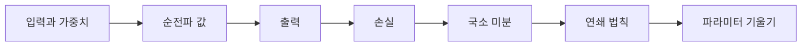

# Backpropagation의 연쇄 법칙

> [!abstract] 핵심
> 역전파는 순전파로 얻은 출력과 정답의 오차를 출발점으로 삼아, 오차에 관여한 노드와 파라미터의 미분을 뒤쪽에서 앞쪽으로 계산한다. 연쇄 법칙은 이 연결을 만드는 규칙이다.

## 손실에서 파라미터까지

한 노드의 출력이 $q=\sigma(W^Tx+b)$이고 손실이 $L$일 때, 파라미터 변화의 영향은 중간값을 거쳐 전달된다. 예를 들어 $\frac{\partial L}{\partial w}=\frac{\partial L}{\partial q}\frac{\partial q}{\partial w}$처럼 나눠 계산할 수 있다.



| 계산 대상 | 의미 | 다음 단계 |
| --- | --- | --- |
| 순전파 값 | 가중합과 활성화 결과 | 출력 생성 |
| 손실 | 예측과 정답의 차이 | 미분의 시작점 |
| 국소 미분 | 한 연산이 결과에 미치는 변화 | 이전 노드로 전달 |
| 파라미터 기울기 | 가중치와 편향의 변화량 | 갱신에 사용 |

> [!note] 계산 방향
> 값 자체는 입력층에서 출력층으로 계산하고, 손실의 미분은 출력 쪽에서 이전 층으로 전달한다. 두 방향을 구분하면 역전파 식을 읽기 쉬워진다.

```html preview h=170
<div style="font-family:system-ui,sans-serif;padding:16px;border:1px solid var(--border);background:var(--card);color:var(--foreground)">
  <div style="font-weight:700;margin-bottom:10px">연쇄 법칙의 연결</div>
  <div style="display:flex;gap:8px;align-items:center;flex-wrap:wrap">
    <span style="padding:8px;border:1px solid var(--border)">손실</span>
    <span aria-hidden="true">×</span>
    <span style="padding:8px;border:1px solid var(--border)">중간값의 미분</span>
    <span aria-hidden="true">×</span>
    <span style="padding:8px;border:1px solid var(--border)">파라미터의 미분</span>
  </div>
</div>
```

<Tabs>
<Tab label="순전파">
입력, 가중치, 편향, 활성화 함수를 이용해 각 층의 값을 계산한다.
</Tab>
<Tab label="연쇄 법칙">
손실과 중간값 사이의 의존 관계를 미분의 곱으로 분해한다.
</Tab>
<Tab label="역전파">
출력에 가까운 미분 결과를 앞선 층의 파라미터 기울기로 계속 전달한다.
</Tab>
</Tabs>

<details>
<summary>연쇄 법칙 점검 질문</summary>

- 어떤 값이 다른 값에 의존하는가?
- 손실에서 바로 구할 수 있는 미분은 무엇인가?
- 한 층의 미분이 이전 층의 미분 계산에 어떻게 사용되는가?
</details>

> [!tip] 중간 변수를 적기
> 가중합과 활성화 결과에 별도의 기호를 붙이면, 미분 경로를 생략하지 않고 확인할 수 있다.

> [!warning] 방향 혼동 방지
> 연쇄 법칙은 미분을 뒤로 전달하지만, 실제 입력값과 출력값을 만드는 순전파 계산을 대체하지는 않는다.
