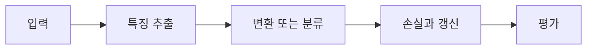

> [!abstract] 핵심
> CIFAR-10 분류 실습은 RGB 이미지 10개 범주를 대상으로 모델 규모와 학습 조건을 정하고 정확도를 측정하는 흐름이다.

## 구조와 학습의 연결

CIFAR-10은 $32\times32\times3$ RGB 이미지 10개 범주로 구성되며, 학습 50,000개와 테스트 10,000개가 제시된다. 실습 조건에는 배치 크기 약 200, 학습률 약 0.1과 감소, ReLU, Cross Entropy, 약 500개 노드와 6개 층, 20 epoch, batch normalization, dropout, 초기화, SGD가 포함된다.



| 요소 | 역할 | 확인 |
| --- | --- | --- |
| 입력 | RGB 32×32 이미지 | 입력 형태와 정규화를 맞춘다 |
| 출력 | 10개 클래스 점수 | 라벨·Cross Entropy 형식을 맞춘다 |
| 학습 | 배치·학습률·epoch | 감소 규칙과 최적화를 기록한다 |

> [!note] 실행 흐름
> 입력 형상과 라벨을 확인한 뒤 모델의 층·노드·정규화 설정을 정한다. 정확도는 학습과 테스트를 구분해 측정하고, 변경한 조건을 함께 기록한다.

```html preview h=165
<div style="font-family:system-ui,sans-serif;padding:16px;border:1px solid var(--border);background:var(--card);color:var(--foreground);border-radius:var(--radius)">
  <div style="font-weight:700;margin-bottom:10px">01. CIFAR-10 분류 실습 · 설계 점검</div>
  <div style="display:grid;grid-template-columns:repeat(4,minmax(0,1fr));gap:8px">
    <div style="padding:9px;border:1px solid var(--border);border-radius:var(--radius)">입력</div>
    <div style="padding:9px;border:1px solid var(--border);border-radius:var(--radius)">층</div>
    <div style="padding:9px;border:1px solid var(--border);border-radius:var(--radius)">손실</div>
    <div style="padding:9px;border:1px solid var(--border);border-radius:var(--radius)">검증</div>
  </div>
</div>
```

## 세 관점

<Tabs>
<Tab label="개념">

분류 모델은 각 이미지에 대해 10개 범주 점수를 만든다. 입력 형상은 첫 층의 크기를 결정한다.

</Tab>
<Tab label="구현">

Batch normalization, dropout, 초기화, 최적화는 서로 다른 단계에서 학습 안정성과 일반화에 영향을 준다.

</Tab>
<Tab label="검증">

정확도 하나만 보지 말고 학습률 감소 시점, 손실, 테스트 정확도를 같은 실험 조건에서 비교한다.

</Tab>
</Tabs>

<details>
<summary>복습 질문</summary>

학습 50,000개와 테스트 10,000개의 역할은 어떻게 다른가? 학습률 감소 규칙을 기록해야 하는 이유는 무엇인가?

</details>

> [!tip] 학습 전략
> 텐서의 모양, 파라미터 선택, 평가 기준을 함께 기록한다. 한 번에 하나의 설정만 바꾸어 변화의 원인을 분리한다.
> [!warning] 해석 주의
> 모델의 노드 수와 층 수를 늘려 학습 정확도가 올라도 테스트 성능이 함께 오르는지 별도로 확인한다.
