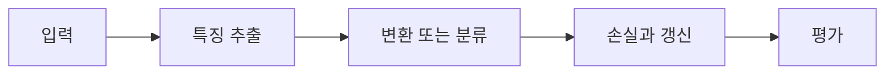

> [!abstract] 핵심
> AlexNet 사례는 활성화·풀링·dropout·데이터 증식 같은 모듈을 결합해 이미지 분류의 표현과 일반화 문제를 함께 다룬다.

## 구조와 학습의 연결

ReLU는 합성곱·완전연결 계산 뒤의 활성화로 사용되고, overlapping pooling은 특징맵의 공간 크기를 줄인다. Dropout과 데이터 증식은 과적합을 줄이기 위한 구성으로 제시된다. 역전파 학습에서는 이 모든 층을 지나 손실의 변화가 파라미터로 전달된다.



| 요소 | 역할 | 확인 |
| --- | --- | --- |
| ReLU | 비선형 활성화 | 순전파 출력과 역전파 기울기를 확인한다 |
| pooling | 공간 축소 | 선택·집계 규칙을 기록한다 |
| dropout·증식 | 일반화 보조 | 훈련과 평가의 적용 조건을 구분한다 |

> [!note] 실행 흐름
> 순전파에서 각 모듈의 입출력 모양을 확인하고, 손실에서 시작한 그래디언트가 합성곱·활성화·풀링을 통과할 수 있도록 각 단계의 저장값을 관리한다.

```html preview h=165
<div style="font-family:system-ui,sans-serif;padding:16px;border:1px solid var(--border);background:var(--card);color:var(--foreground);border-radius:var(--radius)">
  <div style="font-weight:700;margin-bottom:10px">01. CNN Backpropagation - AlexNet 정규화 · 설계 점검</div>
  <div style="display:grid;grid-template-columns:repeat(4,minmax(0,1fr));gap:8px">
    <div style="padding:9px;border:1px solid var(--border);border-radius:var(--radius)">입력</div>
    <div style="padding:9px;border:1px solid var(--border);border-radius:var(--radius)">층</div>
    <div style="padding:9px;border:1px solid var(--border);border-radius:var(--radius)">손실</div>
    <div style="padding:9px;border:1px solid var(--border);border-radius:var(--radius)">검증</div>
  </div>
</div>
```

## 세 관점

<Tabs>
<Tab label="개념">

이미지 모델의 학습은 합성곱만의 문제가 아니다. 활성화·pooling·regularization이 함께 순전파와 역전파 경로를 만든다.

</Tab>
<Tab label="구현">

훈련 중에는 loss에서 시작한 변화량이 각 계층의 파라미터로 이어진다. 모듈마다 입력·출력·기울기 모양을 기록한다.

</Tab>
<Tab label="검증">

dropout과 증식은 검증 성능을 개선하는지로 확인한다. 데이터·학습률 같은 다른 조건을 고정해야 비교가 가능하다.

</Tab>
</Tabs>

<details>
<summary>복습 질문</summary>

pooling과 dropout은 순전파에서 어떤 식으로 다르게 동작하는가? 역전파를 위해 각 층의 어떤 정보를 보존해야 하는가?

</details>

> [!tip] 학습 전략
> 텐서의 모양, 파라미터 선택, 평가 기준을 함께 기록한다. 한 번에 하나의 설정만 바꾸어 변화의 원인을 분리한다.
> [!warning] 해석 주의
> 과적합 완화 모듈을 추가해도 데이터 분할이나 평가 절차가 바뀌면 효과를 공정하게 비교할 수 없다.
