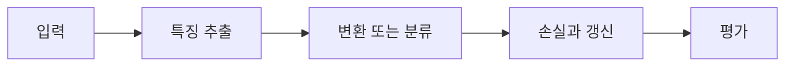

> [!abstract] 핵심
> CNN 분류 실습은 합성곱·풀링으로 특징맵을 만들고, 이를 평탄화해 완전연결 층에서 범주를 예측하는 흐름을 다룬다.

## 구조와 학습의 연결

CNN 분류 모델은 합성곱과 풀링을 거친 특징맵을 평탄화한 뒤 완전연결 층에 전달할 수 있다. 실습은 LeNet-5 구조를 중심으로 층마다 입력·출력 형태가 어떻게 바뀌는지 확인하게 한다.



| 요소 | 역할 | 확인 |
| --- | --- | --- |
| 합성곱 | 지역 특징 추출 | 채널·커널·출력 크기를 확인한다 |
| 풀링 | 특징맵의 공간 크기 조절 | stride와 출력 크기를 계산한다 |
| 평탄화 | 특징맵을 벡터화 | FC 층 입력 차원과 맞춘다 |

> [!note] 실행 흐름
> 합성곱·풀링 뒤의 공간 크기와 채널 수를 계산하고, 평탄화한 차원이 첫 완전연결 층 입력과 맞는지 확인한다. 학습 뒤에는 예측 범주와 정답을 비교한다.

```html preview h=165
<div style="font-family:system-ui,sans-serif;padding:16px;border:1px solid var(--border);background:var(--card);color:var(--foreground);border-radius:var(--radius)">
  <div style="font-weight:700;margin-bottom:10px">01. CNN 분류 실습 · 설계 점검</div>
  <div style="display:grid;grid-template-columns:repeat(4,minmax(0,1fr));gap:8px">
    <div style="padding:9px;border:1px solid var(--border);border-radius:var(--radius)">입력</div>
    <div style="padding:9px;border:1px solid var(--border);border-radius:var(--radius)">층</div>
    <div style="padding:9px;border:1px solid var(--border);border-radius:var(--radius)">손실</div>
    <div style="padding:9px;border:1px solid var(--border);border-radius:var(--radius)">검증</div>
  </div>
</div>
```

## 세 관점

<Tabs>
<Tab label="개념">

CNN은 이미지의 공간적 구조를 유지하며 특징을 추출한다. 완전연결 층은 마지막 특징 표현으로 범주 점수를 만든다.

</Tab>
<Tab label="구현">

각 층 뒤 텐서 모양을 표로 적는다. 평탄화 이전의 채널·높이·너비가 FC 입력 수를 결정한다.

</Tab>
<Tab label="검증">

모델이 실행된다고 해서 텐서 모양이 의도와 맞는 것은 아니다. 층별 출력과 정확도를 함께 점검한다.

</Tab>
</Tabs>

<details>
<summary>복습 질문</summary>

풀링 뒤 텐서 모양이 왜 다음 합성곱·FC 층의 파라미터 수에 영향을 주는가? 평탄화 시점은 어떤 역할을 하는가?

</details>

> [!tip] 학습 전략
> 텐서의 모양, 파라미터 선택, 평가 기준을 함께 기록한다. 한 번에 하나의 설정만 바꾸어 변화의 원인을 분리한다.
> [!warning] 해석 주의
> 평탄화는 공간 정보를 더 이상 직접 보존하지 않는다. 그 전에 어떤 특징을 추출했는지가 분류 품질에 중요하다.
