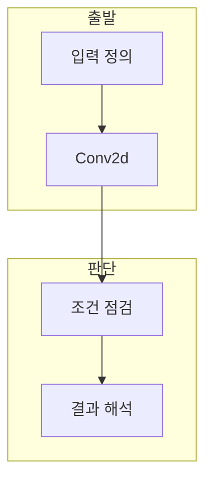

> [!abstract] 한 줄 요약
> CNN 설계 모듈 실습 - Conv2d 매개변수은 합성곱 출력 형상를 학습 과정의 입력, 계산, 검증 관점으로 구분해 이해하는 노트다.

## 이 노트의 지도



## 1. 합성곱 출력 형상의 역할

강의 주제는 모델이 처리할 입력과 중간 표현을 연결해 합성곱 출력 형상의 역할을 설명한다. ==Conv2d== 는 커널·stride·padding을 갖는 합성곱 연산.

> [!important] 판단의 출발점
> 목적·입력·정답 또는 평가 기준을 함께 적어야 같은 용어를 다른 문제에 잘못 적용하지 않는다.

## 2. 학습과 검증의 연결

계산 단계의 값은 단독 결론이 아니라 모델 설정과 평가 절차 안에서 해석한다.

$$
H_{out}=\left\lfloor\frac{H+2P-K}{S}\right\rfloor+1
$$

<details>
<summary>확인 순서</summary>

입력 형상 또는 조건을 확인하고, 계산 결과를 기록한 뒤 정답·손실·평가 기준 중 해당하는 기준으로 해석한다.

</details>

## 데이터로 보기

```html preview
<div style="font-family:system-ui,sans-serif;padding:20px;color:var(--foreground)">
  <label for="amt" style="font-size:14px;font-weight:600">Conv2d 단계</label>
  <div id="out" style="font-size:30px;font-weight:700;color:var(--chart-1);margin:6px 0">3</div>
  <input id="amt" type="range" min="1" max="10" step="1" value="3"
    style="width:100%;accent-color:var(--primary)" />
  <p style="font-size:13px;color:var(--muted-foreground)">값을 바꾸며 갱신·반복·깊이 같은 설정이 결과와 연결됨을 생각한다.</p>
  <script>
    var amt = document.getElementById('amt');
    var out = document.getElementById('out');
    amt.addEventListener('input', function () {
      out.textContent = Number(amt.value).toLocaleString();
    });
  </script>
</div>
```

> [!warning] 과해석의 한계
> 단일 예시나 설정 하나만으로 모델의 일반 성능을 단정하지 않는다.

## 핵심 정리

| 개념 | 정의 | 학습 판단 |
| :-- | :-- | :-- |
| Conv2d | 커널·stride·padding을 갖는 합성곱 연산 | 핵심 역할을 구분한다 |
| Conv2d | 학습 과정의 계산 단계 | 설정과 갱신을 확인한다 |
| 결과 해석 | 결과를 확인하는 단계 | 조건부로 해석한다 |

## 관련 개념

- 모델의 손실과 최적화는 학습 갱신과 연결된다.
- 일반화 평가는 학습 결과와 별도로 확인한다.

> [!question]- 스스로 점검
> **Q.** Conv2d을 결과 수치만으로 판단하면 안 되는 이유는 무엇인가?
>
> **A.** 입력, 모델 설정, 손실 또는 평가 기준이 함께 결과를 결정하기 때문이다.
