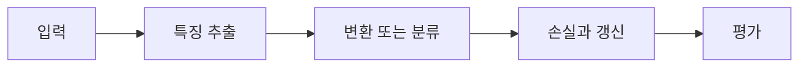

> [!abstract] 핵심
> 합성곱 계층 구현에서는 입력 채널, 출력 채널, 커널 크기 같은 매개변수가 특징맵의 형태와 모델 용량을 결정한다.

## 구조와 학습의 연결

Conv2d 계층은 입력 특징맵 채널 수, 출력 특징맵 채널 수, kernel size 등을 지정해 합성곱을 구현한다. VGG 계열의 간소화된 실습 구조에서도 작은 커널의 반복, pooling, 채널 증가가 층의 흐름을 만든다.



| 요소 | 역할 | 확인 |
| --- | --- | --- |
| in_channels | 입력 특징맵 채널 | 이전 층 출력과 맞춘다 |
| out_channels | 새 특징맵 개수 | 다음 층 입력과 연결한다 |
| kernel_size | 지역 창의 크기 | 출력 공간 크기를 계산한다 |

> [!note] 실행 흐름
> 입력 채널과 Conv2d의 첫 인자가 맞는지 확인하고, 각 층의 출력 채널을 다음 층 입력으로 전달한다. 커널·stride·padding을 바꾼 뒤 출력 높이·너비를 계산해 본다.

```html preview h=165
<div style="font-family:system-ui,sans-serif;padding:16px;border:1px solid var(--border);background:var(--card);color:var(--foreground);border-radius:var(--radius)">
  <div style="font-weight:700;margin-bottom:10px">01. CNN 설계 모듈 실습 - Conv2d 매개변수 · 설계 점검</div>
  <div style="display:grid;grid-template-columns:repeat(4,minmax(0,1fr));gap:8px">
    <div style="padding:9px;border:1px solid var(--border);border-radius:var(--radius)">입력</div>
    <div style="padding:9px;border:1px solid var(--border);border-radius:var(--radius)">층</div>
    <div style="padding:9px;border:1px solid var(--border);border-radius:var(--radius)">손실</div>
    <div style="padding:9px;border:1px solid var(--border);border-radius:var(--radius)">검증</div>
  </div>
</div>
```

## 세 관점

<Tabs>
<Tab label="개념">

Conv2d의 매개변수는 API 인자 목록이 아니라 텐서 계약이다. 한 층의 출력 채널은 다음 층의 입력 채널이 된다.

</Tab>
<Tab label="구현">

각 층 정의 뒤 실제 출력 모양을 출력해 계산과 비교한다. channel·height·width를 모두 기록한다.

</Tab>
<Tab label="검증">

구조를 간소화한 모델과 더 깊은 모델을 비교할 때는 정확도뿐 아니라 연산 시간과 파라미터 수도 확인한다.

</Tab>
</Tabs>

<details>
<summary>복습 질문</summary>

한 합성곱 층의 출력 채널이 다음 합성곱 층에서 어떤 값이 되는가? kernel size를 바꾸면 무엇을 다시 계산해야 하는가?

</details>

> [!tip] 학습 전략
> 텐서의 모양, 파라미터 선택, 평가 기준을 함께 기록한다. 한 번에 하나의 설정만 바꾸어 변화의 원인을 분리한다.
> [!warning] 해석 주의
> 코드가 실행돼도 채널 순서나 출력 모양이 의도와 맞았다는 보장은 없다. 층별 텐서를 확인한다.
