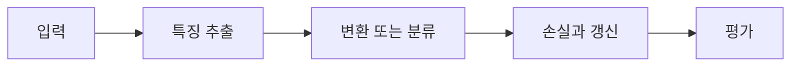

> [!abstract] 핵심
> Skip connection, Dense connection, Channel attention은 CNN의 정보 전달 방식을 바꾸는 주요 설계 모듈이며, 간소화된 VGG 계열 구조에서 실습할 수 있다.

## 구조와 학습의 연결

Skip connection은 앞선 표현을 뒤 층으로 건너뛰어 전달하고, Dense connection은 여러 앞선 표현을 연결한다. Channel attention은 채널별 중요도를 다루는 모듈로 제시된다. 실습에서는 계산량을 줄인 VGG 계열 구조를 사용해 이러한 설계 선택을 비교한다.



| 요소 | 역할 | 확인 |
| --- | --- | --- |
| Skip connection | 앞선 표현을 건너뛰어 전달 | 더하기가 가능한 모양인지 확인한다 |
| Dense connection | 여러 앞선 표현을 연결 | 채널 수 증가를 추적한다 |
| Channel attention | 채널별 중요도 조절 | 채널 가중치의 적용 위치를 본다 |

> [!note] 실행 흐름
> 기본 CNN의 출력 모양을 기준으로 연결 모듈을 하나 추가한다. 연결 전후의 채널 수·메모리·손실 변화를 기록하고, 입력을 직접 더하는지 이어 붙이는지 구분한다.

```html preview h=165
<div style="font-family:system-ui,sans-serif;padding:16px;border:1px solid var(--border);background:var(--card);color:var(--foreground);border-radius:var(--radius)">
  <div style="font-weight:700;margin-bottom:10px">01. CNN 설계 모듈 실습 - 연결 구조 · 설계 점검</div>
  <div style="display:grid;grid-template-columns:repeat(4,minmax(0,1fr));gap:8px">
    <div style="padding:9px;border:1px solid var(--border);border-radius:var(--radius)">입력</div>
    <div style="padding:9px;border:1px solid var(--border);border-radius:var(--radius)">층</div>
    <div style="padding:9px;border:1px solid var(--border);border-radius:var(--radius)">손실</div>
    <div style="padding:9px;border:1px solid var(--border);border-radius:var(--radius)">검증</div>
  </div>
</div>
```

## 세 관점

<Tabs>
<Tab label="개념">

연결 모듈은 단순히 층을 더 깊게 만드는 것이 아니라 정보가 흐르는 경로를 바꾸는 선택이다.

</Tab>
<Tab label="구현">

실습에서는 기준 모델을 먼저 만들고 한 모듈만 추가한다. 출력 모양과 연결 방식의 조건을 코드에서 확인한다.

</Tab>
<Tab label="검증">

정확도만이 아니라 파라미터 수·메모리·학습 안정성도 비교한다. 같은 데이터 분할을 유지한다.

</Tab>
</Tabs>

<details>
<summary>복습 질문</summary>

skip 연결의 더하기와 dense 연결의 이어 붙이기는 채널 수에 어떤 차이를 만드는가? 기준 모델이 필요한 이유는 무엇인가?

</details>

> [!tip] 학습 전략
> 텐서의 모양, 파라미터 선택, 평가 기준을 함께 기록한다. 한 번에 하나의 설정만 바꾸어 변화의 원인을 분리한다.
> [!warning] 해석 주의
> 연결 모듈을 여러 개 한꺼번에 바꾸면 성능 변화가 어느 모듈에서 온 것인지 분리하기 어렵다.
