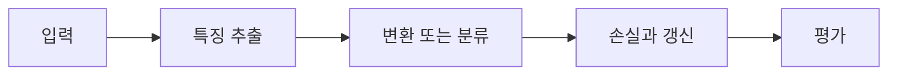

> [!abstract] 핵심
> RGB 같은 3차원 이미지에 대한 합성곱은 입력 채널 전체를 덮는 필터로 여러 활성화 맵을 만들며, 필터 수는 출력 특징의 폭을 정한다.

## 구조와 학습의 연결

3D 이미지 입력에서 2D convolution의 필터는 공간 크기와 입력 채널 깊이를 함께 가진다. 각 필터는 하나의 activation map을 만들고, 여러 필터는 여러 activation map을 만든다. 각 위치의 출력은 가중합과 편향 뒤 활성화로 계산된다.



| 요소 | 역할 | 확인 |
| --- | --- | --- |
| 3D 입력 | 공간×채널 | RGB면 채널 축을 포함한다 |
| 필터 | 공간×입력 채널 | 입력 깊이를 모두 덮는다 |
| activation map | 필터 하나의 출력 | 여러 필터가 여러 채널을 만든다 |

> [!note] 실행 흐름
> 입력·필터·출력의 세 차원을 모두 적은 뒤, 필터 수와 출력 채널의 관계를 확인한다. 여러 필터가 서로 다른 특징을 포착하도록 학습되는지 손실과 성능으로 평가한다.

```html preview h=165
<div style="font-family:system-ui,sans-serif;padding:16px;border:1px solid var(--border);background:var(--card);color:var(--foreground);border-radius:var(--radius)">
  <div style="font-weight:700;margin-bottom:10px">01. CNN 주요 설계 모듈 이론 · 설계 점검</div>
  <div style="display:grid;grid-template-columns:repeat(4,minmax(0,1fr));gap:8px">
    <div style="padding:9px;border:1px solid var(--border);border-radius:var(--radius)">입력</div>
    <div style="padding:9px;border:1px solid var(--border);border-radius:var(--radius)">층</div>
    <div style="padding:9px;border:1px solid var(--border);border-radius:var(--radius)">손실</div>
    <div style="padding:9px;border:1px solid var(--border);border-radius:var(--radius)">검증</div>
  </div>
</div>
```

## 세 관점

<Tabs>
<Tab label="개념">

필터는 공간 위치뿐 아니라 입력 채널을 함께 본다. 따라서 RGB의 색상 정보도 같은 합성곱 계산에 포함된다.

</Tab>
<Tab label="구현">

필터의 개수·크기·stride·padding을 지정하고 출력 모양을 계산한다. 각 값이 어떤 축을 바꾸는지 구분한다.

</Tab>
<Tab label="검증">

필터가 많아진 결과는 용량과 연산량의 변화다. 실제 성능은 검증 데이터에서 확인한다.

</Tab>
</Tabs>

<details>
<summary>복습 질문</summary>

필터 하나가 activation map 하나를 만든다는 말은 출력 채널과 어떻게 연결되는가? 입력의 채널 축을 빼면 어떤 계산이 사라지는가?

</details>

> [!tip] 학습 전략
> 텐서의 모양, 파라미터 선택, 평가 기준을 함께 기록한다. 한 번에 하나의 설정만 바꾸어 변화의 원인을 분리한다.
> [!warning] 해석 주의
> 필터 수를 무조건 늘리면 모델 용량과 계산량이 늘어난다. 검증 성능의 개선 없이 복잡도만 커질 수 있다.
