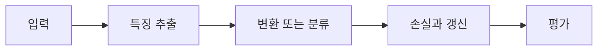

> [!abstract] 핵심
> 3차원 RGB 입력에서 2차원 합성곱은 채널을 포함하는 필터로 특징맵을 만들며, 필터 수가 출력 채널 수를 결정한다.

## 구조와 학습의 연결

RGB 이미지는 높이·너비·3개 채널을 가진다. 2D convolution은 입력의 모든 채널을 덮는 필터를 사용해 한 장의 활성화 맵을 만들고, 여러 필터를 쓰면 여러 출력 채널이 생긴다. 각 위치의 값은 $Wx+b$ 뒤 활성화를 적용하는 방식으로 표현할 수 있다.



| 요소 | 역할 | 확인 |
| --- | --- | --- |
| 입력 | 높이×너비×채널 | RGB면 채널이 3개다 |
| 필터 | 공간 크기×입력 채널 | 깊이가 입력 채널과 같아야 한다 |
| 출력 | 공간 크기×필터 수 | 필터 수가 출력 채널을 만든다 |

> [!note] 실행 흐름
> 입력의 공간 크기와 채널 수를 적고, 필터의 높이·너비·깊이가 입력과 맞는지 확인한다. 필터 개수와 stride·padding을 이용해 출력 채널과 공간 크기를 계산한다.

```html preview h=165
<div style="font-family:system-ui,sans-serif;padding:16px;border:1px solid var(--border);background:var(--card);color:var(--foreground);border-radius:var(--radius)">
  <div style="font-weight:700;margin-bottom:10px">01. CNN의 공간 크기와 채널 · 설계 점검</div>
  <div style="display:grid;grid-template-columns:repeat(4,minmax(0,1fr));gap:8px">
    <div style="padding:9px;border:1px solid var(--border);border-radius:var(--radius)">입력</div>
    <div style="padding:9px;border:1px solid var(--border);border-radius:var(--radius)">층</div>
    <div style="padding:9px;border:1px solid var(--border);border-radius:var(--radius)">손실</div>
    <div style="padding:9px;border:1px solid var(--border);border-radius:var(--radius)">검증</div>
  </div>
</div>
```

## 세 관점

<Tabs>
<Tab label="개념">

한 필터는 입력의 모든 채널을 함께 보고 하나의 활성화 맵을 만든다. 여러 필터는 서로 다른 특징을 위한 여러 맵을 만든다.

</Tab>
<Tab label="구현">

프레임워크의 합성곱 계층에서는 입력·출력 채널, 커널 크기, stride, padding을 명시한다.

</Tab>
<Tab label="검증">

출력 채널이 늘어도 공간 크기와 계산량이 어떻게 바뀌는지 함께 확인한다. 텐서 모양은 다음 층의 계약이다.

</Tab>
</Tabs>

<details>
<summary>복습 질문</summary>

RGB 입력에 대한 필터의 깊이는 왜 3이어야 하는가? 필터 수를 늘리면 출력에서 무엇이 달라지는가?

</details>

> [!tip] 학습 전략
> 텐서의 모양, 파라미터 선택, 평가 기준을 함께 기록한다. 한 번에 하나의 설정만 바꾸어 변화의 원인을 분리한다.
> [!warning] 해석 주의
> 출력 채널 수와 공간 크기를 같은 것으로 혼동하지 않는다. 두 값은 서로 다른 설계 선택에서 결정된다.
