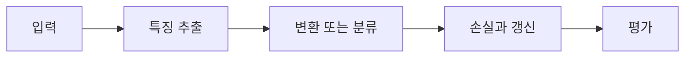

> [!abstract] 핵심
> CNN은 평탄화로 공간 정보가 사라지는 MLP의 한계를 줄이기 위해 이미지 위에서 합성곱 연산으로 지역 특징을 추출한다.

## 구조와 학습의 연결

완전연결 층은 2차원 이미지를 1차원으로 평탄화해 받기 때문에 형상 정보가 무시될 수 있고, 많은 가중치가 필요하다. CNN은 입력 위를 커널이 이동하며 지역 반응을 모아 특징맵을 만든다. 특징맵은 이후 층에서 더 복잡한 표현을 만들기 위한 입력이 된다.



| 요소 | 역할 | 확인 |
| --- | --- | --- |
| 이미지 형상 | 높이·너비·채널 | 평탄화 전 구조를 유지한다 |
| 커널 | 지역 창에서의 가중 연산 | 커널 크기와 채널을 맞춘다 |
| 특징맵 | 합성곱 출력 | 출력 공간 크기·채널 수를 확인한다 |

> [!note] 실행 흐름
> 입력 높이·너비·채널, 커널 크기, stride, padding을 정하고 합성곱 뒤 특징맵 모양을 계산한다. 층이 깊어질수록 어떤 지역 패턴을 전달하는지 비교한다.

```html preview h=165
<div style="font-family:system-ui,sans-serif;padding:16px;border:1px solid var(--border);background:var(--card);color:var(--foreground);border-radius:var(--radius)">
  <div style="font-weight:700;margin-bottom:10px">01. CNN의 합성곱 원리 · 설계 점검</div>
  <div style="display:grid;grid-template-columns:repeat(4,minmax(0,1fr));gap:8px">
    <div style="padding:9px;border:1px solid var(--border);border-radius:var(--radius)">입력</div>
    <div style="padding:9px;border:1px solid var(--border);border-radius:var(--radius)">층</div>
    <div style="padding:9px;border:1px solid var(--border);border-radius:var(--radius)">손실</div>
    <div style="padding:9px;border:1px solid var(--border);border-radius:var(--radius)">검증</div>
  </div>
</div>
```

## 세 관점

<Tabs>
<Tab label="개념">

CNN의 핵심은 이미지를 벡터 하나로 먼저 펴지 않고 지역적 이웃 관계를 이용하는 것이다.

</Tab>
<Tab label="구현">

합성곱 층의 입력·커널·출력 모양을 추적한다. 각 커널은 하나의 출력 채널을 만드는 역할을 할 수 있다.

</Tab>
<Tab label="검증">

파라미터 수 감소와 공간 정보 보존은 구조적 장점이지만, 실제 성능은 데이터·커널·훈련 조건에서 검증해야 한다.

</Tab>
</Tabs>

<details>
<summary>복습 질문</summary>

MLP에 이미지를 평탄화해서 넣으면 어떤 정보가 약해지는가? 커널의 채널 수는 입력과 왜 맞아야 하는가?

</details>

> [!tip] 학습 전략
> 텐서의 모양, 파라미터 선택, 평가 기준을 함께 기록한다. 한 번에 하나의 설정만 바꾸어 변화의 원인을 분리한다.
> [!warning] 해석 주의
> 합성곱이 지역 구조를 사용해도 출력 크기 계산을 잘못하면 뒤 층의 연결이 맞지 않는다.
