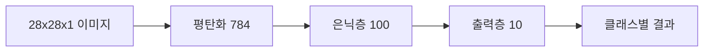

> [!abstract] 목표
> 이 실습은 MNIST 손글씨 이미지를 숫자 클래스의 확률로 분류한다. 입력 이미지는 $28\times28\times1$이고, 출력은 0부터 9까지의 클래스에 대한 값으로 구성된다.

## 단층과 다층 구성 비교

단층 퍼셉트론 구성은 입력 784개에서 출력 10개로 이어진다. 다층 퍼셉트론 예시는 입력 784개, 첫 층 출력 100개, 다음 층 출력 10개로 구성된다.



| 구성 | 입력과 출력 | 활성화와 손실 |
| --- | --- | --- |
| 단층 퍼셉트론 | 784에서 10 | Softmax, Cross Entropy |
| 2층 MLP 첫 층 | 784에서 100 | 은닉 표현 생성 |
| 2층 MLP 다음 층 | 100에서 10 | 클래스별 결과 생성 |

> [!note] 연결 크기
> 2층 MLP에서는 첫 번째 완전연결 층의 출력 노드 수와 두 번째 완전연결 층의 입력 노드 수가 같아야 연결할 수 있다.

```html preview h=170
<div style="font-family:system-ui,sans-serif;padding:16px;border:1px solid var(--border);background:var(--card);color:var(--foreground)">
  <div style="display:grid;grid-template-columns:repeat(3,minmax(0,1fr));gap:8px;text-align:center">
    <div style="padding:10px;border:1px solid var(--border)">784 입력</div>
    <div style="padding:10px;border:1px solid var(--border)">100 은닉</div>
    <div style="padding:10px;border:1px solid var(--border)">10 출력</div>
  </div>
  <div style="margin-top:10px;color:var(--muted-foreground)">각 층의 차원이 연결 가능해야 한다.</div>
</div>
```

<Tabs>
<Tab label="입력">
손글씨 이미지를 모델이 다룰 수 있는 입력 벡터로 준비한다.
</Tab>
<Tab label="모델">
단층과 다층 구조의 층 수, 입출력 크기, 활성화 함수를 명확히 둔다.
</Tab>
<Tab label="손실">
예측값과 정답값을 이용해 Cross Entropy 손실을 계산하는 구성을 확인한다.
</Tab>
</Tabs>

<details>
<summary>모델 정의 전 점검</summary>

- 입력 이미지가 올바른 크기로 정리되었는가?
- 각 완전연결 층의 입출력 크기가 이어지는가?
- 출력 클래스 수가 10개로 설정되었는가?
- 손실 함수가 분류 출력과 맞는가?
</details>

> [!tip] 차원을 표로 남기기
> 각 층의 입력과 출력을 표로 적으면 모델 정의 중 발생하는 연결 불일치를 빠르게 찾을 수 있다.

> [!warning] 출력 해석
> 출력 10개는 10개 숫자 클래스에 대응한다. 가장 큰 값만 확인하기 전에 클래스 순서가 무엇을 뜻하는지 먼저 고정한다.
