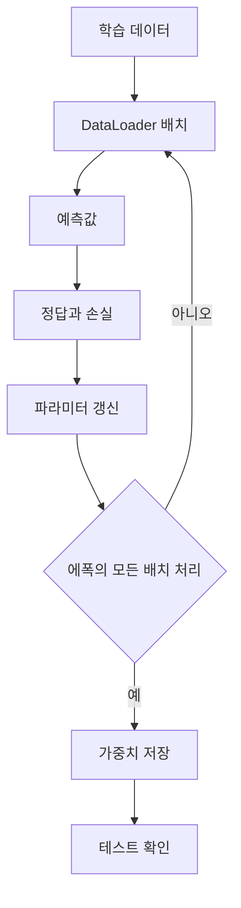

# MLP 실습: 학습과 평가

> [!abstract] 핵심
> MLP 실습에서는 DataLoader로 배치 단위 학습을 구성하고, 전체 데이터에 대한 반복을 에폭으로 관리한다. 학습이 끝난 네트워크 가중치를 저장한 뒤 테스트 데이터의 분류 성능과 예측 결과를 확인한다.

## 반복 구조를 분리해 보기

에폭은 전체 학습 데이터에 대한 반복이고, 이터레이션은 한 에폭 안에서 배치를 처리하는 반복이다. 각 배치에서 예측값과 정답으로 손실을 계산하고 파라미터를 갱신한다.



| 반복 단위 | 범위 | 확인 대상 |
| --- | --- | --- |
| 배치 | 일부 샘플 | 한 번의 손실과 갱신 |
| 이터레이션 | 에폭 안의 배치 반복 | 배치 처리 순서 |
| 에폭 | 전체 학습 데이터 | 학습 진행 상태 |
| 테스트 | 별도 데이터 | 분류 성능과 예측 결과 |

> [!note] 평가 흐름
> 실습 구성에는 학습 뒤 네트워크의 가중치를 저장하고, MNIST 테스트 데이터의 분류 성능 및 개별 이미지의 예측 결과를 확인하는 단계가 있다.

```html preview h=170
<div style="font-family:system-ui,sans-serif;padding:16px;border:1px solid var(--border);background:var(--card);color:var(--foreground)">
  <div style="font-weight:700;margin-bottom:10px">학습 반복의 단위</div>
  <div style="display:flex;gap:8px;align-items:center;flex-wrap:wrap">
    <span style="padding:8px;border:1px solid var(--border)">배치</span>
    <span aria-hidden="true">→</span>
    <span style="padding:8px;border:1px solid var(--border)">이터레이션</span>
    <span aria-hidden="true">→</span>
    <span style="padding:8px;border:1px solid var(--border)">에폭</span>
    <span aria-hidden="true">→</span>
    <span style="padding:8px;border:1px solid var(--border)">테스트</span>
  </div>
</div>
```

<Tabs>
<Tab label="학습">
배치마다 예측값과 정답을 사용해 손실을 계산하고 파라미터를 갱신한다.
</Tab>
<Tab label="저장">
학습이 끝난 뒤 네트워크의 가중치 파라미터를 저장하고 확인한다.
</Tab>
<Tab label="평가">
테스트 데이터의 분류 성능과 선택한 이미지의 예측 결과를 확인한다.
</Tab>
</Tabs>

<details>
<summary>실습 로그에 남길 항목</summary>

- 현재 에폭과 이터레이션
- 배치마다 계산한 손실
- 저장한 가중치의 시점
- 테스트 분류 성능과 예측 클래스
</details>

> [!tip] 학습과 테스트를 분리하기
> 테스트 결과를 학습 중 파라미터 갱신에 사용하지 않도록, 두 데이터의 역할과 확인 시점을 구분한다.

> [!warning] 반복 단위 혼동
> 이터레이션 횟수와 에폭 횟수는 같은 수가 아니다. 기록할 때 어떤 단위를 사용했는지 함께 적는다.
