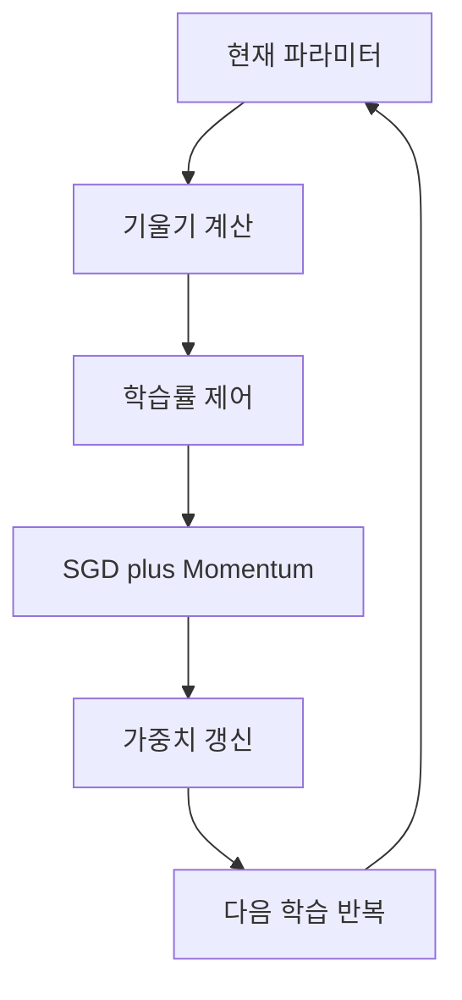

# Optimizer: 모멘텀

> [!abstract] 핵심
> 옵티마이저 자료는 경사 하강법의 학습률 제어를 검토하고, SLP 학습에서 SGD와 Momentum 기법을 비교 대상으로 다룬다.

## 학습률 제어에서 모멘텀까지

경사 하강법은 현재 위치에서 기울기를 계산하고 학습률을 곱해 반대 방향으로 가중치를 갱신한다. 학습률 제어는 더 짧은 시간에 정확도 높은 학습 파라미터를 찾기 위해 학습률을 조절하는 방법이다.



| 비교 관점 | 기본 경사 하강법 | 모멘텀 실습 |
| --- | --- | --- |
| 기초 갱신 | 기울기와 학습률 사용 | SGD 흐름에 Momentum 적용 |
| 학습률 | 고정값 또는 제어 | 제어 방식과 함께 관찰 |
| 실습 대상 | SLP | SLP |

> [!note] 학습률 제어
> 자료에서는 StepLR이 지정한 에폭 단위마다 학습률을 조절하고, ExponentialLR이 매 에폭 단위마다 학습률을 조절하는 예시를 제시한다.

```html preview h=170
<div style="font-family:system-ui,sans-serif;padding:16px;border:1px solid var(--border);background:var(--card);color:var(--foreground)">
  <div style="display:flex;align-items:center;gap:8px;flex-wrap:wrap">
    <span style="padding:8px;border:1px solid var(--border)">기울기</span>
    <span aria-hidden="true">→</span>
    <span style="padding:8px;border:1px solid var(--border)">학습률</span>
    <span aria-hidden="true">→</span>
    <span style="padding:8px;border:1px solid var(--border)">모멘텀 학습</span>
  </div>
  <div style="margin-top:10px;color:var(--muted-foreground)">학습 설정을 바꿀 때는 결과 확인 기준도 함께 둔다.</div>
</div>
```

<Tabs>
<Tab label="기초">
경사 하강법은 가중치의 손실 미분과 학습률을 이용해 파라미터를 갱신한다.
</Tab>
<Tab label="제어">
StepLR과 ExponentialLR은 에폭 진행에 맞춰 학습률을 조절하는 기능이다.
</Tab>
<Tab label="모멘텀">
실습은 SGD와 Momentum 조합을 SLP 학습 설정으로 다룬다.
</Tab>
</Tabs>

<details>
<summary>옵티마이저 비교 기록</summary>

- 사용한 학습률과 조절 방식
- 사용한 옵티마이저
- 에폭별 손실 또는 성능 확인 시점
- 동일한 데이터와 모델 설정 여부
</details>

> [!tip] 변경 범위 줄이기
> 모멘텀을 비교할 때는 데이터와 모델 구조를 유지하고, 옵티마이저 또는 학습률 제어 중 무엇을 바꿨는지 분명히 한다.

> [!warning] 원문 오류
> 원문에는 경사 하강법을 가리키는 영어 표현이 “Gradient decent”로 표기된 부분이 있다. 이는 “descent”의 철자 오류이며, 이 노트에서는 원문 오류를 숨기지 않고 별도 기록한다.
