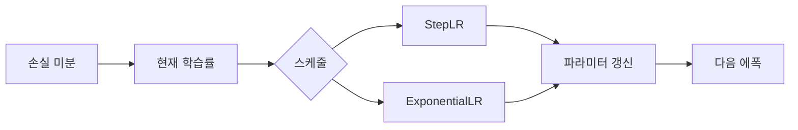

# Optimizer: 적응적 학습률

> [!abstract] 핵심
> 학습률 제어는 고정된 학습률만 사용하는 대신 학습 진행에 따라 값을 조절하는 방법이다. 자료는 StepLR, ExponentialLR과 함께 SGD, Momentum, AdaGrad, Adam을 비교 대상으로 제시한다.

## 학습률을 일정하게 두지 않기

경사 하강법의 갱신은 $W_{new}=W_{prev}-\alpha\frac{\partial L}{\partial W}$로 표현된다. 여기서 $\alpha$는 학습률이며, 학습률 제어는 이 값을 에폭 진행에 따라 조절하는 데 초점을 둔다.



| 방법 | 자료에서의 설명 | 관찰 단위 |
| --- | --- | --- |
| 고정 학습률 | 이전 실습의 기본 설정 | 전체 학습 |
| StepLR | 지정된 에폭 단위마다 조절 | step 또는 epoch |
| ExponentialLR | 매 에폭 단위마다 조절 | step 또는 epoch |
| Adam | 비교 옵티마이저 중 하나 | SLP 학습 설정 |

> [!note] 스케줄 예시
> StepLR과 ExponentialLR은 모두 학습률을 조절하지만, 변경 시점의 규칙이 다르다. 따라서 같은 초기값만 비교하지 말고 에폭별 변화를 함께 기록한다.

```html preview h=170
<div style="font-family:system-ui,sans-serif;padding:16px;border:1px solid var(--border);background:var(--card);color:var(--foreground)">
  <div style="font-weight:700;margin-bottom:10px">에폭에 따른 학습률 관리</div>
  <div style="display:grid;grid-template-columns:repeat(3,minmax(0,1fr));gap:8px;text-align:center">
    <div style="padding:10px;border:1px solid var(--border)">초기값</div>
    <div style="padding:10px;border:1px solid var(--border)">스케줄</div>
    <div style="padding:10px;border:1px solid var(--border)">갱신</div>
  </div>
</div>
```

<Tabs>
<Tab label="학습률">
학습률은 기울기에 곱해지는 갱신 크기이며, 손실 감소 경로에 영향을 준다.
</Tab>
<Tab label="스케줄">
StepLR과 ExponentialLR은 에폭 진행에 따라 학습률을 바꾸는 서로 다른 규칙이다.
</Tab>
<Tab label="옵티마이저">
자료의 비교 목록에는 SGD, Momentum, AdaGrad, Adam이 포함된다.
</Tab>
</Tabs>

<details>
<summary>스케줄 실험의 점검 항목</summary>

- 초기 학습률은 무엇인가?
- 어느 에폭에서 어떤 규칙으로 값이 바뀌는가?
- 다른 옵티마이저 조건은 같게 두었는가?
- 결과를 어느 에폭에서 확인했는가?
</details>

> [!tip] 변화 시점을 표시하기
> 성능 변화 그래프에 학습률 변경 시점을 함께 표시하면, 스케줄과 결과의 관계를 추적하기 편하다.

> [!warning] 원문 오류
> 원문에는 경사 하강법을 가리키는 영어 표현이 “Gradient decent”로 표기된 부분이 있다. 이는 “descent”의 철자 오류이며, 이 노트에서는 원문 오류를 숨기지 않고 별도 기록한다.
