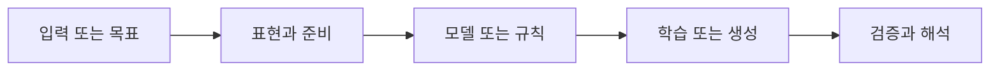

> [!abstract] 핵심
> 신경망 학습은 입력의 순전파, 활성화 함수, 손실 함수, 최적화, 역전파가 연결되는 흐름으로 볼 수 있다.

## 문제를 학습 흐름으로 바꾸기

신경망은 완전연결 층을 통해 입력을 전달하고, Step·Sigmoid·ReLU·Parametric ReLU 같은 활성화 함수를 적용한다. 예측과 목표의 차이는 MAE·MSE 같은 손실로 측정될 수 있으며, 경사 하강법·모멘텀·Adam은 파라미터를 갱신하는 방식이다. 역전파는 손실 정보를 이전 층으로 전달한다.



| 관점 | 확인할 질문 | 학습할 때의 점검 |
| --- | --- | --- |
| 활성화 | 층의 변환 규칙 | 출력 범위와 기울기 특성을 본다 |
| 손실 | 예측과 목표의 차이 | 과제의 출력 형식과 맞춘다 |
| 최적화 | 파라미터 갱신 방법 | 학습률과 갱신 경로를 기록한다 |

> [!note] 흐름
> 입력에서 출력까지의 순전파와 손실 계산을 먼저 고정한 뒤, 역전파로 각 파라미터의 갱신 방향을 연결한다. 활성화·손실·최적화는 독립된 이름 목록이 아니라 같은 학습 흐름의 역할이다.

```html preview h=170
<div style="font-family:system-ui,sans-serif;padding:16px;border:1px solid var(--border);background:var(--card);color:var(--foreground);border-radius:var(--radius)">
  <div style="font-weight:700;margin-bottom:10px">01. Perceptron 이론 - 신경망 구성 · 점검 흐름</div>
  <div style="display:grid;grid-template-columns:repeat(4,minmax(0,1fr));gap:8px">
    <div style="padding:9px;border:1px solid var(--border);border-radius:var(--radius)">입력</div>
    <div style="padding:9px;border:1px solid var(--border);border-radius:var(--radius)">준비</div>
    <div style="padding:9px;border:1px solid var(--border);border-radius:var(--radius)">실행</div>
    <div style="padding:9px;border:1px solid var(--border);border-radius:var(--radius)">점검</div>
  </div>
</div>
```

## 관점을 나누어 보기

<Tabs>
<Tab label="개념">

Perceptron과 신경망은 입력을 층으로 전달한 뒤 활성화를 적용해 출력을 만든다. 순전파는 예측을 만드는 방향이다.

</Tab>
<Tab label="실행">

손실을 계산한 뒤 역전파는 각 층의 파라미터에 필요한 변화량을 전달한다. 최적화기는 그 정보를 이용해 갱신한다.

</Tab>
<Tab label="검증">

활성화 함수나 최적화기 하나의 이름만 바꾼 실험도 손실·정확도·학습 안정성을 함께 비교해야 한다.

</Tab>
</Tabs>

<details>
<summary>복습 질문</summary>

활성화 함수가 없다면 여러 층을 쌓는 효과는 어떻게 달라질까? 손실 함수와 최적화기의 역할은 어떻게 구분되는가?

</details>

> [!tip] 학습 전략
> 목표, 입력, 평가 기준을 한 문장으로 연결해 본다. 한 번에 여러 조건을 바꾸지 말고 결과 변화의 원인을 기록한다.
> [!warning] 해석 주의
> 학습이 진행된다는 사실만으로 적절한 손실이나 활성화 조합을 뜻하지 않는다. 출력 형식과 평가 목표를 먼저 맞춘다.
