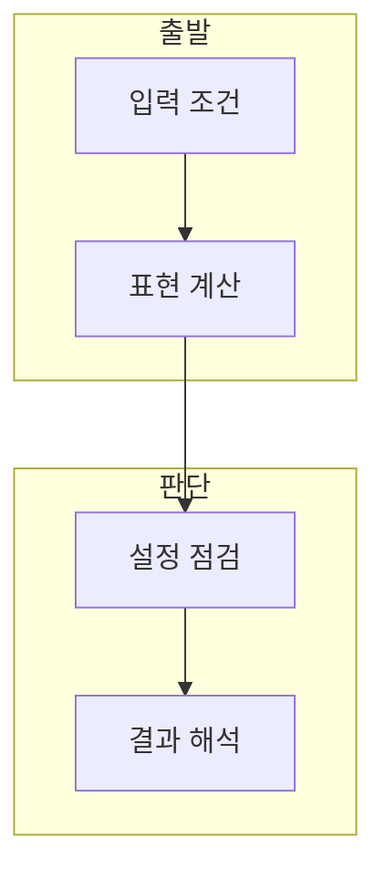

> [!abstract] 한 줄 요약
> Perceptron 이론 - 활성화와 최적화은 입력 조건, 모델 계산, 평가 기준을 분리해 학습해야 하는 주제다.

## 이 노트의 지도



## 1. 활성화 함수의 역할

강의의 핵심은 ==활성화 함수==을 입력과 모델 결과 사이의 관계로 읽는 것이다. 활성화 함수은 가중합을 출력 표현으로 바꾸는 비선형 함수.

> [!important] 판단의 출발점
> 목적과 입력, 정답 또는 평가 기준을 함께 적어야 용어를 다른 문제에 잘못 적용하지 않는다.

## 2. 설정과 결과의 연결

계산 단계의 값은 단독 결론이 아니라 모델 구조와 검증 절차 안에서 해석한다.

$$
y=h(w^T x+b)
$$

<details>
<summary>확인 순서</summary>

입력 형상 또는 조건을 확인하고, 계산 결과를 기록한 뒤 손실·정답·평가 기준 중 해당하는 기준으로 점검한다.

</details>


## 데이터로 보기

```html preview
<div style="font-family:system-ui,sans-serif;padding:20px">
  <div id="cards" style="display:flex;gap:14px;flex-wrap:wrap"></div>
  <script>
    var stats = [
      ['입력', '조건', '문제 정의', 'var(--chart-1)'],
      ['계산', '모델', '표현 갱신', 'var(--chart-2)'],
      ['검증', '평가', '결과 해석', 'var(--chart-3)']
    ];
    document.getElementById('cards').innerHTML = stats.map(function (s) {
      return '<div style="flex:1;min-width:150px;padding:16px;background:var(--card);' +
        'color:var(--card-foreground);border:1px solid var(--border);' +
        'border-radius:var(--radius)">' +
        '<div style="font-size:13px;color:var(--muted-foreground)">' + s[0] + '</div>' +
        '<div style="font-size:26px;font-weight:700;margin-top:4px">' + s[1] + '</div>' +
        '<div style="font-size:12px;font-weight:600;margin-top:4px;color:' + s[3] + '">' + s[2] + '</div>' +
        '</div>';
    }).join('');
  </script>
</div>
```

> [!warning] 과해석의 한계
> 단일 예시나 설정 하나만으로 모델의 일반 성능을 단정하지 않는다.

## 핵심 정리

| 개념 | 정의 | 학습 판단 |
| :-- | :-- | :-- |
| 활성화 함수 | 가중합을 출력 표현으로 바꾸는 비선형 함수 | 역할을 구분한다 |
| 모델 계산 | 표현 또는 파라미터 갱신 | 설정을 확인한다 |
| 평가 | 결과를 기준과 비교 | 조건부로 해석한다 |

## 관련 개념

- 손실과 최적화는 파라미터 갱신과 연결된다.
- 일반화 평가는 학습 결과와 별도로 확인한다.

> [!question]- 스스로 점검
> **Q.** 활성화 함수을 결과 수치만으로 판단하면 안 되는 이유는 무엇인가?
>
> **A.** 입력, 모델 설정, 손실 또는 평가 기준이 함께 결과를 결정하기 때문이다.
